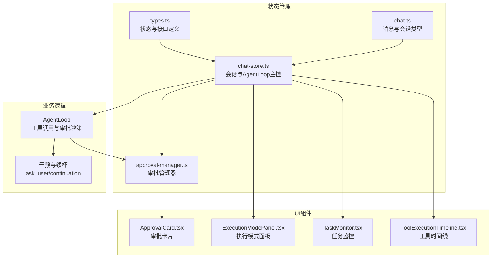
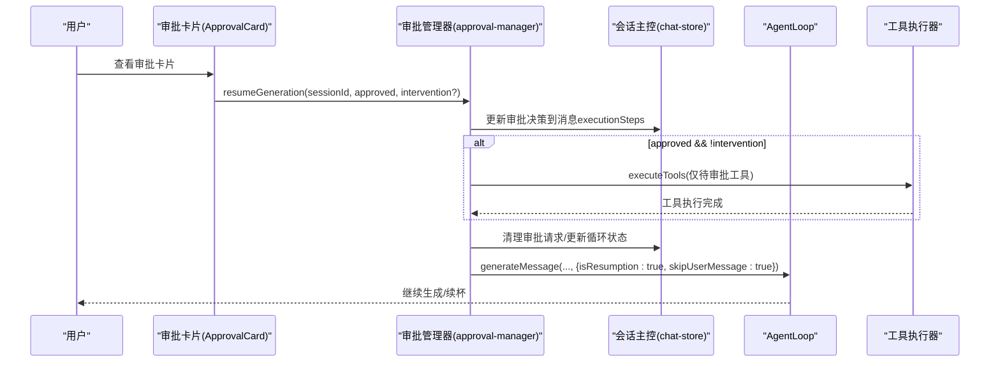
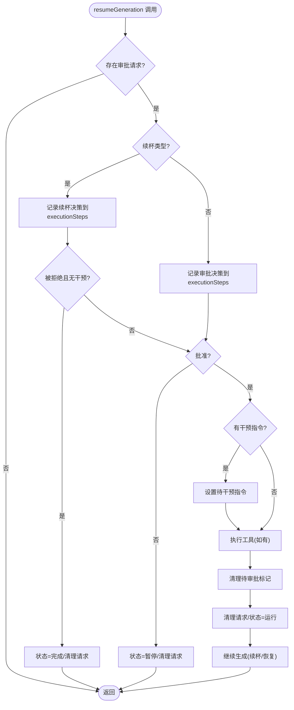
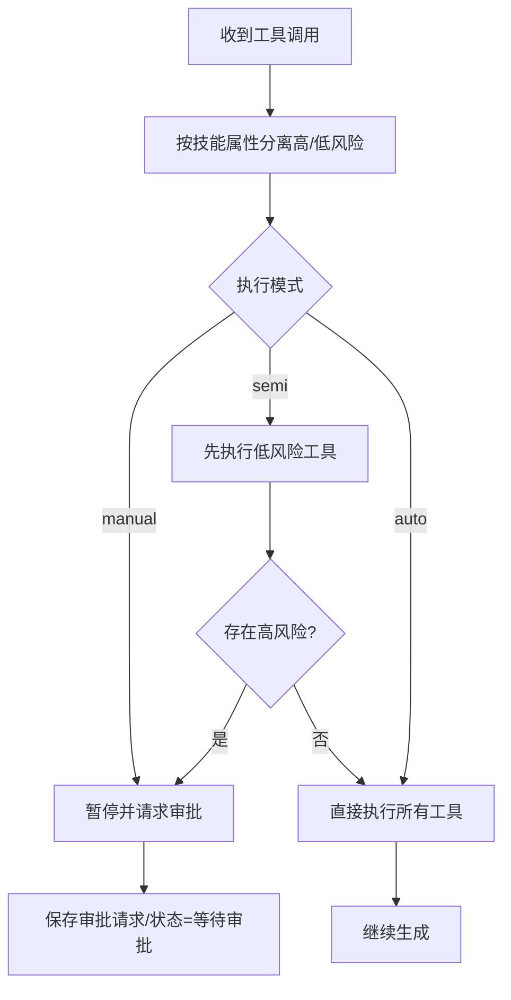
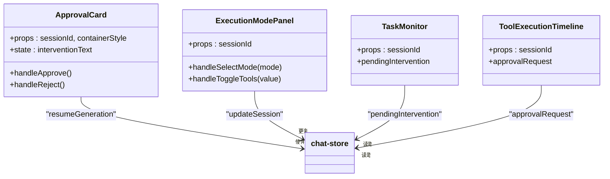
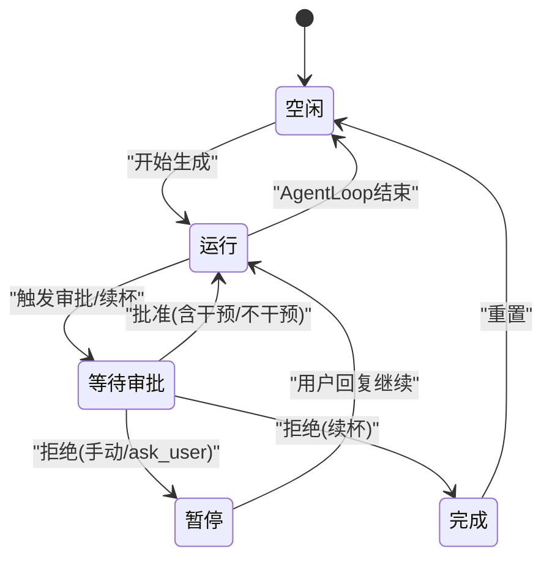
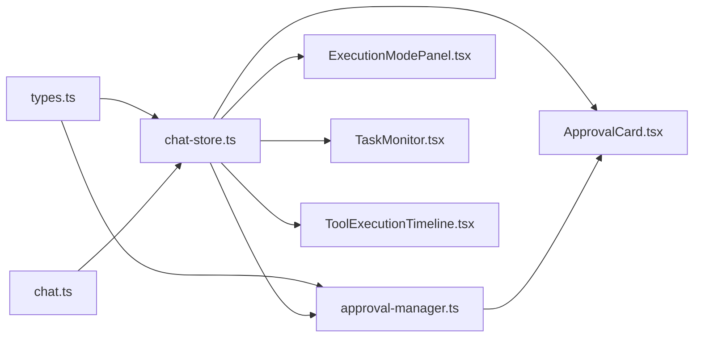

# 审批工作流

<cite>
**本文引用的文件**
- [approval-manager.ts](file://src/store/chat/approval-manager.ts)
- [chat-store.ts](file://src/store/chat-store.ts)
- [types.ts](file://src/store/chat/types.ts)
- [ApprovalCard.tsx](file://src/features/chat/components/ApprovalCard.tsx)
- [ExecutionModePanel.tsx](file://src/features/chat/components/SessionSettingsSheet/ExecutionModePanel.tsx)
- [TaskMonitor.tsx](file://src/features/chat/components/TaskMonitor.tsx)
- [ToolExecutionTimeline.tsx](file://src/components/skills/ToolExecutionTimeline.tsx)
- [chat.ts](file://src/types/chat.ts)
- [task.ts](file://src/lib/skills/core/task.ts)
</cite>

## 目录
1. [简介](#简介)
2. [项目结构](#项目结构)
3. [核心组件](#核心组件)
4. [架构总览](#架构总览)
5. [详细组件分析](#详细组件分析)
6. [依赖关系分析](#依赖关系分析)
7. [性能考量](#性能考量)
8. [故障排查指南](#故障排查指南)
9. [结论](#结论)
10. [附录](#附录)

## 简介
本文件面向开发者与产品团队，系统性阐述审批工作流的设计与实现，覆盖以下主题：
- 智能代理的审批机制：自动、半自动与手动执行模式
- 审批请求的生成、传递与处理流程
- 干预请求管理：工具审批、续杯审批与用户干预
- 工作流状态机：空闲、运行、暂停、等待审批与完成
- 审批UI组件设计与实现：审批卡片、操作按钮与状态指示
- 配置项与扩展点，帮助快速集成灵活的审批工作流

## 项目结构
审批工作流由“状态管理”“业务逻辑”“UI组件”三层构成：
- 状态管理：会话状态、审批请求、执行模式、循环状态
- 业务逻辑：AgentLoop中工具调用决策、审批触发与恢复执行
- UI组件：审批卡片、执行模式面板、任务监控与工具时间线

图表来源
- [chat-store.ts:2000-2250](file://src/store/chat-store.ts#L2000-L2250)
- [approval-manager.ts:1-173](file://src/store/chat/approval-manager.ts#L1-L173)
- [types.ts:117-163](file://src/store/chat/types.ts#L117-L163)
- [chat.ts:135-200](file://src/types/chat.ts#L135-L200)
- [ApprovalCard.tsx:1-166](file://src/features/chat/components/ApprovalCard.tsx#L1-L166)
- [ExecutionModePanel.tsx:1-169](file://src/features/chat/components/SessionSettingsSheet/ExecutionModePanel.tsx#L1-L169)
- [TaskMonitor.tsx:162-180](file://src/features/chat/components/TaskMonitor.tsx#L162-L180)
- [ToolExecutionTimeline.tsx:121-175](file://src/components/skills/ToolExecutionTimeline.tsx#L121-L175)

章节来源
- [chat-store.ts:2000-2250](file://src/store/chat-store.ts#L2000-L2250)
- [types.ts:117-163](file://src/store/chat/types.ts#L117-L163)
- [chat.ts:135-200](file://src/types/chat.ts#L135-L200)

## 核心组件
- 审批管理器（ApprovalManager）
  - 设置/清除审批请求
  - 恢复生成（批准/拒绝/带干预指令）
  - 更新执行模式与循环状态
- AgentLoop（会话主控）
  - 工具调用决策（自动/半自动/手动）
  - 触发审批请求与等待审批状态
  - 处理续杯与任务暂停
- UI组件
  - 审批卡片：展示工具与原因，提供批准/拒绝与可选干预指令
  - 执行模式面板：切换auto/semi/manual与工具开关
  - 任务监控：显示“需要决策”状态
  - 工具时间线：展示审批/续杯状态与工具信息

章节来源
- [approval-manager.ts:9-173](file://src/store/chat/approval-manager.ts#L9-L173)
- [chat-store.ts:2000-2250](file://src/store/chat-store.ts#L2000-L2250)
- [ApprovalCard.tsx:1-166](file://src/features/chat/components/ApprovalCard.tsx#L1-L166)
- [ExecutionModePanel.tsx:1-169](file://src/features/chat/components/SessionSettingsSheet/ExecutionModePanel.tsx#L1-L169)
- [TaskMonitor.tsx:162-180](file://src/features/chat/components/TaskMonitor.tsx#L162-L180)
- [ToolExecutionTimeline.tsx:121-175](file://src/components/skills/ToolExecutionTimeline.tsx#L121-L175)

## 架构总览
审批工作流围绕“会话状态”展开，AgentLoop在每次生成回复前评估工具调用风险，决定是否暂停并进入“等待审批”。用户通过审批卡片进行批准/拒绝或附加干预指令，审批管理器据此恢复生成并执行相应动作。

图表来源
- [approval-manager.ts:21-146](file://src/store/chat/approval-manager.ts#L21-L146)
- [chat-store.ts:2000-2250](file://src/store/chat-store.ts#L2000-L2250)

## 详细组件分析

### 审批管理器（ApprovalManager）
职责与流程要点：
- 设置审批请求：将需要审批的工具集合与原因写入会话
- 恢复生成：
  - 记录干预决策到消息的executionSteps
  - 若批准且无干预：仅执行“待审批工具”，避免重复执行已执行的低风险工具
  - 清理待审批标记，更新循环状态为运行
  - 续杯场景：批准后增加预算并继续生成
  - 拒绝/结束任务：根据类型更新状态并清理请求
- 更新执行模式与循环状态：支持运行时切换模式与状态流转

图表来源
- [approval-manager.ts:21-146](file://src/store/chat/approval-manager.ts#L21-L146)

章节来源
- [approval-manager.ts:9-173](file://src/store/chat/approval-manager.ts#L9-L173)

### AgentLoop 与审批触发
- 工具风险分离：区分高风险与低风险工具
- 执行模式策略：
  - manual：所有工具均需审批
  - semi：仅高风险工具需审批，低风险先行执行
  - auto：自动执行，不触发审批
- 审批请求生成：
  - 记录待审批工具ID列表，便于恢复时精准执行
  - 写入审批请求与等待审批状态
  - 在消息中追加“需要干预”步骤
- 续杯与暂停：
  - 达到最大循环次数时触发续杯审批
  - 工具执行可主动暂停（ask_user），等待用户输入

图表来源
- [chat-store.ts:2013-2094](file://src/store/chat-store.ts#L2013-L2094)
- [chat-store.ts:1187-1209](file://src/store/chat-store.ts#L1187-L1209)
- [task.ts:312-337](file://src/lib/skills/core/task.ts#L312-L337)

章节来源
- [chat-store.ts:2013-2094](file://src/store/chat-store.ts#L2013-L2094)
- [chat-store.ts:1187-1209](file://src/store/chat-store.ts#L1187-L1209)
- [task.ts:312-337](file://src/lib/skills/core/task.ts#L312-L337)

### 审批UI 组件
- 审批卡片（ApprovalCard）
  - 展示工具名、参数摘要与审批原因
  - 提供“拒绝/批准”按钮与可选干预指令输入
  - 根据类型（工具审批/续杯）切换样式与文案
- 执行模式面板（ExecutionModePanel）
  - 切换auto/semi/manual
  - 控制工具启用/禁用
- 任务监控（TaskMonitor）
  - 显示“需要决策”状态条，提示用户回复继续
- 工具执行时间线（ToolExecutionTimeline）
  - 展示审批/续杯状态与工具信息，增强可追溯性

图表来源
- [ApprovalCard.tsx:1-166](file://src/features/chat/components/ApprovalCard.tsx#L1-L166)
- [ExecutionModePanel.tsx:1-169](file://src/features/chat/components/SessionSettingsSheet/ExecutionModePanel.tsx#L1-L169)
- [TaskMonitor.tsx:162-180](file://src/features/chat/components/TaskMonitor.tsx#L162-L180)
- [ToolExecutionTimeline.tsx:121-175](file://src/components/skills/ToolExecutionTimeline.tsx#L121-L175)

章节来源
- [ApprovalCard.tsx:1-166](file://src/features/chat/components/ApprovalCard.tsx#L1-L166)
- [ExecutionModePanel.tsx:1-169](file://src/features/chat/components/SessionSettingsSheet/ExecutionModePanel.tsx#L1-L169)
- [TaskMonitor.tsx:162-180](file://src/features/chat/components/TaskMonitor.tsx#L162-L180)
- [ToolExecutionTimeline.tsx:121-175](file://src/components/skills/ToolExecutionTimeline.tsx#L121-L175)

### 工作流状态机
- 状态枚举：idle、running、paused、waiting_for_approval、completed
- 状态转换：
  - running → waiting_for_approval：触发审批或续杯
  - waiting_for_approval → running：批准（含干预/不干预）
  - waiting_for_approval → paused/completed：拒绝/结束任务
  - paused：工具执行ask_user触发，等待用户回复
  - completed：任务结束
  - idle：AgentLoop后置处理阶段重置

图表来源
- [types.ts:117-118](file://src/store/chat/types.ts#L117-L118)
- [chat-store.ts:2210-2218](file://src/store/chat-store.ts#L2210-L2218)
- [approval-manager.ts:75-87](file://src/store/chat/approval-manager.ts#L75-L87)

章节来源
- [types.ts:117-118](file://src/store/chat/types.ts#L117-L118)
- [chat-store.ts:2210-2218](file://src/store/chat-store.ts#L2210-L2218)
- [approval-manager.ts:75-87](file://src/store/chat/approval-manager.ts#L75-L87)

### 干预请求管理
- 工具审批：仅高风险工具或手动模式下触发，记录待审批工具ID，恢复时精准执行
- 续杯审批：达到最大循环次数时触发，批准后增加预算并继续
- 用户干预：审批卡片支持附加指令，审批管理器将其写入待干预状态，后续生成时透传

章节来源
- [chat-store.ts:2066-2094](file://src/store/chat-store.ts#L2066-L2094)
- [approval-manager.ts:21-146](file://src/store/chat/approval-manager.ts#L21-L146)
- [TaskMonitor.tsx:162-180](file://src/features/chat/components/TaskMonitor.tsx#L162-L180)

## 依赖关系分析
- 审批管理器依赖会话状态与工具执行器，负责审批决策与恢复流程
- AgentLoop依赖审批管理器的状态与请求，控制审批触发与后续生成
- UI组件依赖会话状态，驱动用户交互与反馈
- 类型定义统一约束状态与接口，保证模块间契约稳定

图表来源
- [types.ts:1-163](file://src/store/chat/types.ts#L1-L163)
- [chat.ts:135-200](file://src/types/chat.ts#L135-L200)
- [chat-store.ts:2000-2250](file://src/store/chat-store.ts#L2000-L2250)
- [approval-manager.ts:1-173](file://src/store/chat/approval-manager.ts#L1-L173)
- [ApprovalCard.tsx:1-166](file://src/features/chat/components/ApprovalCard.tsx#L1-L166)
- [ExecutionModePanel.tsx:1-169](file://src/features/chat/components/SessionSettingsSheet/ExecutionModePanel.tsx#L1-L169)
- [TaskMonitor.tsx:162-180](file://src/features/chat/components/TaskMonitor.tsx#L162-L180)
- [ToolExecutionTimeline.tsx:121-175](file://src/components/skills/ToolExecutionTimeline.tsx#L121-L175)

章节来源
- [types.ts:1-163](file://src/store/chat/types.ts#L1-L163)
- [chat.ts:135-200](file://src/types/chat.ts#L135-L200)
- [chat-store.ts:2000-2250](file://src/store/chat-store.ts#L2000-L2250)
- [approval-manager.ts:1-173](file://src/store/chat/approval-manager.ts#L1-L173)

## 性能考量
- 半自动模式下优先执行低风险工具，减少等待时间
- 待审批工具ID标记避免重复执行，降低无效开销
- 死循环检测防止长时间无效生成，提升稳定性
- 后处理阶段延迟执行，避免阻塞UI恢复

## 故障排查指南
- 审批未触发
  - 检查执行模式与工具风险属性
  - 确认AgentLoop中审批判断逻辑
- 审批已触发但UI未显示
  - 检查会话状态是否为等待审批
  - 确认审批卡片渲染条件
- 恢复后工具未执行
  - 检查待审批工具ID标记是否正确
  - 确认审批管理器仅执行标记工具
- 续杯预算未增加
  - 检查审批管理器续杯分支逻辑
  - 确认会话中预算字段更新

章节来源
- [chat-store.ts:2013-2094](file://src/store/chat-store.ts#L2013-L2094)
- [approval-manager.ts:89-137](file://src/store/chat/approval-manager.ts#L89-L137)
- [ApprovalCard.tsx:22-52](file://src/features/chat/components/ApprovalCard.tsx#L22-L52)

## 结论
该审批工作流通过清晰的执行模式、严谨的审批触发与恢复机制、以及直观的UI反馈，实现了从自动到手动的灵活控制。配合状态机与时间线可视化，既保障安全性，又维持良好的用户体验。建议在生产环境中结合日志与监控，持续优化工具风险识别与阈值配置。

## 附录

### 配置选项与扩展点
- 执行模式
  - auto：自动执行，不触发审批
  - semi：半自动，高风险工具审批，低风险先行执行
  - manual：手动，所有工具审批
- 工具启用
  - 控制是否允许工具调用
- 续杯预算
  - 批准续杯后按步长增加预算
- 干预指令
  - 审批卡片支持附加指令，审批管理器透传至生成流程

章节来源
- [ExecutionModePanel.tsx:15-32](file://src/features/chat/components/SessionSettingsSheet/ExecutionModePanel.tsx#L15-L32)
- [chat-store.ts:1187-1209](file://src/store/chat-store.ts#L1187-L1209)
- [approval-manager.ts:124-136](file://src/store/chat/approval-manager.ts#L124-L136)
- [ApprovalCard.tsx:96-121](file://src/features/chat/components/ApprovalCard.tsx#L96-L121)