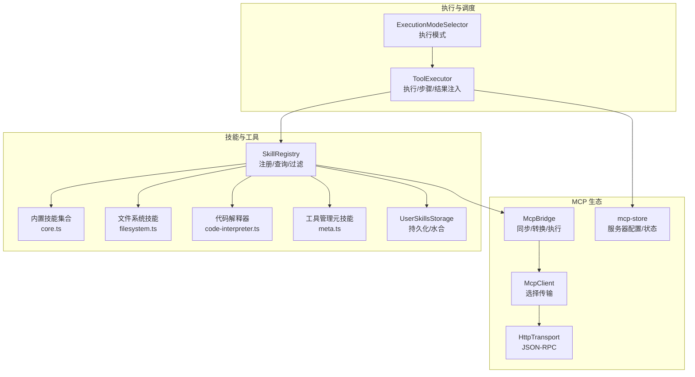
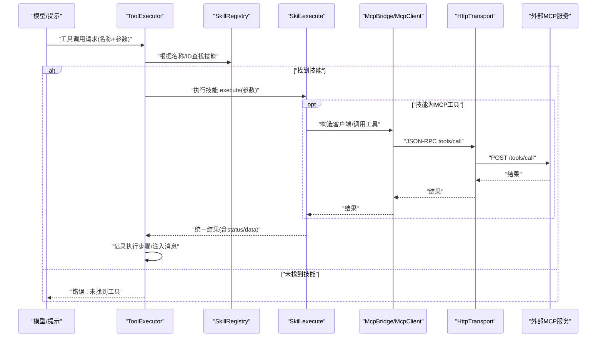
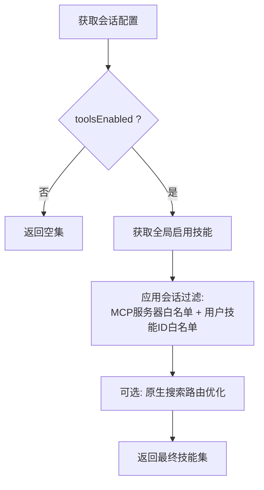
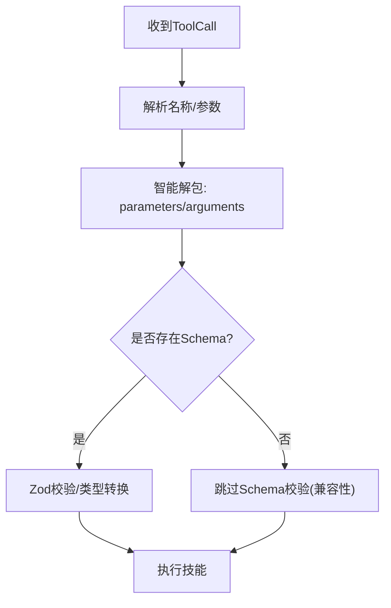
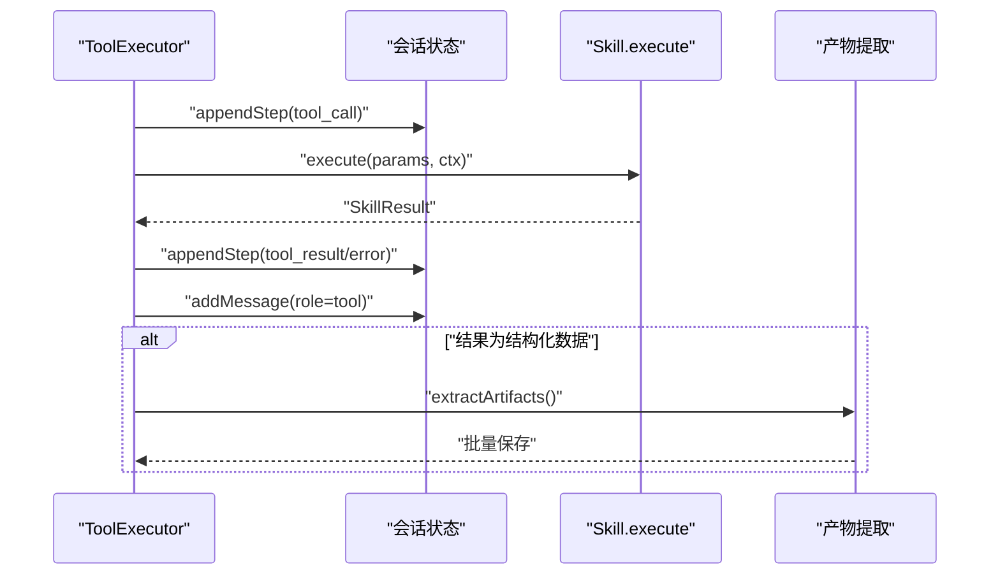
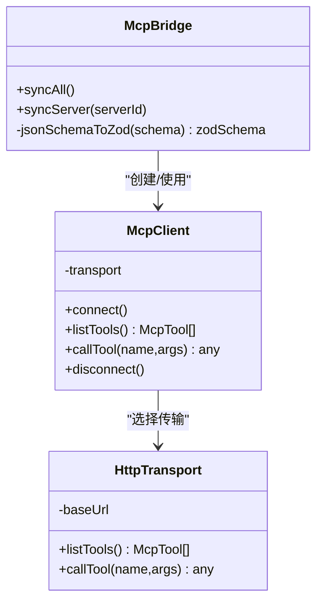
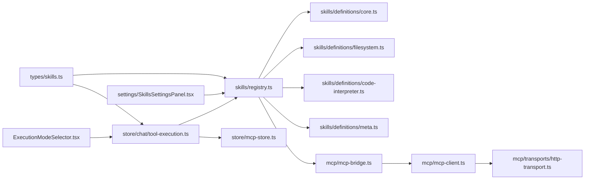

# 工具调用系统

<cite>
**本文引用的文件**
- [src/lib/skills/registry.ts](file://src/lib/skills/registry.ts)
- [src/lib/skills/storage.ts](file://src/lib/skills/storage.ts)
- [src/lib/skills/definitions/core.ts](file://src/lib/skills/definitions/core.ts)
- [src/lib/skills/definitions/filesystem.ts](file://src/lib/skills/definitions/filesystem.ts)
- [src/lib/skills/definitions/code-interpreter.ts](file://src/lib/skills/definitions/code-interpreter.ts)
- [src/lib/skills/definitions/meta.ts](file://src/lib/skills/definitions/meta.ts)
- [src/lib/mcp/mcp-bridge.ts](file://src/lib/mcp/mcp-bridge.ts)
- [src/lib/mcp/mcp-client.ts](file://src/lib/mcp/mcp-client.ts)
- [src/lib/mcp/transports/http-transport.ts](file://src/lib/mcp/transports/http-transport.ts)
- [src/store/chat/tool-execution.ts](file://src/store/chat/tool-execution.ts)
- [src/store/mcp-store.ts](file://src/store/mcp-store.ts)
- [src/types/skills.ts](file://src/types/skills.ts)
- [src/components/settings/SkillsSettingsPanel.tsx](file://src/components/settings/SkillsSettingsPanel.tsx)
- [src/features/chat/components/ExecutionModeSelector.tsx](file://src/features/chat/components/ExecutionModeSelector.tsx)
</cite>

## 目录
1. [简介](#简介)
2. [项目结构](#项目结构)
3. [核心组件](#核心组件)
4. [架构总览](#架构总览)
5. [详细组件分析](#详细组件分析)
6. [依赖关系分析](#依赖关系分析)
7. [性能考量](#性能考量)
8. [故障排查指南](#故障排查指南)
9. [结论](#结论)
10. [附录](#附录)

## 简介
本文件系统性阐述工具调用系统的执行流程、工具注册与启用/禁用管理、高风险工具安全控制、异步执行与状态跟踪、与技能系统的集成、参数动态构建与验证、以及监控与调试机制。面向开发者提供可操作的集成指南与扩展建议。

## 项目结构
工具调用系统围绕“技能（Skill）注册表”展开，统一承载内置技能、用户自定义技能与来自 MCP 服务器的外部工具。执行器负责解析模型输出的工具调用请求，按策略执行并产出结果；MCP 桥接器负责将外部工具同步为本地技能；传输层封装 HTTP/SSE 访问；会话状态与速率限制由存储层维护。

图示来源
- [src/lib/skills/registry.ts:1-189](file://src/lib/skills/registry.ts#L1-L189)
- [src/lib/skills/storage.ts:1-152](file://src/lib/skills/storage.ts#L1-L152)
- [src/lib/skills/definitions/core.ts:1-231](file://src/lib/skills/definitions/core.ts#L1-L231)
- [src/lib/skills/definitions/filesystem.ts:1-318](file://src/lib/skills/definitions/filesystem.ts#L1-L318)
- [src/lib/skills/definitions/code-interpreter.ts:1-94](file://src/lib/skills/definitions/code-interpreter.ts#L1-L94)
- [src/lib/skills/definitions/meta.ts:26-147](file://src/lib/skills/definitions/meta.ts#L26-L147)
- [src/lib/mcp/mcp-bridge.ts:1-202](file://src/lib/mcp/mcp-bridge.ts#L1-L202)
- [src/lib/mcp/mcp-client.ts:1-52](file://src/lib/mcp/mcp-client.ts#L1-L52)
- [src/lib/mcp/transports/http-transport.ts:1-158](file://src/lib/mcp/transports/http-transport.ts#L1-L158)
- [src/store/chat/tool-execution.ts:1-379](file://src/store/chat/tool-execution.ts#L1-L379)
- [src/store/mcp-store.ts:1-72](file://src/store/mcp-store.ts#L1-L72)
- [src/features/chat/components/ExecutionModeSelector.tsx:81-211](file://src/features/chat/components/ExecutionModeSelector.tsx#L81-L211)

章节来源
- [src/lib/skills/registry.ts:1-189](file://src/lib/skills/registry.ts#L1-L189)
- [src/store/chat/tool-execution.ts:1-379](file://src/store/chat/tool-execution.ts#L1-L379)

## 核心组件
- 技能注册表：集中注册与查询技能，支持会话级过滤与动态重载。
- 用户技能存储：持久化用户自定义技能，水合为可执行技能对象。
- 内置技能：知识检索、网络搜索、图像生成、网页浏览等。
- 文件系统技能：受沙箱保护的文件读写与目录列举。
- 代码解释器：受限环境下的 JS 执行能力。
- MCP 桥接器：将外部工具同步为本地技能，参数强制转换与即时连接执行。
- 执行器：统一调度、参数解包、速率限制、步骤可视化、结果注入与审计。
- 存储与设置：MCP 服务器配置、状态与调用节流；技能启用/禁用 UI。

章节来源
- [src/types/skills.ts:1-74](file://src/types/skills.ts#L1-L74)
- [src/lib/skills/registry.ts:41-189](file://src/lib/skills/registry.ts#L41-L189)
- [src/lib/skills/storage.ts:61-151](file://src/lib/skills/storage.ts#L61-L151)
- [src/lib/skills/definitions/core.ts:11-231](file://src/lib/skills/definitions/core.ts#L11-L231)
- [src/lib/skills/definitions/filesystem.ts:40-318](file://src/lib/skills/definitions/filesystem.ts#L40-L318)
- [src/lib/skills/definitions/code-interpreter.ts:9-94](file://src/lib/skills/definitions/code-interpreter.ts#L9-L94)
- [src/lib/mcp/mcp-bridge.ts:64-129](file://src/lib/mcp/mcp-bridge.ts#L64-L129)
- [src/store/chat/tool-execution.ts:20-379](file://src/store/chat/tool-execution.ts#L20-L379)
- [src/store/mcp-store.ts:6-72](file://src/store/mcp-store.ts#L6-L72)

## 架构总览
系统采用“注册表 + 执行器”的双层架构：上层注册表统一管理技能来源（内置、用户、MCP），下层执行器负责具体调用、参数校验、速率控制与结果注入。MCP 通过桥接器将外部工具映射为本地技能，传输层抽象 HTTP/SSE 访问。

图示来源
- [src/store/chat/tool-execution.ts:140-295](file://src/store/chat/tool-execution.ts#L140-L295)
- [src/lib/skills/registry.ts:48-55](file://src/lib/skills/registry.ts#L48-L55)
- [src/lib/mcp/mcp-bridge.ts:79-112](file://src/lib/mcp/mcp-bridge.ts#L79-L112)
- [src/lib/mcp/mcp-client.ts:41-43](file://src/lib/mcp/mcp-client.ts#L41-L43)
- [src/lib/mcp/transports/http-transport.ts:90-143](file://src/lib/mcp/transports/http-transport.ts#L90-L143)

## 详细组件分析

### 工具注册表与启用/禁用管理
- 注册与查询：支持按 ID 与名称回退查找；内置、用户与 MCP 工具统一注册。
- 会话感知过滤：结合会话选项与活动服务器/技能集合，动态决定可用工具集。
- 全局启用控制：基于设置中的技能配置，严格控制是否启用某技能。
- 动态重载：支持用户技能的重载与清理，保证 UI 与执行一致性。

图示来源
- [src/lib/skills/registry.ts:130-172](file://src/lib/skills/registry.ts#L130-L172)

章节来源
- [src/lib/skills/registry.ts:41-189](file://src/lib/skills/registry.ts#L41-L189)
- [src/components/settings/SkillsSettingsPanel.tsx:106-258](file://src/components/settings/SkillsSettingsPanel.tsx#L106-L258)

### 工具发现与参数验证
- 工具发现：MCP 桥接器扫描外部工具，转换为本地技能对象，附带 Zod Schema。
- 参数验证：执行前依据技能 Schema 进行类型与必填项校验；对 MCP 工具进行强制类型转换（如对象转字符串）。
- 参数解包：兼容不同来源的参数包装形式（parameters/arguments 字段）。

图示来源
- [src/store/chat/tool-execution.ts:150-161](file://src/store/chat/tool-execution.ts#L150-L161)
- [src/lib/mcp/mcp-bridge.ts:82-93](file://src/lib/mcp/mcp-bridge.ts#L82-L93)
- [src/types/skills.ts:12-24](file://src/types/skills.ts#L12-L24)

章节来源
- [src/lib/mcp/mcp-bridge.ts:64-129](file://src/lib/mcp/mcp-bridge.ts#L64-L129)
- [src/store/chat/tool-execution.ts:150-161](file://src/store/chat/tool-execution.ts#L150-L161)
- [src/types/skills.ts:12-24](file://src/types/skills.ts#L12-L24)

### 执行调度与结果处理
- 统一调度：执行器按顺序处理每个工具调用，记录执行步骤（思考/调用/结果/错误/限流）。
- 速率限制：基于 MCP 服务器配置的调用间隔，自动等待与恢复，保障服务端稳定性。
- 结果注入：将工具结果作为“tool”消息注入会话，支持渲染注入与自动提取产物。
- 错误拦截：对失败结果附加系统引导，提升自愈能力。

图示来源
- [src/store/chat/tool-execution.ts:107-138](file://src/store/chat/tool-execution.ts#L107-L138)
- [src/store/chat/tool-execution.ts:251-295](file://src/store/chat/tool-execution.ts#L251-L295)
- [src/store/chat/tool-execution.ts:342-374](file://src/store/chat/tool-execution.ts#L342-L374)

章节来源
- [src/store/chat/tool-execution.ts:20-379](file://src/store/chat/tool-execution.ts#L20-L379)

### MCP 工具同步与执行
- 同步策略：桥接器清理失效工具，覆盖式注册，标记服务器状态。
- 执行模式：为每个调用即时建立连接，执行后断开，避免长连接带来的复杂性。
- 参数转换：针对 MCP 输入 Schema 进行强制类型转换，提升兼容性。
- 传输适配：自动探测路径与回退，统一 JSON-RPC 调用。

图示来源
- [src/lib/mcp/mcp-bridge.ts:14-129](file://src/lib/mcp/mcp-bridge.ts#L14-L129)
- [src/lib/mcp/mcp-client.ts:6-52](file://src/lib/mcp/mcp-client.ts#L6-L52)
- [src/lib/mcp/transports/http-transport.ts:50-143](file://src/lib/mcp/transports/http-transport.ts#L50-L143)

章节来源
- [src/lib/mcp/mcp-bridge.ts:64-129](file://src/lib/mcp/mcp-bridge.ts#L64-L129)
- [src/lib/mcp/mcp-client.ts:10-50](file://src/lib/mcp/mcp-client.ts#L10-L50)
- [src/lib/mcp/transports/http-transport.ts:90-143](file://src/lib/mcp/transports/http-transport.ts#L90-L143)

### 高风险工具的安全控制
- 标记与隔离：高风险工具（如文件写入）在定义时标注 isHighRisk。
- 沙箱与路径校验：文件系统技能在受限沙箱内执行，禁止路径穿越与越权访问。
- 审计日志：对高风险操作记录动作、资源、会话、代理与元数据。
- 失败降级：RAG 同步失败不影响物理写入，但会记录警告。

章节来源
- [src/lib/skills/definitions/filesystem.ts:40-161](file://src/lib/skills/definitions/filesystem.ts#L40-L161)
- [src/lib/skills/definitions/filesystem.ts:176-234](file://src/lib/skills/definitions/filesystem.ts#L176-L234)
- [src/lib/skills/definitions/filesystem.ts:248-318](file://src/lib/skills/definitions/filesystem.ts#L248-L318)

### 工具与技能系统的集成
- 内置技能：知识检索、网络搜索、图像生成、网页浏览等，均实现统一 Skill 接口。
- 用户自定义技能：通过存储持久化，水合为可执行技能，支持默认参数合并与运行时配置。
- 元工具：提供工具测试、注册、删除、列表等管理能力，支持高风险标记与 schema 校验。

章节来源
- [src/lib/skills/definitions/core.ts:11-231](file://src/lib/skills/definitions/core.ts#L11-L231)
- [src/lib/skills/storage.ts:61-151](file://src/lib/skills/storage.ts#L61-L151)
- [src/lib/skills/definitions/meta.ts:64-147](file://src/lib/skills/definitions/meta.ts#L64-L147)

### 异步执行模式与状态跟踪
- 步骤可视化：执行器维护每条消息的 executionSteps，支持多种状态（思考/调用/结果/错误/限流）。
- 限流与恢复：基于服务器 lastCallTimestamp 与 callInterval 计算等待时间，等待后恢复调用。
- 流式保护：拦截流式初期的不完整调用，避免崩溃循环。

章节来源
- [src/store/chat/tool-execution.ts:107-138](file://src/store/chat/tool-execution.ts#L107-L138)
- [src/store/chat/tool-execution.ts:202-234](file://src/store/chat/tool-execution.ts#L202-L234)
- [src/store/chat/tool-execution.ts:92-104](file://src/store/chat/tool-execution.ts#L92-L104)

### 监控与调试机制
- 执行日志：传输层打印请求体与响应，便于排查参数结构问题。
- 服务器状态：MCP 存储维护连接状态与错误信息，支持 UI 展示。
- 执行模式：提供自动/半自动/手动三种模式，配合严格模式与会话选项控制工具使用。
- 技能开关：设置面板支持逐项启用/禁用与删除、编辑、配置。

章节来源
- [src/lib/mcp/transports/http-transport.ts:104-142](file://src/lib/mcp/transports/http-transport.ts#L104-L142)
- [src/store/mcp-store.ts:20-72](file://src/store/mcp-store.ts#L20-L72)
- [src/features/chat/components/ExecutionModeSelector.tsx:81-211](file://src/features/chat/components/ExecutionModeSelector.tsx#L81-L211)
- [src/components/settings/SkillsSettingsPanel.tsx:106-258](file://src/components/settings/SkillsSettingsPanel.tsx#L106-L258)

## 依赖关系分析

图示来源
- [src/types/skills.ts:1-74](file://src/types/skills.ts#L1-L74)
- [src/lib/skills/registry.ts:1-189](file://src/lib/skills/registry.ts#L1-L189)
- [src/store/chat/tool-execution.ts:1-379](file://src/store/chat/tool-execution.ts#L1-L379)
- [src/lib/mcp/mcp-bridge.ts:1-202](file://src/lib/mcp/mcp-bridge.ts#L1-L202)
- [src/lib/mcp/mcp-client.ts:1-52](file://src/lib/mcp/mcp-client.ts#L1-L52)
- [src/lib/mcp/transports/http-transport.ts:1-158](file://src/lib/mcp/transports/http-transport.ts#L1-L158)
- [src/store/mcp-store.ts:1-72](file://src/store/mcp-store.ts#L1-L72)
- [src/components/settings/SkillsSettingsPanel.tsx:106-258](file://src/components/settings/SkillsSettingsPanel.tsx#L106-L258)
- [src/features/chat/components/ExecutionModeSelector.tsx:81-211](file://src/features/chat/components/ExecutionModeSelector.tsx#L81-L211)

章节来源
- [src/lib/skills/registry.ts:1-189](file://src/lib/skills/registry.ts#L1-L189)
- [src/store/chat/tool-execution.ts:1-379](file://src/store/chat/tool-execution.ts#L1-L379)

## 性能考量
- 无状态执行：MCP 工具采用即时连接与断开，降低连接管理成本。
- 参数预处理：在执行前完成参数解包与类型转换，减少运行时分支判断。
- 并发与非阻塞：产物提取与持久化采用异步批量写入，不阻塞主执行流程。
- 速率限制：基于服务器配置的最小调用间隔，避免触发上游限流。

## 故障排查指南
- 工具不可用：确认技能是否在会话白名单中，检查 MCP 服务器启用状态与 lastSync 时间。
- 参数错误：查看传输层日志中的请求体，核对参数结构与必填字段；必要时使用元工具 test 功能验证 schema。
- 执行失败：执行器会为错误结果附加系统引导；检查技能返回的 status 与 data，定位具体原因。
- 限流卡顿：观察 executionSteps 中的 throttled 状态与等待时间，调整服务器 callInterval。
- 高风险操作：若文件写入失败，检查沙箱路径与权限；关注审计日志中的错误信息。

章节来源
- [src/store/chat/tool-execution.ts:163-197](file://src/store/chat/tool-execution.ts#L163-L197)
- [src/lib/mcp/transports/http-transport.ts:115-142](file://src/lib/mcp/transports/http-transport.ts#L115-L142)
- [src/lib/skills/definitions/filesystem.ts:142-159](file://src/lib/skills/definitions/filesystem.ts#L142-L159)

## 结论
该工具调用系统以“注册表 + 执行器”为核心，结合 MCP 生态与本地技能，实现了统一的工具发现、参数验证、执行调度与结果处理。通过严格的启用/禁用控制、高风险工具安全机制、异步执行与状态跟踪，以及完善的监控与调试手段，系统在易用性与安全性之间取得良好平衡。开发者可据此快速扩展新工具与集成外部服务。

## 附录

### 集成指南（开发者）
- 新增内置技能
  - 在对应定义文件中新增 Skill 对象，定义 id/name/description/schema/execute。
  - 在注册表初始化处注册，或通过工具管理元技能进行动态注册。
  - 参考路径：[内置技能定义:11-231](file://src/lib/skills/definitions/core.ts#L11-L231)，[注册表注册:13-32](file://src/lib/skills/registry.ts#L13-L32)
- 新增用户自定义技能
  - 使用元工具的 register 动作保存技能；支持 schema 与默认配置合并。
  - 参考路径：[元工具注册:112-139](file://src/lib/skills/definitions/meta.ts#L112-L139)，[存储持久化:39-56](file://src/lib/skills/storage.ts#L39-L56)
- 集成 MCP 工具
  - 在 MCP 存储中添加服务器配置；启动桥接器同步；确认工具已注册到注册表。
  - 参考路径：[MCP 存储:6-72](file://src/store/mcp-store.ts#L6-L72)，[桥接器同步:14-129](file://src/lib/mcp/mcp-bridge.ts#L14-L129)
- 执行器接入
  - 调用 createToolExecutor 创建执行器实例；传入会话与消息上下文；处理执行步骤与结果注入。
  - 参考路径：[执行器实现:20-379](file://src/store/chat/tool-execution.ts#L20-L379)
- 安全与审计
  - 对高风险工具启用 isHighRisk 标记；在执行前后记录审计日志；严格沙箱与路径校验。
  - 参考路径：[文件系统技能:40-161](file://src/lib/skills/definitions/filesystem.ts#L40-L161)