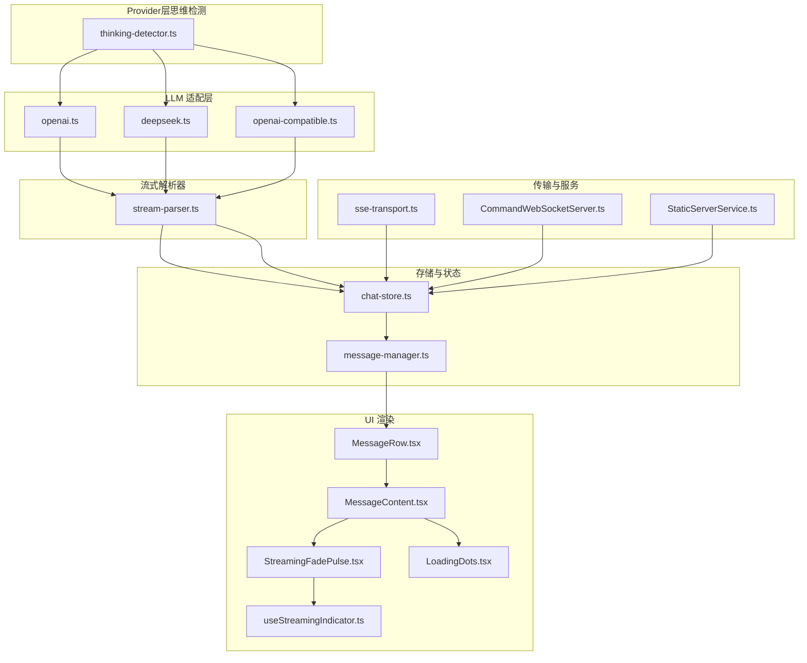
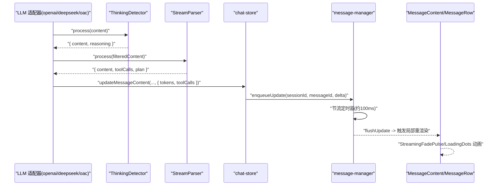
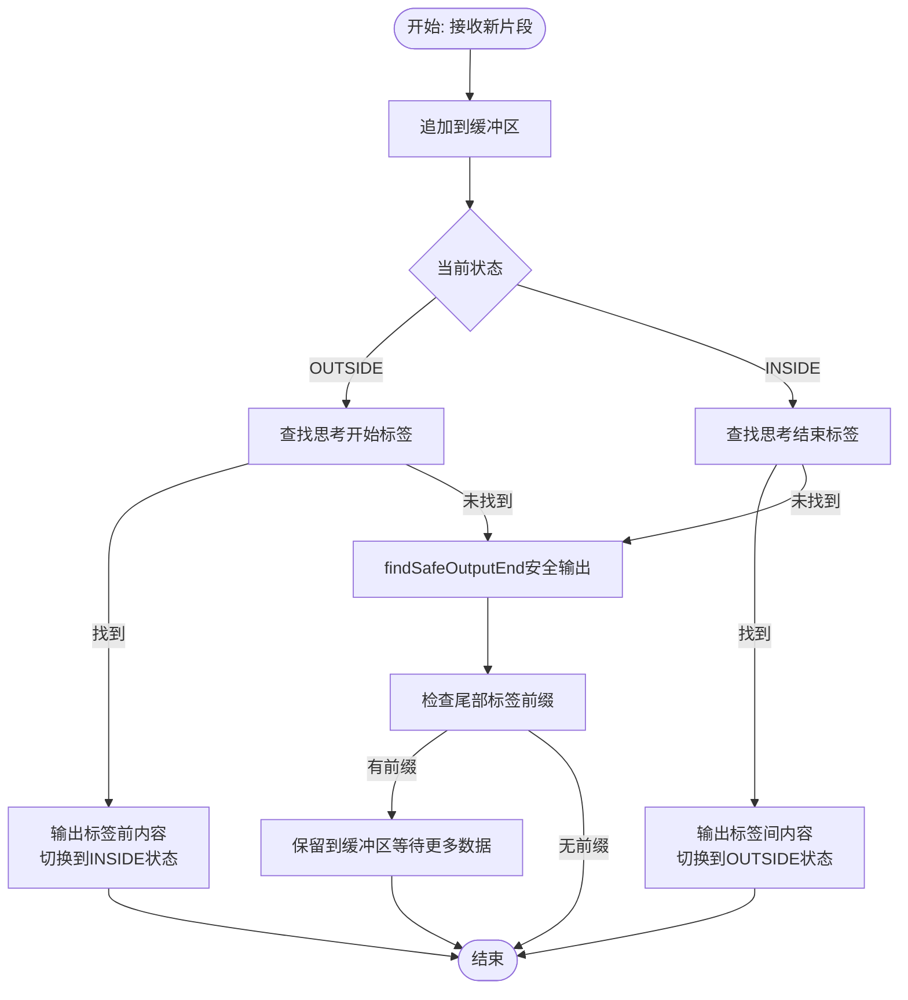
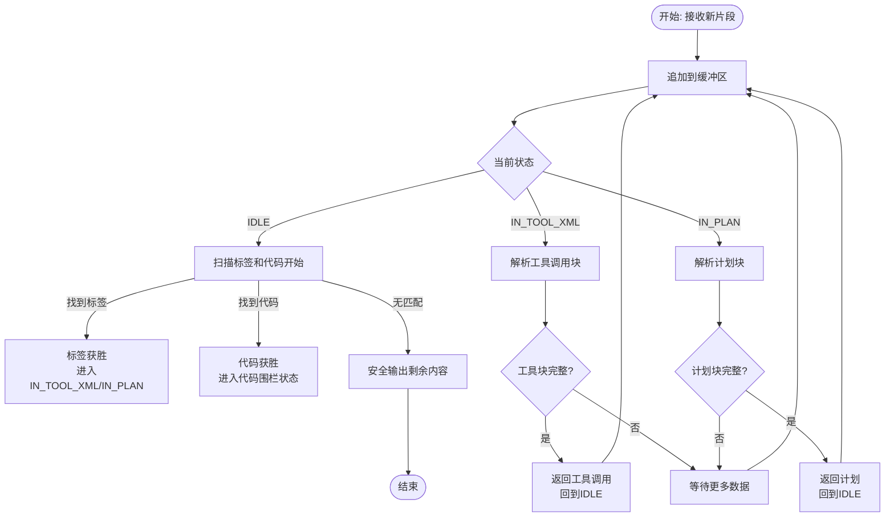
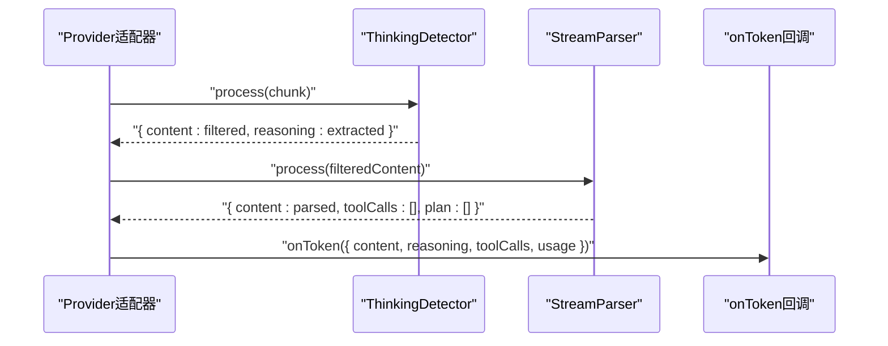
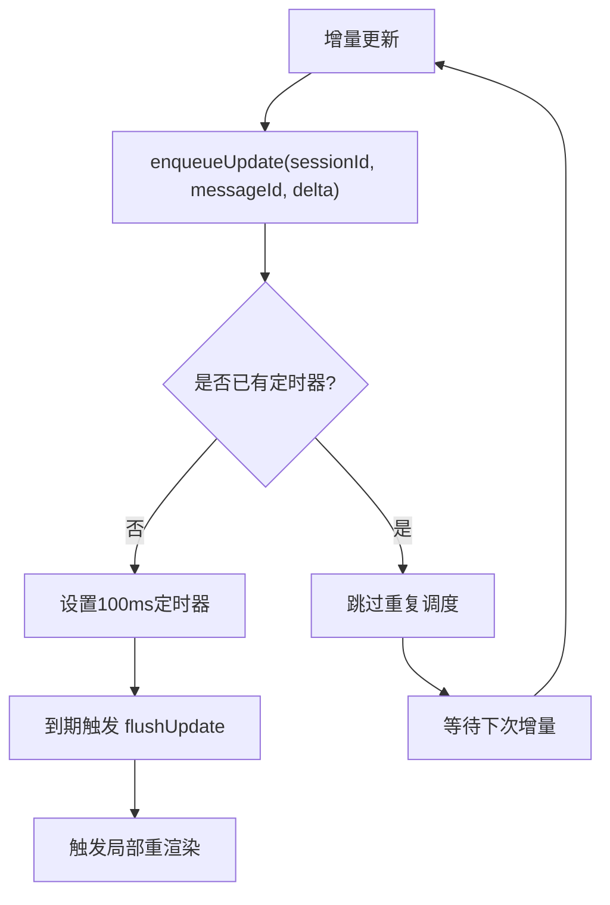
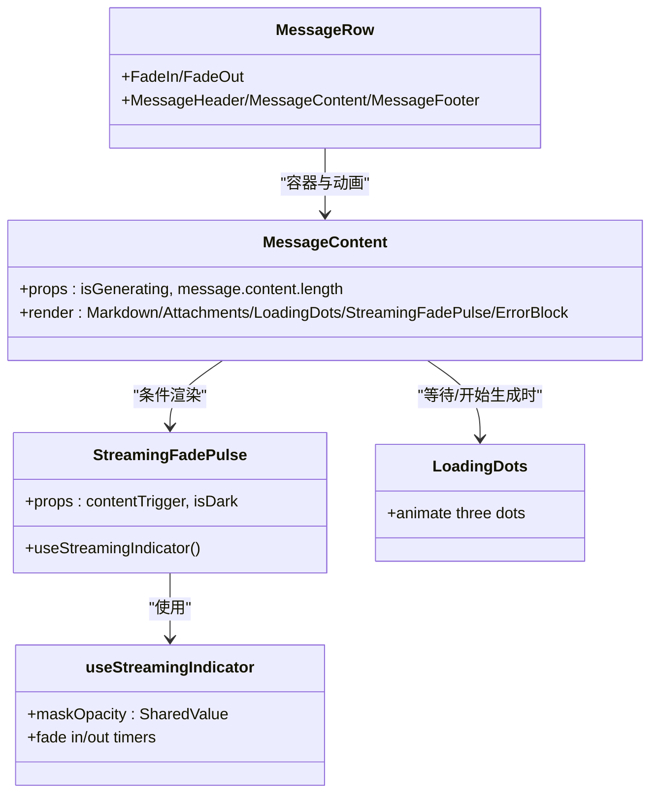
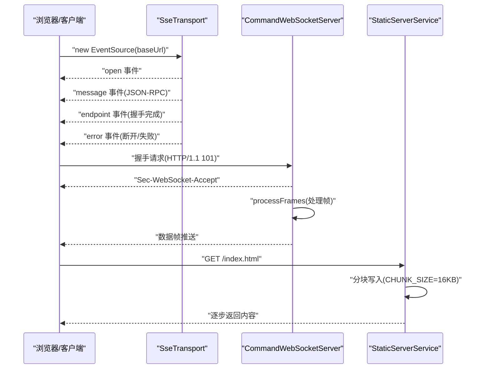
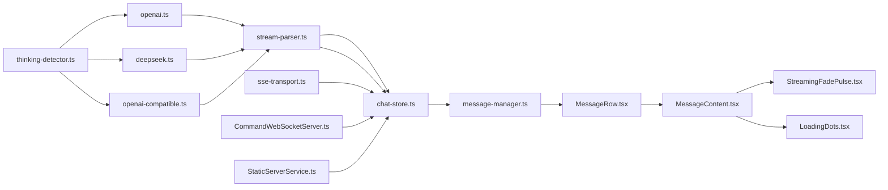

# 流式响应处理

<cite>
**本文引用的文件**
- [stream-parser.ts](file://src/lib/llm/stream-parser.ts)
- [thinking-detector.ts](file://src/lib/llm/thinking-detector.ts)
- [patterns.ts](file://src/lib/llm/patterns.ts)
- [openai.ts](file://src/lib/llm/providers/openai.ts)
- [deepseek.ts](file://src/lib/llm/providers/deepseek.ts)
- [openai-compatible.ts](file://src/lib/llm/providers/openai-compatible.ts)
- [chat-store.ts](file://src/store/chat-store.ts)
- [message-manager.ts](file://src/store/chat/message-manager.ts)
- [useChat.ts](file://src/features/chat/hooks/useChat.ts)
- [MessageContent.tsx](file://src/features/chat/components/message/MessageContent.tsx)
- [StreamingFadePulse.tsx](file://src/features/chat/components/message/blocks/StreamingFadePulse.tsx)
- [useStreamingIndicator.ts](file://src/features/chat/components/message/hooks/useStreamingIndicator.ts)
- [LoadingDots.tsx](file://src/features/chat/components/message/blocks/LoadingDots.tsx)
- [MessageRow.tsx](file://src/features/chat/components/message/MessageRow.tsx)
- [error-normalizer.ts](file://src/lib/llm/error-normalizer.ts)
- [sse-transport.ts](file://src/lib/mcp/transports/sse-transport.ts)
- [CommandWebSocketServer.ts](file://src/services/workbench/CommandWebSocketServer.ts)
- [StaticServerService.ts](file://src/services/workbench/StaticServerService.ts)
- [ChatPage.tsx](file://web-client/src/pages/ChatPage.tsx)
- [useWebSocket.ts](file://web-client/src/hooks/useWebSocket.ts)
</cite>

## 更新摘要
**所做更改**
- 更新了StreamParser工作原理章节，反映其重构后专注于工具调用XML块、计划块和代码围栏处理
- 新增ThinkingDetector组件的详细说明，解释思维标签检测的集中化处理
- 更新了架构图和数据流图，体现Provider层的ThinkingDetector集成
- 修正了流式解析流程，移除了StreamBufferManager的思考标签处理逻辑
- 更新了错误处理和性能优化章节的相关内容

## 目录
1. [简介](#简介)
2. [项目结构](#项目结构)
3. [核心组件](#核心组件)
4. [架构总览](#架构总览)
5. [详细组件分析](#详细组件分析)
6. [依赖关系分析](#依赖关系分析)
7. [性能考量](#性能考量)
8. [故障排查指南](#故障排查指南)
9. [结论](#结论)
10. [附录](#附录)

## 简介
本文件系统性阐述本仓库中的流式响应处理体系，覆盖数据接收、解析、增量更新与状态同步，以及前端 UI 的渐进式渲染、动画与体验优化。经过重构后，系统采用"Provider层思维标签检测 + StreamParser结构化内容解析"的新架构，实现了更加清晰和高效的流式响应处理机制。

## 项目结构
围绕流式响应的关键模块分布如下：
- **Provider层思维检测**：ThinkingDetector负责统一处理各种思考标签格式，包括HTML注释、XML标签等
- **流式解析器**：StreamParser专注于工具调用XML块、计划块和代码围栏的解析
- **LLM适配层**：OpenAI、DeepSeek、兼容OpenAI协议的供应商，负责建立流式连接和集成思维检测
- **存储与状态**：chat-store与message-manager负责会话消息的生成、流式聚合、节流刷新与最终落盘
- **UI渲染**：MessageRow/MessageContent/StreamingFadePulse/LoadingDots等组件负责渐进式展示、脉冲动画与加载态
- **传输与服务**：SSE/WS服务端与客户端，保障长连接稳定与分块传输
- **错误标准化**：ErrorNormalizer将各类错误归类、提取重试信息，统一提示

**图表来源**
- [thinking-detector.ts:1-227](file://src/lib/llm/thinking-detector.ts#L1-L227)
- [stream-parser.ts:1-395](file://src/lib/llm/stream-parser.ts#L1-L395)
- [openai.ts:150-349](file://src/lib/llm/providers/openai.ts#L150-L349)
- [deepseek.ts:140-339](file://src/lib/llm/providers/deepseek.ts#L140-L339)
- [chat-store.ts:1360-1559](file://src/store/chat-store.ts#L1360-L1559)

## 核心组件
- **ThinkingDetector**：统一的思维标签检测器，支持多种思考标签格式（<!-- THINKING_START/END -->、<think>、<thought>），处理标签跨chunk分割的边界情况
- **StreamParser**：重构后的流式解析器，专注于工具调用XML块、计划块和代码围栏的解析，不再处理思考标签
- **LLM适配器**：集成ThinkingDetector的Provider层，负责建立流式连接、解析增量片段、聚合工具调用与用量信息
- **存储与状态**：chat-store在流式过程中持续更新消息内容与用量；message-manager对UI更新进行节流，避免频繁重渲染
- **UI渲染**：MessageRow/MessageContent负责布局与内容渲染；StreamingFadePulse与LoadingDots提供渐进式显示与脉冲动画，提升交互感知
- **错误处理**：ErrorNormalizer将网络、速率限制、鉴权、无效请求、服务器错误等统一归类，提取可选的重试等待时间，便于UI展示与自动重试

**章节来源**
- [thinking-detector.ts:1-227](file://src/lib/llm/thinking-detector.ts#L1-L227)
- [stream-parser.ts:1-395](file://src/lib/llm/stream-parser.ts#L1-L395)
- [openai.ts:150-349](file://src/lib/llm/providers/openai.ts#L150-L349)
- [deepseek.ts:140-339](file://src/lib/llm/providers/deepseek.ts#L140-L339)
- [chat-store.ts:1360-1559](file://src/store/chat-store.ts#L1360-L1559)

## 架构总览
下图展示了重构后的完整链路：Provider层使用ThinkingDetector分离思考内容和正文内容，StreamParser处理结构化内容（工具调用、计划、代码围栏），最终通过message-manager节流更新UI。

**图表来源**
- [openai.ts:198-201](file://src/lib/llm/providers/openai.ts#L198-L201)
- [deepseek.ts:189-192](file://src/lib/llm/providers/deepseek.ts#L189-L192)
- [thinking-detector.ts:47-106](file://src/lib/llm/thinking-detector.ts#L47-L106)
- [stream-parser.ts:42-247](file://src/lib/llm/stream-parser.ts#L42-L247)
- [chat-store.ts:1369-1385](file://src/store/chat-store.ts#L1369-L1385)

## 详细组件分析

### ThinkingDetector 工作原理
**更新** ThinkingDetector现在负责统一处理所有思考标签检测逻辑，替代了各Provider内的状态机和StreamBufferManager。

- **多格式支持**：支持HTML注释格式（<!-- THINKING_START/END -->）、XML标签格式（<think>、<thought>）等多种思考标签
- **边界情况处理**：处理标签跨chunk分割的情况，通过findSafeOutputEnd方法确保安全输出
- **状态机管理**：维护OUTSIDE/INSIDE两种状态，准确分离思考内容和正文内容
- **性能优化**：使用循环保护机制，避免无限循环；通过findSafeOutputEnd保留可能形成标签的字符

**图表来源**
- [thinking-detector.ts:56-103](file://src/lib/llm/thinking-detector.ts#L56-L103)
- [thinking-detector.ts:204-225](file://src/lib/llm/thinking-detector.ts#L204-L225)

**章节来源**
- [thinking-detector.ts:1-227](file://src/lib/llm/thinking-detector.ts#L1-L227)

### StreamParser 工作原理
**更新** StreamParser已重构，移除了思考标签处理逻辑，现在专注于工具调用XML块、计划块和代码围栏处理。

- **专注解析**：专门处理工具调用XML块、计划块和代码围栏，不再涉及思考标签检测
- **状态机设计**：维护IDLE、IN_TOOL_XML、IN_PLAN三种状态，处理复杂的嵌套结构
- **上下文感知**：跟踪代码围栏状态（inFence、inInlineCode），确保代码块的完整性
- **多Provider支持**：支持多种工具调用格式（tool_code、tool_calls、tools、call、tool_call）

**图表来源**
- [stream-parser.ts:59-239](file://src/lib/llm/stream-parser.ts#L59-L239)
- [stream-parser.ts:282-373](file://src/lib/llm/stream-parser.ts#L282-L373)

**章节来源**
- [stream-parser.ts:1-395](file://src/lib/llm/stream-parser.ts#L1-L395)

### Provider层集成：ThinkingDetector + StreamParser
**更新** 各Provider适配器现在集成了ThinkingDetector进行思维标签检测，然后使用StreamParser处理结构化内容。

- **OpenAI适配器**：在流式处理中使用ThinkingDetector分离思考内容，然后用StreamParser解析工具调用和计划
- **DeepSeek适配器**：同样集成ThinkingDetector，支持DeepSeek特有的<think>标签和reasoning_content
- **流式回调优化**：先进行思维分离，再进行结构化内容解析，提高准确性

**图表来源**
- [openai.ts:198-201](file://src/lib/llm/providers/openai.ts#L198-L201)
- [deepseek.ts:189-192](file://src/lib/llm/providers/deepseek.ts#L189-L192)
- [stream-parser.ts:42-247](file://src/lib/llm/stream-parser.ts#L42-L247)

**章节来源**
- [openai.ts:150-349](file://src/lib/llm/providers/openai.ts#L150-L349)
- [deepseek.ts:140-339](file://src/lib/llm/providers/deepseek.ts#L140-L339)

### 存储与状态同步：节流与增量更新
- chat-store在流式回调中持续更新消息内容与用量，最后在流结束后冲刷缓冲区残余内容
- message-manager对同一消息的多次增量更新进行节流（约100ms），平衡流畅度与渲染开销，避免频繁重渲染
- 新增对思维内容的处理：思维内容通过ThinkingDetector分离，直接传递给UI组件

**图表来源**
- [chat-store.ts:1482-1519](file://src/store/chat-store.ts#L1482-L1519)
- [message-manager.ts:271-278](file://src/store/chat/message-manager.ts#L271-L278)

**章节来源**
- [chat-store.ts:1360-1559](file://src/store/chat-store.ts#L1360-L1559)
- [message-manager.ts:271-278](file://src/store/chat/message-manager.ts#L271-L278)

### UI 渲染：渐进式显示、动画与体验优化
- MessageContent根据isGenerating与message.content长度决定显示LoadingDots或Markdown内容，并叠加StreamingFadePulse脉冲遮罩
- StreamingFadePulse通过useStreamingIndicator控制淡入淡出，结合IDLE_TIMEOUT_MS实现"有内容到达即脉冲"的即时反馈
- MessageRow对最近消息使用淡入/淡出动画，增强滚动体验
- 新增对思维内容的渲染支持，思维内容在Timeline中单独显示

**图表来源**
- [MessageContent.tsx:14-97](file://src/features/chat/components/message/MessageContent.tsx#L14-L97)
- [StreamingFadePulse.tsx:16-52](file://src/features/chat/components/message/blocks/StreamingFadePulse.tsx#L16-L52)
- [useStreamingIndicator.ts:11-49](file://src/features/chat/components/message/hooks/useStreamingIndicator.ts#L11-L49)
- [LoadingDots.tsx:18-65](file://src/features/chat/components/message/blocks/LoadingDots.tsx#L18-L65)
- [MessageRow.tsx:40-128](file://src/features/chat/components/message/MessageRow.tsx#L40-L128)

**章节来源**
- [MessageContent.tsx:14-97](file://src/features/chat/components/message/MessageContent.tsx#L14-L97)
- [StreamingFadePulse.tsx:16-52](file://src/features/chat/components/message/blocks/StreamingFadePulse.tsx#L16-L52)
- [useStreamingIndicator.ts:11-49](file://src/features/chat/components/message/hooks/useStreamingIndicator.ts#L11-L49)
- [LoadingDots.tsx:18-65](file://src/features/chat/components/message/blocks/LoadingDots.tsx#L18-L65)
- [MessageRow.tsx:40-128](file://src/features/chat/components/message/MessageRow.tsx#L40-L128)

### 传输与服务：SSE/WS 与静态服务分块
- SSE Transport：监听open/message/endpoint/error事件，endpoint事件作为握手完成信号；断开时拒绝待处理请求
- WebSocket服务端：完成协议升级与帧处理，支持握手完成后继续处理剩余帧
- 静态服务分块：采用固定大小分块写入，避免一次性写入大体积内容导致阻塞或异常

**图表来源**
- [sse-transport.ts:41-88](file://src/lib/mcp/transports/sse-transport.ts#L41-L88)
- [CommandWebSocketServer.ts:210-249](file://src/services/workbench/CommandWebSocketServer.ts#L210-L249)
- [StaticServerService.ts:147-162](file://src/services/workbench/StaticServerService.ts#L147-L162)

**章节来源**
- [sse-transport.ts:41-104](file://src/lib/mcp/transports/sse-transport.ts#L41-L104)
- [CommandWebSocketServer.ts:210-249](file://src/services/workbench/CommandWebSocketServer.ts#L210-L249)
- [StaticServerService.ts:147-162](file://src/services/workbench/StaticServerService.ts#L147-L162)

### Web 客户端流式渲染示例
- ChatPage：监听流式更新，按messageId合并或新增消息，逐步拼接content
- useWebSocket：根据消息类型区分TOKEN与CHAT_RESPONSE，实现增量追加或替换

**章节来源**
- [ChatPage.tsx:187-201](file://web-client/src/pages/ChatPage.tsx#L187-L201)
- [useWebSocket.ts:53-78](file://web-client/src/hooks/useWebSocket.ts#L53-L78)

## 依赖关系分析
**更新** 重构后的依赖关系更加清晰：ThinkingDetector独立处理思维标签检测，StreamParser专注于结构化内容解析，Provider层负责集成。

- **低耦合**：ThinkingDetector和StreamParser各自独立，通过Provider层集成
- **关键依赖链**：Provider层 → ThinkingDetector → StreamParser → chat-store → message-manager → UI
- **传输层**：SSE/WS与静态服务分别服务于不同场景，互不干扰

**图表来源**
- [thinking-detector.ts:37-136](file://src/lib/llm/thinking-detector.ts#L37-L136)
- [stream-parser.ts:25-40](file://src/lib/llm/stream-parser.ts#L25-L40)
- [openai.ts:157-201](file://src/lib/llm/providers/openai.ts#L157-L201)
- [deepseek.ts:148-192](file://src/lib/llm/providers/deepseek.ts#L148-L192)

## 性能考量
**更新** 性能优化策略针对新的架构进行了调整：

- **思维检测优化**：ThinkingDetector使用findSafeOutputEnd避免提前输出可能形成标签的字符，减少重新解析的开销
- **解析器优化**：StreamParser采用状态机和循环保护，避免无限循环和过度解析
- **渲染节流**：message-manager对增量更新进行约100ms节流，兼顾流畅度与渲染成本
- **分块传输**：静态服务采用16KB分块写入，避免大文件一次性写入带来的阻塞风险
- **动画开销控制**：StreamingFadePulse与LoadingDots使用reanimated的SharedValue与withTiming/withRepeat，减少不必要的重排
- **网络优化**：SSE/WS传输层尽量复用连接，减少握手与连接开销；适配器在流结束时及时释放资源

**章节来源**
- [thinking-detector.ts:204-225](file://src/lib/llm/thinking-detector.ts#L204-L225)
- [stream-parser.ts:52-239](file://src/lib/llm/stream-parser.ts#L52-L239)
- [message-manager.ts:271-278](file://src/store/chat/message-manager.ts#L271-L278)
- [StaticServerService.ts:147-162](file://src/services/workbench/StaticServerService.ts#L147-L162)

## 故障排查指南
**更新** 故障排查指南针对新的架构进行了更新：

- **思维标签问题**：如果思考内容没有正确分离，检查ThinkingDetector的状态机和标签匹配逻辑
- **结构化内容解析失败**：检查StreamParser的状态转换和标签匹配，确认工具调用格式是否符合预期
- **错误分类与重试**：ErrorNormalizer将网络、速率限制、鉴权、无效请求、服务器错误等归类，并可提取retryAfter时间，便于UI提示与自动重试
- **断线与重连**：SseTransport在error事件中断开连接并拒绝待处理请求；建议在上层业务中实现指数退避重连策略
- **流结束处理**：若未收到显式结束信号，适配器在readyState=4且2xx时仍会resolve，确保流程闭环
- **工具调用解析**：在流式阶段避免解析不完整的JSON参数，待流结束后再统一解析，防止崩溃

**章节来源**
- [thinking-detector.ts:112-128](file://src/lib/llm/thinking-detector.ts#L112-L128)
- [stream-parser.ts:375-393](file://src/lib/llm/stream-parser.ts#L375-L393)
- [error-normalizer.ts:40-124](file://src/lib/llm/error-normalizer.ts#L40-L124)
- [sse-transport.ts:70-84](file://src/lib/mcp/transports/sse-transport.ts#L70-L84)

## 结论
**更新** 重构后的系统通过"Provider层思维检测 + StreamParser结构化解析"的组合，实现了更加清晰和高效的流式响应处理。新的架构将思维标签检测集中化处理，StreamParser专注于结构化内容解析，Provider层负责集成，形成了职责分明、易于维护的系统架构。建议在生产环境中结合ErrorNormalizer的重试策略与SSE/WS的断线重连机制，进一步提升稳定性与用户体验。

## 附录
**更新** 最佳实践清单针对新架构进行了调整：

- **思维内容分离**：在Provider层使用ThinkingDetector统一处理各种思考标签格式
- **结构化内容解析**：使用StreamParser处理工具调用、计划和代码围栏，避免在片段阶段解析不完整JSON
- **状态机设计**：ThinkingDetector使用循环保护机制，避免无限循环和性能问题
- **使用message-manager的节流策略**，避免过度重渲染
- **在UI中以"内容长度变化"为触发条件驱动StreamingFadePulse，保持动画自然**
- **对SSE/WS连接实施指数退避重连，并在断开时拒绝待处理请求，避免状态不一致**
- **在流结束时调用flush，确保未闭合标记内容被正确归并**
- **Provider层集成思维检测和结构化解析，确保内容分离的准确性**