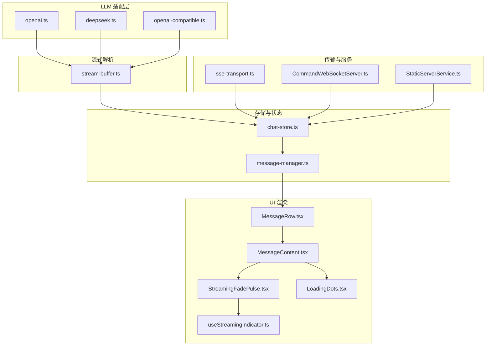
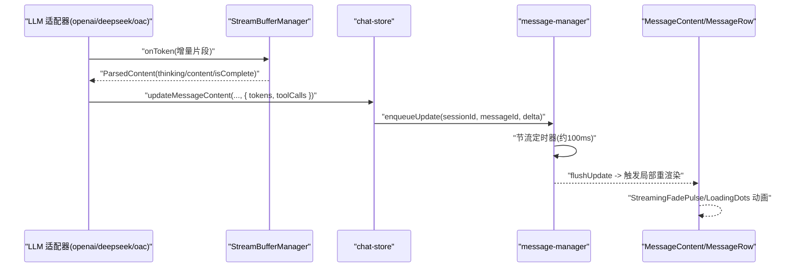
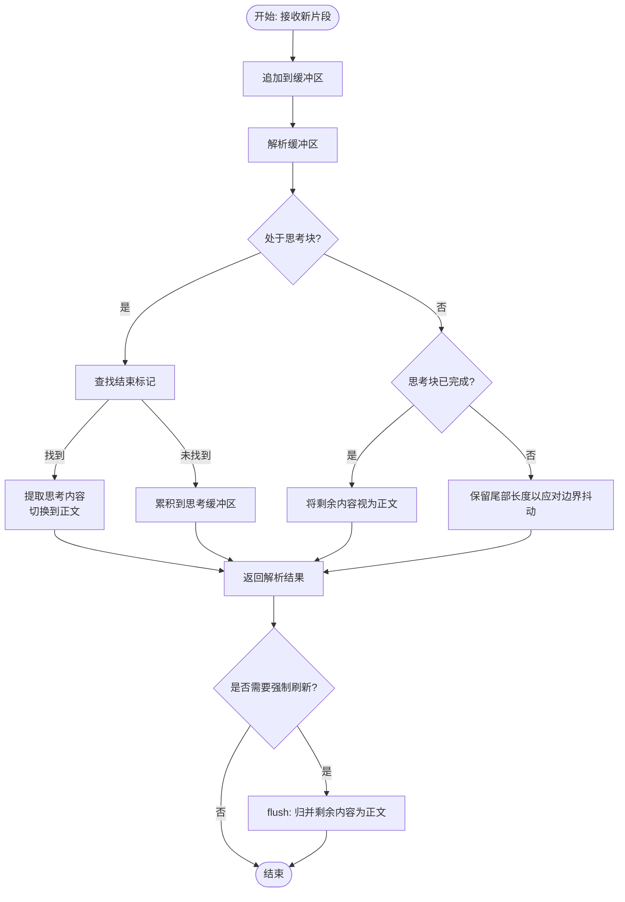
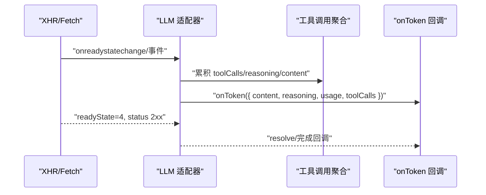
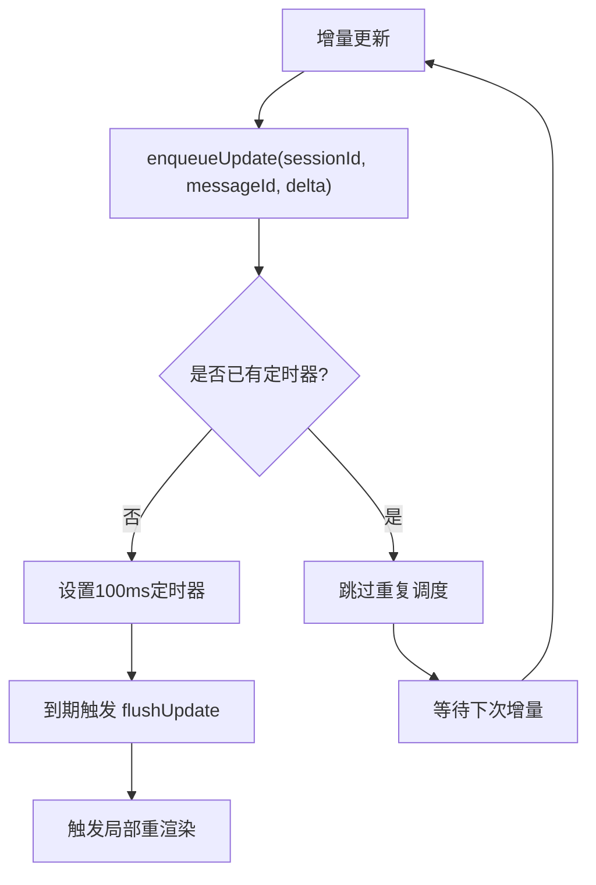
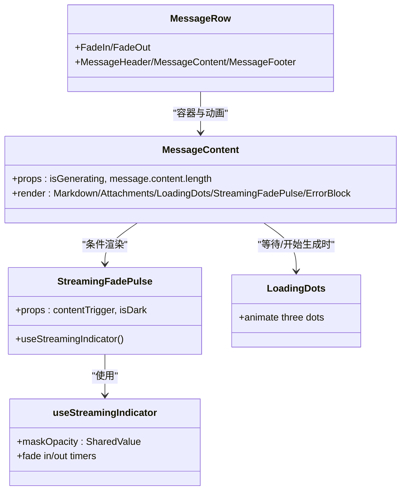
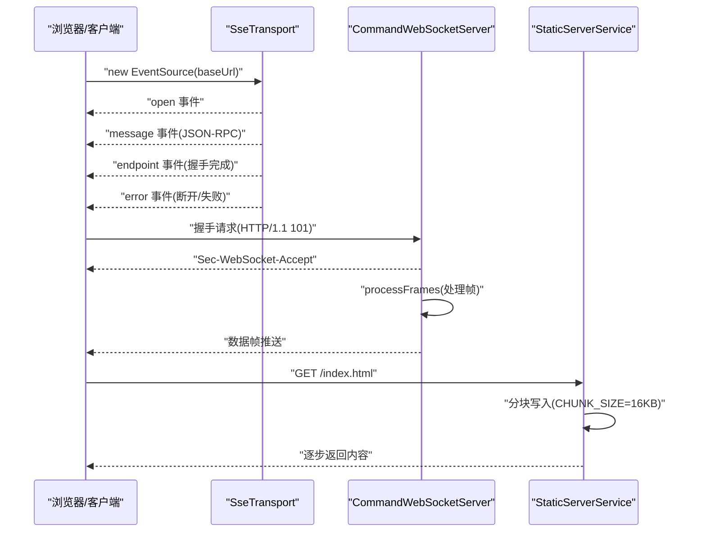
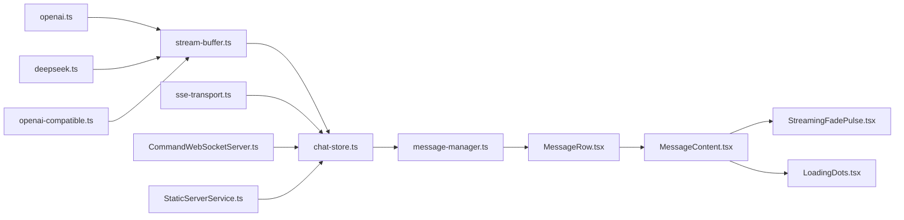

# 流式响应处理

<cite>
**本文引用的文件**
- [stream-buffer.ts](file://src/lib/llm/stream-buffer.ts)
- [openai.ts](file://src/lib/llm/providers/openai.ts)
- [deepseek.ts](file://src/lib/llm/providers/deepseek.ts)
- [openai-compatible.ts](file://src/lib/llm/providers/openai-compatible.ts)
- [chat-store.ts](file://src/store/chat-store.ts)
- [message-manager.ts](file://src/store/chat/message-manager.ts)
- [useChat.ts](file://src/features/chat/hooks/useChat.ts)
- [MessageContent.tsx](file://src/features/chat/components/message/MessageContent.tsx)
- [StreamingFadePulse.tsx](file://src/features/chat/components/message/blocks/StreamingFadePulse.tsx)
- [useStreamingIndicator.ts](file://src/features/chat/components/message/hooks/useStreamingIndicator.ts)
- [LoadingDots.tsx](file://src/features/chat/components/message/blocks/LoadingDots.tsx)
- [MessageRow.tsx](file://src/features/chat/components/message/MessageRow.tsx)
- [error-normalizer.ts](file://src/lib/llm/error-normalizer.ts)
- [sse-transport.ts](file://src/lib/mcp/transports/sse-transport.ts)
- [CommandWebSocketServer.ts](file://src/services/workbench/CommandWebSocketServer.ts)
- [StaticServerService.ts](file://src/services/workbench/StaticServerService.ts)
- [ChatPage.tsx](file://web-client/src/pages/ChatPage.tsx)
- [useWebSocket.ts](file://web-client/src/hooks/useWebSocket.ts)
</cite>

## 目录
1. [简介](#简介)
2. [项目结构](#项目结构)
3. [核心组件](#核心组件)
4. [架构总览](#架构总览)
5. [详细组件分析](#详细组件分析)
6. [依赖关系分析](#依赖关系分析)
7. [性能考量](#性能考量)
8. [故障排查指南](#故障排查指南)
9. [结论](#结论)
10. [附录](#附录)

## 简介
本文件系统性阐述本仓库中的流式响应处理体系，覆盖数据接收、解析、增量更新与状态同步，以及前端 UI 的渐进式渲染、动画与体验优化；同时给出性能优化策略、错误处理与重连机制，并提供可直接参考的代码定位与最佳实践。

## 项目结构
围绕流式响应的关键模块分布如下：
- LLM 适配层：OpenAI、DeepSeek、兼容 OpenAI 协议的供应商，负责建立流式连接、解析增量片段、触发回调。
- 流式缓冲与解析：StreamBufferManager 将流式片段按“思考/正文”结构化拆分，处理跨块边界与未闭合标签。
- 存储与状态：chat-store 与 message-manager 负责会话消息的生成、流式聚合、节流刷新与最终落盘。
- UI 渲染：MessageRow/MessageContent/StreamingFadePulse/LoadingDots 等组件负责渐进式展示、脉冲动画与加载态。
- 传输与服务：SSE/WS 服务端与客户端，保障长连接稳定与分块传输。
- 错误标准化：ErrorNormalizer 将各类错误归类、提取重试信息，统一提示。

图表来源
- [openai.ts:250-320](file://src/lib/llm/providers/openai.ts#L250-L320)
- [deepseek.ts:280-360](file://src/lib/llm/providers/deepseek.ts#L280-L360)
- [openai-compatible.ts:300-340](file://src/lib/llm/providers/openai-compatible.ts#L300-L340)
- [stream-buffer.ts:23-97](file://src/lib/llm/stream-buffer.ts#L23-L97)
- [chat-store.ts:1508-1539](file://src/store/chat-store.ts#L1508-L1539)
- [message-manager.ts:271-278](file://src/store/chat/message-manager.ts#L271-L278)
- [MessageRow.tsx:40-128](file://src/features/chat/components/message/MessageRow.tsx#L40-L128)
- [MessageContent.tsx:14-97](file://src/features/chat/components/message/MessageContent.tsx#L14-L97)
- [StreamingFadePulse.tsx:16-52](file://src/features/chat/components/message/blocks/StreamingFadePulse.tsx#L16-L52)
- [LoadingDots.tsx:18-65](file://src/features/chat/components/message/blocks/LoadingDots.tsx#L18-L65)
- [useStreamingIndicator.ts:11-49](file://src/features/chat/components/message/hooks/useStreamingIndicator.ts#L11-L49)
- [sse-transport.ts:41-88](file://src/lib/mcp/transports/sse-transport.ts#L41-L88)
- [CommandWebSocketServer.ts:210-249](file://src/services/workbench/CommandWebSocketServer.ts#L210-L249)
- [StaticServerService.ts:147-162](file://src/services/workbench/StaticServerService.ts#L147-L162)

章节来源
- [openai.ts:250-320](file://src/lib/llm/providers/openai.ts#L250-L320)
- [deepseek.ts:280-360](file://src/lib/llm/providers/deepseek.ts#L280-L360)
- [openai-compatible.ts:300-340](file://src/lib/llm/providers/openai-compatible.ts#L300-L340)
- [stream-buffer.ts:23-97](file://src/lib/llm/stream-buffer.ts#L23-L97)
- [chat-store.ts:1508-1539](file://src/store/chat-store.ts#L1508-L1539)
- [message-manager.ts:271-278](file://src/store/chat/message-manager.ts#L271-L278)
- [MessageRow.tsx:40-128](file://src/features/chat/components/message/MessageRow.tsx#L40-L128)
- [MessageContent.tsx:14-97](file://src/features/chat/components/message/MessageContent.tsx#L14-L97)
- [StreamingFadePulse.tsx:16-52](file://src/features/chat/components/message/blocks/StreamingFadePulse.tsx#L16-L52)
- [LoadingDots.tsx:18-65](file://src/features/chat/components/message/blocks/LoadingDots.tsx#L18-L65)
- [useStreamingIndicator.ts:11-49](file://src/features/chat/components/message/hooks/useStreamingIndicator.ts#L11-L49)
- [sse-transport.ts:41-88](file://src/lib/mcp/transports/sse-transport.ts#L41-L88)
- [CommandWebSocketServer.ts:210-249](file://src/services/workbench/CommandWebSocketServer.ts#L210-L249)
- [StaticServerService.ts:147-162](file://src/services/workbench/StaticServerService.ts#L147-L162)

## 核心组件
- 流式缓冲与解析：StreamBufferManager 将流式片段按结构化边界（如“思考/正文”）进行拆分与合并，处理跨块边界与未闭合标签，提供统一的解析结果与强制刷新能力。
- LLM 适配器：OpenAI、DeepSeek、OpenAI 兼容协议适配器负责建立流式连接、解析增量片段、聚合工具调用与用量信息，并在流结束时触发完成回调。
- 存储与状态：chat-store 在流式过程中持续更新消息内容与用量；message-manager 对 UI 更新进行节流，避免频繁重渲染。
- UI 渲染：MessageRow/MessageContent 负责布局与内容渲染；StreamingFadePulse 与 LoadingDots 提供渐进式显示与脉冲动画，提升交互感知。
- 错误处理：ErrorNormalizer 将网络、速率限制、鉴权、无效请求、服务器错误等统一归类，提取可选的重试等待时间，便于 UI 展示与自动重试。

章节来源
- [stream-buffer.ts:23-140](file://src/lib/llm/stream-buffer.ts#L23-L140)
- [openai.ts:254-305](file://src/lib/llm/providers/openai.ts#L254-L305)
- [deepseek.ts:285-349](file://src/lib/llm/providers/deepseek.ts#L285-L349)
- [openai-compatible.ts:310-338](file://src/lib/llm/providers/openai-compatible.ts#L310-L338)
- [chat-store.ts:1508-1539](file://src/store/chat-store.ts#L1508-L1539)
- [message-manager.ts:271-278](file://src/store/chat/message-manager.ts#L271-L278)
- [MessageContent.tsx:14-97](file://src/features/chat/components/message/MessageContent.tsx#L14-L97)
- [StreamingFadePulse.tsx:16-52](file://src/features/chat/components/message/blocks/StreamingFadePulse.tsx#L16-L52)
- [LoadingDots.tsx:18-65](file://src/features/chat/components/message/blocks/LoadingDots.tsx#L18-L65)
- [error-normalizer.ts:40-124](file://src/lib/llm/error-normalizer.ts#L40-L124)

## 架构总览
下图展示了从 LLM 适配器到 UI 的完整链路：适配器解析增量片段，通过流式回调更新消息内容与用量；message-manager 节流刷新；UI 组件根据生成状态与内容长度驱动渐进式渲染与动画。

图表来源
- [openai.ts:294-301](file://src/lib/llm/providers/openai.ts#L294-L301)
- [deepseek.ts:338-345](file://src/lib/llm/providers/deepseek.ts#L338-L345)
- [openai-compatible.ts:320-327](file://src/lib/llm/providers/openai-compatible.ts#L320-L327)
- [stream-buffer.ts:41-97](file://src/lib/llm/stream-buffer.ts#L41-L97)
- [chat-store.ts:1508-1516](file://src/store/chat-store.ts#L1508-L1516)
- [message-manager.ts:271-278](file://src/store/chat/message-manager.ts#L271-L278)
- [MessageContent.tsx:82-94](file://src/features/chat/components/message/MessageContent.tsx#L82-L94)
- [StreamingFadePulse.tsx:16-52](file://src/features/chat/components/message/blocks/StreamingFadePulse.tsx#L16-L52)

## 详细组件分析

### StreamBufferManager 工作原理
- 数据分片与边界识别：通过结构化标记（如“思考/正文”起止）将流式片段拆分为两段内容，处理跨块边界与未闭合标签。
- 增量更新：每次 append 后立即 parse，返回当前可用的 thinking/content 与 isComplete 标记。
- 强制刷新：在流结束时 flush，确保未闭合标记内容被安全地归入相应区域。
- 状态查询：getState 便于调试与诊断。

图表来源
- [stream-buffer.ts:33-97](file://src/lib/llm/stream-buffer.ts#L33-L97)
- [stream-buffer.ts:103-117](file://src/lib/llm/stream-buffer.ts#L103-L117)

章节来源
- [stream-buffer.ts:23-140](file://src/lib/llm/stream-buffer.ts#L23-L140)

### LLM 适配器的流式回调与工具调用聚合
- OpenAI/DeepSeek/OpenAI 兼容协议适配器在收到增量片段时，解析 content/reasoning/toolCalls/usage 等字段，调用 onToken 回调。
- 工具调用聚合：将同一流中的多个片段累积为完整结构，避免在片段阶段解析不完整的 JSON。
- 流结束处理：当 XHR.readyState=4 且状态码 2xx 时，表示流结束，触发 resolve 或完成回调。

图表来源
- [openai.ts:294-301](file://src/lib/llm/providers/openai.ts#L294-L301)
- [deepseek.ts:285-349](file://src/lib/llm/providers/deepseek.ts#L285-L349)
- [openai-compatible.ts:315-327](file://src/lib/llm/providers/openai-compatible.ts#L315-L327)

章节来源
- [openai.ts:254-305](file://src/lib/llm/providers/openai.ts#L254-L305)
- [deepseek.ts:285-349](file://src/lib/llm/providers/deepseek.ts#L285-L349)
- [openai-compatible.ts:310-338](file://src/lib/llm/providers/openai-compatible.ts#L310-L338)

### 存储与状态同步：节流与增量更新
- chat-store 在流式回调中持续更新消息内容与用量，最后在流结束后冲刷缓冲区残余内容。
- message-manager 对同一消息的多次增量更新进行节流（约 100ms），平衡流畅度与渲染开销，避免频繁重渲染。

图表来源
- [chat-store.ts:1508-1539](file://src/store/chat-store.ts#L1508-L1539)
- [message-manager.ts:271-278](file://src/store/chat/message-manager.ts#L271-L278)

章节来源
- [chat-store.ts:1508-1539](file://src/store/chat-store.ts#L1508-L1539)
- [message-manager.ts:271-278](file://src/store/chat/message-manager.ts#L271-L278)

### UI 渲染：渐进式显示、动画与体验优化
- MessageContent 根据 isGenerating 与 message.content 长度决定显示 LoadingDots 或 Markdown 内容，并叠加 StreamingFadePulse 脉冲遮罩。
- StreamingFadePulse 通过 useStreamingIndicator 控制淡入淡出，结合 IDLE_TIMEOUT_MS 实现“有内容到达即脉冲”的即时反馈。
- MessageRow 对最近消息使用淡入/淡出动画，增强滚动体验。

图表来源
- [MessageContent.tsx:14-97](file://src/features/chat/components/message/MessageContent.tsx#L14-L97)
- [StreamingFadePulse.tsx:16-52](file://src/features/chat/components/message/blocks/StreamingFadePulse.tsx#L16-L52)
- [useStreamingIndicator.ts:11-49](file://src/features/chat/components/message/hooks/useStreamingIndicator.ts#L11-L49)
- [LoadingDots.tsx:18-65](file://src/features/chat/components/message/blocks/LoadingDots.tsx#L18-L65)
- [MessageRow.tsx:40-128](file://src/features/chat/components/message/MessageRow.tsx#L40-L128)

章节来源
- [MessageContent.tsx:14-97](file://src/features/chat/components/message/MessageContent.tsx#L14-L97)
- [StreamingFadePulse.tsx:16-52](file://src/features/chat/components/message/blocks/StreamingFadePulse.tsx#L16-L52)
- [useStreamingIndicator.ts:11-49](file://src/features/chat/components/message/hooks/useStreamingIndicator.ts#L11-L49)
- [LoadingDots.tsx:18-65](file://src/features/chat/components/message/blocks/LoadingDots.tsx#L18-L65)
- [MessageRow.tsx:40-128](file://src/features/chat/components/message/MessageRow.tsx#L40-L128)

### 传输与服务：SSE/WS 与静态服务分块
- SSE Transport：监听 open/message/endpoint/error 事件，endpoint 事件作为握手完成信号；断开时拒绝待处理请求。
- WebSocket 服务端：完成协议升级与帧处理，支持握手完成后继续处理剩余帧。
- 静态服务分块：采用固定大小分块写入，避免一次性写入大体积内容导致阻塞或异常。

图表来源
- [sse-transport.ts:41-88](file://src/lib/mcp/transports/sse-transport.ts#L41-L88)
- [CommandWebSocketServer.ts:210-249](file://src/services/workbench/CommandWebSocketServer.ts#L210-L249)
- [StaticServerService.ts:147-162](file://src/services/workbench/StaticServerService.ts#L147-L162)

章节来源
- [sse-transport.ts:41-104](file://src/lib/mcp/transports/sse-transport.ts#L41-L104)
- [CommandWebSocketServer.ts:210-249](file://src/services/workbench/CommandWebSocketServer.ts#L210-L249)
- [StaticServerService.ts:147-162](file://src/services/workbench/StaticServerService.ts#L147-L162)

### Web 客户端流式渲染示例
- ChatPage：监听流式更新，按 messageId 合并或新增消息，逐步拼接 content。
- useWebSocket：根据消息类型区分 TOKEN 与 CHAT_RESPONSE，实现增量追加或替换。

章节来源
- [ChatPage.tsx:187-201](file://web-client/src/pages/ChatPage.tsx#L187-L201)
- [useWebSocket.ts:53-78](file://web-client/src/hooks/useWebSocket.ts#L53-L78)

## 依赖关系分析
- 低耦合：LLM 适配器仅依赖 StreamBufferManager 的解析结果；UI 组件只消费 store 的状态变化。
- 关键依赖链：适配器 → StreamBufferManager → chat-store → message-manager → UI。
- 传输层：SSE/WS 与静态服务分别服务于不同场景，互不干扰。

图表来源
- [openai.ts:254-305](file://src/lib/llm/providers/openai.ts#L254-L305)
- [deepseek.ts:285-349](file://src/lib/llm/providers/deepseek.ts#L285-L349)
- [openai-compatible.ts:310-338](file://src/lib/llm/providers/openai-compatible.ts#L310-L338)
- [stream-buffer.ts:23-97](file://src/lib/llm/stream-buffer.ts#L23-L97)
- [chat-store.ts:1508-1539](file://src/store/chat-store.ts#L1508-L1539)
- [message-manager.ts:271-278](file://src/store/chat/message-manager.ts#L271-L278)
- [MessageRow.tsx:40-128](file://src/features/chat/components/message/MessageRow.tsx#L40-L128)
- [MessageContent.tsx:14-97](file://src/features/chat/components/message/MessageContent.tsx#L14-L97)
- [StreamingFadePulse.tsx:16-52](file://src/features/chat/components/message/blocks/StreamingFadePulse.tsx#L16-L52)
- [LoadingDots.tsx:18-65](file://src/features/chat/components/message/blocks/LoadingDots.tsx#L18-L65)
- [sse-transport.ts:41-88](file://src/lib/mcp/transports/sse-transport.ts#L41-L88)
- [CommandWebSocketServer.ts:210-249](file://src/services/workbench/CommandWebSocketServer.ts#L210-L249)
- [StaticServerService.ts:147-162](file://src/services/workbench/StaticServerService.ts#L147-L162)

## 性能考量
- 渲染节流：message-manager 对增量更新进行约 100ms 节流，兼顾流畅度与渲染成本。
- 分块传输：静态服务采用 16KB 分块写入，避免大文件一次性写入带来的阻塞风险。
- 动画开销控制：StreamingFadePulse 与 LoadingDots 使用 reanimated 的 SharedValue 与 withTiming/withRepeat，减少不必要的重排。
- 网络优化：SSE/WS 传输层尽量复用连接，减少握手与连接开销；适配器在流结束时及时释放资源。

章节来源
- [message-manager.ts:271-278](file://src/store/chat/message-manager.ts#L271-L278)
- [StaticServerService.ts:147-162](file://src/services/workbench/StaticServerService.ts#L147-L162)
- [StreamingFadePulse.tsx:16-52](file://src/features/chat/components/message/blocks/StreamingFadePulse.tsx#L16-L52)
- [LoadingDots.tsx:18-65](file://src/features/chat/components/message/blocks/LoadingDots.tsx#L18-L65)

## 故障排查指南
- 错误分类与重试：ErrorNormalizer 将网络、速率限制、鉴权、无效请求、服务器错误等归类，并可提取 retryAfter 时间，便于 UI 提示与自动重试。
- 断线与重连：SseTransport 在 error 事件中断开连接并拒绝待处理请求；建议在上层业务中实现指数退避重连策略。
- 流结束处理：若未收到显式结束信号，适配器在 readyState=4 且 2xx 时仍会 resolve，确保流程闭环。
- 工具调用解析：在流式阶段避免解析不完整的 JSON 参数，待流结束后再统一解析，防止崩溃。

章节来源
- [error-normalizer.ts:40-124](file://src/lib/llm/error-normalizer.ts#L40-L124)
- [sse-transport.ts:70-84](file://src/lib/mcp/transports/sse-transport.ts#L70-L84)
- [openai-compatible.ts:315-327](file://src/lib/llm/providers/openai-compatible.ts#L315-L327)
- [openai.ts:254-269](file://src/lib/llm/providers/openai.ts#L254-L269)
- [deepseek.ts:285-300](file://src/lib/llm/providers/deepseek.ts#L285-L300)

## 结论
本系统通过“结构化流式解析 + 存储节流 + 渐进式 UI 动画”的组合，实现了稳定、顺滑的流式响应体验。适配器层抽象了多供应商差异，UI 层通过脉冲与加载动画提升了感知速度；传输层与静态服务保证了长连接与分块传输的可靠性。建议在生产环境中结合 ErrorNormalizer 的重试策略与 SSE/WS 的断线重连机制，进一步提升稳定性与用户体验。

## 附录
- 最佳实践清单
  - 在流式阶段仅聚合数据，不在片段阶段解析不完整 JSON。
  - 使用 message-manager 的节流策略，避免过度重渲染。
  - 在 UI 中以“内容长度变化”为触发条件驱动 StreamingFadePulse，保持动画自然。
  - 对 SSE/WS 连接实施指数退避重连，并在断开时拒绝待处理请求，避免状态不一致。
  - 在流结束时调用 flush，确保未闭合标记内容被正确归并。