# 消息处理

<cite>
**本文引用的文件**
- [src/types/chat.ts](file://src/types/chat.ts)
- [src/store/chat/types.ts](file://src/store/chat/types.ts)
- [src/store/chat/message-manager.ts](file://src/store/chat/message-manager.ts)
- [src/lib/db/session-repository.ts](file://src/lib/db/session-repository.ts)
- [src/lib/db/schema.ts](file://src/lib/db/schema.ts)
- [src/features/chat/components/message/MessageContent.tsx](file://src/features/chat/components/message/MessageContent.tsx)
- [src/features/chat/components/message/blocks/AttachmentBlock.tsx](file://src/features/chat/components/message/blocks/AttachmentBlock.tsx)
- [src/features/chat/components/message/blocks/ErrorBlock.tsx](file://src/features/chat/components/message/blocks/ErrorBlock.tsx)
- [src/features/chat/components/message/hooks/useMessageArchive.ts](file://src/features/chat/components/message/hooks/useMessageArchive.ts)
- [src/store/chat/post-processor.ts](file://src/store/chat/post-processor.ts)
- [src/lib/rag/memory-manager.ts](file://src/lib/rag/memory-manager.ts)
- [src/lib/llm/providers/gemini.ts](file://src/lib/llm/providers/gemini.ts)
- [src/lib/llm/providers/vertexai.ts](file://src/lib/llm/providers/vertexai.ts)
- [src/lib/llm/error-normalizer.ts](file://src/lib/llm/error-normalizer.ts)
- [web-client/src/hooks/useWebSocket.ts](file://web-client/src/hooks/useWebSocket.ts)
- [src/services/workbench/StoreSyncService.ts](file://src/services/workbench/StoreSyncService.ts)
</cite>

## 目录
1. [简介](#简介)
2. [项目结构](#项目结构)
3. [核心组件](#核心组件)
4. [架构总览](#架构总览)
5. [详细组件分析](#详细组件分析)
6. [依赖关系分析](#依赖关系分析)
7. [性能考量](#性能考量)
8. [故障排查指南](#故障排查指南)
9. [结论](#结论)
10. [附录](#附录)

## 简介
本文件面向开发者，系统化阐述消息处理系统的实现与设计，覆盖消息的创建、更新、删除与检索；消息类型体系（用户、助手、工具、系统）；内容格式化、附件与图片管理；状态管理（生成、向量化、归档、进度）；存储架构（SQLite、迁移、缓存）；以及与 RAG、LLM 提供商、错误标准化、前后端同步等模块的集成方式。文档以循序渐进的方式组织，既适合快速上手，也便于深入扩展。

## 项目结构
消息处理相关代码主要分布在以下区域：
- 类型定义与接口：消息、会话、RAG、工具调用等核心类型
- 状态管理：消息管理器、会话管理器、审批与环管理
- 存储层：SQLite 访问、表结构迁移
- UI 展示：消息内容渲染、附件块、错误块、归档钩子
- 后处理：向量化归档、KG 提取、上下文摘要、统计更新
- LLM 集成：消息格式化、多提供商适配
- 错误处理：错误分类与标准化
- 同步与广播：工作台服务与 WebSocket

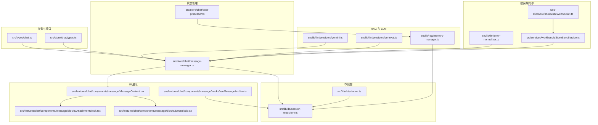

图表来源
- [src/types/chat.ts:135-167](file://src/types/chat.ts#L135-L167)
- [src/store/chat/types.ts:35-73](file://src/store/chat/types.ts#L35-L73)
- [src/store/chat/message-manager.ts:18-442](file://src/store/chat/message-manager.ts#L18-L442)
- [src/lib/db/session-repository.ts:162-424](file://src/lib/db/session-repository.ts#L162-L424)
- [src/lib/db/schema.ts:138-151](file://src/lib/db/schema.ts#L138-L151)
- [src/features/chat/components/message/MessageContent.tsx:14-98](file://src/features/chat/components/message/MessageContent.tsx#L14-L98)
- [src/features/chat/components/message/blocks/AttachmentBlock.tsx:9-69](file://src/features/chat/components/message/blocks/AttachmentBlock.tsx#L9-L69)
- [src/features/chat/components/message/blocks/ErrorBlock.tsx:7-35](file://src/features/chat/components/message/blocks/ErrorBlock.tsx#L7-L35)
- [src/features/chat/components/message/hooks/useMessageArchive.ts:6-58](file://src/features/chat/components/message/hooks/useMessageArchive.ts#L6-L58)
- [src/store/chat/post-processor.ts:44-95](file://src/store/chat/post-processor.ts#L44-L95)
- [src/lib/rag/memory-manager.ts:718-761](file://src/lib/rag/memory-manager.ts#L718-L761)
- [src/lib/llm/providers/gemini.ts:235-257](file://src/lib/llm/providers/gemini.ts#L235-L257)
- [src/lib/llm/providers/vertexai.ts:461-488](file://src/lib/llm/providers/vertexai.ts#L461-L488)
- [src/lib/llm/error-normalizer.ts:40-124](file://src/lib/llm/error-normalizer.ts#L40-L124)
- [web-client/src/hooks/useWebSocket.ts:38-51](file://web-client/src/hooks/useWebSocket.ts#L38-L51)
- [src/services/workbench/StoreSyncService.ts:79-93](file://src/services/workbench/StoreSyncService.ts#L79-L93)

章节来源
- [src/types/chat.ts:135-167](file://src/types/chat.ts#L135-L167)
- [src/store/chat/types.ts:35-73](file://src/store/chat/types.ts#L35-L73)
- [src/store/chat/message-manager.ts:18-442](file://src/store/chat/message-manager.ts#L18-L442)
- [src/lib/db/session-repository.ts:162-424](file://src/lib/db/session-repository.ts#L162-L424)
- [src/lib/db/schema.ts:138-151](file://src/lib/db/schema.ts#L138-L151)
- [src/features/chat/components/message/MessageContent.tsx:14-98](file://src/features/chat/components/message/MessageContent.tsx#L14-L98)
- [src/features/chat/components/message/blocks/AttachmentBlock.tsx:9-69](file://src/features/chat/components/message/blocks/AttachmentBlock.tsx#L9-L69)
- [src/features/chat/components/message/blocks/ErrorBlock.tsx:7-35](file://src/features/chat/components/message/blocks/ErrorBlock.tsx#L7-L35)
- [src/features/chat/components/message/hooks/useMessageArchive.ts:6-58](file://src/features/chat/components/message/hooks/useMessageArchive.ts#L6-L58)
- [src/store/chat/post-processor.ts:44-95](file://src/store/chat/post-processor.ts#L44-L95)
- [src/lib/rag/memory-manager.ts:718-761](file://src/lib/rag/memory-manager.ts#L718-L761)
- [src/lib/llm/providers/gemini.ts:235-257](file://src/lib/llm/providers/gemini.ts#L235-L257)
- [src/lib/llm/providers/vertexai.ts:461-488](file://src/lib/llm/providers/vertexai.ts#L461-L488)
- [src/lib/llm/error-normalizer.ts:40-124](file://src/lib/llm/error-normalizer.ts#L40-L124)
- [web-client/src/hooks/useWebSocket.ts:38-51](file://web-client/src/hooks/useWebSocket.ts#L38-L51)
- [src/services/workbench/StoreSyncService.ts:79-93](file://src/services/workbench/StoreSyncService.ts#L79-L93)

## 核心组件
- 消息类型与接口：定义消息、会话、RAG、工具调用、令牌用量等结构，支撑 UI 渲染与后处理。
- 消息管理器：负责消息的乐观更新、防抖写库、批量向量化状态更新、布局高度缓存、进度与错误标记。
- 存储层：SQLite 访问封装，提供消息的增删改查、分页、游标加载、自愈式迁移。
- UI 展示：消息内容渲染、附件块、错误块、归档状态钩子。
- 后处理：归档到 RAG、KG 提取、上下文摘要、统计更新。
- LLM 集成：消息角色映射、格式化、多提供商适配。
- 错误处理：错误分类与标准化，提升用户体验与可观测性。
- 同步与广播：工作台服务与 WebSocket，保障多端一致。

章节来源
- [src/types/chat.ts:135-167](file://src/types/chat.ts#L135-L167)
- [src/store/chat/types.ts:35-73](file://src/store/chat/types.ts#L35-L73)
- [src/store/chat/message-manager.ts:18-442](file://src/store/chat/message-manager.ts#L18-L442)
- [src/lib/db/session-repository.ts:162-424](file://src/lib/db/session-repository.ts#L162-L424)
- [src/features/chat/components/message/MessageContent.tsx:14-98](file://src/features/chat/components/message/MessageContent.tsx#L14-L98)
- [src/store/chat/post-processor.ts:44-95](file://src/store/chat/post-processor.ts#L44-L95)
- [src/lib/llm/providers/gemini.ts:235-257](file://src/lib/llm/providers/gemini.ts#L235-L257)

## 架构总览
消息处理系统采用“前端乐观更新 + 后台持久化”的双写模式，结合 SQLite 与内存状态，实现高性能与一致性的平衡。LLM 提供商负责消息格式化与角色映射，RAG 模块负责向量化归档与检索增强，错误标准化提供统一的错误体验，工作台服务与 WebSocket 实现多端同步。

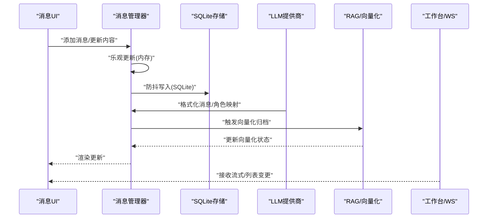

图表来源
- [src/store/chat/message-manager.ts:205-231](file://src/store/chat/message-manager.ts#L205-L231)
- [src/lib/db/session-repository.ts:162-204](file://src/lib/db/session-repository.ts#L162-L204)
- [src/lib/llm/providers/gemini.ts:235-257](file://src/lib/llm/providers/gemini.ts#L235-L257)
- [src/store/chat/post-processor.ts:44-95](file://src/store/chat/post-processor.ts#L44-L95)
- [web-client/src/hooks/useWebSocket.ts:38-51](file://web-client/src/hooks/useWebSocket.ts#L38-L51)

## 详细组件分析

### 消息类型系统与内容格式化
- 消息类型：用户、助手、系统、工具四类角色，分别承载不同职责与渲染逻辑。
- 内容结构：支持 Markdown 内容、思考链、引用、引用元数据、工具调用与结果、图片与文件附件、向量化状态、归档标记、布局高度等。
- LLM 角色映射：将消息角色映射为模型期望的角色（如 user/model/function），并进行内容格式化，确保多提供商一致性。

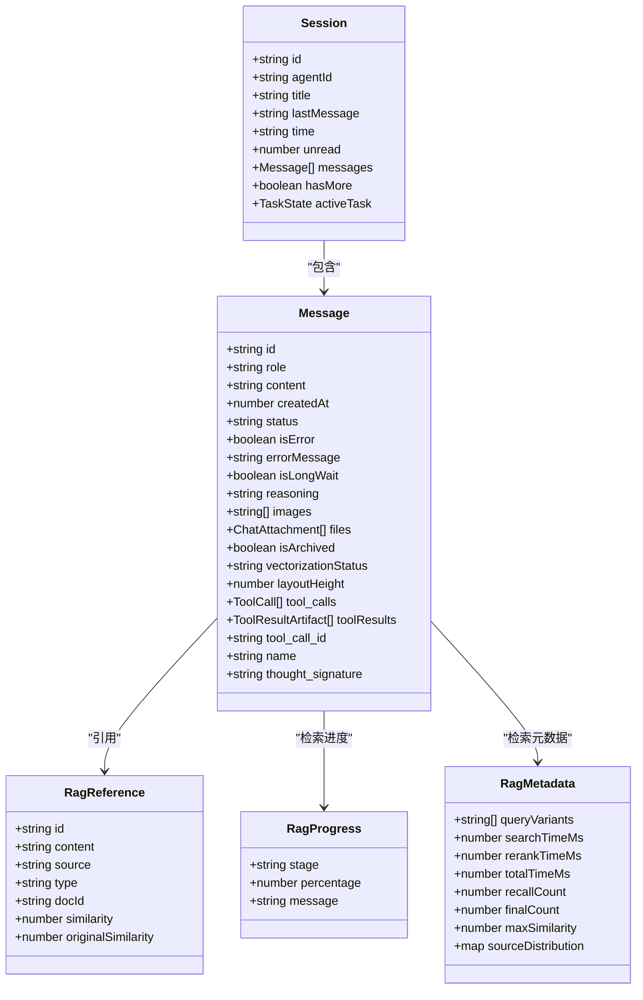

图表来源
- [src/types/chat.ts:135-167](file://src/types/chat.ts#L135-L167)
- [src/types/chat.ts:77-106](file://src/types/chat.ts#L77-L106)
- [src/types/chat.ts:87-106](file://src/types/chat.ts#L87-L106)
- [src/types/chat.ts:169-223](file://src/types/chat.ts#L169-L223)

章节来源
- [src/types/chat.ts:135-167](file://src/types/chat.ts#L135-L167)
- [src/types/chat.ts:77-106](file://src/types/chat.ts#L77-L106)
- [src/types/chat.ts:87-106](file://src/types/chat.ts#L87-L106)
- [src/types/chat.ts:169-223](file://src/types/chat.ts#L169-L223)

### 消息创建、更新、删除与检索
- 创建：乐观更新内存状态，后台异步写入 SQLite，并更新会话更新时间。
- 更新：采用节流与防抖合并高频更新，批量写入 SQLite，同时维护令牌用量与计费统计。
- 删除：支持删除单条消息与“删除某时间之后的所有消息”，并中止生成中的会话。
- 检索：支持标准分页与基于游标的“之前”加载，返回时按时间升序以适配渲染。

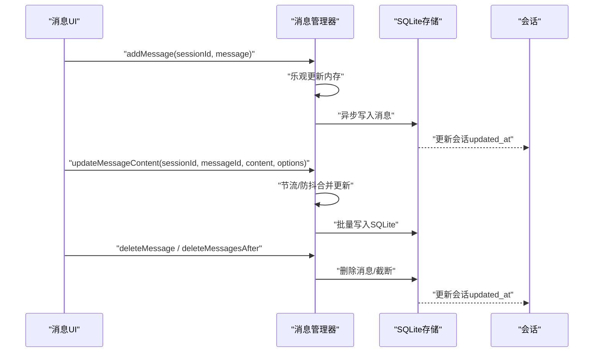

图表来源
- [src/store/chat/message-manager.ts:205-231](file://src/store/chat/message-manager.ts#L205-L231)
- [src/store/chat/message-manager.ts:233-279](file://src/store/chat/message-manager.ts#L233-L279)
- [src/store/chat/message-manager.ts:281-334](file://src/store/chat/message-manager.ts#L281-L334)
- [src/lib/db/session-repository.ts:162-204](file://src/lib/db/session-repository.ts#L162-L204)
- [src/lib/db/session-repository.ts:246-260](file://src/lib/db/session-repository.ts#L246-L260)
- [src/lib/db/session-repository.ts:266-299](file://src/lib/db/session-repository.ts#L266-L299)

章节来源
- [src/store/chat/message-manager.ts:205-231](file://src/store/chat/message-manager.ts#L205-L231)
- [src/store/chat/message-manager.ts:233-279](file://src/store/chat/message-manager.ts#L233-L279)
- [src/store/chat/message-manager.ts:281-334](file://src/store/chat/message-manager.ts#L281-L334)
- [src/lib/db/session-repository.ts:162-204](file://src/lib/db/session-repository.ts#L162-L204)
- [src/lib/db/session-repository.ts:246-260](file://src/lib/db/session-repository.ts#L246-L260)
- [src/lib/db/session-repository.ts:266-299](file://src/lib/db/session-repository.ts#L266-L299)

### 附件与图片管理
- 附件结构：文件名、大小、MIME、URI、可选文本内容与令牌估算。
- 图片结构：缩略图与原图 URI、MIME 类型。
- 渲染：附件块根据是否存在图片或文件进行条件渲染，图片支持点击预览。

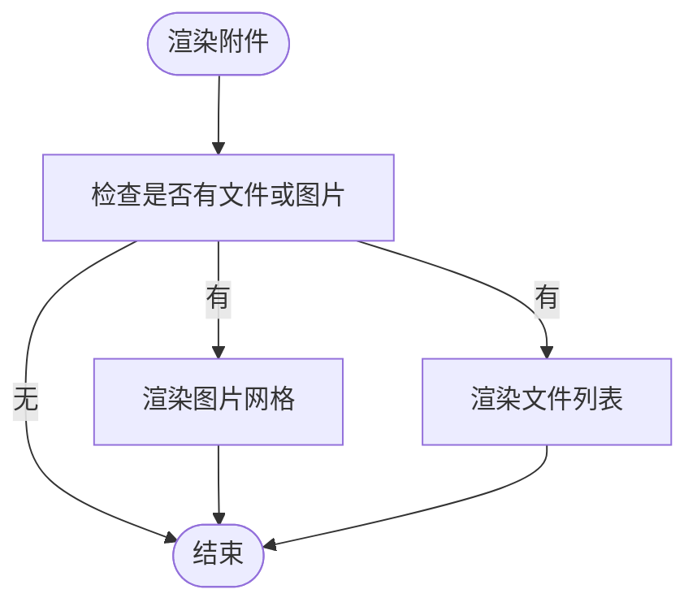

图表来源
- [src/features/chat/components/message/blocks/AttachmentBlock.tsx:9-69](file://src/features/chat/components/message/blocks/AttachmentBlock.tsx#L9-L69)
- [src/types/chat.ts:67-75](file://src/types/chat.ts#L67-L75)
- [src/types/chat.ts:61-65](file://src/types/chat.ts#L61-L65)

章节来源
- [src/features/chat/components/message/blocks/AttachmentBlock.tsx:9-69](file://src/features/chat/components/message/blocks/AttachmentBlock.tsx#L9-L69)
- [src/types/chat.ts:67-75](file://src/types/chat.ts#L67-L75)
- [src/types/chat.ts:61-65](file://src/types/chat.ts#L61-L65)

### 状态管理：生成、向量化、归档与进度
- 生成状态：UI 通过 isGenerating 控制加载与脉冲效果；消息管理器在删除/截断时中止生成。
- 向量化状态：支持 processing/success/error，成功后自动归档标记；批量更新以减少写库频率。
- 归档状态：归档钩子根据向量库记录与生成/处理状态动态判断是否归档。
- 进度跟踪：RAG 进度与元数据通过消息字段传递，后处理模块更新 UI 与统计。

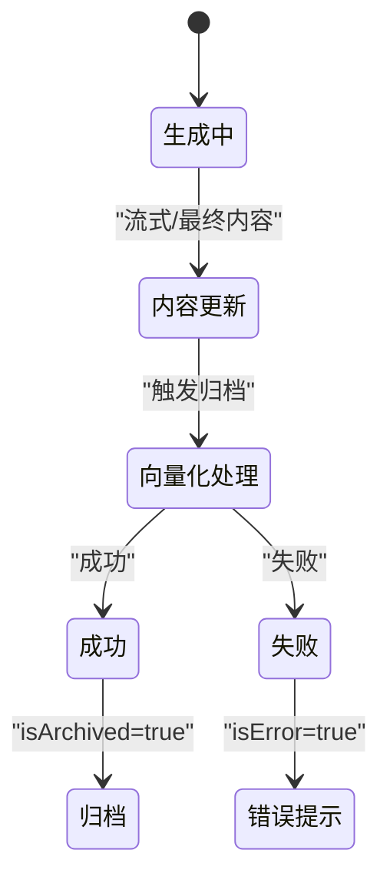

图表来源
- [src/store/chat/message-manager.ts:399-435](file://src/store/chat/message-manager.ts#L399-L435)
- [src/features/chat/components/message/hooks/useMessageArchive.ts:6-58](file://src/features/chat/components/message/hooks/useMessageArchive.ts#L6-L58)
- [src/store/chat/post-processor.ts:44-95](file://src/store/chat/post-processor.ts#L44-L95)

章节来源
- [src/store/chat/message-manager.ts:399-435](file://src/store/chat/message-manager.ts#L399-L435)
- [src/features/chat/components/message/hooks/useMessageArchive.ts:6-58](file://src/features/chat/components/message/hooks/useMessageArchive.ts#L6-L58)
- [src/store/chat/post-processor.ts:44-95](file://src/store/chat/post-processor.ts#L44-L95)

### 存储架构：SQLite、迁移与缓存
- 表结构：会话与消息表，消息包含 JSON 字段存储复杂结构（如 images、files、tool_calls、rag_* 等）。
- 迁移：自愈式迁移，自动检测缺失列并补全，保证版本演进的稳定性。
- 缓存：布局高度缓存（layoutHeight）避免频繁写库；令牌用量与计费统计在内存中增量计算，定期落库。

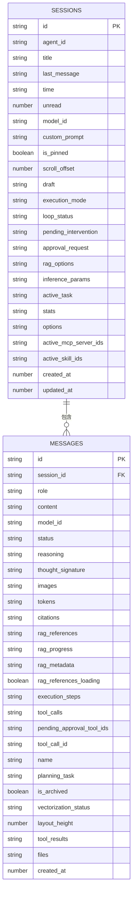

图表来源
- [src/lib/db/session-repository.ts:162-204](file://src/lib/db/session-repository.ts#L162-L204)
- [src/lib/db/session-repository.ts:345-402](file://src/lib/db/session-repository.ts#L345-L402)
- [src/lib/db/schema.ts:138-151](file://src/lib/db/schema.ts#L138-L151)

章节来源
- [src/lib/db/session-repository.ts:162-204](file://src/lib/db/session-repository.ts#L162-L204)
- [src/lib/db/session-repository.ts:345-402](file://src/lib/db/session-repository.ts#L345-L402)
- [src/lib/db/schema.ts:138-151](file://src/lib/db/schema.ts#L138-L151)

### 与 LLM 提供商的集成
- 角色映射：将消息角色映射为模型期望的角色（如 user/assistant/tool -> user/model/function）。
- 内容格式化：对消息内容进行格式化，确保多提供商一致性。
- 平台差异：不同提供商对连续用户消息、工具结果合并等有差异化处理，避免混淆模型。

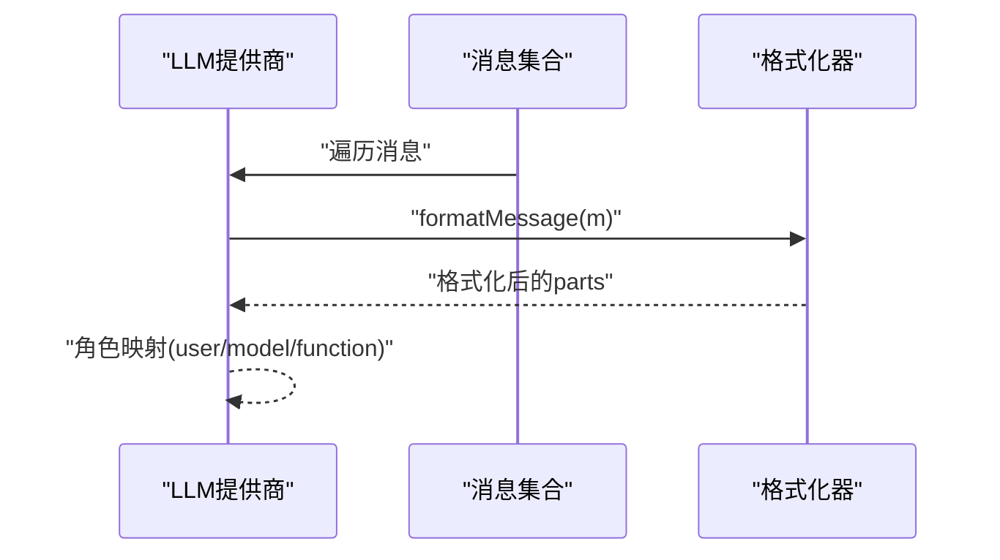

图表来源
- [src/lib/llm/providers/gemini.ts:235-257](file://src/lib/llm/providers/gemini.ts#L235-L257)
- [src/lib/llm/providers/vertexai.ts:461-488](file://src/lib/llm/providers/vertexai.ts#L461-L488)

章节来源
- [src/lib/llm/providers/gemini.ts:235-257](file://src/lib/llm/providers/gemini.ts#L235-L257)
- [src/lib/llm/providers/vertexai.ts:461-488](file://src/lib/llm/providers/vertexai.ts#L461-L488)

### 错误处理与用户体验
- 错误分类：网络、鉴权、限流、无效请求、服务器错误、配额超限、超时、未知。
- 标准化输出：提供用户友好消息、技术消息、是否可重试、重试等待时间。
- UI 展示：错误块根据 isError/isLongWait 展示软超时警告与重试动作。

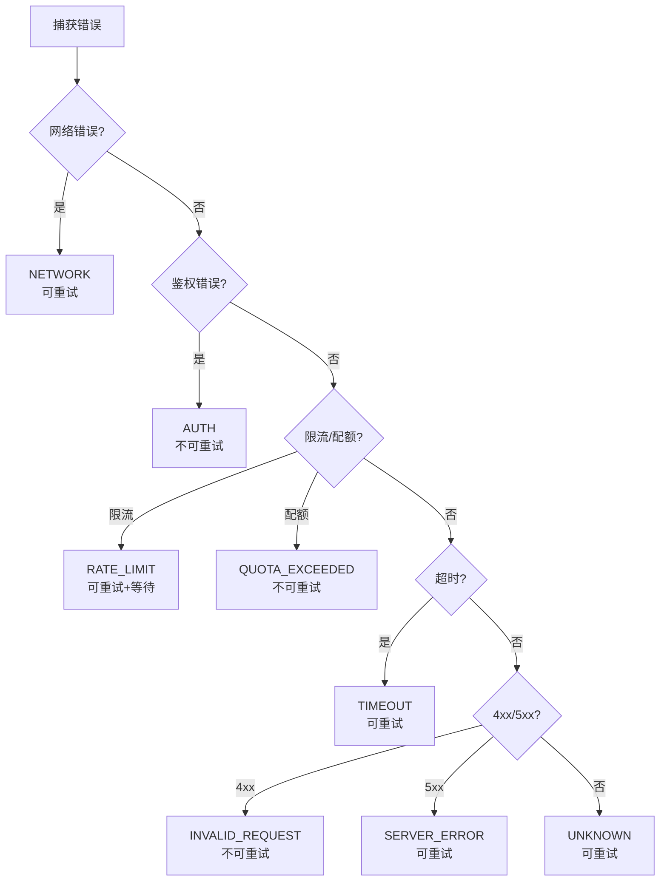

图表来源
- [src/lib/llm/error-normalizer.ts:40-124](file://src/lib/llm/error-normalizer.ts#L40-L124)
- [src/features/chat/components/message/blocks/ErrorBlock.tsx:7-35](file://src/features/chat/components/message/blocks/ErrorBlock.tsx#L7-L35)

章节来源
- [src/lib/llm/error-normalizer.ts:40-124](file://src/lib/llm/error-normalizer.ts#L40-L124)
- [src/features/chat/components/message/blocks/ErrorBlock.tsx:7-35](file://src/features/chat/components/message/blocks/ErrorBlock.tsx#L7-L35)

### 后处理与 RAG 归档
- 归档流程：设置向量化状态为 processing，执行切块与嵌入，更新进度，最终标记 success 并归档。
- KG 提取：采用批量累积模式，达到阈值后统一处理，降低开销。
- 上下文摘要：根据窗口与阈值判断是否需要摘要，避免上下文膨胀。
- 统计更新：累计输入/输出/系统消耗，更新会话统计与外部计费。

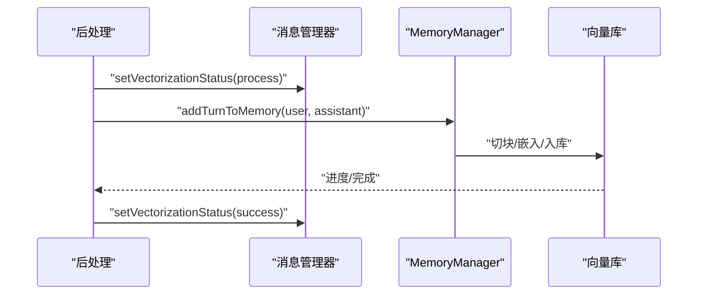

图表来源
- [src/store/chat/post-processor.ts:44-95](file://src/store/chat/post-processor.ts#L44-L95)
- [src/store/chat/message-manager.ts:399-435](file://src/store/chat/message-manager.ts#L399-L435)
- [src/lib/rag/memory-manager.ts:718-761](file://src/lib/rag/memory-manager.ts#L718-L761)

章节来源
- [src/store/chat/post-processor.ts:44-95](file://src/store/chat/post-processor.ts#L44-L95)
- [src/store/chat/message-manager.ts:399-435](file://src/store/chat/message-manager.ts#L399-L435)
- [src/lib/rag/memory-manager.ts:718-761](file://src/lib/rag/memory-manager.ts#L718-L761)

### 多端同步与流式更新
- WebSocket：客户端监听消息事件，解析并更新状态。
- 工作台服务：监控会话列表与当前消息内容变化，广播全量或增量更新，确保一致性。

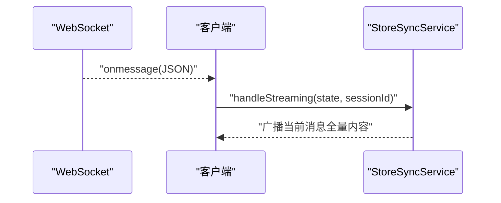

图表来源
- [web-client/src/hooks/useWebSocket.ts:38-51](file://web-client/src/hooks/useWebSocket.ts#L38-L51)
- [src/services/workbench/StoreSyncService.ts:79-93](file://src/services/workbench/StoreSyncService.ts#L79-L93)

章节来源
- [web-client/src/hooks/useWebSocket.ts:38-51](file://web-client/src/hooks/useWebSocket.ts#L38-L51)
- [src/services/workbench/StoreSyncService.ts:79-93](file://src/services/workbench/StoreSyncService.ts#L79-L93)

## 依赖关系分析
- 消息管理器依赖类型定义与存储层，负责 UI 乐观更新与 SQLite 防抖写入。
- 存储层依赖 SQLite 与迁移脚本，提供 CRUD 与自愈能力。
- UI 展示依赖消息上下文与块组件，错误块与归档钩子增强用户体验。
- 后处理依赖 RAG 模块与设置存储，负责归档、KG、摘要与统计。
- LLM 提供商依赖消息格式化与角色映射，保证多提供商一致性。
- 错误标准化贯穿消息生命周期，提升错误处理一致性。
- 工作台服务与 WebSocket 提供多端同步能力。

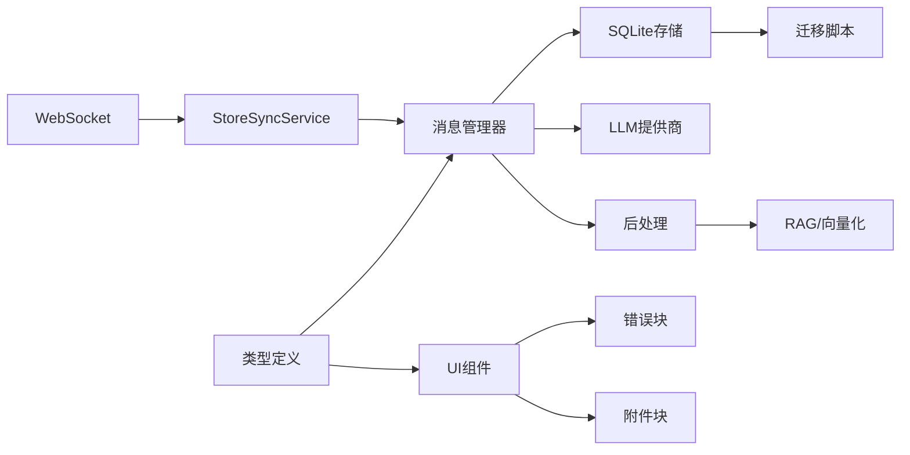

图表来源
- [src/types/chat.ts:135-167](file://src/types/chat.ts#L135-L167)
- [src/store/chat/message-manager.ts:18-442](file://src/store/chat/message-manager.ts#L18-L442)
- [src/lib/db/session-repository.ts:162-424](file://src/lib/db/session-repository.ts#L162-L424)
- [src/lib/db/schema.ts:138-151](file://src/lib/db/schema.ts#L138-L151)
- [src/features/chat/components/message/blocks/ErrorBlock.tsx:7-35](file://src/features/chat/components/message/blocks/ErrorBlock.tsx#L7-L35)
- [src/features/chat/components/message/blocks/AttachmentBlock.tsx:9-69](file://src/features/chat/components/message/blocks/AttachmentBlock.tsx#L9-L69)
- [src/store/chat/post-processor.ts:44-95](file://src/store/chat/post-processor.ts#L44-L95)
- [src/lib/rag/memory-manager.ts:718-761](file://src/lib/rag/memory-manager.ts#L718-L761)
- [web-client/src/hooks/useWebSocket.ts:38-51](file://web-client/src/hooks/useWebSocket.ts#L38-L51)
- [src/services/workbench/StoreSyncService.ts:79-93](file://src/services/workbench/StoreSyncService.ts#L79-L93)

章节来源
- [src/types/chat.ts:135-167](file://src/types/chat.ts#L135-L167)
- [src/store/chat/message-manager.ts:18-442](file://src/store/chat/message-manager.ts#L18-L442)
- [src/lib/db/session-repository.ts:162-424](file://src/lib/db/session-repository.ts#L162-L424)
- [src/lib/db/schema.ts:138-151](file://src/lib/db/schema.ts#L138-L151)
- [src/features/chat/components/message/blocks/ErrorBlock.tsx:7-35](file://src/features/chat/components/message/blocks/ErrorBlock.tsx#L7-L35)
- [src/features/chat/components/message/blocks/AttachmentBlock.tsx:9-69](file://src/features/chat/components/message/blocks/AttachmentBlock.tsx#L9-L69)
- [src/store/chat/post-processor.ts:44-95](file://src/store/chat/post-processor.ts#L44-L95)
- [src/lib/rag/memory-manager.ts:718-761](file://src/lib/rag/memory-manager.ts#L718-L761)
- [web-client/src/hooks/useWebSocket.ts:38-51](file://web-client/src/hooks/useWebSocket.ts#L38-L51)
- [src/services/workbench/StoreSyncService.ts:79-93](file://src/services/workbench/StoreSyncService.ts#L79-L93)

## 性能考量
- 防抖与节流：消息内容更新采用 500ms 防抖与 100ms 节流，平衡流畅度与写库频率。
- 布局高度缓存：仅在高度变化超过阈值时更新，避免频繁写库。
- 批量向量化状态更新：批量写入 SQLite，减少事务开销。
- 并行搜索与混合检索：向量与关键词并行，RRF 融合，提升召回质量与速度。
- 自愈式迁移：自动修复缺失列，降低部署风险与维护成本。
- 多端同步：广播全量内容，确保一致性的同时减少增量复杂度。

## 故障排查指南
- SQLite 写入失败：检查防抖定时器与异常捕获，确认 DB 状态与迁移脚本执行情况。
- 归档状态异常：检查向量化状态与数据库向量记录，确认 isArchived 与 vectorizationStatus 的一致性。
- LLM 角色映射问题：核对消息角色与提供商映射逻辑，避免工具结果与用户消息混淆。
- 错误分类不准确：检查错误标准化器的分类逻辑与响应头/体解析。
- 多端不同步：检查 WebSocket 连接状态与 StoreSyncService 的广播逻辑。

章节来源
- [src/store/chat/message-manager.ts:61-72](file://src/store/chat/message-manager.ts#L61-L72)
- [src/features/chat/components/message/hooks/useMessageArchive.ts:6-58](file://src/features/chat/components/message/hooks/useMessageArchive.ts#L6-L58)
- [src/lib/llm/providers/vertexai.ts:461-488](file://src/lib/llm/providers/vertexai.ts#L461-L488)
- [src/lib/llm/error-normalizer.ts:40-124](file://src/lib/llm/error-normalizer.ts#L40-L124)
- [web-client/src/hooks/useWebSocket.ts:38-51](file://web-client/src/hooks/useWebSocket.ts#L38-L51)
- [src/services/workbench/StoreSyncService.ts:79-93](file://src/services/workbench/StoreSyncService.ts#L79-L93)

## 结论
消息处理系统通过“前端乐观更新 + 后台持久化”的双写模式，结合 SQLite 与内存状态，实现了高性能与一致性的平衡。完善的类型定义、UI 渲染、错误标准化与多端同步，使得系统在复杂场景下仍具备良好的可维护性与扩展性。向量化归档与 RAG 流程进一步增强了知识沉淀与检索能力，为后续功能拓展提供了坚实基础。

## 附录
- 使用模式建议
  - 创建消息：使用消息管理器的 addMessage，确保 UI 立即可见，后台异步写库。
  - 更新内容：通过 updateMessageContent 传入选项（如 tokens、reasoning、tool_calls 等），系统自动节流与防抖。
  - 删除消息：谨慎使用 deleteMessagesAfter 截断，注意中止生成中的会话。
  - 向量化：归档完成后自动设置 isArchived 与 vectorizationStatus，UI 可据此展示。
  - 错误处理：根据 isError/isLongWait 展示错误块与软超时提示，引导用户重试或中止。
  - 多端同步：确保 WebSocket 正常连接，StoreSyncService 广播当前消息全量内容。