# 聊天系统详解

<cite>
**本文档引用的文件**
- [src/features/chat/index.ts](file://src/features/chat/index.ts)
- [src/store/chat/index.ts](file://src/store/chat/index.ts)
- [src/services/workbench/controllers/ChatController.ts](file://src/services/workbench/controllers/ChatController.ts)
- [src/types/chat.ts](file://src/types/chat.ts)
- [src/store/chat/types.ts](file://src/store/chat/types.ts)
- [src/store/chat/session-manager.ts](file://src/store/chat/session-manager.ts)
- [src/store/chat/message-manager.ts](file://src/store/chat/message-manager.ts)
- [src/store/chat/tool-execution.ts](file://src/store/chat/tool-execution.ts)
- [src/features/chat/hooks/useChat.ts](file://src/features/chat/hooks/useChat.ts)
- [src/store/chat-store.ts](file://src/store/chat-store.ts)
- [src/lib/llm/stream-parser.ts](file://src/lib/llm/stream-parser.ts)
- [src/features/chat/components/message/blocks/StreamingFadePulse.tsx](file://src/features/chat/components/message/blocks/StreamingFadePulse.tsx)
- [src/features/chat/utils/artifact-extractor.ts](file://src/features/chat/utils/artifact-extractor.ts)
- [src/lib/skills/registry.ts](file://src/lib/skills/registry.ts)
- [src/features/chat/components/RagOmniIndicator.tsx](file://src/features/chat/components/RagOmniIndicator.tsx)
- [src/features/settings/screens/RagAdvancedSettings.tsx](file://src/features/settings/screens/RagAdvancedSettings.tsx)
- [src/store/rag-store.ts](file://src/store/rag-store.ts)
- [src/lib/rag/memory-manager.ts](file://src/lib/rag/memory-manager.ts)
- [src/store/settings-store.ts](file://src/store/settings-store.ts)
</cite>

## 更新摘要
**变更内容**
- 新增JIT（Just-In-Time）实时知识提取功能的用户界面支持
- 更新RagOmniIndicator组件以显示JIT进度状态
- 新增RagAdvancedSettings组件中的JIT配置选项
- 增强RAG检索流程中的实时知识图谱补全能力

## 目录
1. [引言](#引言)
2. [项目结构](#项目结构)
3. [核心组件](#核心组件)
4. [架构总览](#架构总览)
5. [详细组件分析](#详细组件分析)
6. [JIT实时知识提取系统](#jit实时知识提取系统)
7. [依赖关系分析](#依赖关系分析)
8. [性能考量](#性能考量)
9. [故障排查指南](#故障排查指南)
10. [结论](#结论)
11. [附录](#附录)

## 引言
本文件面向开发者与技术文档读者，系统性解析 Nexara 聊天系统的实现机制，涵盖会话管理、消息处理、工具调用系统、流式响应处理、状态管理与持久化、以及消息存储与检索等关键主题。文档通过多层级可视化与代码级分析，帮助读者快速理解并高效扩展聊天功能。

**更新** 本次更新特别关注JIT（Just-In-Time）实时知识提取功能的集成，该功能提供了用户友好的JIT功能控制界面，包括进度状态显示和配置选项。

## 项目结构
Nexara 聊天系统采用"特性驱动 + 分层模块"的组织方式：
- 特性层：features/chat 提供聊天 UI 组件与交互钩子，包括新增的JIT进度指示器
- 状态层：store/chat 与 store/chat-store 提供会话、消息、工具执行与审批管理
- 服务层：services/workbench/controllers 提供工作台控制器，暴露聊天相关 API
- 类型层：types/chat 定义会话、消息、工具调用与 RAG 结构，包括JIT配置
- 工具与解析：lib/llm/stream-parser 提供流式解析；features/chat/utils/artifact-extractor 提供产物提取
- 技能注册中心：lib/skills/registry 提供工具发现与路由
- 设置层：features/settings/screens 提供RAG高级设置界面，包括JIT配置

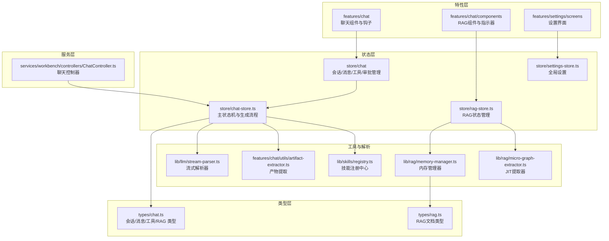

**图表来源**
- [src/features/chat/index.ts:1-6](file://src/features/chat/index.ts#L1-L6)
- [src/store/chat/index.ts:1-24](file://src/store/chat/index.ts#L1-L24)
- [src/services/workbench/controllers/ChatController.ts:1-130](file://src/services/workbench/controllers/ChatController.ts#L1-L130)
- [src/types/chat.ts:1-314](file://src/types/chat.ts#L1-L314)
- [src/store/chat-store.ts:1-800](file://src/store/chat-store.ts#L1-L800)
- [src/lib/llm/stream-parser.ts:1-455](file://src/lib/llm/stream-parser.ts#L1-L455)
- [src/features/chat/utils/artifact-extractor.ts:1-229](file://src/features/chat/utils/artifact-extractor.ts#L1-L229)
- [src/lib/skills/registry.ts:1-189](file://src/lib/skills/registry.ts#L1-L189)
- [src/features/chat/components/RagOmniIndicator.tsx:1-345](file://src/features/chat/components/RagOmniIndicator.tsx#L1-L345)
- [src/features/settings/screens/RagAdvancedSettings.tsx:1-415](file://src/features/settings/screens/RagAdvancedSettings.tsx#L1-L415)
- [src/store/rag-store.ts:1-1116](file://src/store/rag-store.ts#L1-L1116)
- [src/lib/rag/memory-manager.ts:1-1080](file://src/lib/rag/memory-manager.ts#L1-L1080)

**章节来源**
- [src/features/chat/index.ts:1-6](file://src/features/chat/index.ts#L1-L6)
- [src/store/chat/index.ts:1-24](file://src/store/chat/index.ts#L1-L24)
- [src/services/workbench/controllers/ChatController.ts:1-130](file://src/services/workbench/controllers/ChatController.ts#L1-L130)
- [src/types/chat.ts:1-314](file://src/types/chat.ts#L1-L314)

## 核心组件
- 会话管理：负责会话的创建、更新、删除、持久化与查询，采用 SQLite 双写模式提升可靠性
- 消息管理：负责消息的添加、更新、删除、向量化与布局缓存，采用防抖与缓冲区优化高频更新
- 工具执行：负责工具发现、参数解析与执行、结果注入与产物提取
- 流式解析：负责增量解析 LLM 输出，分离文本、推理、计划与工具调用
- 控制器：对外暴露聊天 API，协调状态层与持久化层
- 钩子：为 UI 提供响应式会话状态与消息加载、分页加载能力
- **JIT实时知识提取**：新增的实时知识图谱补全功能，提供用户友好的进度状态显示

**章节来源**
- [src/store/chat/session-manager.ts:1-281](file://src/store/chat/session-manager.ts#L1-L281)
- [src/store/chat/message-manager.ts:1-442](file://src/store/chat/message-manager.ts#L1-L442)
- [src/store/chat/tool-execution.ts:1-379](file://src/store/chat/tool-execution.ts#L1-L379)
- [src/lib/llm/stream-parser.ts:1-455](file://src/lib/llm/stream-parser.ts#L1-L455)
- [src/services/workbench/controllers/ChatController.ts:1-130](file://src/services/workbench/controllers/ChatController.ts#L1-L130)
- [src/features/chat/hooks/useChat.ts:1-117](file://src/features/chat/hooks/useChat.ts#L1-L117)

## 架构总览
聊天系统采用"状态机 + 管理器 + 控制器 + 类型约束"的分层设计：
- 状态机（chat-store）承载核心业务流程，包括消息生成、RAG 检索、工具调用、流式解析与 UI 状态
- 管理器（session-manager、message-manager、tool-execution）封装具体职责，提供统一接口
- 控制器（ChatController）对外提供 API，屏蔽内部细节
- 类型（types/chat）统一数据结构与行为契约
- **JIT管理器**：新增的实时知识提取管理器，集成到RAG检索流程中

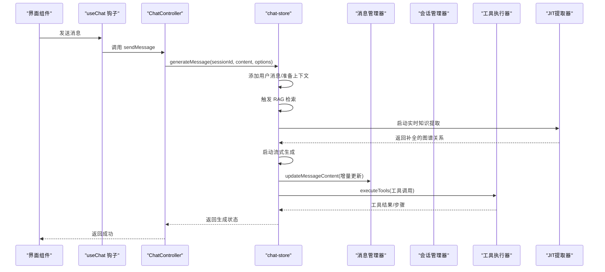

**图表来源**
- [src/features/chat/hooks/useChat.ts:43-77](file://src/features/chat/hooks/useChat.ts#L43-L77)
- [src/services/workbench/controllers/ChatController.ts:75-95](file://src/services/workbench/controllers/ChatController.ts#L75-L95)
- [src/store/chat-store.ts:360-520](file://src/store/chat-store.ts#L360-L520)
- [src/store/chat/message-manager.ts:233-279](file://src/store/chat/message-manager.ts#L233-L279)
- [src/store/chat/tool-execution.ts:24-379](file://src/store/chat/tool-execution.ts#L24-L379)

## 详细组件分析

### 会话管理与生命周期
- 双写模式：所有写操作先写入 SQLite，再更新内存状态，确保崩溃不丢数据
- 生命周期：创建、更新、删除、草稿、置顶、滚动偏移、任务状态、MCP/技能开关
- 会话级配置：推理参数、RAG 选项、执行模式、循环状态、思维签名、任务快照等

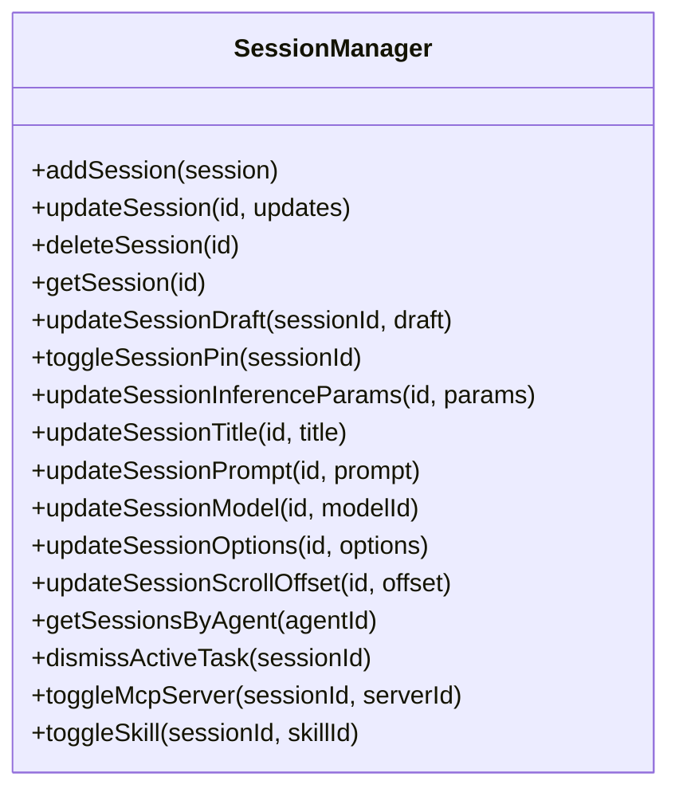

**图表来源**
- [src/store/chat/session-manager.ts:15-281](file://src/store/chat/session-manager.ts#L15-L281)
- [src/store/chat/types.ts:75-103](file://src/store/chat/types.ts#L75-L103)

**章节来源**
- [src/store/chat/session-manager.ts:1-281](file://src/store/chat/session-manager.ts#L1-L281)
- [src/store/chat/types.ts:75-103](file://src/store/chat/types.ts#L75-L103)

### 消息管理与持久化
- 增量更新：采用缓冲区与节流（100ms）合并高频更新，降低 UI 重绘与 DB 写入压力
- 防抖持久化：DB 写入采用 500ms 防抖，避免流式过程中的频繁 IO
- 计费追踪：基于 token 增量计算 chatInput/chatOutput/ragSystem，并汇总到会话统计
- 向量化状态：支持 processing/success/error 三态，配合归档与布局缓存

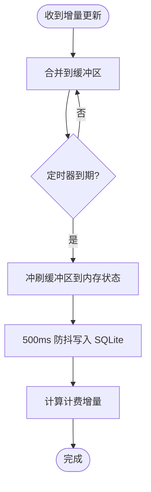

**图表来源**
- [src/store/chat/message-manager.ts:18-75](file://src/store/chat/message-manager.ts#L18-L75)
- [src/store/chat/message-manager.ts:77-202](file://src/store/chat/message-manager.ts#L77-L202)

**章节来源**
- [src/store/chat/message-manager.ts:1-442](file://src/store/chat/message-manager.ts#L1-L442)

### 工具调用系统
- 工具发现：通过技能注册中心按会话配置筛选可用技能（MCP 服务器与自定义技能）
- 参数解析：统一解析 JSON/XML/参数包装，支持智能解包与类型转换
- 执行与拦截：应用级拦截（如工具禁用）、速率限制、错误反射提示、步骤可视化
- 产物提取：自动从渲染类工具结果中提取 echarts/mermaid/math/svg/html 等产物并持久化

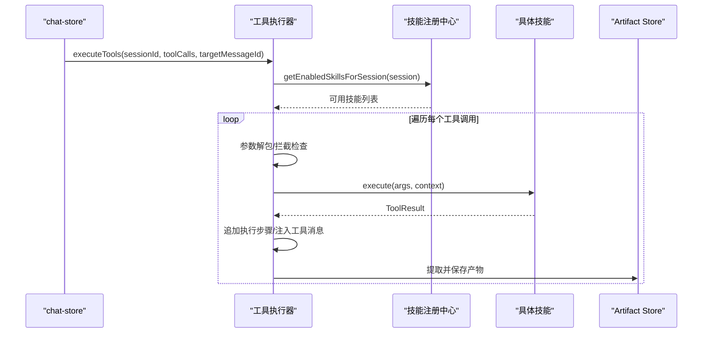

**图表来源**
- [src/store/chat/tool-execution.ts:24-379](file://src/store/chat/tool-execution.ts#L24-L379)
- [src/lib/skills/registry.ts:130-172](file://src/lib/skills/registry.ts#L130-L172)
- [src/features/chat/utils/artifact-extractor.ts:157-200](file://src/features/chat/utils/artifact-extractor.ts#L157-L200)

**章节来源**
- [src/store/chat/tool-execution.ts:1-379](file://src/store/chat/tool-execution.ts#L1-L379)
- [src/lib/skills/registry.ts:1-189](file://src/lib/skills/registry.ts#L1-L189)
- [src/features/chat/utils/artifact-extractor.ts:1-229](file://src/features/chat/utils/artifact-extractor.ts#L1-L229)

### 流式响应处理
- 状态机解析：StreamParser 基于状态机增量解析，支持 think/thought/plan/tool_calls 等结构化块
- Provider 感知：针对不同供应商的输出进行清理与适配，确保 UI 展示纯净文本
- 实时渲染：结合 UI 的渐隐脉冲效果与 Markdown 渲染，优化长文本流式体验

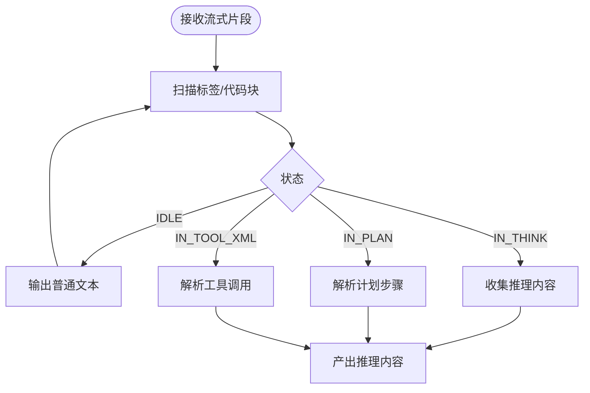

**图表来源**
- [src/lib/llm/stream-parser.ts:23-307](file://src/lib/llm/stream-parser.ts#L23-L307)

**章节来源**
- [src/lib/llm/stream-parser.ts:1-455](file://src/lib/llm/stream-parser.ts#L1-L455)
- [src/features/chat/components/message/blocks/StreamingFadePulse.tsx:1-54](file://src/features/chat/components/message/blocks/StreamingFadePulse.tsx#L1-L54)

### 控制器与 API 协议
- 会话：获取会话列表、获取会话历史、创建会话、删除会话
- 消息：发送消息（异步启动生成）、中止生成、删除消息、重新生成
- 控制器采用"发起即返回"策略，实际更新通过状态同步服务推送

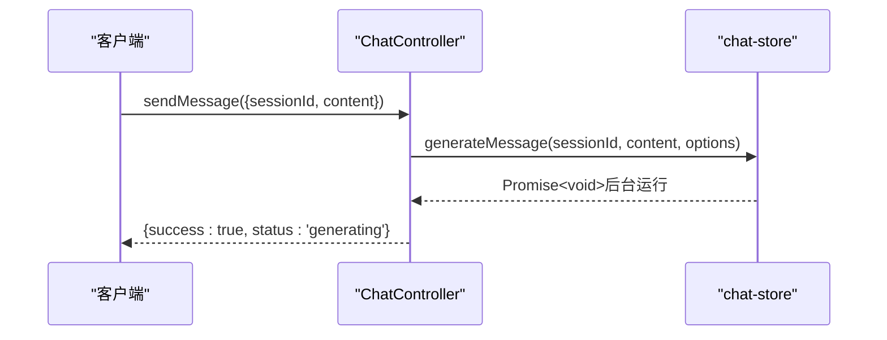

**图表来源**
- [src/services/workbench/controllers/ChatController.ts:75-95](file://src/services/workbench/controllers/ChatController.ts#L75-L95)
- [src/store/chat-store.ts:360-520](file://src/store/chat-store.ts#L360-L520)

**章节来源**
- [src/services/workbench/controllers/ChatController.ts:1-130](file://src/services/workbench/controllers/ChatController.ts#L1-L130)

### 数据模型与类型约束
- Session：包含 agentId、消息数组、推理参数、RAG 选项、执行模式、循环状态、任务状态等
- Message：支持角色、内容、token、RAG 引用、推理、引用、工具调用/结果、布局高度、向量化状态等
- 工具调用与执行步骤：标准化 ToolCall/ToolResult/ExecutionStep 结构，便于 UI 可视化与审计
- **RagConfiguration**：新增JIT配置字段，包括jitMaxChunks、jitTimeoutMs、jitMaxCharsPerChunk等

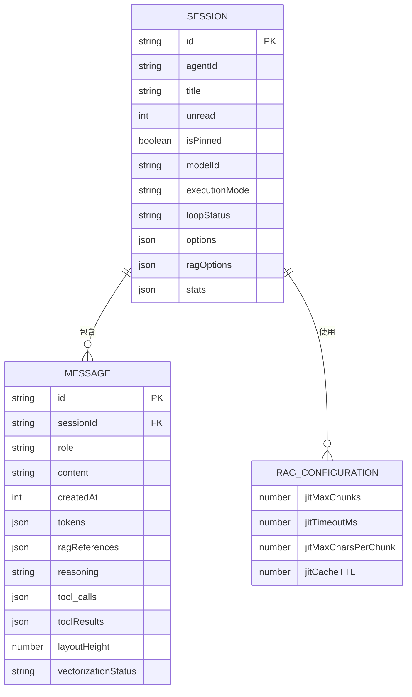

**图表来源**
- [src/types/chat.ts:169-223](file://src/types/chat.ts#L169-L223)
- [src/types/chat.ts:135-167](file://src/types/chat.ts#L135-L167)
- [src/types/chat.ts:306-311](file://src/types/chat.ts#L306-L311)

**章节来源**
- [src/types/chat.ts:1-314](file://src/types/chat.ts#L1-L314)

## JIT实时知识提取系统

### 系统概述
JIT（Just-In-Time）实时知识提取是Nexara聊天系统的新功能，它能够在对话过程中动态地从召回的文本片段中实时提取缺失的知识图谱关系，提供更丰富的上下文信息。

### 核心组件

#### RagOmniIndicator组件增强
RagOmniIndicator组件现在集成了JIT进度状态显示，能够：
- 显示实时知识提取的进度百分比
- 提供呼吸脉冲动画效果表示活跃状态
- 展示JIT提取的统计信息（如块数量）
- 支持展开/折叠查看更多详细信息

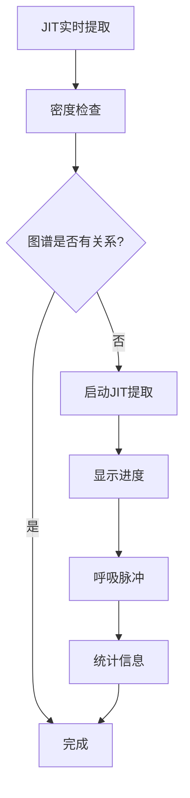

**图表来源**
- [src/features/chat/components/RagOmniIndicator.tsx:72-100](file://src/features/chat/components/RagOmniIndicator.tsx#L72-L100)
- [src/features/chat/components/RagOmniIndicator.tsx:111-212](file://src/features/chat/components/RagOmniIndicator.tsx#L111-L212)

#### RagAdvancedSettings组件JIT配置
RagAdvancedSettings提供了完整的JIT功能控制界面：
- **JIT总开关**：启用/禁用实时知识提取功能
- **最大块数设置**：控制参与实时抽取的文本块数量（默认3）
- **自由模式**：允许更宽松的实体识别模式
- **领域自动识别**：自动检测和设置知识图谱领域

**章节来源**
- [src/features/chat/components/RagOmniIndicator.tsx:1-345](file://src/features/chat/components/RagOmniIndicator.tsx#L1-L345)
- [src/features/settings/screens/RagAdvancedSettings.tsx:155-197](file://src/features/settings/screens/RagAdvancedSettings.tsx#L155-L197)

### JIT执行流程
JIT功能在RAG检索流程中作为增强阶段运行：

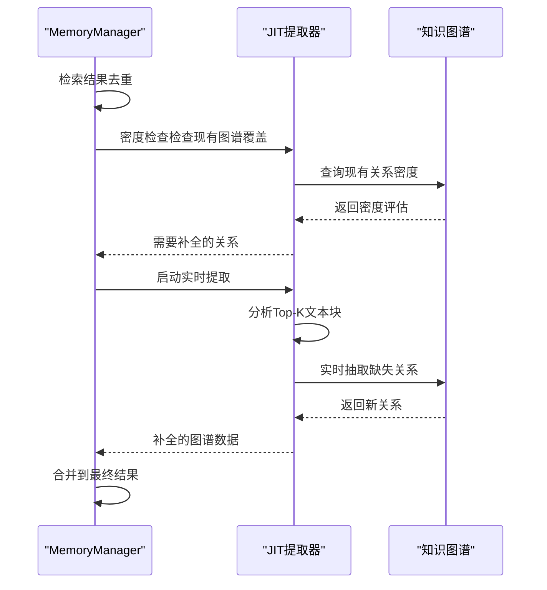

**图表来源**
- [src/lib/rag/memory-manager.ts:495-521](file://src/lib/rag/memory-manager.ts#L495-L521)
- [src/lib/rag/memory-manager.ts:502-520](file://src/lib/rag/memory-manager.ts#L502-L520)

**章节来源**
- [src/lib/rag/memory-manager.ts:495-521](file://src/lib/rag/memory-manager.ts#L495-L521)

### 配置参数详解
JIT功能通过以下配置参数进行控制：

| 参数名 | 默认值 | 描述 |
|--------|--------|------|
| jitMaxChunks | 3 | 参与实时抽取的文本块数量 |
| jitTimeoutMs | 5000 | JIT抽取超时时间（毫秒） |
| jitMaxCharsPerChunk | 2000 | 每个chunk的最大字符数 |
| jitCacheTTL | 3600 | JIT缓存的TTL（秒） |

**章节来源**
- [src/types/chat.ts:306-311](file://src/types/chat.ts#L306-L311)
- [src/store/settings-store.ts:115-180](file://src/store/settings-store.ts#L115-L180)

## 依赖关系分析
- 控制器依赖状态层：ChatController 通过 useChatStore 调用 generateMessage 等动作
- 状态层依赖管理器：chat-store 组合 message-manager、session-manager、tool-execution
- 管理器依赖类型与仓库：管理器使用 types/chat 与 SessionRepository 进行数据操作
- 工具执行依赖注册中心与产物提取：技能发现与产物持久化
- UI 钩子依赖状态层：useChat 提供响应式会话与消息加载
- **JIT系统依赖**：RagOmniIndicator依赖rag-store状态，RagAdvancedSettings依赖settings-store配置

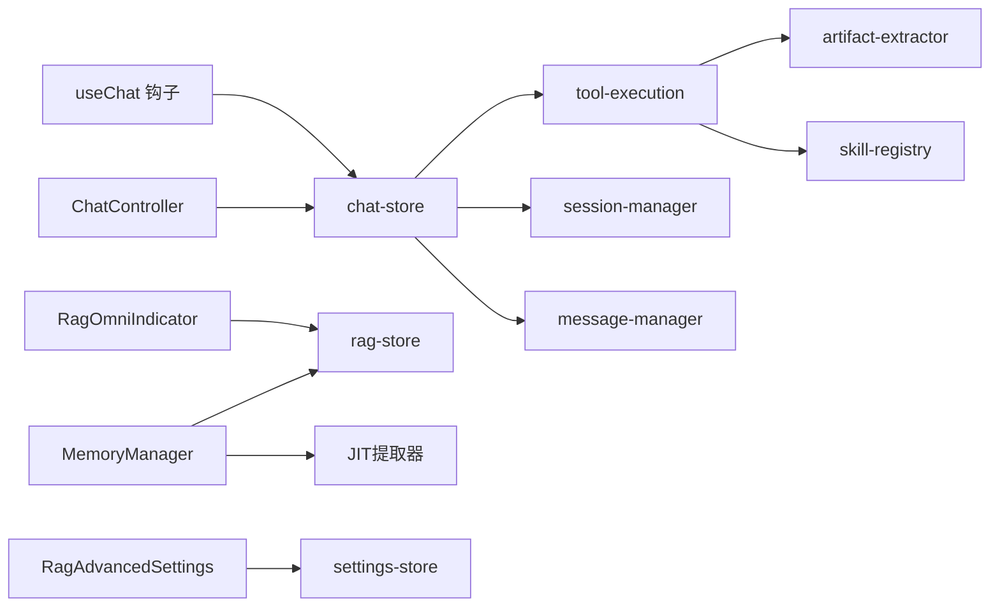

**图表来源**
- [src/services/workbench/controllers/ChatController.ts:1-130](file://src/services/workbench/controllers/ChatController.ts#L1-L130)
- [src/store/chat-store.ts:212-219](file://src/store/chat-store.ts#L212-L219)
- [src/store/chat/index.ts:8-23](file://src/store/chat/index.ts#L8-L23)
- [src/lib/skills/registry.ts:1-189](file://src/lib/skills/registry.ts#L1-L189)
- [src/features/chat/hooks/useChat.ts:1-117](file://src/features/chat/hooks/useChat.ts#L1-L117)
- [src/features/chat/components/RagOmniIndicator.tsx:3-52](file://src/features/chat/components/RagOmniIndicator.tsx#L3-L52)
- [src/features/settings/screens/RagAdvancedSettings.tsx:40-41](file://src/features/settings/screens/RagAdvancedSettings.tsx#L40-L41)
- [src/lib/rag/memory-manager.ts:1-1080](file://src/lib/rag/memory-manager.ts#L1-L1080)

**章节来源**
- [src/store/chat/index.ts:1-24](file://src/store/chat/index.ts#L1-L24)
- [src/store/chat-store.ts:212-219](file://src/store/chat-store.ts#L212-L219)

## 性能考量
- 防抖与节流：消息管理器对高频更新采用 100ms 节流与 500ms DB 防抖，平衡流畅度与一致性
- 分页加载：会话消息按需加载，避免一次性加载大量历史造成内存压力
- SQLite 双写：写操作双写确保可靠性，但需注意 DB 写入延迟与冲突处理
- 流式解析：状态机增量解析减少全量匹配开销，适合长文本与高吞吐场景
- 向量化与归档：消息向量化后可归档，减少检索与渲染负担
- **JIT性能优化**：采用超时控制和缓存机制，避免长时间阻塞对话流程

[本节为通用指导，无需列出具体文件来源]

## 故障排查指南
- 生成卡住：检查 activeRequests 中是否存在对应 sessionId 的客户端，必要时调用 abortGeneration
- 工具调用失败：查看工具执行器的日志与拦截提示，确认工具是否被禁用或参数不完整
- RAG 检索超时：系统内置 30 秒超时保护，若频繁超时需检查数据库锁与检索配置
- 消息丢失：确认是否启用 SQLite 双写，检查 DB 写入异常日志
- 流式渲染卡顿：检查 UI 渲染频率与 Markdown 解析开销，适当调整节流参数
- **JIT提取失败**：检查JIT配置参数，确认网络连接正常，查看JIT提取器日志
- **进度显示异常**：确认rag-store中的processingState状态正确更新，检查RagOmniIndicator的props传递

**章节来源**
- [src/store/chat-store.ts:323-337](file://src/store/chat-store.ts#L323-L337)
- [src/store/chat/tool-execution.ts:47-90](file://src/store/chat/tool-execution.ts#L47-L90)
- [src/store/chat-store.ts:677-686](file://src/store/chat-store.ts#L677-L686)
- [src/store/chat/message-manager.ts:48-75](file://src/store/chat/message-manager.ts#L48-L75)

## 结论
Nexara 聊天系统通过清晰的分层设计与严格的类型约束，实现了可靠的会话与消息管理、稳健的工具调用与产物提取、高效的流式解析与渲染，以及灵活的 RAG 检索与计费追踪。其 SQLite 双写模式与防抖机制有效平衡了性能与一致性，适合在移动端与桌面端稳定运行。

**更新** 新增的JIT实时知识提取功能进一步增强了系统的智能化水平，通过用户友好的界面控制和实时进度显示，为用户提供更加丰富和准确的对话上下文。该功能的集成展示了系统在保持稳定性的同时，持续引入创新特性的能力。

[本节为总结性内容，无需列出具体文件来源]

## 附录
- 使用模式建议
  - 会话创建：通过 ChatController.createSession 初始化 agentId 与模型，默认开启半自动执行模式
  - 发送消息：通过 useChat.sendMessage 合并会话级选项，支持图片与文件上传
  - 工具调用：在消息中包含结构化工具调用块，工具执行器自动解析并执行
  - 流式渲染：结合 StreamParser 与 UI 组件，实现平滑的文本与推理内容增量展示
  - 产物提取：渲染类工具结果自动提取并持久化，便于后续展示与审计
  - **JIT配置**：通过RagAdvancedSettings界面启用JIT功能，设置合适的最大块数和超时参数
  - **进度监控**：使用RagOmniIndicator组件实时查看JIT提取进度和状态

[本节为概念性内容，无需列出具体文件来源]