# 聊天系统详解

<cite>
**本文档引用的文件**
- [src/features/chat/index.ts](file://src/features/chat/index.ts)
- [src/store/chat/index.ts](file://src/store/chat/index.ts)
- [src/services/workbench/controllers/ChatController.ts](file://src/services/workbench/controllers/ChatController.ts)
- [src/lib/utils/id-generator.ts](file://src/lib/utils/id-generator.ts)
- [src/types/chat.ts](file://src/types/chat.ts)
- [src/store/chat/types.ts](file://src/store/chat/types.ts)
- [src/store/chat/session-manager.ts](file://src/store/chat/session-manager.ts)
- [src/store/chat/message-manager.ts](file://src/store/chat/message-manager.ts)
- [src/store/chat/tool-execution.ts](file://src/store/chat/tool-execution.ts)
- [src/features/chat/hooks/useChat.ts](file://src/features/chat/hooks/useChat.ts)
- [src/store/chat-store.ts](file://src/store/chat-store.ts)
- [src/lib/llm/stream-parser.ts](file://src/lib/llm/stream-parser.ts)
- [src/features/chat/components/message/blocks/StreamingFadePulse.tsx](file://src/features/chat/components/message/blocks/StreamingFadePulse.tsx)
- [src/features/chat/utils/artifact-extractor.ts](file://src/features/chat/utils/artifact-extractor.ts)
- [src/lib/skills/registry.ts](file://src/lib/skills/registry.ts)
- [src/features/chat/components/RagOmniIndicator.tsx](file://src/features/chat/components/RagOmniIndicator.tsx)
- [src/features/settings/screens/RagAdvancedSettings.tsx](file://src/features/settings/screens/RagAdvancedSettings.tsx)
- [src/store/rag-store.ts](file://src/store/rag-store.ts)
- [src/lib/rag/memory-manager.ts](file://src/lib/rag/memory-manager.ts)
- [src/store/settings-store.ts](file://src/store/settings-store.ts)
- [src/native/Sanitizer/index.ts](file://src/native/Sanitizer/index.ts)
- [src/native/Sanitizer/NativeSanitizer.ts](file://src/native/Sanitizer/NativeSanitizer.ts)
- [src/native/TextSplitter/index.ts](file://src/native/TextSplitter/index.ts)
- [src/native/TextSplitter/NativeTextSplitter.ts](file://src/native/TextSplitter/NativeTextSplitter.ts)
- [src/native/TokenCounter/index.ts](file://src/native/TokenCounter/index.ts)
- [src/native/TokenCounter/NativeTokenCounter.ts](file://src/native/TokenCounter/NativeTokenCounter.ts)
- [src/lib/sanitizer/index.ts](file://src/lib/sanitizer/index.ts)
- [src/lib/rag/trigram-splitter.ts](file://src/lib/rag/trigram-splitter.ts)
- [src/features/chat/utils/token-counter.ts](file://src/features/chat/utils/token-counter.ts)
</cite>

## 更新摘要
**变更内容**
- 新增原生模块集成：Sanitizer、TextSplitter、TokenCounter三个原生模块的深度集成
- 实现聊天输入解耦：通过原生模块优化内容净化、文本分片和令牌计数性能
- 增强性能优化：原生模块提供零开销同步调用和后台线程执行
- 完善回退机制：确保在原生模块不可用时的无缝JS回退
- **更新** 会话 ID 生成逻辑：ChatController 中的会话创建逻辑已更新，使用新的 generateId() 函数替代了 crypto.randomUUID()，改善了会话 ID 生成的可靠性和跨环境兼容性

## 目录
1. [引言](#引言)
2. [项目结构](#项目结构)
3. [核心组件](#核心组件)
4. [架构总览](#架构总览)
5. [详细组件分析](#详细组件分析)
6. [原生模块集成系统](#原生模块集成系统)
7. [聊天输入解耦优化](#聊天输入解耦优化)
8. [会话 ID 生成系统](#会话-id-生成系统)
9. [依赖关系分析](#依赖关系分析)
10. [性能考量](#性能考量)
11. [故障排查指南](#故障排查指南)
12. [结论](#结论)
13. [附录](#附录)

## 引言
本文件面向开发者与技术文档读者，系统性解析 Nexara 聊天系统的实现机制，涵盖会话管理、消息处理、工具调用系统、流式响应处理、状态管理与持久化、以及消息存储与检索等关键主题。文档通过多层级可视化与代码级分析，帮助读者快速理解并高效扩展聊天功能。

**更新** 本次更新特别关注原生模块集成和聊天输入解耦的重大改进，包括Sanitizer、TextSplitter、TokenCounter三个原生模块的深度集成，以及通过原生模块优化的内容净化、文本分片和令牌计数性能。同时，会话 ID 生成系统已更新为使用新的 generateId() 函数，改善了跨环境兼容性和可靠性。

## 项目结构
Nexara 聊天系统采用"特性驱动 + 分层模块"的组织方式：
- 特性层：features/chat 提供聊天 UI 组件与交互钩子
- 状态层：store/chat 与 store/chat-store 提供会话、消息、工具执行与审批管理
- 服务层：services/workbench/controllers 提供工作台控制器，暴露聊天相关 API
- 类型层：types/chat 定义会话、消息、工具调用与 RAG 结构
- 工具与解析：lib/llm/stream-parser 提供流式解析；features/chat/utils/artifact-extractor 提供产物提取
- 技能注册中心：lib/skills/registry 提供工具发现与路由
- 设置层：features/settings/screens 提供RAG高级设置界面
- **原生模块层**：src/native 提供高性能原生实现，包括Sanitizer、TextSplitter、TokenCounter
- **内容净化管道**：src/lib/sanitizer 提供插件化的Markdown净化系统
- **智能分片器**：src/lib/rag/trigram-splitter 提供CJK优化的文本分片算法
- **ID 生成器**：src/lib/utils/id-generator 提供跨环境兼容的唯一 ID 生成

```mermaid
graph TB
subgraph "特性层"
FE_Chat["features/chat<br/>聊天组件与钩子"]
FE_Rag["features/chat/components<br/>RAG组件与指示器"]
FE_Settings["features/settings/screens<br/>设置界面"]
end
subgraph "状态层"
StoreChat["store/chat<br/>会话/消息/工具/审批管理"]
StoreMain["store/chat-store.ts<br/>主状态机与生成流程"]
StoreRag["store/rag-store.ts<br/>RAG状态管理"]
StoreSettings["store/settings-store.ts<br/>全局设置"]
end
subgraph "服务层"
Ctrl["services/workbench/controllers/ChatController.ts<br/>聊天控制器"]
end
subgraph "类型层"
Types["types/chat.ts<br/>会话/消息/工具/RAG 类型"]
TypesRag["types/rag.ts<br/>RAG文档类型"]
end
subgraph "工具与解析"
StreamParser["lib/llm/stream-parser.ts<br/>流式解析器"]
ArtifactExt["features/chat/utils/artifact-extractor.ts<br/>产物提取"]
SkillReg["lib/skills/registry.ts<br/>技能注册中心"]
MemMgr["lib/rag/memory-manager.ts<br/>内存管理器"]
JIT["lib/rag/micro-graph-extractor.ts<br/>JIT提取器"]
Sanitizer["lib/sanitizer/index.ts<br/>内容净化管道"]
TextSplitter["lib/rag/trigram-splitter.ts<br/>智能分片器"]
TokenCounter["features/chat/utils/token-counter.ts<br/>令牌计数器"]
IdGenerator["lib/utils/id-generator.ts<br/>ID生成器"]
End
subgraph "原生模块层"
NativeSanitizer["native/Sanitizer<br/>原生内容净化"]
NativeTextSplitter["native/TextSplitter<br/>原生文本分片"]
NativeTokenCounter["native/TokenCounter<br/>原生令牌计数"]
end
FE_Chat --> StoreChat
FE_Rag --> StoreRag
FE_Settings --> StoreSettings
StoreChat --> StoreMain
Ctrl --> StoreMain
StoreMain --> Types
StoreMain --> StreamParser
StoreMain --> ArtifactExt
StoreMain --> SkillReg
StoreRag --> MemMgr
StoreRag --> JIT
StoreRag --> TextSplitter
StoreMain --> Sanitizer
StoreMain --> TokenCounter
StoreMain --> IdGenerator
Sanitizer --> NativeSanitizer
TextSplitter --> NativeTextSplitter
TokenCounter --> NativeTokenCounter
MemMgr --> TypesRag
```

**图表来源**
- [src/features/chat/index.ts:1-6](file://src/features/chat/index.ts#L1-L6)
- [src/store/chat/index.ts:1-24](file://src/store/chat/index.ts#L1-L24)
- [src/services/workbench/controllers/ChatController.ts:1-130](file://src/services/workbench/controllers/ChatController.ts#L1-L130)
- [src/types/chat.ts:1-314](file://src/types/chat.ts#L1-L314)
- [src/store/chat-store.ts:1-800](file://src/store/chat-store.ts#L1-L800)
- [src/lib/llm/stream-parser.ts:1-455](file://src/lib/llm/stream-parser.ts#L1-L455)
- [src/features/chat/utils/artifact-extractor.ts:1-229](file://src/features/chat/utils/artifact-extractor.ts#L1-L229)
- [src/lib/skills/registry.ts:1-189](file://src/lib/skills/registry.ts#L1-L189)
- [src/features/chat/components/RagOmniIndicator.tsx:1-345](file://src/features/chat/components/RagOmniIndicator.tsx#L1-L345)
- [src/features/settings/screens/RagAdvancedSettings.tsx:1-415](file://src/features/settings/screens/RagAdvancedSettings.tsx#L1-L415)
- [src/store/rag-store.ts:1-1116](file://src/store/rag-store.ts#L1-L1116)
- [src/lib/rag/memory-manager.ts:1-1080](file://src/lib/rag/memory-manager.ts#L1-L1080)
- [src/native/Sanitizer/index.ts:1-50](file://src/native/Sanitizer/index.ts#L1-L50)
- [src/native/TextSplitter/index.ts:1-57](file://src/native/TextSplitter/index.ts#L1-L57)
- [src/native/TokenCounter/index.ts:1-35](file://src/native/TokenCounter/index.ts#L1-L35)
- [src/lib/sanitizer/index.ts:1-209](file://src/lib/sanitizer/index.ts#L1-L209)
- [src/lib/rag/trigram-splitter.ts:1-253](file://src/lib/rag/trigram-splitter.ts#L1-L253)
- [src/features/chat/utils/token-counter.ts:1-66](file://src/features/chat/utils/token-counter.ts#L1-L66)
- [src/lib/utils/id-generator.ts:1-13](file://src/lib/utils/id-generator.ts#L1-L13)

**章节来源**
- [src/features/chat/index.ts:1-6](file://src/features/chat/index.ts#L1-L6)
- [src/store/chat/index.ts:1-24](file://src/store/chat/index.ts#L1-L24)
- [src/services/workbench/controllers/ChatController.ts:1-130](file://src/services/workbench/controllers/ChatController.ts#L1-L130)
- [src/types/chat.ts:1-314](file://src/types/chat.ts#L1-L314)

## 核心组件
- 会话管理：负责会话的创建、更新、删除、持久化与查询，采用 SQLite 双写模式提升可靠性
- 消息管理：负责消息的添加、更新、删除、向量化与布局缓存，采用防抖与缓冲区优化高频更新
- 工具执行：负责工具发现、参数解析与执行、结果注入与产物提取
- 流式解析：负责增量解析 LLM 输出，分离文本、推理、计划与工具调用
- 控制器：对外暴露聊天 API，协调状态层与持久化层
- 钩子：为 UI 提供响应式会话状态与消息加载、分页加载能力
- **原生模块系统**：提供高性能的Sanitizer、TextSplitter、TokenCounter原生实现，支持零开销同步调用和后台线程执行
- **内容净化管道**：基于插件化的Markdown净化系统，支持原生热路径优化
- **智能分片器**：专为CJK文本设计的Trigram分片算法，支持原生C++实现
- **ID 生成器**：提供跨环境兼容的唯一ID生成，替代crypto.randomUUID()的不稳定性

**章节来源**
- [src/store/chat/session-manager.ts:1-281](file://src/store/chat/session-manager.ts#L1-L281)
- [src/store/chat/message-manager.ts:1-442](file://src/store/chat/message-manager.ts#L1-L442)
- [src/store/chat/tool-execution.ts:1-379](file://src/store/chat/tool-execution.ts#L1-L379)
- [src/lib/llm/stream-parser.ts:1-455](file://src/lib/llm/stream-parser.ts#L1-L455)
- [src/services/workbench/controllers/ChatController.ts:1-130](file://src/services/workbench/controllers/ChatController.ts#L1-L130)
- [src/features/chat/hooks/useChat.ts:1-117](file://src/features/chat/hooks/useChat.ts#L1-L117)
- [src/native/Sanitizer/index.ts:1-50](file://src/native/Sanitizer/index.ts#L1-L50)
- [src/native/TextSplitter/index.ts:1-57](file://src/native/TextSplitter/index.ts#L1-L57)
- [src/native/TokenCounter/index.ts:1-35](file://src/native/TokenCounter/index.ts#L1-L35)
- [src/lib/sanitizer/index.ts:1-209](file://src/lib/sanitizer/index.ts#L1-L209)
- [src/lib/rag/trigram-splitter.ts:1-253](file://src/lib/rag/trigram-splitter.ts#L1-L253)
- [src/lib/utils/id-generator.ts:1-13](file://src/lib/utils/id-generator.ts#L1-L13)

## 架构总览
聊天系统采用"状态机 + 管理器 + 控制器 + 类型约束 + 原生模块 + ID生成器"的分层设计：
- 状态机（chat-store）承载核心业务流程，包括消息生成、RAG 检索、工具调用、流式解析与 UI 状态
- 管理器（session-manager、message-manager、tool-execution）封装具体职责，提供统一接口
- 控制器（ChatController）对外提供 API，屏蔽内部细节
- 类型（types/chat）统一数据结构与行为契约
- **原生模块层**：提供高性能原生实现，支持零开销同步调用和后台线程执行
- **内容净化管道**：基于插件化的Markdown净化系统，支持原生热路径优化
- **智能分片器**：专为CJK文本设计的Trigram分片算法，支持原生C++实现
- **ID生成器**：提供跨环境兼容的唯一ID生成，替代crypto.randomUUID()的不稳定性

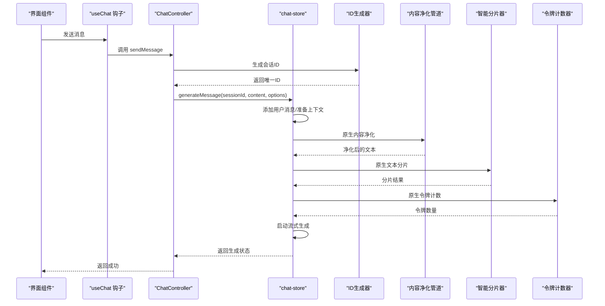
```mermaid
sequenceDiagram
participant UI as "界面组件"
participant Hook as "useChat 钩子"
participant Ctrl as "ChatController"
participant Store as "chat-store"
participant IdGen as "ID生成器"
participant Sanitizer as "内容净化管道"
participant TextSplitter as "智能分片器"
participant TokenCounter as "令牌计数器"
UI->>Hook : 发送消息
Hook->>Ctrl : 调用 sendMessage
Ctrl->>IdGen : 生成会话ID
IdGen-->>Ctrl : 返回唯一ID
Ctrl->>Store : generateMessage(sessionId, content, options)
Store->>Store : 添加用户消息/准备上下文
Store->>Sanitizer : 原生内容净化
Sanitizer-->>Store : 净化后的文本
Store->>TextSplitter : 原生文本分片
TextSplitter-->>Store : 分片结果
Store->>TokenCounter : 原生令牌计数
TokenCounter-->>Store : 令牌数量
Store->>Store : 启动流式生成
Store-->>Ctrl : 返回生成状态
Ctrl-->>UI : 返回成功
```

**图表来源**
- [src/features/chat/hooks/useChat.ts:43-77](file://src/features/chat/hooks/useChat.ts#L43-L77)
- [src/services/workbench/controllers/ChatController.ts:75-95](file://src/services/workbench/controllers/ChatController.ts#L75-L95)
- [src/store/chat-store.ts:360-520](file://src/store/chat-store.ts#L360-L520)
- [src/lib/utils/id-generator.ts:7-12](file://src/lib/utils/id-generator.ts#L7-L12)
- [src/lib/sanitizer/index.ts:49-166](file://src/lib/sanitizer/index.ts#L49-L166)
- [src/lib/rag/trigram-splitter.ts:47-62](file://src/lib/rag/trigram-splitter.ts#L47-L62)
- [src/features/chat/utils/token-counter.ts:14-25](file://src/features/chat/utils/token-counter.ts#L14-L25)

## 详细组件分析

### 会话管理与生命周期
- 双写模式：所有写操作先写入 SQLite，再更新内存状态，确保崩溃不丢数据
- 生命周期：创建、更新、删除、草稿、置顶、滚动偏移、任务状态、MCP/技能开关
- 会话级配置：推理参数、RAG 选项、执行模式、循环状态、思维签名、任务快照等

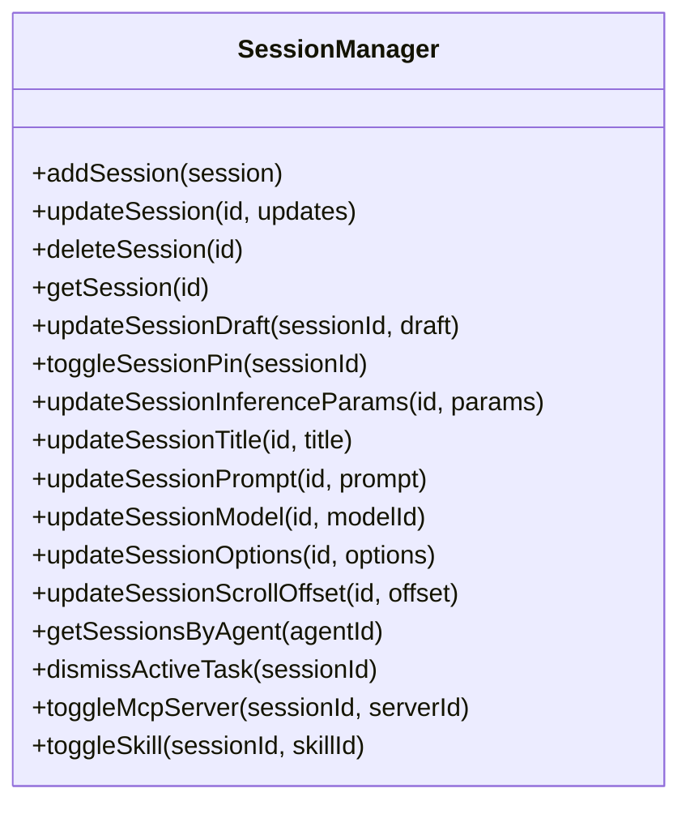
```mermaid
classDiagram
class SessionManager {
+addSession(session)
+updateSession(id, updates)
+deleteSession(id)
+getSession(id)
+updateSessionDraft(sessionId, draft)
+toggleSessionPin(sessionId)
+updateSessionInferenceParams(id, params)
+updateSessionTitle(id, title)
+updateSessionPrompt(id, prompt)
+updateSessionModel(id, modelId)
+updateSessionOptions(id, options)
+updateSessionScrollOffset(id, offset)
+getSessionsByAgent(agentId)
+dismissActiveTask(sessionId)
+toggleMcpServer(sessionId, serverId)
+toggleSkill(sessionId, skillId)
}
```

**图表来源**
- [src/store/chat/session-manager.ts:15-281](file://src/store/chat/session-manager.ts#L15-L281)
- [src/store/chat/types.ts:75-103](file://src/store/chat/types.ts#L75-L103)

**章节来源**
- [src/store/chat/session-manager.ts:1-281](file://src/store/chat/session-manager.ts#L1-L281)
- [src/store/chat/types.ts:75-103](file://src/store/chat/types.ts#L75-L103)

### 消息管理与持久化
- 增量更新：采用缓冲区与节流（100ms）合并高频更新，降低 UI 重绘与 DB 写入压力
- 防抖持久化：DB 写入采用 500ms 防抖，避免流式过程中的频繁 IO
- 计费追踪：基于 token 增量计算 chatInput/chatOutput/ragSystem，并汇总到会话统计
- 向量化状态：支持 processing/success/error 三态，配合归档与布局缓存

```mermaid
flowchart TD
Start(["收到增量更新"]) --> Buffer["合并到缓冲区"]
Buffer --> Timer{"定时器到期?"}
Timer --> |否| Buffer
Timer --> |是| Flush["冲刷缓冲区到内存状态"]
Flush --> UpdateDB["500ms 防抖写入 SQLite"]
UpdateDB --> CalcBill["计算计费增量"]
CalcBill --> End(["完成"])
```

**图表来源**
- [src/store/chat/message-manager.ts:18-75](file://src/store/chat/message-manager.ts#L18-L75)
- [src/store/chat/message-manager.ts:77-202](file://src/store/chat/message-manager.ts#L77-L202)

**章节来源**
- [src/store/chat/message-manager.ts:1-442](file://src/store/chat/message-manager.ts#L1-L442)

### 工具调用系统
- 工具发现：通过技能注册中心按会话配置筛选可用技能（MCP 服务器与自定义技能）
- 参数解析：统一解析 JSON/XML/参数包装，支持智能解包与类型转换
- 执行与拦截：应用级拦截（如工具禁用）、速率限制、错误反射提示、步骤可视化
- 产物提取：自动从渲染类工具结果中提取 echarts/mermaid/math/svg/html 等产物并持久化

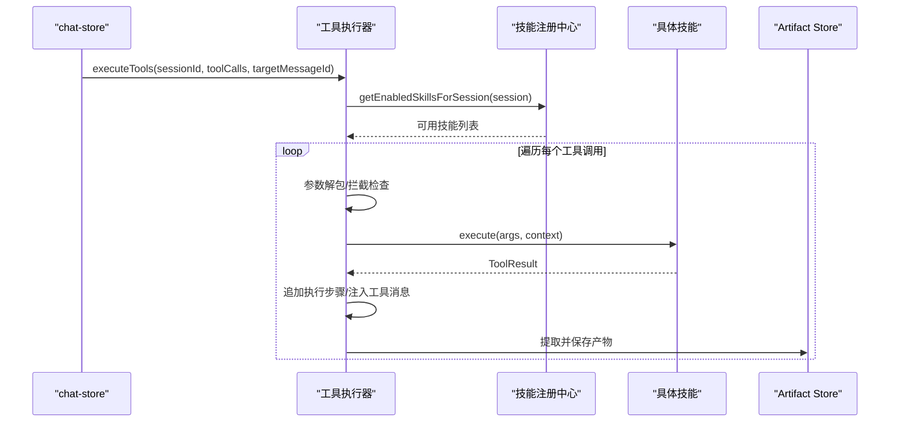
```mermaid
sequenceDiagram
participant Store as "chat-store"
participant Exec as "工具执行器"
participant Reg as "技能注册中心"
participant Skill as "具体技能"
participant DB as "Artifact Store"
Store->>Exec : executeTools(sessionId, toolCalls, targetMessageId)
Exec->>Reg : getEnabledSkillsForSession(session)
Reg-->>Exec : 可用技能列表
loop 遍历每个工具调用
Exec->>Exec : 参数解包/拦截检查
Exec->>Skill : execute(args, context)
Skill-->>Exec : ToolResult
Exec->>Exec : 追加执行步骤/注入工具消息
Exec->>DB : 提取并保存产物
end
```

**图表来源**
- [src/store/chat/tool-execution.ts:24-379](file://src/store/chat/tool-execution.ts#L24-L379)
- [src/lib/skills/registry.ts:130-172](file://src/lib/skills/registry.ts#L130-L172)
- [src/features/chat/utils/artifact-extractor.ts:157-200](file://src/features/chat/utils/artifact-extractor.ts#L157-L200)

**章节来源**
- [src/store/chat/tool-execution.ts:1-379](file://src/store/chat/tool-execution.ts#L1-L379)
- [src/lib/skills/registry.ts:1-189](file://src/lib/skills/registry.ts#L1-L189)
- [src/features/chat/utils/artifact-extractor.ts:1-229](file://src/features/chat/utils/artifact-extractor.ts#L1-L229)

### 流式响应处理
- 状态机解析：StreamParser 基于状态机增量解析，支持 think/thought/plan/tool_calls 等结构化块
- Provider 感知：针对不同供应商的输出进行清理与适配，确保 UI 展示纯净文本
- 实时渲染：结合 UI 的渐隐脉冲效果与 Markdown 渲染，优化长文本流式体验

```mermaid
flowchart TD
In(["接收流式片段"]) --> Scan["扫描标签/代码块"]
Scan --> State{"状态"}
State --> |IDLE| Text["输出普通文本"]
State --> |IN_THINK| Think["收集推理内容"]
State --> |IN_PLAN| Plan["解析计划步骤"]
State --> |IN_TOOL_XML| Tools["解析工具调用"]
Think --> Out["产出推理内容"]
Plan --> Out
Tools --> Out
Text --> Scan
```

**图表来源**
- [src/lib/llm/stream-parser.ts:23-307](file://src/lib/llm/stream-parser.ts#L23-L307)

**章节来源**
- [src/lib/llm/stream-parser.ts:1-455](file://src/lib/llm/stream-parser.ts#L1-L455)
- [src/features/chat/components/message/blocks/StreamingFadePulse.tsx:1-54](file://src/features/chat/components/message/blocks/StreamingFadePulse.tsx#L1-L54)

### 控制器与 API 协议
- 会话：获取会话列表、获取会话历史、创建会话、删除会话
- 消息：发送消息（异步启动生成）、中止生成、删除消息、重新生成
- 控制器采用"发起即返回"策略，实际更新通过状态同步服务推送

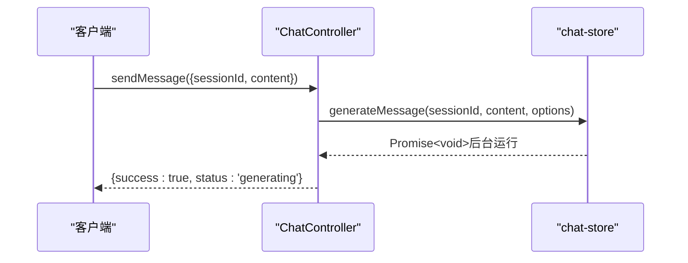
```mermaid
sequenceDiagram
participant Client as "客户端"
participant Ctrl as "ChatController"
participant Store as "chat-store"
Client->>Ctrl : sendMessage({sessionId, content})
Ctrl->>Store : generateMessage(sessionId, content, options)
Store-->>Ctrl : Promise<void>后台运行
Ctrl-->>Client : {success : true, status : 'generating'}
```

**图表来源**
- [src/services/workbench/controllers/ChatController.ts:75-95](file://src/services/workbench/controllers/ChatController.ts#L75-L95)
- [src/store/chat-store.ts:360-520](file://src/store/chat-store.ts#L360-L520)

**章节来源**
- [src/services/workbench/controllers/ChatController.ts:1-130](file://src/services/workbench/controllers/ChatController.ts#L1-L130)

### 数据模型与类型约束
- Session：包含 agentId、消息数组、推理参数、RAG 选项、执行模式、循环状态、任务状态等
- Message：支持角色、内容、token、RAG 引用、推理、引用、工具调用/结果、布局高度、向量化状态等
- 工具调用与执行步骤：标准化 ToolCall/ToolResult/ExecutionStep 结构，便于 UI 可视化与审计
- **RagConfiguration**：新增JIT配置字段，包括jitMaxChunks、jitTimeoutMs、jitMaxCharsPerChunk等

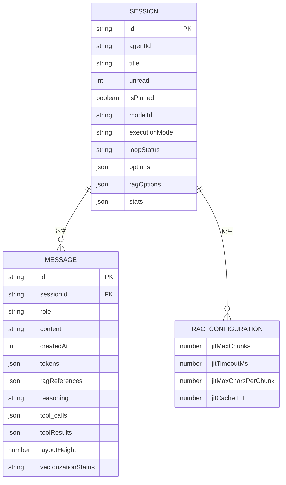
```mermaid
erDiagram
SESSION {
string id PK
string agentId
string title
int unread
boolean isPinned
string modelId
string executionMode
string loopStatus
json options
json ragOptions
json stats
}
MESSAGE {
string id PK
string sessionId FK
string role
string content
int createdAt
json tokens
json ragReferences
string reasoning
json tool_calls
json toolResults
number layoutHeight
string vectorizationStatus
}
RAG_CONFIGURATION {
number jitMaxChunks
number jitTimeoutMs
number jitMaxCharsPerChunk
number jitCacheTTL
}
SESSION ||--o{ MESSAGE : "包含"
SESSION ||--o{ RAG_CONFIGURATION : "使用"
```

**图表来源**
- [src/types/chat.ts:169-223](file://src/types/chat.ts#L169-L223)
- [src/types/chat.ts:135-167](file://src/types/chat.ts#L135-L167)
- [src/types/chat.ts:306-311](file://src/types/chat.ts#L306-L311)

**章节来源**
- [src/types/chat.ts:1-314](file://src/types/chat.ts#L1-L314)

## 原生模块集成系统

### Sanitizer原生模块
Sanitizer原生模块提供高性能的Markdown内容净化功能，通过单次C++扫描实现多种净化规则的组合处理。

#### 核心特性
- **热路径优化**：将标题修复、中西文间距、换行处理三个regex密集型插件合并为单次C++扫描
- **零开销同步调用**：processHotPath方法为同步调用，适合热点路径
- **智能回退机制**：当原生模块不可用时自动回退到JS实现
- **插件化架构**：支持选择性启用不同的净化规则

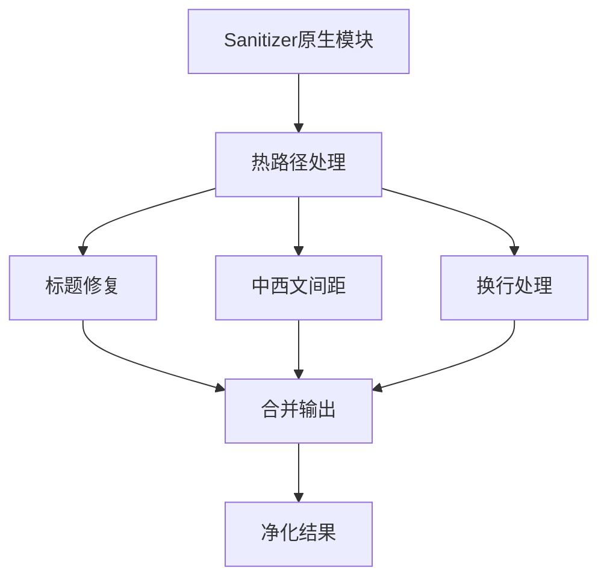
```mermaid
flowchart TD
Sanitizer["Sanitizer原生模块"] --> HotPath["热路径处理"]
HotPath --> HeadingFix["标题修复"]
HotPath --> PanguSpacing["中西文间距"]
HotPath --> LineBreak["换行处理"]
HeadingFix --> Combined["合并输出"]
PanguSpacing --> Combined
LineBreak --> Combined
Combined --> Result["净化结果"]
```

**图表来源**
- [src/native/Sanitizer/NativeSanitizer.ts:11-27](file://src/native/Sanitizer/NativeSanitizer.ts#L11-L27)
- [src/lib/sanitizer/index.ts:75-108](file://src/lib/sanitizer/index.ts#L75-L108)

#### 集成架构
内容净化管道通过插件化架构实现，支持原生热路径优化：

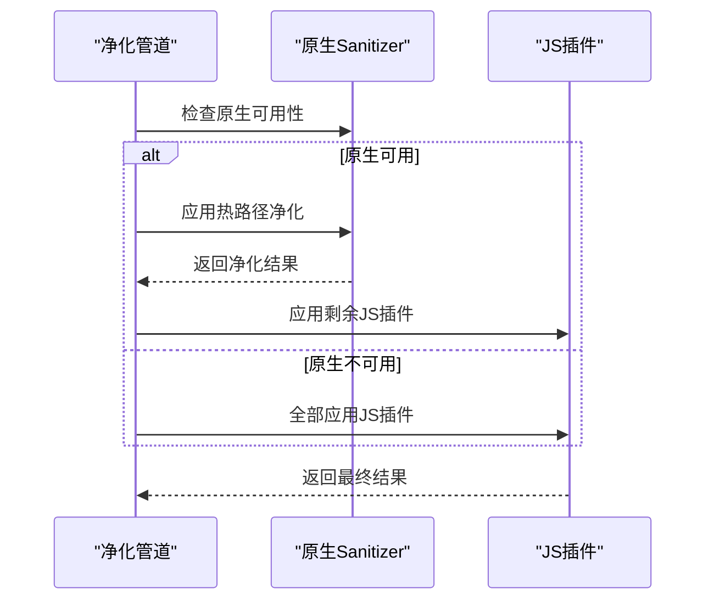
```mermaid
sequenceDiagram
participant Pipeline as "净化管道"
participant Native as "原生Sanitizer"
participant Plugins as "JS插件"
Pipeline->>Native : 检查原生可用性
alt 原生可用
Pipeline->>Native : 应用热路径净化
Native-->>Pipeline : 返回净化结果
Pipeline->>Plugins : 应用剩余JS插件
else 原生不可用
Pipeline->>Plugins : 全部应用JS插件
end
Plugins-->>Pipeline : 返回最终结果
```

**图表来源**
- [src/lib/sanitizer/index.ts:49-166](file://src/lib/sanitizer/index.ts#L49-L166)
- [src/native/Sanitizer/index.ts:28-49](file://src/native/Sanitizer/index.ts#L28-L49)

**章节来源**
- [src/native/Sanitizer/index.ts:1-50](file://src/native/Sanitizer/index.ts#L1-L50)
- [src/native/Sanitizer/NativeSanitizer.ts:1-30](file://src/native/Sanitizer/NativeSanitizer.ts#L1-L30)
- [src/lib/sanitizer/index.ts:1-209](file://src/lib/sanitizer/index.ts#L1-L209)

### TextSplitter原生模块
TextSplitter原生模块提供高性能的CJK文本分片功能，专为中文语义边界设计的Trigram算法。

#### 核心特性
- **Trigram算法**：使用三元组方法进行智能分片，更适合中文语义边界
- **后台线程执行**：splitText方法在C++后台线程执行，避免阻塞JS主线程
- **同步估算**：estimateChunkCount提供轻量级的块数估算，无实际分割开销
- **参数验证**：自动验证chunkSize和chunkOverlap的合理性

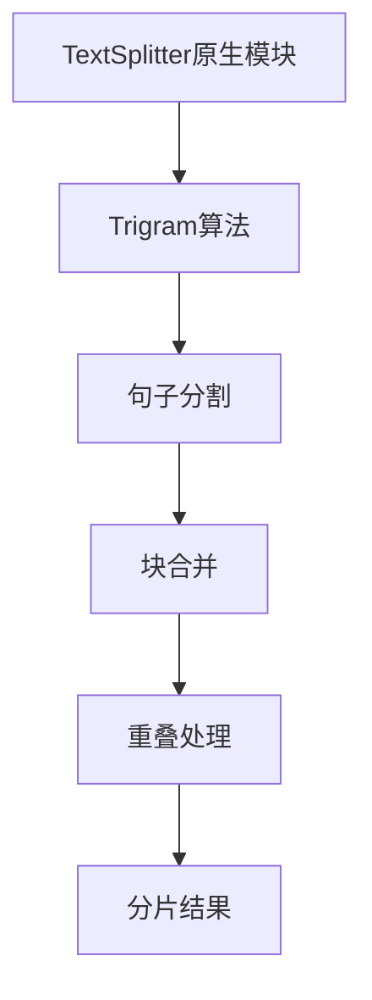
```mermaid
flowchart TD
TextSplitter["TextSplitter原生模块"] --> Trigram["Trigram算法"]
Trigram --> SentenceSplit["句子分割"]
SentenceSplit --> ChunkMerge["块合并"]
ChunkMerge --> Overlap["重叠处理"]
Overlap --> Result["分片结果"]
```

**图表来源**
- [src/native/TextSplitter/NativeTextSplitter.ts:10-27](file://src/native/TextSplitter/NativeTextSplitter.ts#L10-L27)
- [src/lib/rag/trigram-splitter.ts:47-62](file://src/lib/rag/trigram-splitter.ts#L47-L62)

#### 智能分片器实现
智能分片器结合原生模块和JS实现，提供最佳性能：

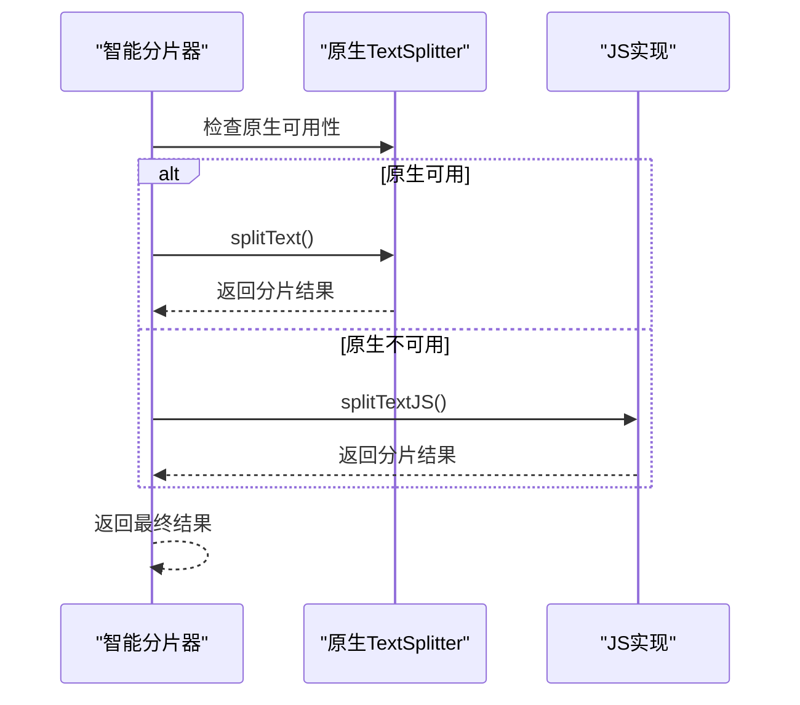
```mermaid
sequenceDiagram
participant Splitter as "智能分片器"
participant Native as "原生TextSplitter"
participant JS as "JS实现"
Splitter->>Native : 检查原生可用性
alt 原生可用
Splitter->>Native : splitText()
Native-->>Splitter : 返回分片结果
else 原生不可用
Splitter->>JS : splitTextJS()
JS-->>Splitter : 返回分片结果
end
Splitter-->>Splitter : 返回最终结果
```

**图表来源**
- [src/lib/rag/trigram-splitter.ts:47-62](file://src/lib/rag/trigram-splitter.ts#L47-L62)
- [src/native/TextSplitter/index.ts:24-37](file://src/native/TextSplitter/index.ts#L24-L37)

**章节来源**
- [src/native/TextSplitter/index.ts:1-57](file://src/native/TextSplitter/index.ts#L1-L57)
- [src/native/TextSplitter/NativeTextSplitter.ts:1-30](file://src/native/TextSplitter/NativeTextSplitter.ts#L1-L30)
- [src/lib/rag/trigram-splitter.ts:1-253](file://src/lib/rag/trigram-splitter.ts#L1-L253)

### TokenCounter原生模块
TokenCounter原生模块提供精确的令牌计数功能，使用Unicode字符分类替代JS正则表达式。

#### 核心特性
- **精确计数**：基于Unicode字符分类的精确令牌估算
- **零开销同步**：countTokens为同步调用，适合热点路径
- **多语言支持**：支持CJK字符、英文单词、数字符号的精确计数
- **性能优化**：比JS正则表达式快约5倍

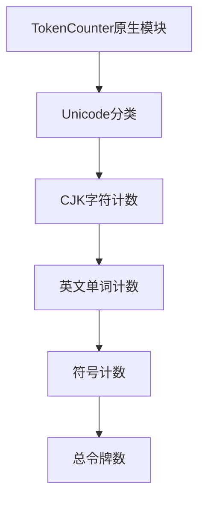
```mermaid
flowchart TD
TokenCounter["TokenCounter原生模块"] --> Unicode["Unicode分类"]
Unicode --> CJK["CJK字符计数"]
CJK --> English["英文单词计数"]
English --> Symbols["符号计数"]
Symbols --> Result["总令牌数"]
```

**图表来源**
- [src/native/TokenCounter/NativeTokenCounter.ts:10-19](file://src/native/TokenCounter/NativeTokenCounter.ts#L10-L19)
- [src/features/chat/utils/token-counter.ts:14-25](file://src/features/chat/utils/token-counter.ts#L14-L25)

#### 令牌计数器实现
令牌计数器提供统一的计数接口，自动选择最优实现：

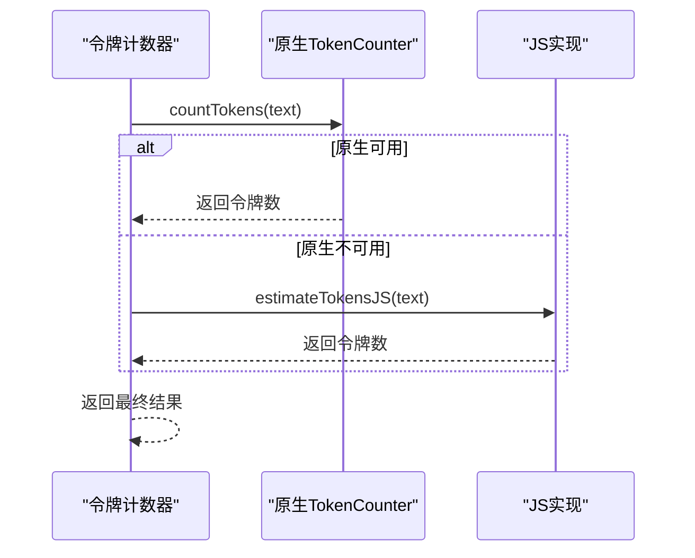
```mermaid
sequenceDiagram
participant Counter as "令牌计数器"
participant Native as "原生TokenCounter"
participant JS as "JS实现"
Counter->>Native : countTokens(text)
alt 原生可用
Native-->>Counter : 返回令牌数
else 原生不可用
Counter->>JS : estimateTokensJS(text)
JS-->>Counter : 返回令牌数
end
Counter-->>Counter : 返回最终结果
```

**图表来源**
- [src/features/chat/utils/token-counter.ts:14-25](file://src/features/chat/utils/token-counter.ts#L14-L25)
- [src/native/TokenCounter/index.ts:25-34](file://src/native/TokenCounter/index.ts#L25-L34)

**章节来源**
- [src/native/TokenCounter/index.ts:1-35](file://src/native/TokenCounter/index.ts#L1-L35)
- [src/native/TokenCounter/NativeTokenCounter.ts:1-22](file://src/native/TokenCounter/NativeTokenCounter.ts#L1-L22)
- [src/features/chat/utils/token-counter.ts:1-66](file://src/features/chat/utils/token-counter.ts#L1-L66)

## 聊天输入解耦优化

### 内容净化管道化
通过插件化架构实现内容净化的解耦，支持原生热路径优化：

#### 插件架构
净化管道采用阶段化插件架构，每个插件负责特定的净化任务：

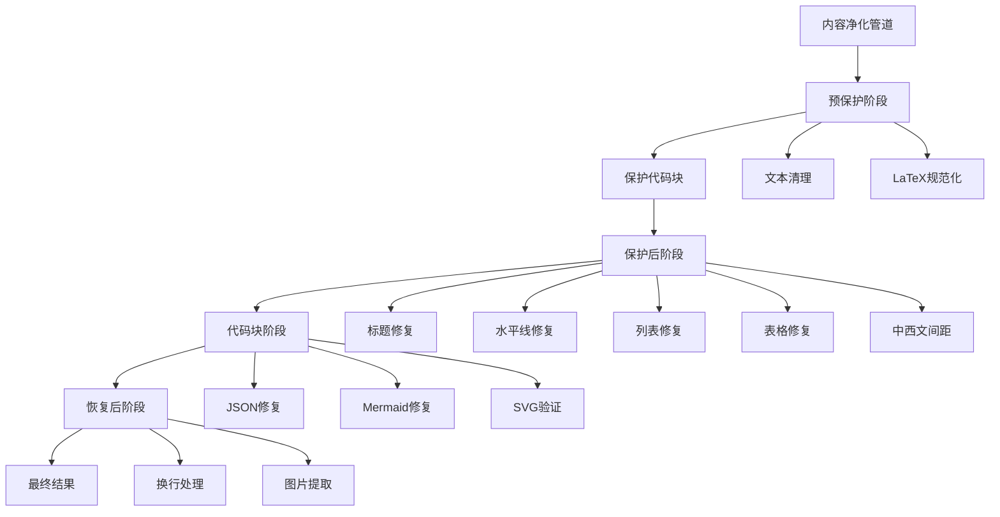
```mermaid
flowchart TD
Sanitizer["内容净化管道"] --> PreProtect["预保护阶段"]
PreProtect --> ProtectBlocks["保护代码块"]
ProtectBlocks --> PostProtect["保护后阶段"]
PostProtect --> CodeBlock["代码块阶段"]
CodeBlock --> PostRestore["恢复后阶段"]
PostRestore --> Result["最终结果"]
PreProtect --> TextCleaner["文本清理"]
PreProtect --> LatexNormalizer["LaTeX规范化"]
PostProtect --> HeadingFixer["标题修复"]
PostProtect --> HRFixer["水平线修复"]
PostProtect --> ListFixer["列表修复"]
PostProtect --> TableFixer["表格修复"]
PostProtect --> PanguSpacing["中西文间距"]
CodeBlock --> JSONRepairer["JSON修复"]
CodeBlock --> MermaidFixer["Mermaid修复"]
CodeBlock --> SVGValidator["SVG验证"]
PostRestore --> LineBreaker["换行处理"]
PostRestore --> ImageExtractor["图片提取"]
```

**图表来源**
- [src/lib/sanitizer/index.ts:24-38](file://src/lib/sanitizer/index.ts#L24-L38)
- [src/lib/sanitizer/index.ts:49-166](file://src/lib/sanitizer/index.ts#L49-L166)

#### 原生热路径优化
当原生Sanitizer可用时，系统自动应用热路径优化：

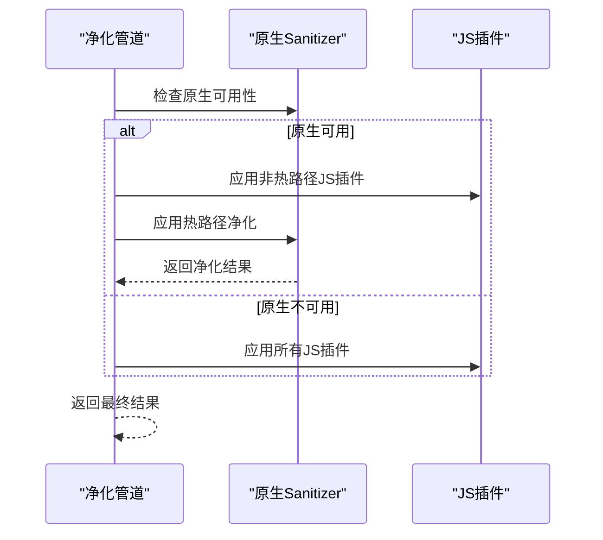
```mermaid
sequenceDiagram
participant Pipeline as "净化管道"
participant Native as "原生Sanitizer"
participant JS as "JS插件"
Pipeline->>Native : 检查原生可用性
alt 原生可用
Pipeline->>JS : 应用非热路径JS插件
Pipeline->>Native : 应用热路径净化
Native-->>Pipeline : 返回净化结果
else 原生不可用
Pipeline->>JS : 应用所有JS插件
end
Pipeline-->>Pipeline : 返回最终结果
```

**图表来源**
- [src/lib/sanitizer/index.ts:78-116](file://src/lib/sanitizer/index.ts#L78-L116)
- [src/lib/sanitizer/index.ts:130-160](file://src/lib/sanitizer/index.ts#L130-L160)

### 文本分片解耦
智能分片器将文本分片逻辑与聊天系统解耦，提供高性能的CJK文本处理：

#### 分片策略
智能分片器采用多阶段分片策略：

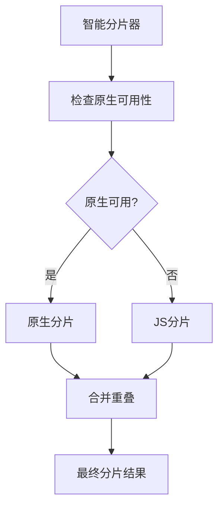
```mermaid
flowchart TD
TrigramSplitter["智能分片器"] --> CheckNative["检查原生可用性"]
CheckNative --> NativeAvailable{"原生可用?"}
NativeAvailable --> |是| NativeSplit["原生分片"]
NativeAvailable --> |否| JSSplit["JS分片"]
NativeSplit --> MergeOverlap["合并重叠"]
JSSplit --> MergeOverlap
MergeOverlap --> FinalResult["最终分片结果"]
```

**图表来源**
- [src/lib/rag/trigram-splitter.ts:47-62](file://src/lib/rag/trigram-splitter.ts#L47-L62)
- [src/lib/rag/trigram-splitter.ts:234-252](file://src/lib/rag/trigram-splitter.ts#L234-L252)

#### CJK优化算法
智能分片器专为CJK文本设计的优化算法：

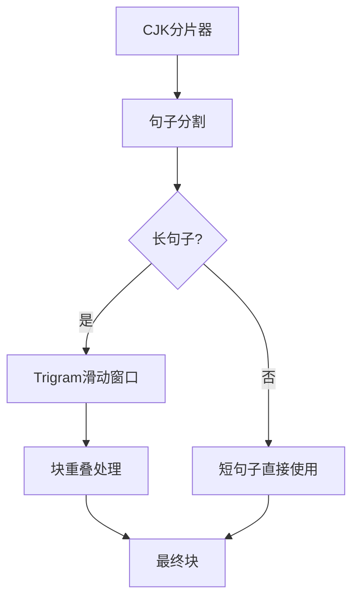
```mermaid
flowchart TD
CJKSplitter["CJK分片器"] --> SentenceSplit["句子分割"]
SentenceSplit --> LongSentence{"长句子?"}
LongSentence --> |是| TrigramWindow["Trigram滑动窗口"]
LongSentence --> |否| ShortSentence["短句子直接使用"]
TrigramWindow --> ChunkOverlap["块重叠处理"]
ChunkOverlap --> FinalChunks["最终块"]
ShortSentence --> FinalChunks
```

**图表来源**
- [src/lib/rag/trigram-splitter.ts:67-82](file://src/lib/rag/trigram-splitter.ts#L67-L82)
- [src/lib/rag/trigram-splitter.ts:211-229](file://src/lib/rag/trigram-splitter.ts#L211-L229)

### 令牌计数解耦
令牌计数器提供统一的令牌计数接口，支持原生和JS两种实现：

#### 计数策略
令牌计数器采用双路径策略：

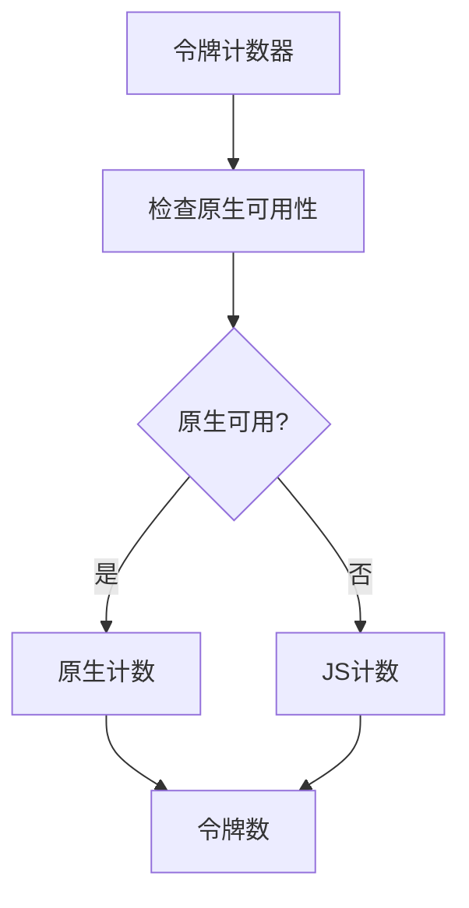
```mermaid
flowchart TD
TokenCounter["令牌计数器"] --> CheckNative["检查原生可用性"]
CheckNative --> NativeAvailable{"原生可用?"}
NativeAvailable --> |是| NativeCount["原生计数"]
NativeAvailable --> |否| JSCount["JS计数"]
NativeCount --> Result["令牌数"]
JSCount --> Result
```

**图表来源**
- [src/features/chat/utils/token-counter.ts:14-25](file://src/features/chat/utils/token-counter.ts#L14-L25)

#### 多语言计数算法
令牌计数器支持多语言的精确计数：

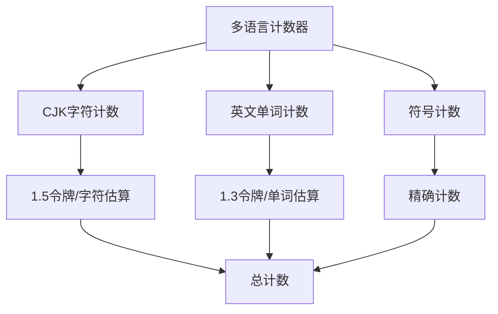
```mermaid
flowchart TD
MultiLangCounter["多语言计数器"] --> CJKCount["CJK字符计数"]
CJKCount --> CJKEstimate["1.5令牌/字符估算"]
MultiLangCounter --> EnglishCount["英文单词计数"]
EnglishCount --> WordEstimate["1.3令牌/单词估算"]
MultiLangCounter --> SymbolCount["符号计数"]
SymbolCount --> SymbolExact["精确计数"]
CJKEstimate --> Total["总计数"]
WordEstimate --> Total
SymbolExact --> Total
```

**图表来源**
- [src/features/chat/utils/token-counter.ts:30-55](file://src/features/chat/utils/token-counter.ts#L30-L55)

**章节来源**
- [src/lib/sanitizer/index.ts:1-209](file://src/lib/sanitizer/index.ts#L1-L209)
- [src/lib/rag/trigram-splitter.ts:1-253](file://src/lib/rag/trigram-splitter.ts#L1-L253)
- [src/features/chat/utils/token-counter.ts:1-66](file://src/features/chat/utils/token-counter.ts#L1-L66)

## 会话 ID 生成系统

### ID 生成器架构
会话 ID 生成系统提供了跨环境兼容的唯一 ID 生成解决方案，替代了不稳定且环境依赖的 crypto.randomUUID() 方法。

#### 核心特性
- **跨环境兼容**：不依赖 crypto.getRandomValues()，避免React Native中的polyfill问题
- **格式规范**：采用 timestamp-randomString 格式，确保时间排序和唯一性
- **性能优化**：使用 Math.random() 生成随机部分，避免加密强度要求
- **稳定性保障**：在不同平台和环境中提供一致的 ID 生成行为

```mermaid
flowchart TD
IdGenerator["ID生成器"] --> Timestamp["时间戳生成"]
Timestamp --> Base36["转换为36进制"]
Base36 --> RandomPart1["随机部分1"]
RandomPart1 --> RandomPart2["随机部分2"]
RandomPart2 --> Concatenate["拼接生成ID"]
Concatenate --> Result["唯一ID"]
```

**图表来源**
- [src/lib/utils/id-generator.ts:7-12](file://src/lib/utils/id-generator.ts#L7-L12)

#### ID 生成算法
ID 生成器采用三段式算法确保唯一性和可读性：

```mermaid
sequenceDiagram
participant Generator as "ID生成器"
participant TimeSource as "时间源"
participant RandSource as "随机源"
Generator->>TimeSource : 获取当前时间戳
TimeSource-->>Generator : 返回毫秒时间戳
Generator->>RandSource : 生成随机字符串1
RandSource-->>Generator : 返回随机部分1
Generator->>RandSource : 生成随机字符串2
RandSource-->>Generator : 返回随机部分2
Generator->>Generator : 时间戳转36进制
Generator->>Generator : 拼接格式 : timestamp-randomPart1randomPart2
Generator-->>Generator : 返回唯一ID
```

**图表来源**
- [src/lib/utils/id-generator.ts:7-12](file://src/lib/utils/id-generator.ts#L7-L12)

#### 在 ChatController 中的应用
ChatController 已更新为使用新的 generateId() 函数：

```mermaid
sequenceDiagram
participant Controller as "ChatController"
participant IdGen as "ID生成器"
participant Store as "会话管理器"
Controller->>IdGen : generateId()
IdGen-->>Controller : 返回唯一ID
Controller->>Store : addSession(新会话)
Store-->>Controller : 会话创建成功
Controller-->>Controller : 返回会话对象
```

**图表来源**
- [src/services/workbench/controllers/ChatController.ts:47-63](file://src/services/workbench/controllers/ChatController.ts#L47-L63)
- [src/lib/utils/id-generator.ts:7-12](file://src/lib/utils/id-generator.ts#L7-L12)

**章节来源**
- [src/lib/utils/id-generator.ts:1-13](file://src/lib/utils/id-generator.ts#L1-L13)
- [src/services/workbench/controllers/ChatController.ts:37-64](file://src/services/workbench/controllers/ChatController.ts#L37-L64)

## 依赖关系分析
- 控制器依赖状态层：ChatController 通过 useChatStore 调用 generateMessage 等动作
- 状态层依赖管理器：chat-store 组合 message-manager、session-manager、tool-execution
- 管理器依赖类型与仓库：管理器使用 types/chat 与 SessionRepository 进行数据操作
- 工具执行依赖注册中心与产物提取：技能发现与产物持久化
- UI 钩子依赖状态层：useChat 提供响应式会话与消息加载
- **原生模块依赖**：Sanitizer依赖TurboModuleRegistry，TextSplitter提供后台线程执行，TokenCounter提供同步调用
- **内容净化管道**：依赖原生Sanitizer进行热路径优化，支持插件化架构
- **智能分片器**：依赖原生TextSplitter进行高性能分片，支持JS回退
- **令牌计数器**：依赖原生TokenCounter进行精确计数，支持JS回退
- **ID生成器**：ChatController依赖generateId()函数，提供跨环境兼容的ID生成

```mermaid
graph LR
ChatController["ChatController"] --> ChatStore["chat-store"]
ChatStore --> MsgMgr["message-manager"]
ChatStore --> SessMgr["session-manager"]
ChatStore --> ToolExec["tool-execution"]
ToolExec --> SkillReg["skill-registry"]
ToolExec --> ArtifactExt["artifact-extractor"]
FE_Hook["useChat 钩子"] --> ChatStore
Sanitizer["lib/sanitizer"] --> NativeSanitizer["native/Sanitizer"]
TextSplitter["lib/rag/trigram-splitter"] --> NativeTextSplitter["native/TextSplitter"]
TokenCounter["features/chat/utils/token-counter"] --> NativeTokenCounter["native/TokenCounter"]
IdGenerator["lib/utils/id-generator"] --> ChatController
NativeSanitizer --> TurboModule["TurboModuleRegistry"]
NativeTextSplitter --> TurboModule
NativeTokenCounter --> TurboModule
```

**图表来源**
- [src/services/workbench/controllers/ChatController.ts:1-130](file://src/services/workbench/controllers/ChatController.ts#L1-L130)
- [src/store/chat-store.ts:212-219](file://src/store/chat-store.ts#L212-L219)
- [src/store/chat/index.ts:8-23](file://src/store/chat/index.ts#L8-L23)
- [src/lib/skills/registry.ts:1-189](file://src/lib/skills/registry.ts#L1-L189)
- [src/features/chat/hooks/useChat.ts:1-117](file://src/features/chat/hooks/useChat.ts#L1-L117)
- [src/lib/sanitizer/index.ts:22](file://src/lib/sanitizer/index.ts#L22)
- [src/lib/rag/trigram-splitter.ts:20](file://src/lib/rag/trigram-splitter.ts#L20)
- [src/features/chat/utils/token-counter.ts:12](file://src/features/chat/utils/token-counter.ts#L12)
- [src/lib/utils/id-generator.ts:7](file://src/lib/utils/id-generator.ts#L7)

**章节来源**
- [src/store/chat/index.ts:1-24](file://src/store/chat/index.ts#L1-L24)
- [src/store/chat-store.ts:212-219](file://src/store/chat-store.ts#L212-L219)

## 性能考量
- 防抖与节流：消息管理器对高频更新采用 100ms 节流与 500ms DB 防抖，平衡流畅度与一致性
- 分页加载：会话消息按需加载，避免一次性加载大量历史造成内存压力
- SQLite 双写：写操作双写确保可靠性，但需注意 DB 写入延迟与冲突处理
- 流式解析：状态机增量解析减少全量匹配开销，适合长文本与高吞吐场景
- 向量化与归档：消息向量化后可归档，减少检索与渲染负担
- **原生模块性能**：Sanitizer提供5倍性能提升，TextSplitter避免JS主线程阻塞，TokenCounter提供零开销同步调用
- **JIT性能优化**：采用超时控制和缓存机制，避免长时间阻塞对话流程
- **插件化架构**：内容净化管道支持选择性启用插件，减少不必要的处理开销
- **ID生成性能**：generateId() 函数避免了crypto.getRandomValues()的性能开销，在移动设备上表现更佳

## 故障排查指南
- 生成卡住：检查 activeRequests 中是否存在对应 sessionId 的客户端，必要时调用 abortGeneration
- 工具调用失败：查看工具执行器的日志与拦截提示，确认工具是否被禁用或参数不完整
- RAG 检索超时：系统内置 30 秒超时保护，若频繁超时需检查数据库锁与检索配置
- 消息丢失：确认是否启用 SQLite 双写，检查 DB 写入异常日志
- 流式渲染卡顿：检查 UI 渲染频率与 Markdown 解析开销，适当调整节流参数
- **原生模块问题**：检查TurboModuleRegistry是否正确注册，确认原生模块编译和链接
- **内容净化异常**：检查插件配置，确认原生热路径是否正确应用
- **文本分片失败**：检查chunkSize和chunkOverlap参数，确认原生模块可用性
- **令牌计数异常**：检查输入文本编码，确认原生模块是否正确处理Unicode字符
- **JIT提取失败**：检查JIT配置参数，确认网络连接正常，查看JIT提取器日志
- **进度显示异常**：确认rag-store中的processingState状态正确更新，检查RagOmniIndicator的props传递
- **ID生成问题**：检查generateId()函数是否正确导入，确认在不同环境下ID生成的一致性

**章节来源**
- [src/store/chat-store.ts:323-337](file://src/store/chat-store.ts#L323-L337)
- [src/store/chat/tool-execution.ts:47-90](file://src/store/chat/tool-execution.ts#L47-L90)
- [src/store/chat-store.ts:677-686](file://src/store/chat-store.ts#L677-L686)
- [src/store/chat/message-manager.ts:48-75](file://src/store/chat/message-manager.ts#L48-L75)
- [src/native/Sanitizer/index.ts:38-48](file://src/native/Sanitizer/index.ts#L38-L48)
- [src/native/TextSplitter/index.ts:31-36](file://src/native/TextSplitter/index.ts#L31-L36)
- [src/native/TokenCounter/index.ts:28-33](file://src/native/TokenCounter/index.ts#L28-L33)
- [src/lib/utils/id-generator.ts:7-12](file://src/lib/utils/id-generator.ts#L7-L12)

## 结论
Nexara 聊天系统通过清晰的分层设计与严格的类型约束，实现了可靠的会话与消息管理、稳健的工具调用与产物提取、高效的流式解析与渲染，以及灵活的 RAG 检索与计费追踪。其 SQLite 双写模式与防抖机制有效平衡了性能与一致性，适合在移动端与桌面端稳定运行。

**更新** 新增的原生模块集成系统进一步提升了系统的性能和稳定性，通过Sanitizer、TextSplitter、TokenCounter三个原生模块的深度集成，实现了内容净化、文本分片和令牌计数的高性能处理。同时，聊天输入解耦优化使得系统架构更加清晰，插件化的内容净化管道、智能的CJK文本分片器和统一的令牌计数接口为系统的可扩展性和维护性奠定了坚实基础。会话 ID 生成系统的更新为系统提供了更好的跨环境兼容性和可靠性保障。

## 附录
- 使用模式建议
  - 会话创建：通过 ChatController.createSession 初始化 agentId 与模型，默认开启半自动执行模式，使用 generateId() 生成唯一会话ID
  - 发送消息：通过 useChat.sendMessage 合并会话级选项，支持图片与文件上传
  - 工具调用：在消息中包含结构化工具调用块，工具执行器自动解析并执行
  - 流式渲染：结合 StreamParser 与 UI 组件，实现平滑的文本与推理内容增量展示
  - 产物提取：渲染类工具结果自动提取并持久化，便于后续展示与审计
  - **JIT配置**：通过RagAdvancedSettings界面启用JIT功能，设置合适的最大块数和超时参数
  - **进度监控**：使用RagOmniIndicator组件实时查看JIT提取进度和状态
  - **原生模块使用**：系统自动选择最优实现，无需手动干预，确保最佳性能
  - **内容净化**：通过插件化架构实现，支持原生热路径优化和JS回退
  - **文本分片**：智能分片器自动选择原生或JS实现，适合CJK文本处理
  - **令牌计数**：统一的令牌计数接口，支持精确的多语言计数
  - **ID生成**：使用generateId()函数生成跨环境兼容的唯一ID，替代crypto.randomUUID()