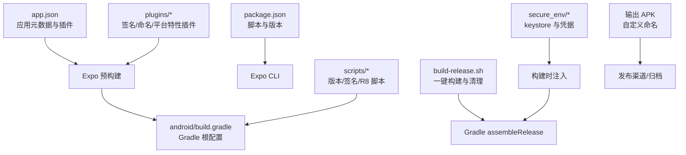
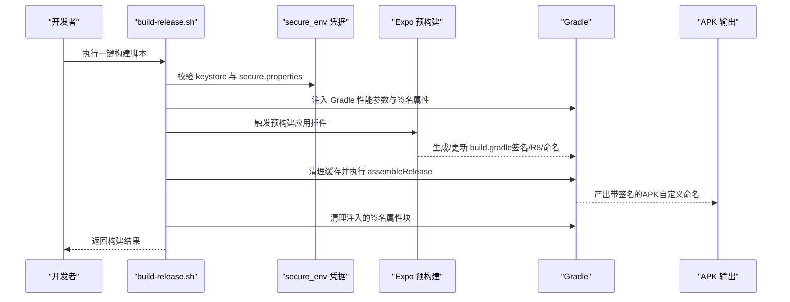
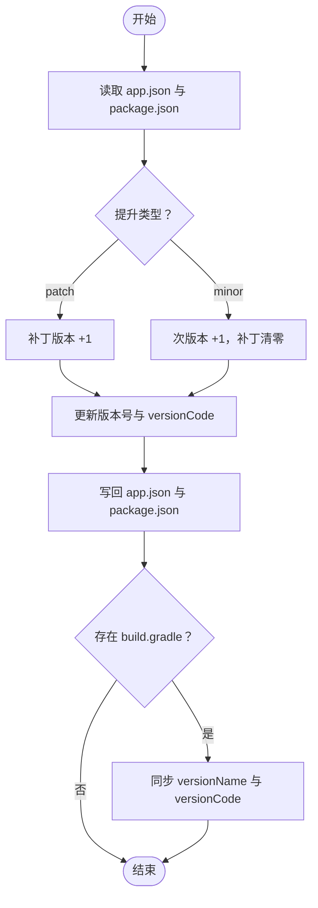
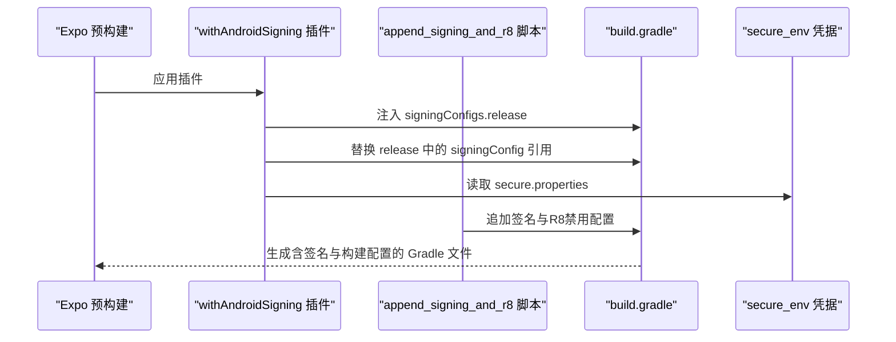
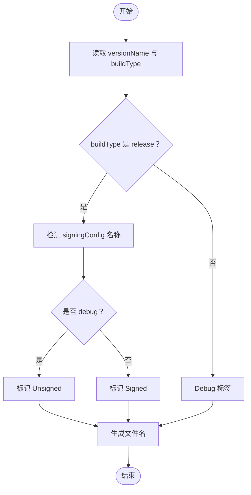
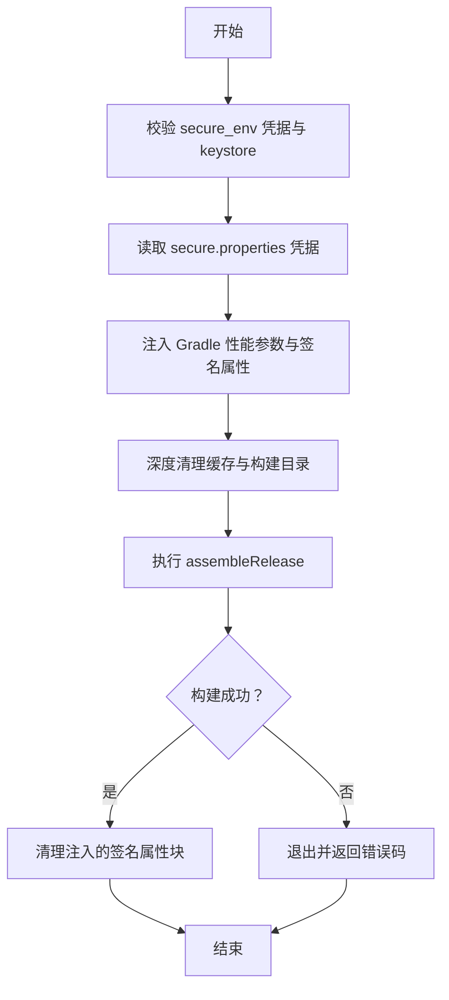
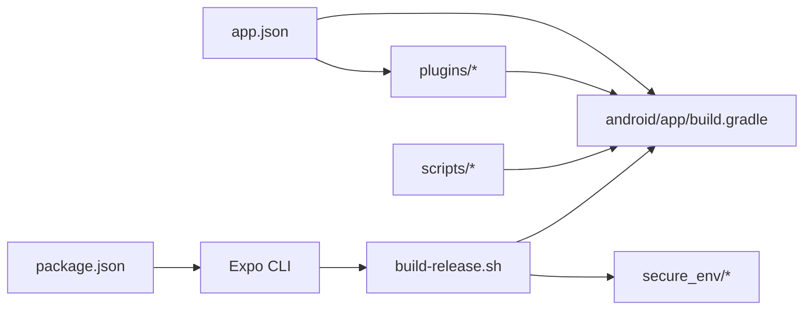

# 发布部署

<cite>
**本文引用的文件**
- [build-release.sh](file://build-release.sh)
- [app.json](file://app.json)
- [package.json](file://package.json)
- [android/build.gradle](file://android/build.gradle)
- [scripts/bump-version.js](file://scripts/bump-version.js)
- [scripts/fix_signing.js](file://scripts/fix_signing.js)
- [scripts/append_signing_and_r8.js](file://scripts/append_signing_and_r8.js)
- [scripts/disable_r8.js](file://scripts/disable_r8.js)
- [scripts/fix_release_safe.js](file://scripts/fix_release_safe.js)
- [plugins/withAndroidSigning.js](file://plugins/withAndroidSigning.js)
- [plugins/withCustomApkName.js](file://plugins/withCustomApkName.js)
- [secure_env/promenar.keystore](file://secure_env/promenar.keystore)
- [secure_env/secure.properties](file://secure_env/secure.properties)
</cite>

## 目录
1. [简介](#简介)
2. [项目结构](#项目结构)
3. [核心组件](#核心组件)
4. [架构总览](#架构总览)
5. [详细组件分析](#详细组件分析)
6. [依赖关系分析](#依赖关系分析)
7. [性能与体积优化](#性能与体积优化)
8. [故障排查指南](#故障排查指南)
9. [结论](#结论)
10. [附录](#附录)

## 简介
本指南面向Nexara项目的发布部署，覆盖Android APK的完整发布流程，包括签名配置、版本管理、发布渠道与环境差异、安全密钥管理策略、发布前检查清单、质量保证流程、APK体积优化与安装包大小控制策略，以及CI/CD集成与自动化部署的最佳实践。文档基于仓库内现有脚本、插件与配置文件进行系统化梳理，确保非技术读者也能理解并执行。

## 项目结构
Nexara采用Expo应用框架，Android原生构建通过Expo的预构建（prebuild）与Gradle流水线完成。发布相关的关键位置如下：
- 应用元数据与插件配置：app.json
- 版本与脚本入口：package.json
- Android根级构建脚本：android/build.gradle
- 版本提升与同步：scripts/bump-version.js
- 签名与R8修复脚本：scripts/append_signing_and_r8.js、scripts/fix_signing.js、scripts/disable_r8.js、scripts/fix_release_safe.js
- Expo插件：plugins/withAndroidSigning.js、plugins/withCustomApkName.js
- 安全密钥与凭据：secure_env/promenar.keystore、secure_env/secure.properties
- 自动化构建脚本：build-release.sh

图表来源
- [app.json:1-64](file://app.json#L1-L64)
- [android/build.gradle:1-26](file://android/build.gradle#L1-L26)
- [build-release.sh:1-99](file://build-release.sh#L1-L99)

章节来源
- [app.json:1-64](file://app.json#L1-L64)
- [package.json:1-120](file://package.json#L1-L120)
- [android/build.gradle:1-26](file://android/build.gradle#L1-L26)

## 核心组件
- 版本与元数据管理
  - app.json中定义了应用名称、版本号、Android包名、权限与插件列表；同时包含Android的versionCode与versionName。
  - package.json中定义了应用版本与常用脚本（如启动、运行、版本提升）。
- 签名与打包配置
  - 通过Expo插件与脚本在构建期注入签名配置与APK命名规则，确保发布版使用正式keystore签名。
- 安全密钥与凭据
  - keystore文件与secure.properties凭据位于secure_env目录，构建脚本在本地注入到Gradle属性中并在完成后清理。
- 构建与发布流水线
  - build-release.sh负责凭据校验、注入、Gradle参数优化、清理与最终构建，并在完成后清理注入内容。

章节来源
- [app.json:1-64](file://app.json#L1-L64)
- [package.json:1-120](file://package.json#L1-L120)
- [build-release.sh:1-99](file://build-release.sh#L1-L99)

## 架构总览
下图展示了从源码到APK产物的端到端发布路径，涵盖版本管理、签名注入、Gradle优化与构建、APK命名与清理等环节。

图表来源
- [build-release.sh:1-99](file://build-release.sh#L1-L99)
- [plugins/withAndroidSigning.js:1-62](file://plugins/withAndroidSigning.js#L1-L62)
- [plugins/withCustomApkName.js:1-85](file://plugins/withCustomApkName.js#L1-L85)
- [scripts/append_signing_and_r8.js:1-44](file://scripts/append_signing_and_r8.js#L1-L44)
- [scripts/disable_r8.js:1-83](file://scripts/disable_r8.js#L1-L83)

## 详细组件分析

### 组件A：版本管理与同步（bump-version）
- 功能概述
  - 支持按补丁或次版本提升，自动同步app.json与package.json中的版本号，并同步更新android/app/build.gradle中的versionCode与versionName。
- 关键行为
  - 读取当前版本，计算新版本，递增versionCode。
  - 写回app.json、package.json与build.gradle。
- 使用建议
  - 在合并到主分支前执行，确保版本一致性与可追溯性。

图表来源
- [scripts/bump-version.js:1-65](file://scripts/bump-version.js#L1-L65)

章节来源
- [scripts/bump-version.js:1-65](file://scripts/bump-version.js#L1-L65)
- [app.json:1-64](file://app.json#L1-L64)
- [package.json:1-120](file://package.json#L1-L120)

### 组件B：签名配置注入（withAndroidSigning 与 append_signing_and_r8）
- 功能概述
  - 通过Expo插件在build.gradle中注入release签名配置与构建类型设置；另一脚本追加签名与R8禁用逻辑。
- 关键行为
  - 插件：在存在secure_env凭据时使用正式keystore，否则回退到debug keystore。
  - 脚本：注入signingConfigs.release与buildTypes.release中的signingConfig引用，同时禁用R8与资源压缩。
- 注意事项
  - 若已存在旧的签名引用（如debug），需由脚本或后续修复脚本进行替换。

图表来源
- [plugins/withAndroidSigning.js:1-62](file://plugins/withAndroidSigning.js#L1-L62)
- [scripts/append_signing_and_r8.js:1-44](file://scripts/append_signing_and_r8.js#L1-L44)

章节来源
- [plugins/withAndroidSigning.js:1-62](file://plugins/withAndroidSigning.js#L1-L62)
- [scripts/append_signing_and_r8.js:1-44](file://scripts/append_signing_and_r8.js#L1-L44)

### 组件C：APK命名与渠道策略（withCustomApkName）
- 功能概述
  - 自定义APK输出文件名，区分Release（Signed/Unsigned）与Debug，并附加日期后缀。
- 关键行为
  - 依据buildType与signingConfig动态生成文件名；当release使用debug签名时标记为Unsigned。
- 使用建议
  - 与发布渠道策略结合：Signed用于正式发布，Unsigned用于内部测试或快速验证。

图表来源
- [plugins/withCustomApkName.js:1-85](file://plugins/withCustomApkName.js#L1-L85)

章节来源
- [plugins/withCustomApkName.js:1-85](file://plugins/withCustomApkName.js#L1-L85)

### 组件D：一键构建与清理（build-release.sh）
- 功能概述
  - 校验secure_env凭据与keystore，注入Gradle性能参数与签名属性，清理缓存并执行assembleRelease，最后清理注入内容。
- 关键行为
  - 自动检测硬件资源并调整Gradle并发与堆大小。
  - 深度清理以避免缓存污染。
- 使用建议
  - 在CI/CD中作为单一入口，确保环境隔离与凭据安全。

图表来源
- [build-release.sh:1-99](file://build-release.sh#L1-L99)

章节来源
- [build-release.sh:1-99](file://build-release.sh#L1-L99)

### 组件E：R8与资源压缩控制（disable_r8 与 fix_release_safe）
- 功能概述
  - 确保release构建禁用R8与资源压缩，必要时强制替换或插入配置。
- 关键行为
  - 通过脚本扫描并替换minifyEnabled/shrinkResources为false，或在release块中显式插入。
- 使用建议
  - 在CI/CD中作为质量门禁，防止因混淆导致的崩溃与体积异常。

章节来源
- [scripts/disable_r8.js:1-83](file://scripts/disable_r8.js#L1-L83)
- [scripts/fix_release_safe.js:1-67](file://scripts/fix_release_safe.js#L1-L67)

## 依赖关系分析
- 配置与插件
  - app.json通过plugins字段启用签名、APK命名、平台特性与前台服务等插件。
  - android/build.gradle引入Expo根项目插件，使Gradle与Expo配置协同工作。
- 脚本与文件
  - build-release.sh依赖secure_env中的keystore与凭据，注入到Gradle属性后执行构建。
  - 多个脚本共同维护build.gradle的签名与R8配置一致性。

图表来源
- [app.json:1-64](file://app.json#L1-L64)
- [android/build.gradle:1-26](file://android/build.gradle#L1-L26)
- [build-release.sh:1-99](file://build-release.sh#L1-L99)

章节来源
- [app.json:1-64](file://app.json#L1-L64)
- [android/build.gradle:1-26](file://android/build.gradle#L1-L26)
- [package.json:1-120](file://package.json#L1-L120)

## 性能与体积优化
- Gradle性能优化
  - build-release.sh根据内存与CPU自动设置jvmargs与并发worker数量，减少长时间构建失败风险。
- R8与资源压缩
  - 默认禁用R8与资源压缩，降低崩溃风险与二进制复杂度；如需启用，请在CI中增加稳定性验证。
- 平台特性与库标签
  - 通过插件启用arm64-only与原生库标签，有助于减小ABI与安装包体积。
- APK命名与归档
  - 自定义命名便于快速识别版本与签名状态，建议配合渠道标签统一归档策略。

章节来源
- [build-release.sh:1-99](file://build-release.sh#L1-L99)
- [scripts/disable_r8.js:1-83](file://scripts/disable_r8.js#L1-L83)
- [plugins/withCustomApkName.js:1-85](file://plugins/withCustomApkName.js#L1-L85)

## 故障排查指南
- 常见问题与定位
  - 缺少secure_env凭据：构建脚本报错并退出，检查promenar.keystore与secure.properties是否存在且完整。
  - Gradle构建失败：查看build-release.sh返回的退出码，确认Gradle日志与缓存清理是否生效。
  - 签名未生效：确认build.gradle中release块已正确引用signingConfigs.release，必要时运行fix_signing.js或fix_release_safe.js。
  - R8相关崩溃：确认release块minifyEnabled与shrinkResources均为false，必要时运行disable_r8.js。
- 建议流程
  - 先执行版本提升与同步，再运行build-release.sh，最后核对APK命名与签名状态。

章节来源
- [build-release.sh:1-99](file://build-release.sh#L1-L99)
- [scripts/fix_signing.js:1-118](file://scripts/fix_signing.js#L1-L118)
- [scripts/fix_release_safe.js:1-67](file://scripts/fix_release_safe.js#L1-L67)
- [scripts/disable_r8.js:1-83](file://scripts/disable_r8.js#L1-L83)

## 结论
Nexara的发布部署体系通过Expo插件与多脚本协作，实现了从版本管理、签名注入、Gradle优化到APK命名与清理的闭环。结合secure_env的安全策略与CI/CD自动化，可稳定产出高质量的Android发布包。建议在CI中固定凭据注入与构建参数，持续监控体积与稳定性指标，确保发布流程可重复、可审计、可回滚。

## 附录

### 发布前检查清单
- 版本与元数据
  - app.json与package.json版本一致，versionCode已递增。
- 签名与凭据
  - secure_env中keystore与secure.properties齐全，权限最小化。
- 构建配置
  - release块禁用R8与资源压缩，签名引用指向release配置。
- 渠道与命名
  - APK命名包含版本、类型与签名状态，便于归档与分发。
- CI/CD
  - 构建脚本作为唯一入口，缓存清理策略明确，产物上传与签名验证通过。

### 环境差异与发布渠道
- 调试版（Debug）
  - 使用默认debug签名，开启调试功能，适合开发与内部测试。
- 发布版（Release）
  - 使用正式keystore签名，禁用R8与资源压缩，命名包含Signed标签，适合对外发布。
- 渠道策略
  - Signed用于正式商店与外部分发，Unsigned用于内部快速验证与回归测试。

### 安全密钥管理策略
- keystore保护
  - 将promenar.keystore置于secure_env目录，严格限制访问权限。
- 凭据注入
  - 仅在构建时临时注入到Gradle属性，构建结束后立即清理，避免长期驻留。
- 最小权限原则
  - 仅授予构建所需权限，定期轮换密钥与密码，记录变更历史。

### CI/CD集成与自动化部署最佳实践
- 单一入口
  - 使用build-release.sh作为CI任务入口，确保环境隔离与可重复性。
- 凭据注入
  - 在CI中以安全变量方式注入secure.properties内容，避免明文存储。
- 构建缓存
  - 合理利用Gradle与npm缓存，但需在每次构建前执行深度清理以规避缓存污染。
- 质量门禁
  - 在CI中加入稳定性测试与体积阈值检查，确保发布包质量。