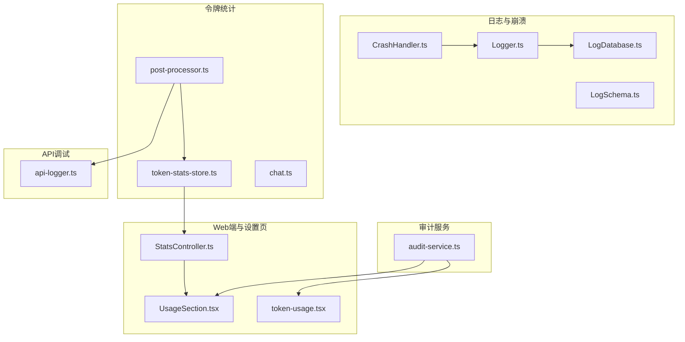
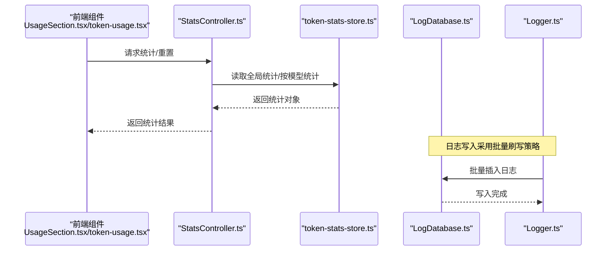
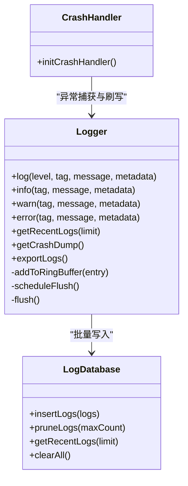
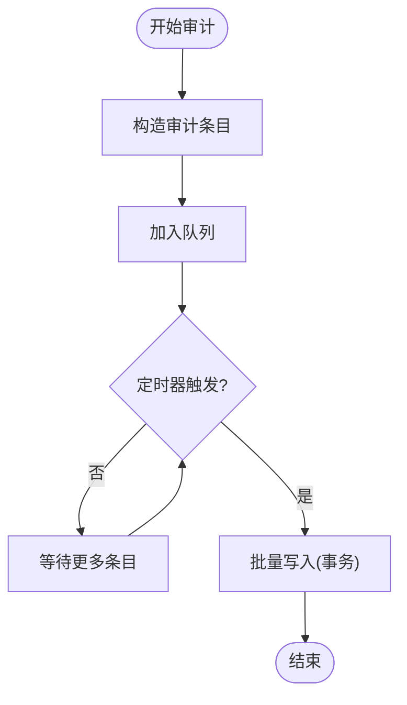
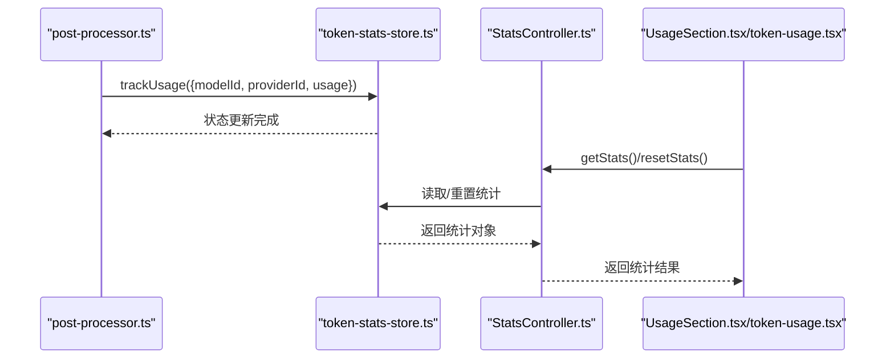
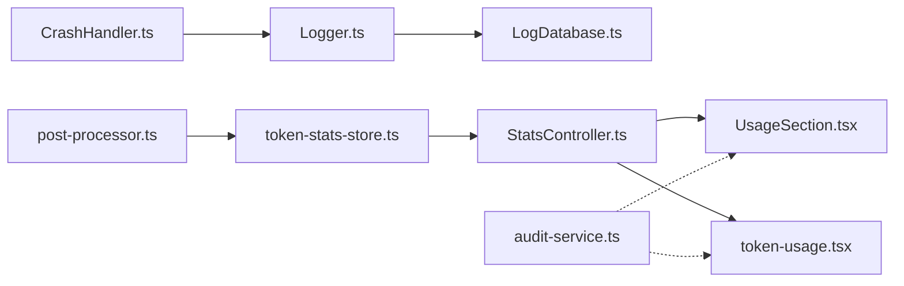

# 性能监控

<cite>
**本文引用的文件**
- [Logger.ts](file://src/lib/logging/Logger.ts)
- [LogDatabase.ts](file://src/lib/logging/LogDatabase.ts)
- [LogSchema.ts](file://src/lib/logging/LogSchema.ts)
- [CrashHandler.ts](file://src/lib/logging/CrashHandler.ts)
- [audit-service.ts](file://src/lib/services/audit-service.ts)
- [token-stats-store.ts](file://src/store/token-stats-store.ts)
- [post-processor.ts](file://src/store/chat/post-processor.ts)
- [chat.ts](file://src/types/chat.ts)
- [StatsController.ts](file://src/services/workbench/controllers/StatsController.ts)
- [UsageSection.tsx](file://web-client/src/pages/settings/UsageSection.tsx)
- [token-usage.tsx](file://app/settings/token-usage.tsx)
- [api-logger.ts](file://src/lib/llm/api-logger.ts)
- [token-stats-audit-report-final.md](file://plans/token-stats-audit-report-final.md)
</cite>

## 目录
1. [简介](#简介)
2. [项目结构](#项目结构)
3. [核心组件](#核心组件)
4. [架构总览](#架构总览)
5. [详细组件分析](#详细组件分析)
6. [依赖关系分析](#依赖关系分析)
7. [性能考量](#性能考量)
8. [故障排查指南](#故障排查指南)
9. [结论](#结论)
10. [附录](#附录)

## 简介
本文件系统性梳理 Nexara 项目的性能监控体系，涵盖以下方面：
- 性能审计与日志记录：统一日志系统、结构化日志格式、日志级别管理、崩溃捕获与回溯。
- 数据库性能分析：SQLite 日志与审计表的写入策略、索引设计、批量写入与清理。
- 内存使用监控：环形缓冲区与批量刷写策略、内存占用与 I/O 平衡。
- 令牌使用统计与性能指标：Token 统计收集、按模型/供应商聚合、Web 端展示与重置。
- 崩溃报告机制与错误处理策略：JS/Native 异常捕获、强制刷写、错误率统计。
- 基准测试与瓶颈识别：基于现有埋点与统计的实践方法。
- 用户行为分析与使用模式监控：审计服务对操作与资源的追踪。

## 项目结构
围绕性能监控的关键目录与文件如下：
- 日志与崩溃：src/lib/logging/*（Logger、LogDatabase、LogSchema、CrashHandler）
- 审计服务：src/lib/services/audit-service.ts
- 令牌统计：src/store/token-stats-store.ts、src/store/chat/post-processor.ts、src/types/chat.ts
- Web 端展示：web-client/src/pages/settings/UsageSection.tsx
- 设置页展示：app/settings/token-usage.tsx
- API 调试日志：src/lib/llm/api-logger.ts
- 统计控制器：src/services/workbench/controllers/StatsController.ts
- 审计报告与修复建议：plans/token-stats-audit-report-final.md

图表来源
- [Logger.ts:1-280](file://src/lib/logging/Logger.ts#L1-L280)
- [LogDatabase.ts:1-132](file://src/lib/logging/LogDatabase.ts#L1-L132)
- [LogSchema.ts:1-43](file://src/lib/logging/LogSchema.ts#L1-L43)
- [CrashHandler.ts:1-53](file://src/lib/logging/CrashHandler.ts#L1-L53)
- [audit-service.ts:1-203](file://src/lib/services/audit-service.ts#L1-L203)
- [token-stats-store.ts:1-272](file://src/store/token-stats-store.ts#L1-L272)
- [post-processor.ts:1-250](file://src/store/chat/post-processor.ts#L1-L250)
- [chat.ts:1-314](file://src/types/chat.ts#L1-L314)
- [StatsController.ts:1-23](file://src/services/workbench/controllers/StatsController.ts#L1-L23)
- [UsageSection.tsx:1-45](file://web-client/src/pages/settings/UsageSection.tsx#L1-L45)
- [token-usage.tsx:232-257](file://app/settings/token-usage.tsx#L232-L257)
- [api-logger.ts:1-60](file://src/lib/llm/api-logger.ts#L1-L60)

章节来源
- [Logger.ts:1-280](file://src/lib/logging/Logger.ts#L1-L280)
- [LogDatabase.ts:1-132](file://src/lib/logging/LogDatabase.ts#L1-L132)
- [LogSchema.ts:1-43](file://src/lib/logging/LogSchema.ts#L1-L43)
- [CrashHandler.ts:1-53](file://src/lib/logging/CrashHandler.ts#L1-L53)
- [audit-service.ts:1-203](file://src/lib/services/audit-service.ts#L1-L203)
- [token-stats-store.ts:1-272](file://src/store/token-stats-store.ts#L1-L272)
- [post-processor.ts:1-250](file://src/store/chat/post-processor.ts#L1-L250)
- [chat.ts:1-314](file://src/types/chat.ts#L1-L314)
- [StatsController.ts:1-23](file://src/services/workbench/controllers/StatsController.ts#L1-L23)
- [UsageSection.tsx:1-45](file://web-client/src/pages/settings/UsageSection.tsx#L1-L45)
- [token-usage.tsx:232-257](file://app/settings/token-usage.tsx#L232-L257)
- [api-logger.ts:1-60](file://src/lib/llm/api-logger.ts#L1-L60)

## 核心组件
- 统一日志系统（Logger）：提供结构化日志、环形缓冲区、批量刷写、会话关联与导出能力。
- 日志数据库（LogDatabase）：SQLite 表结构、批量插入、清理与查询。
- 崩溃处理（CrashHandler）：JS/Native 异常捕获、强制刷写与记录。
- 审计服务（AuditService）：操作审计、批量写入、查询与统计。
- 令牌统计（TokenStatsStore）：按模型/供应商聚合、持久化与修复机制。
- API 调试日志（ApiLogger）：请求/响应载荷记录，统一接入 Logger。
- 统计控制器（StatsController）：对外提供统计查询与重置接口。
- Web/设置页展示：前端组件消费统计与审计数据。

章节来源
- [Logger.ts:1-280](file://src/lib/logging/Logger.ts#L1-L280)
- [LogDatabase.ts:1-132](file://src/lib/logging/LogDatabase.ts#L1-L132)
- [CrashHandler.ts:1-53](file://src/lib/logging/CrashHandler.ts#L1-L53)
- [audit-service.ts:1-203](file://src/lib/services/audit-service.ts#L1-L203)
- [token-stats-store.ts:1-272](file://src/store/token-stats-store.ts#L1-L272)
- [api-logger.ts:1-60](file://src/lib/llm/api-logger.ts#L1-L60)
- [StatsController.ts:1-23](file://src/services/workbench/controllers/StatsController.ts#L1-L23)

## 架构总览
整体监控架构分为三层：
- 数据采集层：聊天后处理器、API 调试日志、审计入口。
- 数据存储层：日志数据库（SQLite）、令牌统计持久化、审计表。
- 数据消费层：Web 端与设置页展示、统计控制器、崩溃回溯。

图表来源
- [StatsController.ts:1-23](file://src/services/workbench/controllers/StatsController.ts#L1-L23)
- [token-stats-store.ts:1-272](file://src/store/token-stats-store.ts#L1-L272)
- [LogDatabase.ts:1-132](file://src/lib/logging/LogDatabase.ts#L1-L132)
- [Logger.ts:1-280](file://src/lib/logging/Logger.ts#L1-L280)
- [UsageSection.tsx:1-45](file://web-client/src/pages/settings/UsageSection.tsx#L1-L45)
- [token-usage.tsx:232-257](file://app/settings/token-usage.tsx#L232-L257)

## 详细组件分析

### 日志系统与崩溃处理
- 结构化日志：统一的 LogEntry 接口，包含级别、标签、消息、时间戳、元数据与会话 ID。
- 写入策略：普通日志延迟批量写入（防抖），错误日志立即刷写；写入锁避免并发事务冲突。
- 环形缓冲区：保留最近 N 条日志，便于崩溃回溯与 UI 展示。
- 崩溃捕获：JS 与 Native 异常捕获，记录并尝试强制刷写，保证关键信息不丢失。

图表来源
- [Logger.ts:1-280](file://src/lib/logging/Logger.ts#L1-L280)
- [LogDatabase.ts:1-132](file://src/lib/logging/LogDatabase.ts#L1-L132)
- [CrashHandler.ts:1-53](file://src/lib/logging/CrashHandler.ts#L1-L53)

章节来源
- [Logger.ts:74-234](file://src/lib/logging/Logger.ts#L74-L234)
- [LogDatabase.ts:48-131](file://src/lib/logging/LogDatabase.ts#L48-L131)
- [CrashHandler.ts:8-52](file://src/lib/logging/CrashHandler.ts#L8-L52)
- [LogSchema.ts:1-43](file://src/lib/logging/LogSchema.ts#L1-L43)

### 审计服务
- 审计入口：统一的 log 方法，批量写入，带事务与锁控制。
- 查询与统计：支持按会话、动作、资源类型、时间范围查询，支持错误率统计与清理旧日志。
- 与数据库交互：通过统一 db 实例执行 SQL，保证一致性。

图表来源
- [audit-service.ts:32-85](file://src/lib/services/audit-service.ts#L32-L85)

章节来源
- [audit-service.ts:26-200](file://src/lib/services/audit-service.ts#L26-L200)

### 令牌使用统计与性能指标
- 数据来源：聊天输入/输出、RAG 系统开销、上下文摘要与向量化等。
- 统计维度：全局总计、按模型、按供应商（可扩展）。
- 持久化与修复：zustand persist + onRehydrateStorage 保护，修复损坏数据结构。
- 前端展示：Web 端与设置页分别展示统计与提供重置功能。

图表来源
- [post-processor.ts:188-213](file://src/store/chat/post-processor.ts#L188-L213)
- [token-stats-store.ts:124-177](file://src/store/token-stats-store.ts#L124-L177)
- [StatsController.ts:4-22](file://src/services/workbench/controllers/StatsController.ts#L4-L22)
- [UsageSection.tsx:16-33](file://web-client/src/pages/settings/UsageSection.tsx#L16-L33)
- [token-usage.tsx:232-257](file://app/settings/token-usage.tsx#L232-L257)

章节来源
- [post-processor.ts:188-213](file://src/store/chat/post-processor.ts#L188-L213)
- [token-stats-store.ts:124-272](file://src/store/token-stats-store.ts#L124-L272)
- [chat.ts:44-50](file://src/types/chat.ts#L44-L50)
- [StatsController.ts:4-22](file://src/services/workbench/controllers/StatsController.ts#L4-L22)
- [UsageSection.tsx:16-33](file://web-client/src/pages/settings/UsageSection.tsx#L16-L33)
- [token-usage.tsx:232-257](file://app/settings/token-usage.tsx#L232-L257)
- [token-stats-audit-report-final.md:15-74](file://plans/token-stats-audit-report-final.md#L15-L74)

### API 调试日志
- 包装统一 Logger，记录请求/响应载荷与元数据，便于定位 API 调用问题。

章节来源
- [api-logger.ts:23-43](file://src/lib/llm/api-logger.ts#L23-L43)

## 依赖关系分析
- Logger 依赖 LogDatabase 进行持久化，CrashHandler 依赖 Logger 进行异常记录与刷写。
- 审计服务与日志系统解耦，各自维护独立表与写入路径。
- 令牌统计依赖聊天后处理器提供数据，前端通过控制器与页面消费。
- Web 端与设置页共享统计来源，分别负责不同展示场景。

图表来源
- [CrashHandler.ts:1-53](file://src/lib/logging/CrashHandler.ts#L1-L53)
- [Logger.ts:1-280](file://src/lib/logging/Logger.ts#L1-L280)
- [LogDatabase.ts:1-132](file://src/lib/logging/LogDatabase.ts#L1-L132)
- [post-processor.ts:1-250](file://src/store/chat/post-processor.ts#L1-L250)
- [token-stats-store.ts:1-272](file://src/store/token-stats-store.ts#L1-L272)
- [StatsController.ts:1-23](file://src/services/workbench/controllers/StatsController.ts#L1-L23)
- [UsageSection.tsx:1-45](file://web-client/src/pages/settings/UsageSection.tsx#L1-L45)
- [token-usage.tsx:232-257](file://app/settings/token-usage.tsx#L232-L257)
- [audit-service.ts:1-203](file://src/lib/services/audit-service.ts#L1-L203)

## 性能考量
- I/O 与内存平衡
  - 日志系统采用环形缓冲区与批量刷写，减少频繁 I/O；错误日志即时刷写保证可靠性。
  - 令牌统计使用 zustand persist，配合 onRehydrateStorage 修复机制，避免因存储损坏导致的崩溃与额外重试成本。
- 数据库写入策略
  - 日志与审计均采用事务批量写入，降低磁盘写放大；SQLite 索引按时间倒序与级别建立，提升查询效率。
- 前端渲染与统计展示
  - Web 端与设置页对统计进行聚合展示，注意边界条件（如全零时的布局）以避免 UI 异常。
- 崩溃回溯
  - 通过环形缓冲区与崩溃处理，可在崩溃发生时快速获取最近日志，辅助定位问题。

章节来源
- [Logger.ts:145-210](file://src/lib/logging/Logger.ts#L145-L210)
- [LogDatabase.ts:48-94](file://src/lib/logging/LogDatabase.ts#L48-L94)
- [audit-service.ts:49-85](file://src/lib/services/audit-service.ts#L49-L85)
- [token-stats-store.ts:178-272](file://src/store/token-stats-store.ts#L178-L272)
- [token-stats-audit-report-final.md:108-139](file://plans/token-stats-audit-report-final.md#L108-L139)

## 故障排查指南
- 崩溃与异常
  - 确认 CrashHandler 已初始化，异常被捕获并记录；必要时手动触发 flush 以确保日志落盘。
  - 使用 Logger.getCrashDump() 快速导出最近日志片段。
- 日志缺失或异常
  - 检查日志级别与开关设置；确认 Logger.enabled 状态；查看批量刷写是否被阻塞。
  - 若出现 SQLite 写入失败，检查事务回滚与异常日志。
- 令牌统计崩溃或数据异常
  - 按审计报告修复 onRehydrateStorage 保护机制与 costUSD 字段缺失问题。
  - 检查前端 flex=0 边界情况，避免布局异常。
- 审计统计异常
  - 使用审计服务的查询与统计接口核对时间段、动作与状态分布；定期清理旧日志以控制表规模。

章节来源
- [CrashHandler.ts:8-52](file://src/lib/logging/CrashHandler.ts#L8-L52)
- [Logger.ts:215-234](file://src/lib/logging/Logger.ts#L215-L234)
- [LogDatabase.ts:70-94](file://src/lib/logging/LogDatabase.ts#L70-L94)
- [audit-service.ts:149-199](file://src/lib/services/audit-service.ts#L149-L199)
- [token-stats-audit-report-final.md:15-74](file://plans/token-stats-audit-report-final.md#L15-L74)
- [token-stats-audit-report-final.md:78-107](file://plans/token-stats-audit-report-final.md#L78-L107)
- [token-stats-audit-report-final.md:110-139](file://plans/token-stats-audit-report-final.md#L110-L139)

## 结论
Nexara 的性能监控体系以统一日志、审计与令牌统计为核心，结合 SQLite 持久化与前端可视化，形成闭环的可观测性方案。当前存在若干可立即修复的问题（如令牌统计的持久化保护与字段完整性），建议优先处理以提升稳定性与可维护性。后续可在令牌统计中引入按供应商聚合与版本化迁移策略，进一步完善指标维度与数据治理。

## 附录
- 性能基准测试方法
  - 基于现有埋点：在聊天后处理器与 API 调试日志中增加时间戳与耗时统计，结合审计服务记录关键操作耗时。
  - 基准场景：固定输入长度与上下文轮数，测量生成耗时、向量化耗时、摘要耗时与日志写入延迟。
  - 瓶颈识别：利用审计统计中的错误率与动作分布，定位高频失败环节；结合日志时间线与数据库写入耗时，识别 I/O 瓶颈。
- 用户行为分析与使用模式监控
  - 审计服务记录会话、动作、资源类型与状态，可用于分析用户使用路径与失败模式。
  - 令牌统计提供输入/输出/系统开销的聚合视图，辅助评估用户偏好与成本趋势。