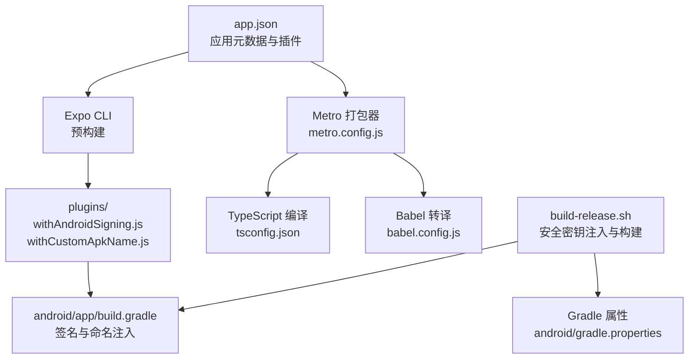
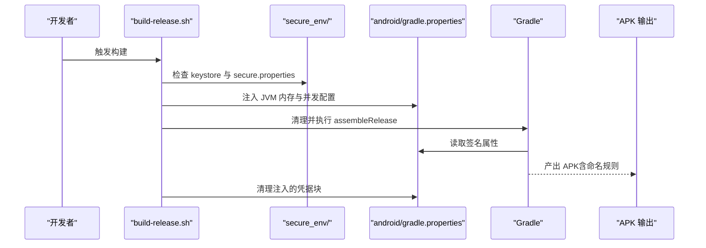
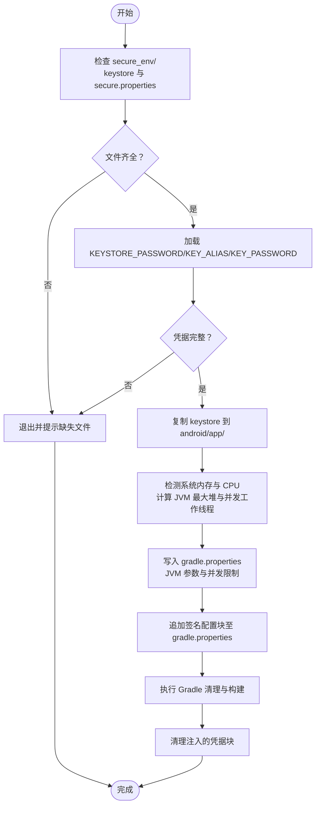
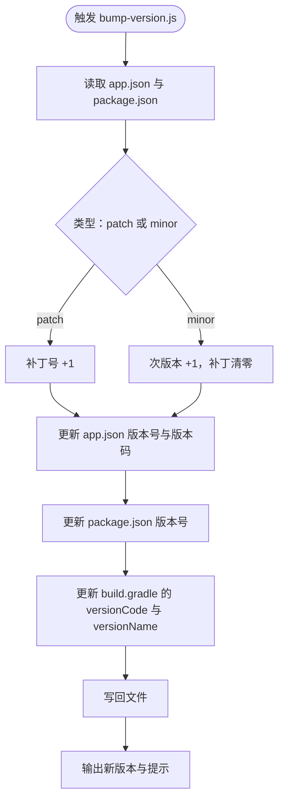
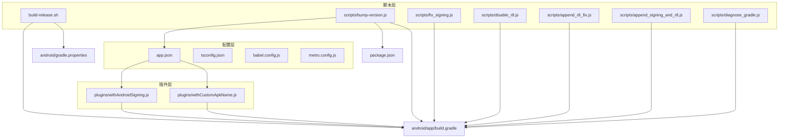

# 构建配置

<cite>
**本文引用的文件**
- [app.json](file://app.json)
- [babel.config.js](file://babel.config.js)
- [metro.config.js](file://metro.config.js)
- [tsconfig.json](file://tsconfig.json)
- [package.json](file://package.json)
- [build-release.sh](file://build-release.sh)
- [scripts/bump-version.js](file://scripts/bump-version.js)
- [scripts/diagnose_gradle.js](file://scripts/diagnose_gradle.js)
- [scripts/disable_r8.js](file://scripts/disable_r8.js)
- [scripts/fix_signing.js](file://scripts/fix_signing.js)
- [scripts/append_signing_and_r8.js](file://scripts/append_signing_and_r8.js)
- [scripts/append_r8_fix.js](file://scripts/append_r8_fix.js)
- [plugins/withAndroidSigning.js](file://plugins/withAndroidSigning.js)
- [plugins/withCustomApkName.js](file://plugins/withCustomApkName.js)
</cite>

## 目录
1. [简介](#简介)
2. [项目结构](#项目结构)
3. [核心组件](#核心组件)
4. [架构总览](#架构总览)
5. [详细组件分析](#详细组件分析)
6. [依赖关系分析](#依赖关系分析)
7. [性能考量](#性能考量)
8. [故障排查指南](#故障排查指南)
9. [结论](#结论)
10. [附录](#附录)

## 简介
本文件系统性梳理 Nexara 项目的构建配置与流程，重点覆盖以下方面：
- 安全密钥注入流程：从本地安全目录到 Gradle 属性注入，再到构建时签名配置的完整链路
- Gradle 属性优化与内存配置策略：基于主机硬件动态调整 JVM 堆大小与并发工作线程数
- 应用配置文件 app.json 的参数设置：版本号管理、权限声明、平台特定配置与插件集成
- TypeScript 编译与 Babel 转译规则：预设与插件组合、样式源输入
- Metro 打包器配置与依赖解析策略：资源扩展、路径解析与原生样式集成
- 构建环境准备指南：Node.js 版本、Android SDK、开发工具链与安全密钥准备

## 项目结构
本项目采用 React Native + Expo 架构，结合自定义脚本与插件实现自动化构建与发布。关键构建相关文件分布如下：
- 应用元数据与插件：app.json
- TypeScript 配置：tsconfig.json
- Babel 转译：babel.config.js
- Metro 打包：metro.config.js
- 依赖与脚本：package.json 及 scripts/ 目录
- Android 构建脚本与插件：build-release.sh 与 plugins/ 目录

图表来源
- [app.json:1-64](file://app.json#L1-L64)
- [metro.config.js:1-13](file://metro.config.js#L1-L13)
- [babel.config.js:1-14](file://babel.config.js#L1-L14)
- [tsconfig.json:1-14](file://tsconfig.json#L1-L14)
- [build-release.sh:1-99](file://build-release.sh#L1-L99)
- [plugins/withAndroidSigning.js:1-62](file://plugins/withAndroidSigning.js#L1-L62)
- [plugins/withCustomApkName.js:1-85](file://plugins/withCustomApkName.js#L1-L85)

章节来源
- [app.json:1-64](file://app.json#L1-L64)
- [package.json:1-120](file://package.json#L1-L120)

## 核心组件
本节聚焦构建配置的核心要素及其职责。

- 应用配置文件 app.json
  - 版本号与平台标识：包含应用名称、版本、平台特定的包名与版本码
  - 权限声明：Android 平台显式声明录音、相机、存储与媒体读取等权限
  - 插件集成：路由、字体、图片选择、自定义 APK 名称、调试配置、宽色域、签名、原生库标签与前台服务等插件
  - 新架构开关：启用新架构以提升性能与稳定性

- TypeScript 编译配置 tsconfig.json
  - 继承 Expo 基础配置，启用严格模式，排除 Web 客户端与测试目录，确保编译范围清晰

- Babel 转译配置 babel.config.js
  - 使用 Expo 预设并指定 JSX 导入源为 nativewind，配合原生样式与动画插件，确保运行时与样式一致性

- Metro 打包配置 metro.config.js
  - 基于 Expo 默认配置，启用原生样式集成，扩展资源后缀，统一依赖解析路径，确保样式与资源正确打包

- 构建脚本与插件
  - build-release.sh：自动化密钥注入、Gradle 性能优化、清理与构建、清理凭据
  - scripts/bump-version.js：版本号与版本码自动递增，同步更新多处配置文件
  - plugins/withAndroidSigning.js：在构建脚本中注入 release 签名配置，兼容安全目录与回退策略
  - plugins/withCustomApkName.js：按约定生成 APK 文件名，区分签名状态与构建类型

章节来源
- [app.json:1-64](file://app.json#L1-L64)
- [tsconfig.json:1-14](file://tsconfig.json#L1-L14)
- [babel.config.js:1-14](file://babel.config.js#L1-L14)
- [metro.config.js:1-13](file://metro.config.js#L1-L13)
- [build-release.sh:1-99](file://build-release.sh#L1-L99)
- [scripts/bump-version.js:1-65](file://scripts/bump-version.js#L1-L65)
- [plugins/withAndroidSigning.js:1-62](file://plugins/withAndroidSigning.js#L1-L62)
- [plugins/withCustomApkName.js:1-85](file://plugins/withCustomApkName.js#L1-L85)

## 架构总览
下图展示从安全密钥到最终 APK 的构建链路，以及各配置文件与脚本之间的交互关系。

图表来源
- [build-release.sh:1-99](file://build-release.sh#L1-L99)
- [app.json:1-64](file://app.json#L1-L64)

## 详细组件分析

### 安全密钥注入流程
该流程确保签名凭据仅在受控环境中存在，并在构建过程中临时注入，完成后立即清理，降低泄露风险。

图表来源
- [build-release.sh:15-99](file://build-release.sh#L15-L99)

章节来源
- [build-release.sh:15-99](file://build-release.sh#L15-L99)

### Gradle 属性优化与内存配置策略
脚本根据系统硬件动态调整 Gradle 行为，兼顾稳定性与性能：
- 低内存场景（<20GB）：限制并发工作线程数，降低 JVM 最大堆，避免 OOM
- 高性能场景（≥20GB）：使用 CPU 核心数作为并发上限，提升构建速度
- 注入策略：先清理旧配置，再写入新的 JVM 与并发参数；签名块使用标记行包裹，便于后续清理

章节来源
- [build-release.sh:41-78](file://build-release.sh#L41-L78)

### 应用配置文件 app.json 参数详解
- 基本信息与启动项：名称、标识、启动图标、启动屏与界面主题
- 版本与架构：版本号、新架构开关
- iOS 与 Android 平台特定设置：Bundle Identifier、包名、版本码、边缘到边缘、预测返回手势、软件键盘布局模式
- 权限配置：录音、相机、外部存储读写、媒体内容读取等
- 插件集成：路由、字体、图片选择、自定义 APK 名称、调试配置、宽色域、签名、原生库标签、资产与前台服务

章节来源
- [app.json:1-64](file://app.json#L1-L64)

### TypeScript 编译配置与 Babel 转译规则
- TypeScript
  - 继承 Expo 基础配置，启用严格模式，排除 Web 客户端与测试目录，确保编译范围可控
- Babel
  - 使用 Expo 预设与 nativewind JSX 导入源，配合 react-native-worklets-core 与 react-native-reanimated 插件，保证动画与工作槽运行时的兼容性

章节来源
- [tsconfig.json:1-14](file://tsconfig.json#L1-L14)
- [babel.config.js:1-14](file://babel.config.js#L1-L14)

### Metro 打包器配置与依赖解析策略
- 基于 Expo 默认配置，启用原生样式集成，指定全局样式输入文件
- 扩展资源后缀（如 bundle），统一 node_modules 解析路径，确保样式与资源正确解析

章节来源
- [metro.config.js:1-13](file://metro.config.js#L1-L13)

### 版本号管理与增量策略
脚本支持补丁与次版本两种递增方式：
- 自动更新 app.json 中的版本号与 Android 版本码
- 同步更新 package.json 的版本号
- 更新 android/app/build.gradle 中的 versionCode 与 versionName
- 提供诊断脚本用于查看构建文件内容，辅助排障

图表来源
- [scripts/bump-version.js:1-65](file://scripts/bump-version.js#L1-L65)

章节来源
- [scripts/bump-version.js:1-65](file://scripts/bump-version.js#L1-L65)

### 插件与构建脚本协同
- withAndroidSigning 插件
  - 在构建脚本中注入 release 签名配置，优先从安全目录读取凭据，不存在时回退到调试签名
  - 修复 release 构建类型中的签名引用，确保使用 release 签名
- withCustomApkName 插件
  - 生成带版本、构建类型与签名状态的 APK 文件名，便于归档与追踪

章节来源
- [plugins/withAndroidSigning.js:1-62](file://plugins/withAndroidSigning.js#L1-L62)
- [plugins/withCustomApkName.js:1-85](file://plugins/withCustomApkName.js#L1-L85)

### R8 与资源压缩禁用策略
针对某些崩溃问题，构建脚本与辅助脚本提供了多种禁用 R8 与资源压缩的方法：
- 通过脚本直接修改 build.gradle，强制 release 块内关闭 minifyEnabled 与 shrinkResources
- 追加注入块，合并到 android 块中，确保最小化影响范围
- 诊断脚本用于查看构建文件内容，辅助定位问题

章节来源
- [scripts/disable_r8.js:1-83](file://scripts/disable_r8.js#L1-L83)
- [scripts/append_r8_fix.js:1-27](file://scripts/append_r8_fix.js#L1-L27)
- [scripts/append_signing_and_r8.js:1-44](file://scripts/append_signing_and_r8.js#L1-L44)
- [scripts/diagnose_gradle.js:1-11](file://scripts/diagnose_gradle.js#L1-L11)

## 依赖关系分析
构建配置涉及多个文件与脚本的协作，下图展示主要依赖关系：

图表来源
- [app.json:1-64](file://app.json#L1-L64)
- [tsconfig.json:1-14](file://tsconfig.json#L1-L14)
- [babel.config.js:1-14](file://babel.config.js#L1-L14)
- [metro.config.js:1-13](file://metro.config.js#L1-L13)
- [build-release.sh:1-99](file://build-release.sh#L1-L99)
- [scripts/bump-version.js:1-65](file://scripts/bump-version.js#L1-L65)
- [scripts/fix_signing.js:1-118](file://scripts/fix_signing.js#L1-L118)
- [scripts/disable_r8.js:1-83](file://scripts/disable_r8.js#L1-L83)
- [scripts/append_r8_fix.js:1-27](file://scripts/append_r8_fix.js#L1-L27)
- [scripts/append_signing_and_r8.js:1-44](file://scripts/append_signing_and_r8.js#L1-L44)
- [scripts/diagnose_gradle.js:1-11](file://scripts/diagnose_gradle.js#L1-L11)
- [plugins/withAndroidSigning.js:1-62](file://plugins/withAndroidSigning.js#L1-L62)
- [plugins/withCustomApkName.js:1-85](file://plugins/withCustomApkName.js#L1-L85)

章节来源
- [package.json:1-120](file://package.json#L1-L120)

## 性能考量
- Gradle 性能优化
  - 动态内存与并发：依据系统内存与 CPU 核心数调整 JVM 最大堆与并发工作线程，平衡构建速度与稳定性
  - 清理策略：构建前清理中间产物与缓存，减少磁盘占用与潜在冲突
- Metro 与编译
  - 严格 TypeScript 模式与明确的排除列表，有助于早期发现类型错误，减少运行时问题
  - Babel 预设与插件组合确保运行时兼容性，避免额外的转换开销

## 故障排查指南
- 构建失败
  - 使用诊断脚本查看构建文件内容，确认签名配置与 R8 设置是否正确
  - 检查 secure_env 目录是否存在 keystore 与 secure.properties，确保凭据完整
- 签名问题
  - 若 release 块仍引用 debug 签名，使用修复脚本移除无效引用并注入正确的签名配置
  - 确认 Gradle 属性中已注入签名块，且构建结束后被清理
- R8 相关崩溃
  - 使用禁用脚本或注入块确保 release 块内关闭 minifyEnabled 与 shrinkResources
- 版本号不一致
  - 使用版本提升脚本统一更新 app.json、package.json 与 build.gradle 中的版本号与版本码

章节来源
- [scripts/diagnose_gradle.js:1-11](file://scripts/diagnose_gradle.js#L1-L11)
- [scripts/fix_signing.js:1-118](file://scripts/fix_signing.js#L1-L118)
- [scripts/disable_r8.js:1-83](file://scripts/disable_r8.js#L1-L83)
- [build-release.sh:15-99](file://build-release.sh#L15-L99)

## 结论
Nexara 的构建配置通过严格的文件组织与自动化脚本实现了安全、可重复且高性能的发布流程。安全密钥注入与凭据清理机制有效降低了泄露风险；Gradle 属性优化与 Metro/Babel 配置确保了跨平台的一致性与稳定性；版本号管理与插件集成进一步提升了可维护性与可追溯性。建议在团队内标准化执行流程，定期审查与更新脚本与插件，以适应不断演进的工具链。

## 附录
- 构建环境准备清单
  - Node.js：与项目依赖匹配的版本，确保 npm/yarn 可用
  - Android SDK：安装所需 API 级别与构建工具，配置 ANDROID_HOME
  - 开发工具链：Android Studio、Gradle、Metro CLI
  - 安全密钥：在 secure_env 目录准备 keystore 与 secure.properties，包含 KEYSTORE_PASSWORD、KEY_ALIAS、KEY_PASSWORD
  - 权限与签名：确保 app.json 中的权限声明与签名配置与目标平台一致