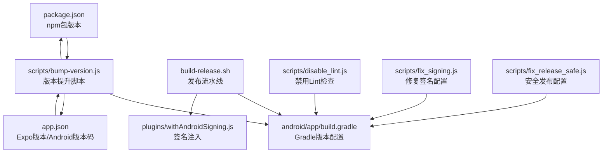
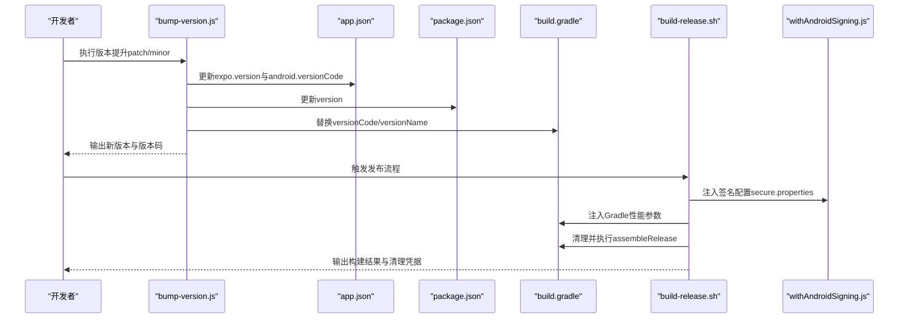
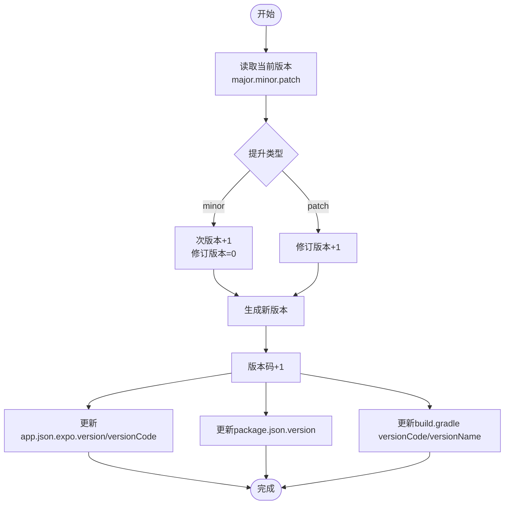
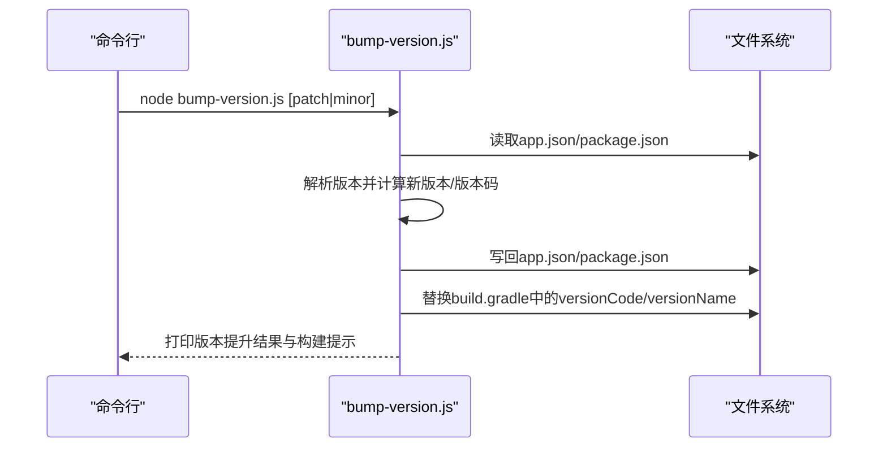
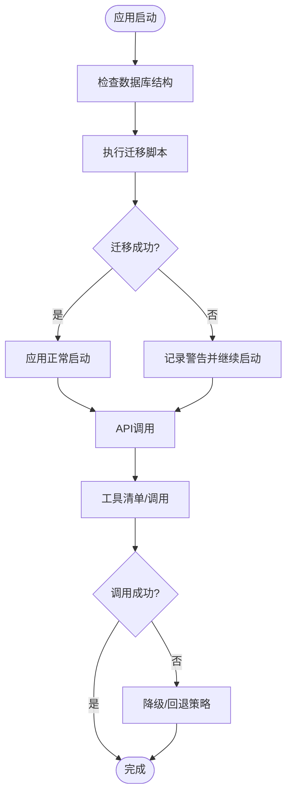
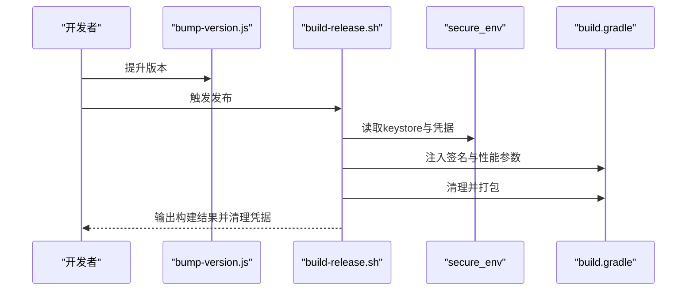
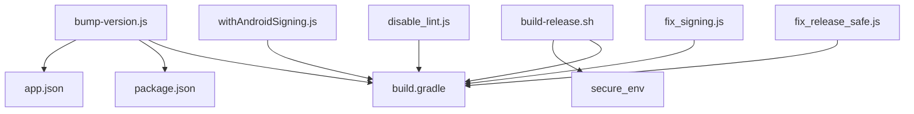

# 版本管理

<cite>
**本文引用的文件**   
- [package.json](file://package.json)
- [app.json](file://app.json)
- [scripts/bump-version.js](file://scripts/bump-version.js)
- [build-release.sh](file://build-release.sh)
- [plugins/withAndroidSigning.js](file://plugins/withAndroidSigning.js)
- [scripts/disable_lint.js](file://scripts/disable_lint.js)
- [scripts/fix_signing.js](file://scripts/fix_signing.js)
- [scripts/fix_release_safe.js](file://scripts/fix_release_safe.js)
- [src/lib/db/migration.ts](file://src/lib/db/migration.ts)
- [src/lib/db/schema.ts](file://src/lib/db/schema.ts)
- [src/services/workbench/StaticServerService.ts](file://src/services/workbench/StaticServerService.ts)
- [src/store/workbench-store.ts](file://src/store/workbench-store.ts)
- [src/lib/logging/Logger.ts](file://src/lib/logging/Logger.ts)
- [src/lib/llm/api-logger.ts](file://src/lib/llm/api-logger.ts)
- [src/lib/llm/providers/openai-compatible.ts](file://src/lib/llm/providers/openai-compatible.ts)
- [docs/artifacts-upgrade-plan.md](file://docs/artifacts-upgrade-plan.md)
- [CHANGELOG.md](file://CHANGELOG.md)
</cite>

## 目录
1. [简介](#简介)
2. [项目结构](#项目结构)
3. [核心组件](#核心组件)
4. [架构总览](#架构总览)
5. [详细组件分析](#详细组件分析)
6. [依赖分析](#依赖分析)
7. [性能考虑](#性能考虑)
8. [故障排查指南](#故障排查指南)
9. [结论](#结论)
10. [附录](#附录)

## 简介
本指南面向Nexara项目的版本管理与发布流程，围绕以下目标展开：
- 明确版本号策略与语义化版本控制实践
- 解释自动版本提升脚本的工作原理与使用方法
- 分析应用版本与API版本的协调机制
- 提供版本兼容性检查与回滚策略
- 解释测试环境与生产环境的版本隔离
- 规范版本发布流程与变更日志维护
- 提供版本迁移指南与向后兼容性保障

## 项目结构
Nexara采用多平台混合开发（React Native + Expo），版本信息主要分布在以下位置：
- 应用版本与Android版本码：app.json（Expo配置）与android/app/build.gradle（Gradle构建配置）
- npm包版本：package.json
- 自动版本提升脚本：scripts/bump-version.js
- 发布流水线：build-release.sh（密钥注入、Gradle优化、打包）
- 插件与构建脚本：plugins/withAndroidSigning.js、scripts/*.js（lint禁用、签名修复、安全配置）

图表来源
- [package.json:1-120](file://package.json#L1-L120)
- [app.json:1-64](file://app.json#L1-L64)
- [scripts/bump-version.js:1-65](file://scripts/bump-version.js#L1-L65)
- [build-release.sh:1-99](file://build-release.sh#L1-L99)
- [plugins/withAndroidSigning.js:18-42](file://plugins/withAndroidSigning.js#L18-L42)
- [scripts/disable_lint.js:1-30](file://scripts/disable_lint.js#L1-L30)
- [scripts/fix_signing.js:1-36](file://scripts/fix_signing.js#L1-L36)
- [scripts/fix_release_safe.js:41-66](file://scripts/fix_release_safe.js#L41-L66)

章节来源
- [package.json:1-120](file://package.json#L1-L120)
- [app.json:1-64](file://app.json#L1-L64)
- [scripts/bump-version.js:1-65](file://scripts/bump-version.js#L1-L65)
- [build-release.sh:1-99](file://build-release.sh#L1-L99)

## 核心组件
- 版本号策略与语义化版本控制
  - 应用版本：由app.json.expo.version与package.json.version共同驱动，当前版本为1.2.75
  - Android版本码：app.json.expo.android.versionCode，随版本提升递增
  - 版本提升类型：仅支持补丁（patch）与次版本（minor）两种模式
- 自动版本提升脚本
  - 作用：读取当前版本，按类型递增，并同步更新app.json、package.json与Gradle配置
  - 输出：打印新旧版本与版本码，提示后续构建命令
- 发布流水线
  - 作用：自动化注入签名密钥、优化Gradle参数、执行打包与清理
  - 安全：通过secure_env目录存放keystore与凭据，构建后清理注入内容
- 数据库迁移与向后兼容
  - 作用：在启动阶段对数据库表结构进行增量迁移，确保新旧版本兼容
  - 策略：逐版本修复缺失字段与新增表，失败不中断应用启动

章节来源
- [package.json:1-120](file://package.json#L1-L120)
- [app.json:1-64](file://app.json#L1-L64)
- [scripts/bump-version.js:1-65](file://scripts/bump-version.js#L1-L65)
- [build-release.sh:1-99](file://build-release.sh#L1-L99)
- [src/lib/db/migration.ts:72-323](file://src/lib/db/migration.ts#L72-L323)

## 架构总览
下图展示版本管理相关组件之间的交互关系与数据流。

图表来源
- [scripts/bump-version.js:1-65](file://scripts/bump-version.js#L1-L65)
- [app.json:1-64](file://app.json#L1-L64)
- [package.json:1-120](file://package.json#L1-L120)
- [build-release.sh:1-99](file://build-release.sh#L1-L99)
- [plugins/withAndroidSigning.js:18-42](file://plugins/withAndroidSigning.js#L18-L42)

## 详细组件分析

### 版本号策略与语义化版本控制
- 当前版本：1.2.75
- 版本提升范围：仅支持patch与minor两类，不支持major
- 版本码规则：
  - minor提升：次版本+1，修订版本清零
  - patch提升：修订版本+1
- Android版本码：每次版本提升递增1，确保应用商店识别为新版本

图表来源
- [scripts/bump-version.js:11-30](file://scripts/bump-version.js#L11-L30)
- [scripts/bump-version.js:36-56](file://scripts/bump-version.js#L36-L56)

章节来源
- [scripts/bump-version.js:1-65](file://scripts/bump-version.js#L1-L65)
- [app.json:1-64](file://app.json#L1-L64)
- [package.json:1-120](file://package.json#L1-L120)

### 自动版本提升脚本工作原理与使用
- 输入：process.argv[2]为“patch”或“minor”
- 处理：
  - 解析当前版本并计算新版本
  - 递增版本码
  - 同步更新app.json、package.json与build.gradle
- 输出：控制台打印新旧版本与版本码，并提示后续构建命令

图表来源
- [scripts/bump-version.js:11-65](file://scripts/bump-version.js#L11-L65)

章节来源
- [scripts/bump-version.js:1-65](file://scripts/bump-version.js#L1-L65)

### 应用版本与API版本的协调机制
- 应用版本：由app.json.expo.version与package.json.version统一管理
- API版本：项目中存在API版本相关设计（如工件API的版本查询与回滚接口），体现API版本化管理思路
- 协调策略：
  - 应用侧版本与API侧版本解耦，通过接口兼容性保障实现平滑升级
  - 在文档中明确API版本与应用版本的对应关系，便于客户端适配

章节来源
- [docs/artifacts-upgrade-plan.md:1622-1654](file://docs/artifacts-upgrade-plan.md#L1622-L1654)

### 版本兼容性检查与回滚策略
- 数据库迁移：
  - 启动阶段执行多轮迁移，修复缺失字段与新增表
  - 对于失败场景，不中断应用启动，避免破坏性回滚
- API兼容性：
  - 提供工具清单与调用接口，确保服务端变更不影响客户端调用
  - 对非JSON响应等异常进行容错处理，返回明确错误信息
- 回滚策略：
  - 数据库层面：通过迁移脚本逐步修复，必要时可基于版本号回退到上一稳定版本
  - API层面：通过工具清单回退与降级方案，保障服务可用性

图表来源
- [src/lib/db/migration.ts:72-323](file://src/lib/db/migration.ts#L72-L323)
- [src/lib/llm/providers/openai-compatible.ts:523-557](file://src/lib/llm/providers/openai-compatible.ts#L523-L557)

章节来源
- [src/lib/db/migration.ts:72-323](file://src/lib/db/migration.ts#L72-L323)
- [src/lib/llm/providers/openai-compatible.ts:523-557](file://src/lib/llm/providers/openai-compatible.ts#L523-L557)

### 测试环境与生产环境的版本隔离
- 版本隔离方式：
  - 通过不同的构建脚本与插件配置实现环境差异化
  - 生产发布脚本在构建完成后清理注入的凭据，避免泄露
- 静态服务器与本地调试：
  - 本地静态服务器服务端口固定，便于测试环境访问
  - 通过状态存储与网络信息获取本地IP，支持跨设备联调

章节来源
- [build-release.sh:12-13](file://build-release.sh#L12-L13)
- [build-release.sh:94-99](file://build-release.sh#L94-L99)
- [src/services/workbench/StaticServerService.ts:18-230](file://src/services/workbench/StaticServerService.ts#L18-L230)
- [src/store/workbench-store.ts:1-56](file://src/store/workbench-store.ts#L1-L56)

### 版本发布流程与变更日志维护规范
- 发布流程：
  - 版本提升：执行版本提升脚本，更新app.json、package.json与build.gradle
  - 签名注入：通过secure_env注入keystore与凭据，构建完成后清理
  - Gradle优化：根据硬件资源调整JVM堆大小与并发线程数
  - 打包与清理：执行assembleRelease并清理注入内容
- 变更日志维护：
  - 采用集中式变更日志文件，记录每个版本的重要变更
  - 建议在版本提升后补充对应版本条目，确保可追溯性

图表来源
- [scripts/bump-version.js:1-65](file://scripts/bump-version.js#L1-L65)
- [build-release.sh:15-99](file://build-release.sh#L15-L99)

章节来源
- [build-release.sh:1-99](file://build-release.sh#L1-L99)
- [CHANGELOG.md:1-69](file://CHANGELOG.md#L1-L69)

### 版本迁移指南与向后兼容性保障
- 迁移指南要点：
  - 数据库迁移：按版本顺序执行，确保字段与表结构一致
  - API迁移：提供工具清单与调用接口，避免破坏性变更
  - 日志与调试：通过日志系统记录迁移过程与异常，便于回溯
- 向后兼容性保障：
  - 保留现有API接口，逐步废弃旧接口
  - 提供迁移指南与测试覆盖，降低升级风险

章节来源
- [src/lib/db/migration.ts:72-323](file://src/lib/db/migration.ts#L72-L323)
- [src/lib/logging/Logger.ts:1-280](file://src/lib/logging/Logger.ts#L1-L280)
- [docs/artifacts-upgrade-plan.md:1622-1654](file://docs/artifacts-upgrade-plan.md#L1622-L1654)

## 依赖分析
- 版本提升脚本依赖：
  - 文件系统读写：更新app.json、package.json与build.gradle
  - 命令行参数解析：区分patch与minor
- 发布流水线依赖：
  - secure_env目录：存放keystore与凭据
  - Gradle配置：注入签名与性能参数
  - 插件：签名注入与构建优化

图表来源
- [scripts/bump-version.js:1-65](file://scripts/bump-version.js#L1-L65)
- [build-release.sh:1-99](file://build-release.sh#L1-L99)
- [plugins/withAndroidSigning.js:18-42](file://plugins/withAndroidSigning.js#L18-L42)
- [scripts/disable_lint.js:1-30](file://scripts/disable_lint.js#L1-L30)
- [scripts/fix_signing.js:1-36](file://scripts/fix_signing.js#L1-L36)
- [scripts/fix_release_safe.js:41-66](file://scripts/fix_release_safe.js#L41-L66)

章节来源
- [scripts/bump-version.js:1-65](file://scripts/bump-version.js#L1-L65)
- [build-release.sh:1-99](file://build-release.sh#L1-L99)

## 性能考虑
- Gradle性能优化：
  - 根据系统内存与CPU核数动态调整JVM最大堆与并发线程数
  - 清理构建缓存，减少重复编译时间
- 版本提升与发布：
  - 版本提升脚本仅修改必要字段，避免不必要的文件改动
  - 发布脚本在完成后清理注入内容，降低安全风险

## 故障排查指南
- 版本提升失败
  - 检查脚本参数是否为“patch”或“minor”
  - 确认app.json与package.json路径是否存在
- 发布失败
  - 检查secure_env目录是否包含keystore与凭据文件
  - 查看Gradle注入的签名配置是否正确
- 数据库迁移失败
  - 查看迁移日志，确认缺失字段或表是否已修复
  - 如失败不中断，可在下次启动时重试
- API调用异常
  - 检查响应内容类型与错误信息，必要时启用降级策略

章节来源
- [scripts/bump-version.js:13-16](file://scripts/bump-version.js#L13-L16)
- [build-release.sh:15-31](file://build-release.sh#L15-L31)
- [src/lib/db/migration.ts:285-289](file://src/lib/db/migration.ts#L285-L289)
- [src/lib/llm/providers/openai-compatible.ts:523-557](file://src/lib/llm/providers/openai-compatible.ts#L523-L557)

## 结论
Nexara的版本管理以自动化脚本为核心，结合Gradle配置与发布流水线，实现了从版本提升到打包发布的闭环。通过数据库迁移与API兼容性设计，项目在版本演进过程中兼顾稳定性与可维护性。建议在后续实践中进一步完善API版本标注与客户端适配策略，持续优化发布流程与变更日志维护规范。

## 附录
- 版本号策略速查
  - 当前版本：1.2.75
  - 支持提升类型：patch、minor
  - Android版本码：随版本提升递增
- 发布流程清单
  - 版本提升：执行版本提升脚本
  - 签名注入：准备secure_env目录
  - Gradle优化：根据硬件资源调整参数
  - 打包：执行assembleRelease
  - 清理：移除注入内容与临时文件