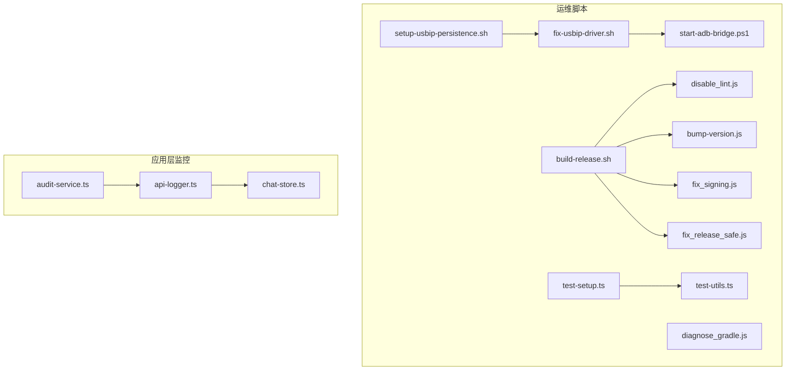
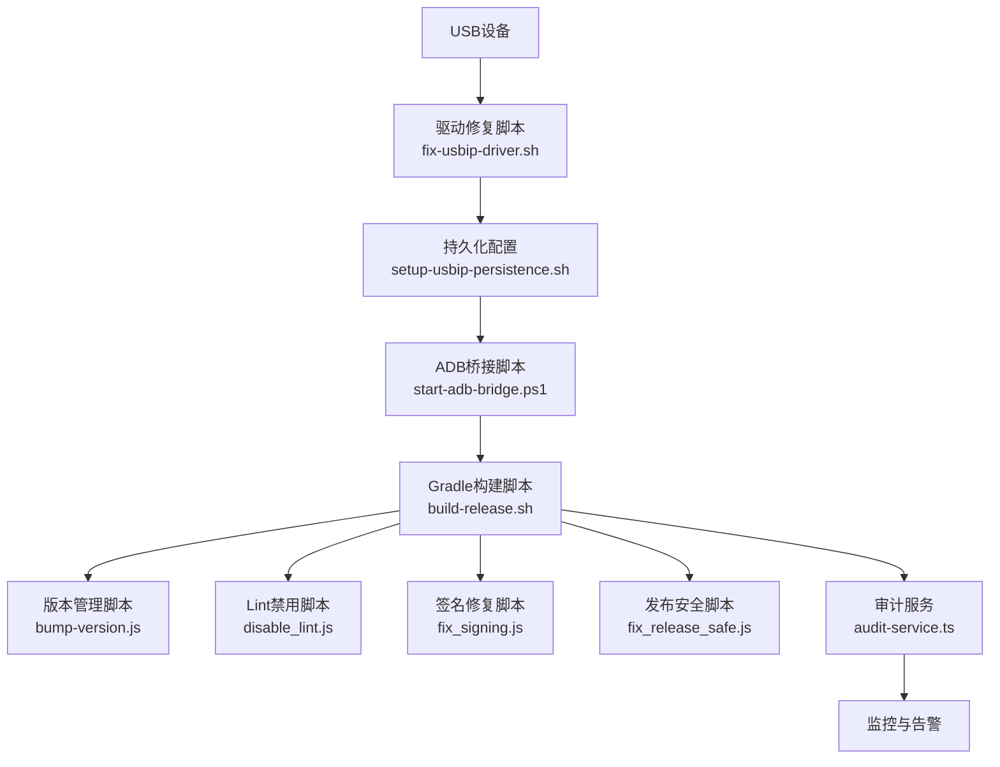
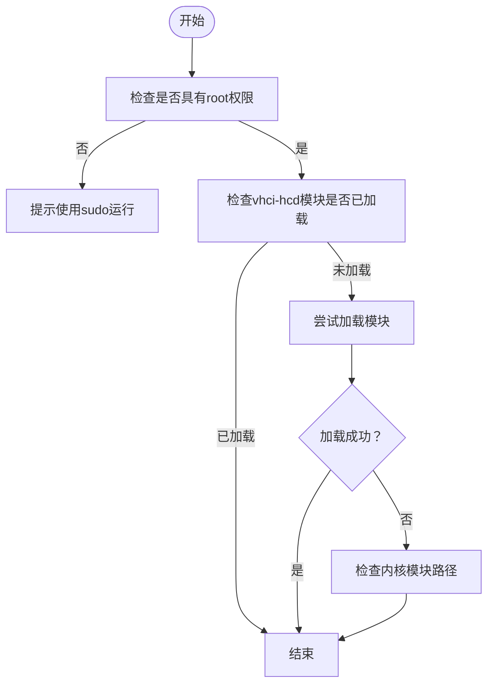
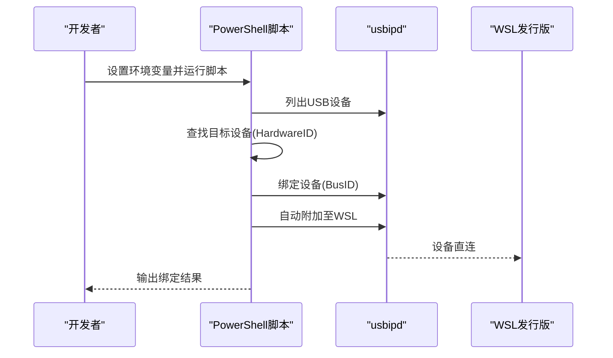
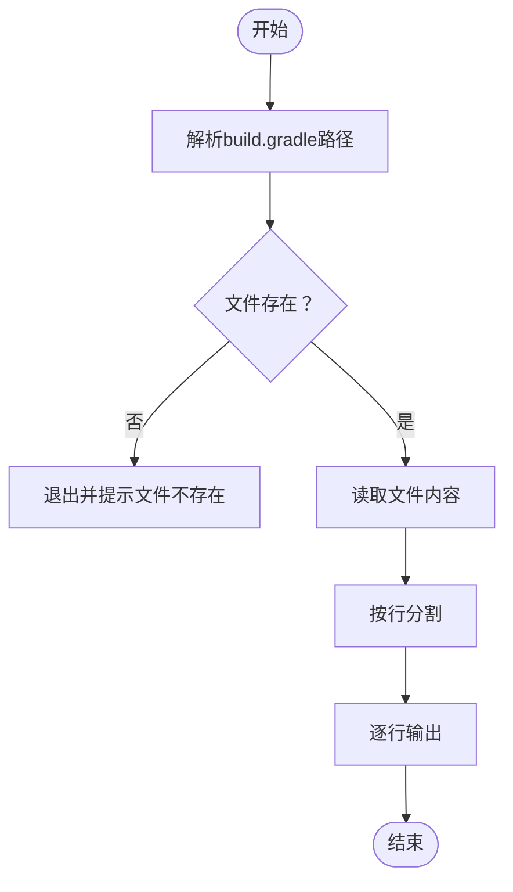
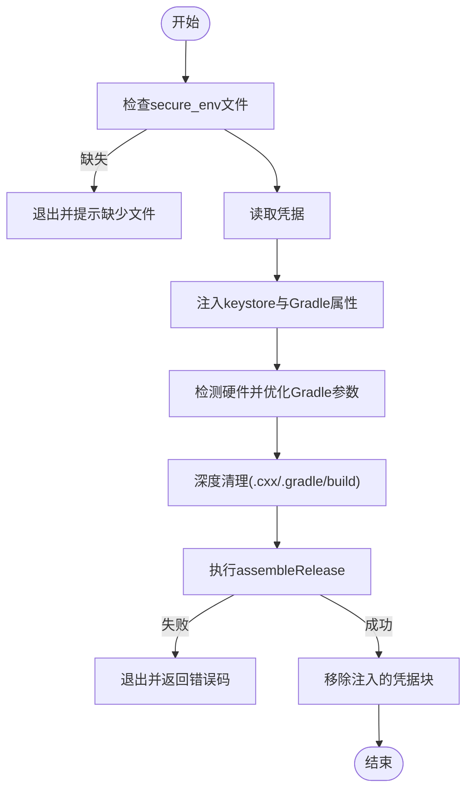
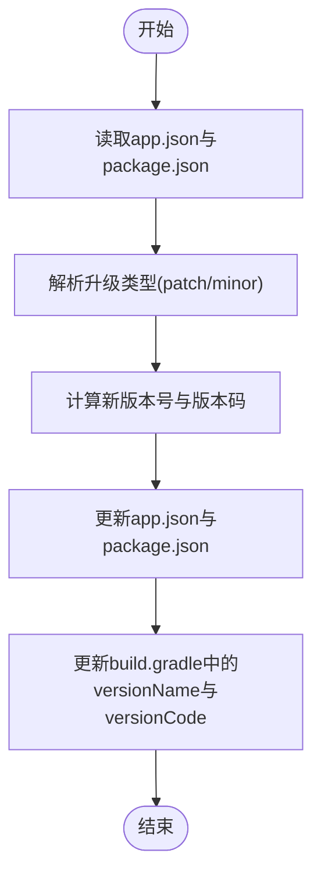
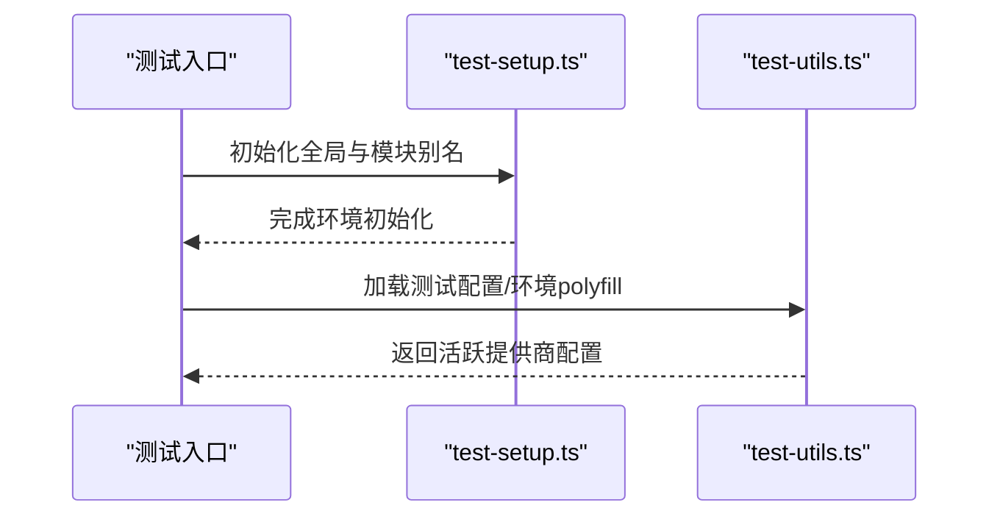
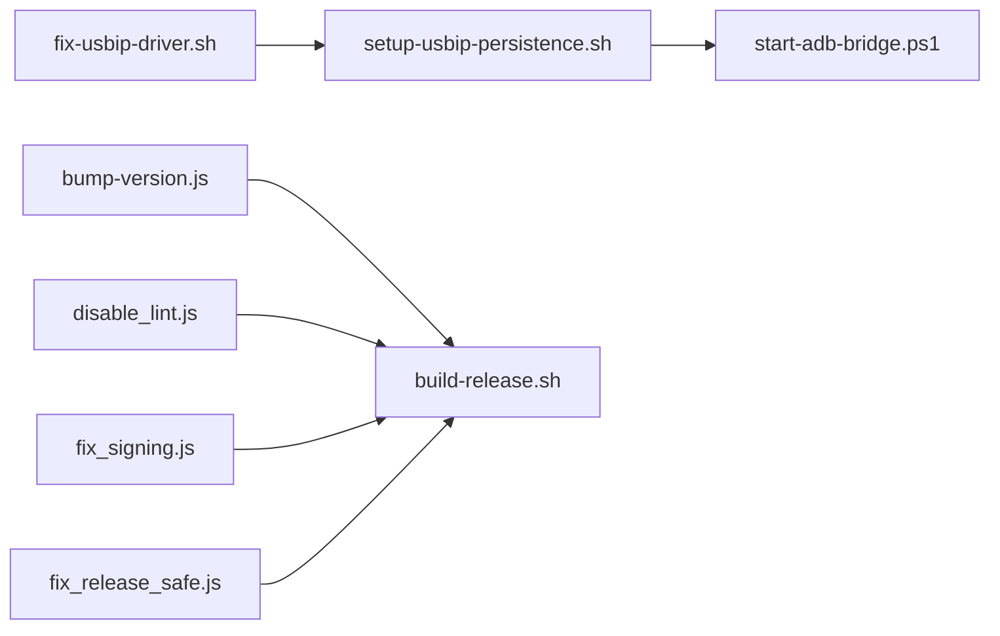

# 运维自动化

<cite>
**本文引用的文件**   
- [scripts/setup-usbip-persistence.sh](file://scripts/setup-usbip-persistence.sh)
- [scripts/fix-usbip-driver.sh](file://scripts/fix-usbip-driver.sh)
- [scripts/start-adb-bridge.ps1](file://scripts/start-adb-bridge.ps1)
- [scripts/diagnose_gradle.js](file://scripts/diagnose_gradle.js)
- [scripts/build-release.sh](file://build-release.sh)
- [scripts/disable_lint.js](file://scripts/disable_lint.js)
- [scripts/bump-version.js](file://scripts/bump-version.js)
- [scripts/fix_signing.js](file://scripts/fix_signing.js)
- [scripts/fix_release_safe.js](file://scripts/fix_release_safe.js)
- [scripts/test-setup.ts](file://scripts/test-setup.ts)
- [scripts/test-utils.ts](file://scripts/test-utils.ts)
- [src/lib/services/audit-service.ts](file://src/lib/services/audit-service.ts)
- [src/lib/llm/api-logger.ts](file://src/lib/llm/api-logger.ts)
- [src/store/chat-store.ts](file://src/store/chat-store.ts)
</cite>

## 目录
1. [简介](#简介)
2. [项目结构](#项目结构)
3. [核心组件](#核心组件)
4. [架构总览](#架构总览)
5. [详细组件分析](#详细组件分析)
6. [依赖关系分析](#依赖关系分析)
7. [性能考量](#性能考量)
8. [故障排查指南](#故障排查指南)
9. [结论](#结论)
10. [附录](#附录)

## 简介
本文件面向Nexara项目的运维与开发团队，系统化梳理并说明以下运维自动化主题：
- 维护脚本功能与使用方法：覆盖WSL/Windows下的USB设备持久化配置、驱动修复与ADB桥接流程。
- 开发环境诊断工具：Gradle问题排查与ADB桥接配置的快速定位。
- 跨平台运维脚本差异与适配策略：针对Linux Bash与Windows PowerShell的差异进行说明。
- 运维任务自动化最佳实践：定时任务与健康检查建议。
- 故障自动恢复机制与应急处理脚本：结合应用内部审计与日志能力给出可落地方案。
- 运维监控与告警系统集成：基于现有审计与日志模块提出对接思路。

## 项目结构
围绕运维自动化，仓库中与之直接相关的脚本与工具主要位于scripts目录；同时，应用层的日志与审计服务为自动化监控与告警提供了数据基础。

图表来源
- [scripts/setup-usbip-persistence.sh:1-30](file://scripts/setup-usbip-persistence.sh#L1-L30)
- [scripts/fix-usbip-driver.sh:1-28](file://scripts/fix-usbip-driver.sh#L1-L28)
- [scripts/start-adb-bridge.ps1:1-41](file://scripts/start-adb-bridge.ps1#L1-L41)
- [scripts/diagnose_gradle.js:1-11](file://scripts/diagnose_gradle.js#L1-L11)
- [build-release.sh:1-99](file://build-release.sh#L1-L99)
- [scripts/disable_lint.js:1-31](file://scripts/disable_lint.js#L1-L31)
- [scripts/bump-version.js:1-65](file://scripts/bump-version.js#L1-L65)
- [scripts/fix_signing.js:1-118](file://scripts/fix_signing.js#L1-L118)
- [scripts/fix_release_safe.js:1-67](file://scripts/fix_release_safe.js#L1-L67)
- [scripts/test-setup.ts:1-13](file://scripts/test-setup.ts#L1-L13)
- [scripts/test-utils.ts:1-48](file://scripts/test-utils.ts#L1-L48)
- [src/lib/services/audit-service.ts:149-202](file://src/lib/services/audit-service.ts#L149-L202)
- [src/lib/llm/api-logger.ts:1-59](file://src/lib/llm/api-logger.ts#L1-L59)
- [src/store/chat-store.ts:1187-1209](file://src/store/chat-store.ts#L1187-L1209)

章节来源
- [scripts/setup-usbip-persistence.sh:1-30](file://scripts/setup-usbip-persistence.sh#L1-L30)
- [scripts/fix-usbip-driver.sh:1-28](file://scripts/fix-usbip-driver.sh#L1-L28)
- [scripts/start-adb-bridge.ps1:1-41](file://scripts/start-adb-bridge.ps1#L1-L41)
- [scripts/diagnose_gradle.js:1-11](file://scripts/diagnose_gradle.js#L1-L11)
- [build-release.sh:1-99](file://build-release.sh#L1-L99)
- [scripts/disable_lint.js:1-31](file://scripts/disable_lint.js#L1-L31)
- [scripts/bump-version.js:1-65](file://scripts/bump-version.js#L1-L65)
- [scripts/fix_signing.js:1-118](file://scripts/fix_signing.js#L1-L118)
- [scripts/fix_release_safe.js:1-67](file://scripts/fix_release_safe.js#L1-L67)
- [scripts/test-setup.ts:1-13](file://scripts/test-setup.ts#L1-L13)
- [scripts/test-utils.ts:1-48](file://scripts/test-utils.ts#L1-L48)
- [src/lib/services/audit-service.ts:149-202](file://src/lib/services/audit-service.ts#L149-L202)
- [src/lib/llm/api-logger.ts:1-59](file://src/lib/llm/api-logger.ts#L1-L59)
- [src/store/chat-store.ts:1187-1209](file://src/store/chat-store.ts#L1187-L1209)

## 核心组件
- USB设备与WSL桥接链路：通过驱动修复与持久化配置保障USB设备在WSL2中的可用性；通过PowerShell脚本完成设备绑定与自动附加至WSL发行版。
- Gradle构建与发布流水线：提供安全注入密钥库、内存与并发优化、清理与构建、以及构建后清理等步骤，确保发布质量与稳定性。
- 开发诊断工具：用于快速查看Gradle配置、禁用Lint检查、版本号升级与签名配置修复，辅助开发与CI环境稳定。
- 应用层审计与日志：提供审计统计、错误率计算与日志清理能力，为运维监控与告警提供数据支撑。

章节来源
- [scripts/fix-usbip-driver.sh:1-28](file://scripts/fix-usbip-driver.sh#L1-L28)
- [scripts/setup-usbip-persistence.sh:1-30](file://scripts/setup-usbip-persistence.sh#L1-L30)
- [scripts/start-adb-bridge.ps1:1-41](file://scripts/start-adb-bridge.ps1#L1-L41)
- [build-release.sh:1-99](file://build-release.sh#L1-L99)
- [scripts/diagnose_gradle.js:1-11](file://scripts/diagnose_gradle.js#L1-L11)
- [scripts/disable_lint.js:1-31](file://scripts/disable_lint.js#L1-L31)
- [scripts/bump-version.js:1-65](file://scripts/bump-version.js#L1-L65)
- [scripts/fix_signing.js:1-118](file://scripts/fix_signing.js#L1-L118)
- [scripts/fix_release_safe.js:1-67](file://scripts/fix_release_safe.js#L1-L67)
- [src/lib/services/audit-service.ts:149-202](file://src/lib/services/audit-service.ts#L149-L202)
- [src/lib/llm/api-logger.ts:1-59](file://src/lib/llm/api-logger.ts#L1-L59)

## 架构总览
下图展示了从设备到构建再到监控的整体运维自动化链路：

图表来源
- [scripts/fix-usbip-driver.sh:1-28](file://scripts/fix-usbip-driver.sh#L1-L28)
- [scripts/setup-usbip-persistence.sh:1-30](file://scripts/setup-usbip-persistence.sh#L1-L30)
- [scripts/start-adb-bridge.ps1:1-41](file://scripts/start-adb-bridge.ps1#L1-L41)
- [build-release.sh:1-99](file://build-release.sh#L1-L99)
- [scripts/bump-version.js:1-65](file://scripts/bump-version.js#L1-L65)
- [scripts/disable_lint.js:1-31](file://scripts/disable_lint.js#L1-L31)
- [scripts/fix_signing.js:1-118](file://scripts/fix_signing.js#L1-L118)
- [scripts/fix_release_safe.js:1-67](file://scripts/fix_release_safe.js#L1-L67)
- [src/lib/services/audit-service.ts:149-202](file://src/lib/services/audit-service.ts#L149-L202)

## 详细组件分析

### USB设备持久化与驱动修复
- 功能概述
  - 驱动修复：检查并加载vhci-hcd模块，解决WSL2下USB设备无法挂载的问题。
  - 持久化：将vhci-hcd模块写入系统模块加载配置，实现开机自启。
- 使用方法
  - 驱动修复：在Linux环境下以管理员权限运行脚本，若提示需要sudo密码则输入后等待加载完成。
  - 持久化：以root权限运行脚本，写入模块配置文件，重启后生效。
- 注意事项
  - 需要具备root权限；若内核模块缺失，需确认WSL内核版本与模块包匹配。
  - 持久化配置文件路径为系统级，修改前请备份原配置。

图表来源
- [scripts/fix-usbip-driver.sh:1-28](file://scripts/fix-usbip-driver.sh#L1-L28)
- [scripts/setup-usbip-persistence.sh:1-30](file://scripts/setup-usbip-persistence.sh#L1-L30)

章节来源
- [scripts/fix-usbip-driver.sh:1-28](file://scripts/fix-usbip-driver.sh#L1-L28)
- [scripts/setup-usbip-persistence.sh:1-30](file://scripts/setup-usbip-persistence.sh#L1-L30)

### ADB桥接配置（Windows PowerShell）
- 功能概述
  - 通过usbipd命令扫描设备、绑定端口并自动附加至指定WSL发行版，实现设备直连。
- 使用方法
  - 设置环境变量NEXARA_DEVICE_NAME与NEXARA_HARDWARE_ID后运行脚本。
  - 保持窗口常开以维持连接。
- 注意事项
  - 必须启用设备的开发者选项与USB调试。
  - 如设备未找到，检查硬件ID与设备状态。

图表来源
- [scripts/start-adb-bridge.ps1:1-41](file://scripts/start-adb-bridge.ps1#L1-L41)

章节来源
- [scripts/start-adb-bridge.ps1:1-41](file://scripts/start-adb-bridge.ps1#L1-L41)

### Gradle问题排查与诊断
- 功能概述
  - 读取Android子工程的build.gradle内容并逐行输出，便于快速定位配置问题。
- 使用方法
  - 在仓库根目录运行脚本，观察输出行号与上下文，结合Gradle报错定位问题。
- 注意事项
  - 若文件不存在，需确认路径与工程结构是否正确。

图表来源
- [scripts/diagnose_gradle.js:1-11](file://scripts/diagnose_gradle.js#L1-L11)

章节来源
- [scripts/diagnose_gradle.js:1-11](file://scripts/diagnose_gradle.js#L1-L11)

### 发布流水线与构建优化
- 功能概述
  - 安全注入：从secure_env读取密钥库与凭据，注入到Gradle属性中。
  - 性能优化：根据系统内存与CPU核心数动态设置Gradle JVM堆大小与并发工作进程数。
  - 清理与构建：执行深度清理并发起release构建。
  - 清理凭据：构建完成后移除注入的敏感信息。
- 使用方法
  - 准备secure_env目录下的keystore与secure.properties文件。
  - 执行脚本，等待构建完成。
- 注意事项
  - 该脚本会删除本地缓存目录，构建时间较长。
  - 失败时会保留注入的凭据块以便排障，建议在CI中谨慎使用。

图表来源
- [build-release.sh:1-99](file://build-release.sh#L1-L99)

章节来源
- [build-release.sh:1-99](file://build-release.sh#L1-L99)

### 版本管理与签名修复
- 版本升级
  - 支持patch与minor两种升级类型，同步更新app.json、package.json与Android构建文件中的版本号与版本码。
- 签名修复
  - 修复release构建中签名配置的引用与定义，确保发布包签名正确且可被验证。
- 发布安全
  - 将release构建配置为关闭混淆与资源收缩，便于问题排查与回滚。

图表来源
- [scripts/bump-version.js:1-65](file://scripts/bump-version.js#L1-L65)

章节来源
- [scripts/bump-version.js:1-65](file://scripts/bump-version.js#L1-L65)
- [scripts/fix_signing.js:1-118](file://scripts/fix_signing.js#L1-L118)
- [scripts/fix_release_safe.js:1-67](file://scripts/fix_release_safe.js#L1-L67)

### Lint禁用与测试环境准备
- Lint禁用
  - 在Android构建配置中插入release检查禁用逻辑，避免因Lint规则导致构建失败。
- 测试环境准备
  - 注册模块别名与全局常量，加载测试配置与环境polyfill，选择活跃的LLM提供商。

图表来源
- [scripts/test-setup.ts:1-13](file://scripts/test-setup.ts#L1-L13)
- [scripts/test-utils.ts:1-48](file://scripts/test-utils.ts#L1-L48)

章节来源
- [scripts/disable_lint.js:1-31](file://scripts/disable_lint.js#L1-L31)
- [scripts/test-setup.ts:1-13](file://scripts/test-setup.ts#L1-L13)
- [scripts/test-utils.ts:1-48](file://scripts/test-utils.ts#L1-L48)

## 依赖关系分析
- 脚本间耦合
  - USB链路：fix-usbip-driver.sh依赖setup-usbip-persistence.sh实现持久化；二者共同为start-adb-bridge.ps1提供稳定的底层设备支持。
  - 构建链路：build-release.sh串联bump-version.js、disable_lint.js、fix_signing.js与fix_release_safe.js，形成完整的发布流水线。
- 外部依赖
  - Windows侧：usbipd命令行工具、WSL发行版。
  - Linux侧：内核模块vhci-hcd、模块加载配置文件。
  - Android侧：Gradle、Android SDK与签名配置。

图表来源
- [scripts/fix-usbip-driver.sh:1-28](file://scripts/fix-usbip-driver.sh#L1-L28)
- [scripts/setup-usbip-persistence.sh:1-30](file://scripts/setup-usbip-persistence.sh#L1-L30)
- [scripts/start-adb-bridge.ps1:1-41](file://scripts/start-adb-bridge.ps1#L1-L41)
- [scripts/bump-version.js:1-65](file://scripts/bump-version.js#L1-L65)
- [scripts/disable_lint.js:1-31](file://scripts/disable_lint.js#L1-L31)
- [scripts/fix_signing.js:1-118](file://scripts/fix_signing.js#L1-L118)
- [scripts/fix_release_safe.js:1-67](file://scripts/fix_release_safe.js#L1-L67)
- [build-release.sh:1-99](file://build-release.sh#L1-L99)

章节来源
- [scripts/fix-usbip-driver.sh:1-28](file://scripts/fix-usbip-driver.sh#L1-L28)
- [scripts/setup-usbip-persistence.sh:1-30](file://scripts/setup-usbip-persistence.sh#L1-L30)
- [scripts/start-adb-bridge.ps1:1-41](file://scripts/start-adb-bridge.ps1#L1-L41)
- [scripts/bump-version.js:1-65](file://scripts/bump-version.js#L1-L65)
- [scripts/disable_lint.js:1-31](file://scripts/disable_lint.js#L1-L31)
- [scripts/fix_signing.js:1-118](file://scripts/fix_signing.js#L1-L118)
- [scripts/fix_release_safe.js:1-67](file://scripts/fix_release_safe.js#L1-L67)
- [build-release.sh:1-99](file://build-release.sh#L1-L99)

## 性能考量
- Gradle构建优化
  - 根据内存与CPU自动调整JVM堆大小与并发工作进程数，减少构建时间并降低资源争用。
  - 深度清理可避免缓存污染，但会增加首次构建耗时，建议在CI中结合缓存策略使用。
- 日志与审计
  - 审计服务提供24小时统计与错误率计算，有助于识别构建与运行阶段的异常趋势。
  - API日志记录请求与响应，便于定位接口问题。

章节来源
- [build-release.sh:41-55](file://build-release.sh#L41-L55)
- [src/lib/services/audit-service.ts:149-185](file://src/lib/services/audit-service.ts#L149-L185)
- [src/lib/llm/api-logger.ts:23-43](file://src/lib/llm/api-logger.ts#L23-L43)

## 故障排查指南
- USB设备无法挂载
  - 先运行驱动修复脚本，确认模块已加载；如仍失败，检查内核模块路径与sudo权限。
  - 运行持久化脚本以确保下次启动自动加载。
- ADB桥接失败
  - 确认设备已启用开发者选项与USB调试；检查硬件ID与设备名称环境变量。
  - 保持桥接窗口常开，避免自动断开。
- Gradle构建失败
  - 使用Gradle诊断脚本查看配置行号；必要时禁用Lint或修复签名配置。
  - 若为发布包问题，使用发布安全脚本重置release构建配置。
- 版本升级异常
  - 检查app.json、package.json与build.gradle中的版本字段一致性，确保升级脚本正确执行。

章节来源
- [scripts/fix-usbip-driver.sh:1-28](file://scripts/fix-usbip-driver.sh#L1-L28)
- [scripts/setup-usbip-persistence.sh:1-30](file://scripts/setup-usbip-persistence.sh#L1-L30)
- [scripts/start-adb-bridge.ps1:1-41](file://scripts/start-adb-bridge.ps1#L1-L41)
- [scripts/diagnose_gradle.js:1-11](file://scripts/diagnose_gradle.js#L1-L11)
- [scripts/disable_lint.js:1-31](file://scripts/disable_lint.js#L1-L31)
- [scripts/fix_signing.js:1-118](file://scripts/fix_signing.js#L1-L118)
- [scripts/fix_release_safe.js:1-67](file://scripts/fix_release_safe.js#L1-L67)
- [scripts/bump-version.js:1-65](file://scripts/bump-version.js#L1-L65)

## 结论
本文件系统化梳理了Nexara项目的运维自动化能力，覆盖USB设备桥接、Gradle构建与发布、开发诊断、版本管理与签名修复、以及应用层审计与日志。通过脚本化的流程与清晰的依赖关系，团队可在不同平台上高效地完成日常运维与发布任务，并借助审计与日志能力持续改进系统稳定性与可观测性。

## 附录
- 跨平台适配策略
  - Linux：优先使用Bash脚本，注意权限与内核模块路径；必要时通过systemd或模块加载配置实现开机自启。
  - Windows：使用PowerShell脚本封装命令行工具调用，统一环境变量与输出格式，避免编码问题。
- 运维任务自动化最佳实践
  - 定时任务：将USB驱动检查与ADB桥接作为周期性任务，结合健康检查与告警联动。
  - 健康检查：基于审计服务统计错误率与总量，设定阈值触发告警。
  - 故障自动恢复：在构建失败时自动回滚签名配置或临时禁用Lint，缩短恢复时间。
- 应急处理脚本
  - 提供一键修复与回滚脚本，结合日志与审计数据快速定位问题根因。