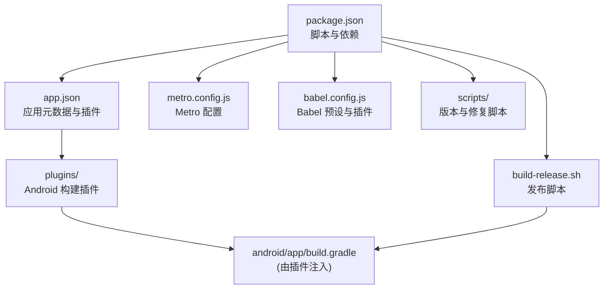
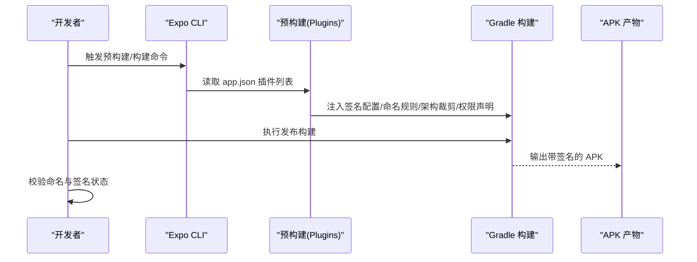
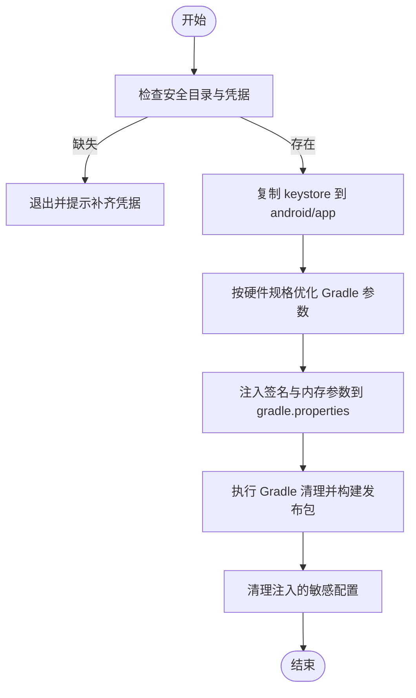
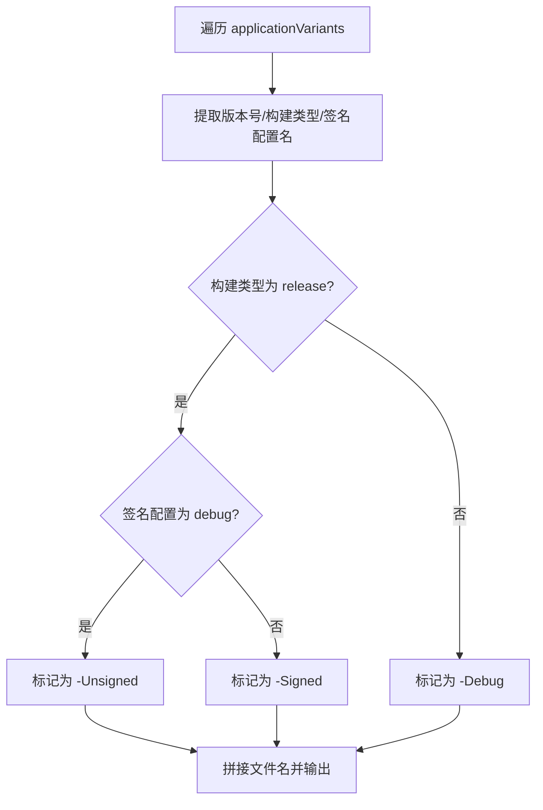
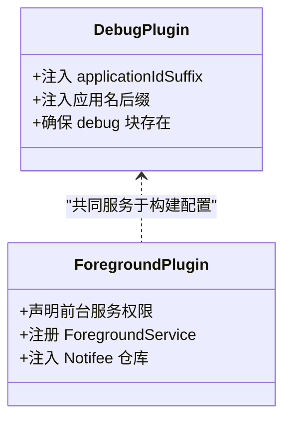
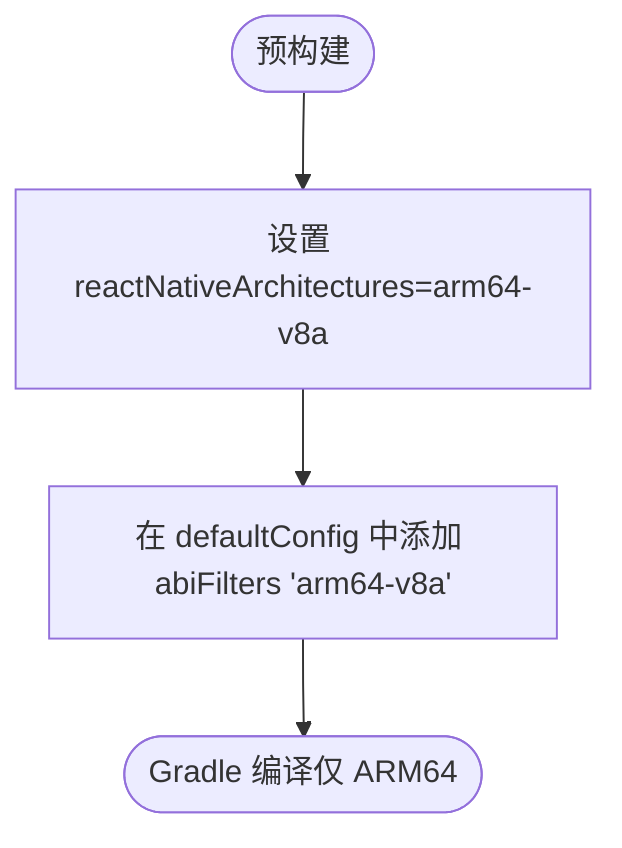
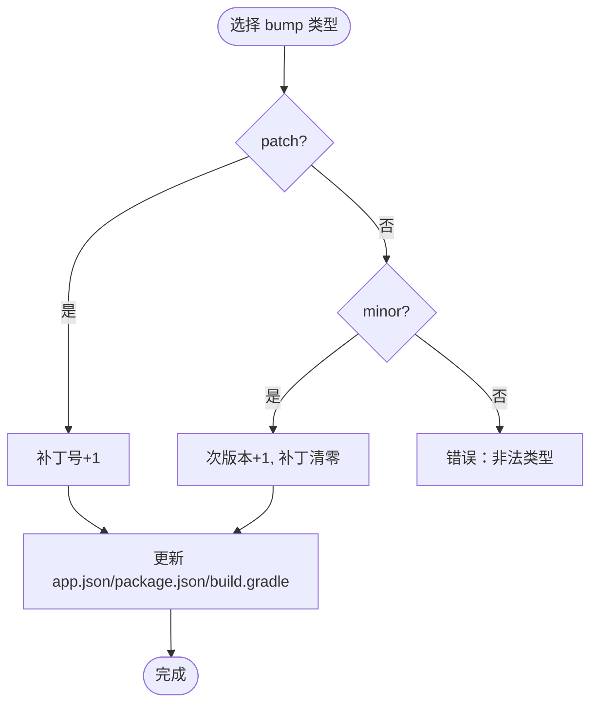
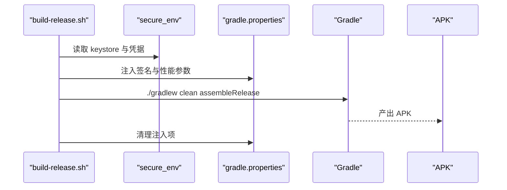
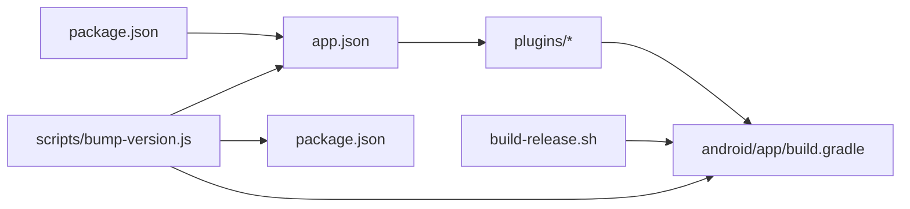

# 部署与运维

<cite>
**本文引用的文件**
- [package.json](file://package.json)
- [app.json](file://app.json)
- [build-release.sh](file://build-release.sh)
- [metro.config.js](file://metro.config.js)
- [babel.config.js](file://babel.config.js)
- [plugins/withAndroidSigning.js](file://plugins/withAndroidSigning.js)
- [plugins/withCustomApkName.js](file://plugins/withCustomApkName.js)
- [plugins/withAndroidDebugConfig.js](file://plugins/withAndroidDebugConfig.js)
- [plugins/withArm64Only.js](file://plugins/withArm64Only.js)
- [plugins/withForegroundService.js](file://plugins/withForegroundService.js)
- [scripts/bump-version.js](file://scripts/bump-version.js)
- [scripts/fix_signing.js](file://scripts/fix_signing.js)
- [scripts/fix_apk_name.js](file://scripts/fix_apk_name.js)
- [README.md](file://README.md)
</cite>

## 目录
1. [简介](#简介)
2. [项目结构](#项目结构)
3. [核心组件](#核心组件)
4. [架构总览](#架构总览)
5. [详细组件分析](#详细组件分析)
6. [依赖关系分析](#依赖关系分析)
7. [性能考虑](#性能考虑)
8. [故障排查指南](#故障排查指南)
9. [结论](#结论)
10. [附录](#附录)

## 简介
本文件面向 Nexara 项目的部署与运维团队，系统化阐述构建配置与发布流程（Android APK 构建、签名配置与发布渠道管理）、生产环境部署策略（服务器配置、域名与 SSL 证书管理）、性能监控与日志收集机制（崩溃报告、性能指标与用户行为分析）、版本管理与热更新策略、运维自动化脚本与 CI/CD 流水线建议，以及故障恢复与应急处理预案。内容基于仓库现有配置与脚本进行归纳总结，帮助团队建立标准化、可审计、可扩展的交付体系。

## 项目结构
Nexara 采用 Expo SDK 54 + React Native（新架构）的移动端工程，结合一组自定义 Expo 配置插件与 Bash/Node 脚本，实现 Android 构建、签名、命名与打包的自动化。关键目录与文件如下：
- 应用元数据与插件：app.json
- 构建与打包：build-release.sh、plugins/*、scripts/*
- 打包与编译：metro.config.js、babel.config.js
- 版本管理：scripts/bump-version.js
- 依赖与脚本入口：package.json

**图表来源**
- [package.json:1-120](file://package.json#L1-L120)
- [app.json:1-64](file://app.json#L1-L64)
- [metro.config.js:1-13](file://metro.config.js#L1-L13)
- [babel.config.js:1-14](file://babel.config.js#L1-L14)
- [build-release.sh:1-99](file://build-release.sh#L1-L99)

**章节来源**
- [package.json:1-120](file://package.json#L1-L120)
- [app.json:1-64](file://app.json#L1-L64)
- [metro.config.js:1-13](file://metro.config.js#L1-L13)
- [babel.config.js:1-14](file://babel.config.js#L1-L14)
- [build-release.sh:1-99](file://build-release.sh#L1-L99)

## 核心组件
- 应用元数据与插件（app.json）：定义应用名称、版本、平台权限、插件列表与 Android 包名、版本码等。
- Expo 配置插件（plugins/*）：在预构建阶段动态修改 Gradle 与清单文件，实现签名、APK 命名、调试配置、架构裁剪与前台服务声明。
- 发布脚本（build-release.sh）：自动化注入密钥、优化 Gradle 性能参数、清理并执行发布构建、清理敏感注入信息。
- Metro/Babel 配置：统一打包与编译行为，确保样式与运行时插件正确加载。
- 版本与修复脚本（scripts/*）：版本号递增、签名与命名修复、构建缓存清理等。

**章节来源**
- [app.json:1-64](file://app.json#L1-L64)
- [plugins/withAndroidSigning.js:1-62](file://plugins/withAndroidSigning.js#L1-L62)
- [plugins/withCustomApkName.js:1-85](file://plugins/withCustomApkName.js#L1-L85)
- [plugins/withAndroidDebugConfig.js:1-54](file://plugins/withAndroidDebugConfig.js#L1-L54)
- [plugins/withArm64Only.js:1-52](file://plugins/withArm64Only.js#L1-L52)
- [plugins/withForegroundService.js:1-73](file://plugins/withForegroundService.js#L1-L73)
- [build-release.sh:1-99](file://build-release.sh#L1-L99)
- [metro.config.js:1-13](file://metro.config.js#L1-L13)
- [babel.config.js:1-14](file://babel.config.js#L1-L14)
- [scripts/bump-version.js:1-65](file://scripts/bump-version.js#L1-L65)
- [scripts/fix_signing.js:1-118](file://scripts/fix_signing.js#L1-L118)
- [scripts/fix_apk_name.js:1-55](file://scripts/fix_apk_name.js#L1-L55)

## 架构总览
下图展示从“版本与签名注入”到“Gradle 构建与产物输出”的整体流程，以及各插件对构建配置的影响。

**图表来源**
- [app.json:43-61](file://app.json#L43-L61)
- [plugins/withAndroidSigning.js:9-59](file://plugins/withAndroidSigning.js#L9-L59)
- [plugins/withCustomApkName.js:11-81](file://plugins/withCustomApkName.js#L11-L81)
- [plugins/withArm64Only.js:7-48](file://plugins/withArm64Only.js#L7-L48)
- [plugins/withForegroundService.js:7-69](file://plugins/withForegroundService.js#L7-L69)
- [build-release.sh:80-92](file://build-release.sh#L80-L92)

## 详细组件分析

### Android 构建与签名配置
- 预构建注入：插件在预构建阶段修改 Gradle 文件，注入 release 签名配置与 buildTypes 使用关系，避免在 release 块误用 debug 签名。
- 密钥注入：发布脚本从安全目录读取密钥与别名，动态写入 gradle.properties 注入点，完成后清理注入内容，保证机密不落盘。
- 签名校验：若未检测到安全环境，回退到默认 debug keystore，确保可构建但不用于发布。

**图表来源**
- [build-release.sh:15-97](file://build-release.sh#L15-L97)
- [plugins/withAndroidSigning.js:9-59](file://plugins/withAndroidSigning.js#L9-L59)

**章节来源**
- [build-release.sh:15-97](file://build-release.sh#L15-L97)
- [plugins/withAndroidSigning.js:9-59](file://plugins/withAndroidSigning.js#L9-L59)

### APK 命名与发布渠道管理
- 命名规范：插件根据构建类型与签名状态生成带日期、版本与签名状态的 APK 文件名，便于归档与溯源。
- 发布渠道：当前脚本聚焦于签名与构建，未见渠道差异化配置；如需多渠道（如内部测试、正式版），可在 Gradle 层新增 productFlavors 并在脚本中选择对应变体。

**图表来源**
- [plugins/withCustomApkName.js:16-41](file://plugins/withCustomApkName.js#L16-L41)

**章节来源**
- [plugins/withCustomApkName.js:11-81](file://plugins/withCustomApkName.js#L11-L81)

### 调试配置与开发分支隔离
- 调试标识：插件在 debug 构建中注入 applicationIdSuffix 与应用名后缀，便于在同一设备安装 dev 与 prod 版本。
- 权限与前台服务：插件为前台服务声明必要权限并在清单中注册服务，同时在根级 Gradle 注入 Notifee 本地仓库，确保依赖可用。

**图表来源**
- [plugins/withAndroidDebugConfig.js:7-49](file://plugins/withAndroidDebugConfig.js#L7-L49)
- [plugins/withForegroundService.js:7-69](file://plugins/withForegroundService.js#L7-L69)

**章节来源**
- [plugins/withAndroidDebugConfig.js:7-49](file://plugins/withAndroidDebugConfig.js#L7-L49)
- [plugins/withForegroundService.js:7-69](file://plugins/withForegroundService.js#L7-L69)

### 架构裁剪与体积优化
- 仅 ARM64：通过 Gradle 属性与 NDK abiFilters 限制仅编译 arm64-v8a，显著降低 APK 体积。
- 与插件协作：该策略与签名、命名等插件在预构建阶段协同生效。

**图表来源**
- [plugins/withArm64Only.js:8-46](file://plugins/withArm64Only.js#L8-L46)

**章节来源**
- [plugins/withArm64Only.js:7-48](file://plugins/withArm64Only.js#L7-L48)

### 版本管理与热更新策略
- 版本号递增：脚本支持 patch 与 minor 两种模式，同步更新 app.json、package.json 与 Android Gradle 文件中的 versionCode/versionName。
- 热更新：仓库未发现内置热更新方案（如 Expo Updates）。建议结合 CI/CD 在构建后上传产物至分发平台，并在应用侧按需拉取与回滚。

**图表来源**
- [scripts/bump-version.js:11-64](file://scripts/bump-version.js#L11-L64)

**章节来源**
- [scripts/bump-version.js:11-64](file://scripts/bump-version.js#L11-L64)

### 发布脚本与构建流程
- 安全前置：校验 keystore 与 secure.properties 是否就绪。
- 性能优化：依据内存与 CPU 自动调整 Gradle 最大堆与并发工作进程数。
- 清理与构建：清理 .cxx/.gradle/build 缓存后执行 assembleRelease。
- 安全清理：构建结束后移除注入的签名配置，避免泄露。

**图表来源**
- [build-release.sh:15-97](file://build-release.sh#L15-L97)

**章节来源**
- [build-release.sh:15-97](file://build-release.sh#L15-L97)

### Metro 与 Babel 配置
- Metro：启用 NativeWind 输入路径，统一资源解析与 watch 目录。
- Babel：使用 Expo 预设与 NativeWind，配合运行时插件提升动画与工作流性能。

**章节来源**
- [metro.config.js:1-13](file://metro.config.js#L1-L13)
- [babel.config.js:1-14](file://babel.config.js#L1-L14)

### 辅助修复脚本
- 签名修复：确保 release 块使用 signingConfigs.release，避免误用 debug。
- 命名修复：修正 APK 命名逻辑，使 release 默认标记为 Signed。

**章节来源**
- [scripts/fix_signing.js:19-117](file://scripts/fix_signing.js#L19-L117)
- [scripts/fix_apk_name.js:12-54](file://scripts/fix_apk_name.js#L12-L54)

## 依赖关系分析
- app.json 插件列表决定预构建阶段的行为；各插件分别作用于 Gradle、清单与仓库配置。
- build-release.sh 与插件形成“先注入、后构建、再清理”的闭环。
- 版本脚本与 Gradle 文件耦合，确保三处版本一致。

**图表来源**
- [app.json:43-61](file://app.json#L43-L61)
- [build-release.sh:80-92](file://build-release.sh#L80-L92)
- [scripts/bump-version.js:43-56](file://scripts/bump-version.js#L43-L56)

**章节来源**
- [app.json:43-61](file://app.json#L43-L61)
- [build-release.sh:80-92](file://build-release.sh#L80-L92)
- [scripts/bump-version.js:43-56](file://scripts/bump-version.js#L43-L56)

## 性能考虑
- 架构裁剪：仅保留 arm64-v8a 显著减少二进制体积与安装时间。
- Gradle 性能：依据硬件自动调整 JVM 堆大小与并发工作进程数，缩短构建时间。
- 缓存清理：构建前清理 .cxx/.gradle/build，避免陈旧缓存影响稳定性。
- 样式与编译：Metro 与 Babel 配置保持一致，减少二次编译开销。

**章节来源**
- [plugins/withArm64Only.js:8-46](file://plugins/withArm64Only.js#L8-L46)
- [build-release.sh:41-62](file://build-release.sh#L41-L62)
- [metro.config.js:1-13](file://metro.config.js#L1-L13)
- [babel.config.js:1-14](file://babel.config.js#L1-L14)

## 故障排查指南
- 构建失败（签名相关）
  - 现象：release 构建提示签名配置错误或找不到 keystore。
  - 处理：确认 secure_env 下 keystore 与 secure.properties 存在且字段齐全；运行签名修复脚本；重新执行构建。
  - 参考
    - [build-release.sh:15-31](file://build-release.sh#L15-L31)
    - [scripts/fix_signing.js:73-110](file://scripts/fix_signing.js#L73-L110)
- APK 命名异常
  - 现象：release 产物未标注 Signed/Unsigned。
  - 处理：运行命名修复脚本；检查插件注入的命名逻辑是否被 prebuild 覆盖。
  - 参考
    - [scripts/fix_apk_name.js:30-51](file://scripts/fix_apk_name.js#L30-L51)
    - [plugins/withCustomApkName.js:67-78](file://plugins/withCustomApkName.js#L67-L78)
- 构建缓慢或 OOM
  - 现象：Gradle 内存不足或并发过高导致失败。
  - 处理：确认脚本已按硬件规格注入 JVM 与并发参数；必要时手动调整 gradle.properties。
  - 参考
    - [build-release.sh:41-62](file://build-release.sh#L41-L62)
- 调试与生产冲突
  - 现象：同一设备无法同时安装 dev/prod。
  - 处理：确认调试插件已注入 applicationIdSuffix 与应用名后缀。
  - 参考
    - [plugins/withAndroidDebugConfig.js:22-44](file://plugins/withAndroidDebugConfig.js#L22-L44)

**章节来源**
- [build-release.sh:15-31](file://build-release.sh#L15-L31)
- [scripts/fix_signing.js:73-110](file://scripts/fix_signing.js#L73-L110)
- [scripts/fix_apk_name.js:30-51](file://scripts/fix_apk_name.js#L30-L51)
- [plugins/withCustomApkName.js:67-78](file://plugins/withCustomApkName.js#L67-L78)
- [build-release.sh:41-62](file://build-release.sh#L41-L62)
- [plugins/withAndroidDebugConfig.js:22-44](file://plugins/withAndroidDebugConfig.js#L22-L44)

## 结论
Nexara 的部署与运维体系以 Expo 插件与 Bash/Node 脚本为核心，实现了签名注入、APK 命名、架构裁剪与前台服务等关键能力的自动化。通过版本脚本与构建脚本的协同，确保了版本一致性与构建稳定性。建议在现有基础上补充 CI/CD 流水线与热更新策略，完善生产环境的域名与 SSL 管理，并建立完善的监控与日志收集机制以支撑持续交付与快速恢复。

## 附录
- 快速开始与技术栈概览可参考项目自述文件。
  
**章节来源**
- [README.md:62-142](file://README.md#L62-L142)