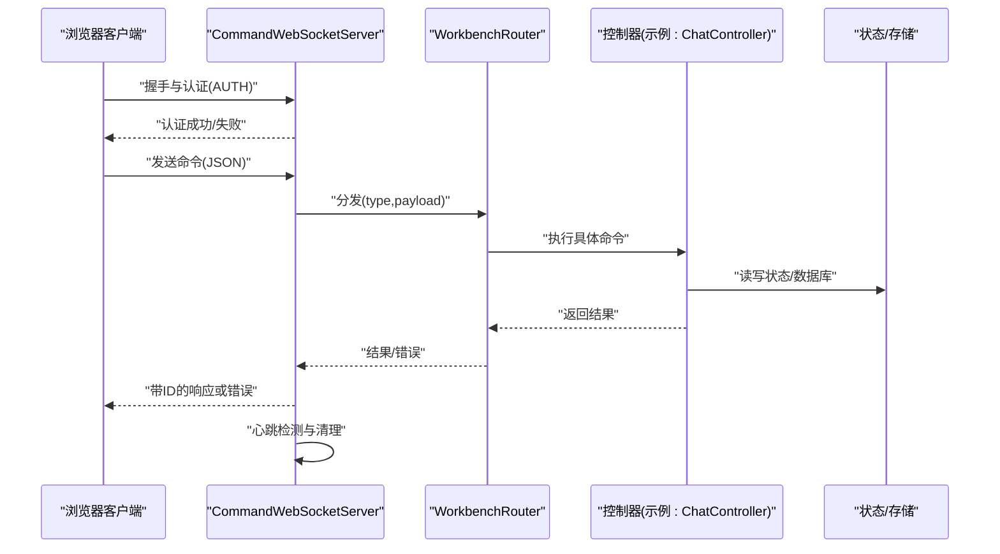
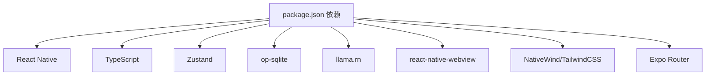

# 发展路线图

<cite>
**本文引用的文件**
- [README.md](file://README.md)
- [package.json](file://package.json)
- [artifacts-optimization-plan.md](file://docs/artifacts-optimization-plan.md)
- [artifacts-workspace-implementation-full.md](file://plans/artifacts-workspace-implementation-full.md)
- [WorkbenchRouter.ts](file://src/services/workbench/WorkbenchRouter.ts)
- [CommandWebSocketServer.ts](file://src/services/workbench/CommandWebSocketServer.ts)
- [StaticServerService.ts](file://src/services/workbench/StaticServerService.ts)
- [RagAdvancedSettings.tsx](file://src/features/settings/screens/RagAdvancedSettings.tsx)
- [vector-store.ts](file://src/lib/rag/vector-store.ts)
</cite>

## 目录
1. [简介](#简介)
2. [项目结构](#项目结构)
3. [核心组件](#核心组件)
4. [架构总览](#架构总览)
5. [详细组件分析](#详细组件分析)
6. [依赖关系分析](#依赖关系分析)
7. [性能考量](#性能考量)
8. [故障排查指南](#故障排查指南)
9. [结论](#结论)
10. [附录](#附录)

## 简介
本发展路线图基于Nexara项目的当前版本与规划文档，系统梳理了UI交互优化、CJK排版改进、本地推理稳定性提升、Workbench可靠性改进与边界情况处理策略，并展望未来可能的功能扩展（更多AI服务商接入、增强的RAG算法、更丰富的代理类型）、开源贡献方向与社区参与方式，以及版本发布计划与里程碑节点。目标是帮助用户理解项目的发展节奏与预期功能，同时确保规划具备技术前瞻性与现实可行性。

## 项目结构
Nexara采用React Native（Expo SDK 54）+ TypeScript构建，前端路由基于Expo Router，状态管理采用Zustand，数据库使用op-sqlite（SQLite + FTS5 + 向量BLOB），本地推理通过llama.rn，Web面板由Vite + React 18 + TailwindCSS 4组成。项目包含移动端应用、Web客户端、工作台服务（WebSocket与静态文件服务器）、RAG知识引擎、代理系统、技能工具体系等模块。

```mermaid
graph TB
subgraph "移动端应用"
A1[聊天界面]
A2[RAG设置]
A3[设置与模型管理]
A4[代理与技能]
end
subgraph "工作台服务"
B1[CommandWebSocketServer]
B2[WorkbenchRouter]
B3[StaticServerService]
end
subgraph "RAG引擎"
C1[向量存储与检索]
C2[知识图谱抽取]
C3[全文检索(FTS5)]
end
subgraph "Web客户端"
D1[Dashboard布局]
D2[聊天与消息]
D3[设置与备份]
end
A1 --- B1
A2 --- C1
A3 --- C2
B1 --- B2
B1 --- B3
B3 --- D1
B3 --- D2
B3 --- D3
```

**图表来源**
- [README.md:48-61](file://README.md#L48-L61)
- [package.json:14-96](file://package.json#L14-L96)
- [CommandWebSocketServer.ts:134-178](file://src/services/workbench/CommandWebSocketServer.ts#L134-L178)
- [StaticServerService.ts:24-36](file://src/services/workbench/StaticServerService.ts#L24-L36)

**章节来源**
- [README.md:48-61](file://README.md#L48-L61)
- [package.json:14-96](file://package.json#L14-L96)

## 核心组件
- 多提供商聊天：支持OpenAI、Anthropic、Gemini、Vertex AI、DeepSeek、Moonshot、智谱、SiliconFlow、GitHub Copilot、Cloudflare等，以及任意OpenAI兼容端点；支持流式响应、工具调用、图像生成与思维链推理。
- RAG知识引擎：基于SQLite + FTS5的内置向量库，支持文档导入、分块与向量化、检索、知识图谱抽取、查询重写与重排序。
- 代理系统：预设Agent（翻译、编程、创意写作等）与自定义Agent，可绑定特定RAG知识库与工具集。
- MCP协议：通过SSE或HTTP连接外部MCP服务器，桥接外部工具到本地技能注册表。
- 本地推理（实验性）：通过llama.rn运行GGUF模型，三槽位（主对话、嵌入、重排序），支持GPU加速。
- Workbench（实验性）：内置WebSocket与静态文件服务器，配套web-client远程管理对话、Agent、知识库与设置。
- 其他特性：Web搜索（Google、Tavily、Bing、Bocha、SearXNG级联降级）、Markdown/LaTeX/Mermaid/ECharts渲染、Skill工具系统、WebDAV备份、中英双语界面。

**章节来源**
- [README.md:14-46](file://README.md#L14-L46)
- [README.md:86-118](file://README.md#L86-L118)

## 架构总览
下图展示了移动端应用、工作台服务与Web客户端之间的交互关系，以及RAG引擎与知识图谱抽取的内部协作。

```mermaid
graph TB
subgraph "移动端"
M1[聊天UI]
M2[RAG设置]
M3[设置与模型管理]
end
subgraph "工作台服务"
W1[WebSocket服务器]
W2[命令路由]
W3[静态文件服务器]
end
subgraph "RAG引擎"
R1[向量存储]
R2[知识图谱]
R3[全文检索]
end
subgraph "Web客户端"
Wc1[仪表盘]
Wc2[聊天页]
Wc3[设置页]
end
M1 <- --> W1
M2 <- --> R1
M3 <- --> R2
W1 <- --> W2
W3 <- --> Wc1
W3 <- --> Wc2
W3 <- --> Wc3
```

**图表来源**
- [README.md:36-38](file://README.md#L36-L38)
- [CommandWebSocketServer.ts:134-178](file://src/services/workbench/CommandWebSocketServer.ts#L134-L178)
- [StaticServerService.ts:24-36](file://src/services/workbench/StaticServerService.ts#L24-L36)

## 详细组件分析

### UI交互与CJK排版优化
- 当前目标
  - UI交互打磨：手势、转场、触感反馈一致性。
  - CJK原生Markdown排版优化：排版、列表缩进等。
- 关键路径
  - UI组件与主题系统位于src/components/ui与src/theme。
  - Markdown渲染涉及多种渲染器（ECharts、Mermaid、Math等）。
- 建议措施
  - 引入统一的动画与触感反馈规范，确保跨页面一致性。
  - 针对CJK字符集优化字体回退、行高与缩进策略，结合WebView渲染器进行排版验证。
  - 建立UI组件的可访问性（无障碍）基线，覆盖焦点顺序、语义标签与屏幕阅读器支持。

**章节来源**
- [README.md:74-75](file://README.md#L74-L75)
- [README.md:146-147](file://README.md#L146-L147)

### 本地推理稳定性与模型兼容性
- 当前目标
  - 本地推理稳定性与模型兼容性提升。
- 关键路径
  - 本地推理通过llama.rn集成，三槽位模型（主对话、嵌入、重排序）。
  - 依赖op-sqlite进行向量存储与检索。
- 建议措施
  - 增加模型兼容性检测与降级策略（如自动选择轻量模型）。
  - 引入本地推理的健康检查与错误恢复机制（断线重连、内存压力处理）。
  - 优化向量检索阈值与相似度计算，减少低质量召回。

**章节来源**
- [README.md:77-77](file://README.md#L77-L77)
- [README.md:149-149](file://README.md#L149-L149)
- [package.json:61](file://package.json#L61)
- [vector-store.ts:217-233](file://src/lib/rag/vector-store.ts#L217-L233)

### Workbench可靠性与边界情况处理
- 当前目标
  - Workbench可靠性与边界情况处理。
- 关键路径
  - WebSocket服务器：CommandWebSocketServer，支持握手、帧处理、心跳、写队列与清理。
  - 命令路由：WorkbenchRouter，集中注册与分发命令。
  - 静态文件服务器：StaticServerService，打包并提供web-client资源。
- 建议措施
  - 增强异常捕获与错误响应（已存在_ERROR/_RESPONSE模式）。
  - 引入认证拦截与权限控制，限制未认证客户端的命令范围。
  - 优化大包传输与分块写入，增加超时与背压处理。
  - 增加心跳保活与客户端清理定时任务，避免僵尸连接。
  - 静态资源准备失败的重试与降级策略。



**图表来源**
- [CommandWebSocketServer.ts:415-444](file://src/services/workbench/CommandWebSocketServer.ts#L415-L444)
- [WorkbenchRouter.ts:34-71](file://src/services/workbench/WorkbenchRouter.ts#L34-L71)

**章节来源**
- [README.md:78-78](file://README.md#L78-L78)
- [README.md:150-150](file://README.md#L150-L150)
- [CommandWebSocketServer.ts:471-484](file://src/services/workbench/CommandWebSocketServer.ts#L471-L484)
- [WorkbenchRouter.ts:18-75](file://src/services/workbench/WorkbenchRouter.ts#L18-L75)

### RAG知识引擎与知识图谱
- 当前目标
  - 部分服务商接入层的完整回归测试。
  - RAG检索与知识图谱抽取的稳定性与性能优化。
- 关键路径
  - 向量存储与检索：基于SQLite + FTS5，支持余弦相似度计算与阈值过滤。
  - 知识图谱抽取：支持成本策略（按摘要优先、按需、全扫描）与本地规则预过滤。
- 建议措施
  - 增加RAG检索的多轮重试与降级策略（如回退到全文检索）。
  - 优化知识图谱抽取提示词与模型选择，提供默认提示词与重置能力。
  - 引入增量哈希与本地预处理以降低开销。

**章节来源**
- [README.md:76-76](file://README.md#L76-L76)
- [README.md:148-148](file://README.md#L148-L148)
- [RagAdvancedSettings.tsx:128-250](file://src/features/settings/screens/RagAdvancedSettings.tsx#L128-L250)
- [vector-store.ts:207-251](file://src/lib/rag/vector-store.ts#L207-L251)

### Artifacts模块专项提升与优化
- 当前目标
  - Artifacts模块的全局索引、搜索、导出与渲染器解耦。
- 关键路径
  - 现状：Artifacts数据分散在消息中，无全局状态管理与索引。
  - 规划：引入ArtifactStore、渲染器注册表、类型系统重构与导出能力。
- 建议措施
  - 逐步迁移现有ToolArtifacts到新的渲染器注册表模式。
  - 增加骨架屏、错误重试与无障碍支持。
  - 引入导出服务（PNG/SVG/JSON/HTML）与版本控制能力。

**章节来源**
- [artifacts-optimization-plan.md:1-133](file://docs/artifacts-optimization-plan.md#L1-L133)
- [artifacts-workspace-implementation-full.md:22-44](file://plans/artifacts-workspace-implementation-full.md#L22-L44)

## 依赖关系分析
- 技术栈与依赖
  - 框架与运行时：Expo SDK 54 + React Native（New Architecture）、TypeScript。
  - 状态管理：Zustand。
  - 数据库：op-sqlite（SQLite + FTS5 + 向量BLOB）。
  - 本地推理：llama.rn。
  - Web面板：Vite + React 18 + TailwindCSS 4。
- 外部依赖与集成
  - 多AI服务商接入：通过Provider配置与模型选择界面管理。
  - MCP协议：通过SSE或HTTP桥接外部工具。
  - Web搜索：多引擎级联降级（Google、Tavily、Bing、Bocha、SearXNG）。



**图表来源**
- [package.json:14-96](file://package.json#L14-L96)
- [README.md:48-61](file://README.md#L48-L61)

**章节来源**
- [package.json:14-96](file://package.json#L14-L96)
- [README.md:48-61](file://README.md#L48-L61)

## 性能考量
- RAG检索性能
  - 通过余弦相似度与阈值过滤减少无效候选，必要时启用重排序。
  - 增加增量哈希与本地预处理以降低计算与网络开销。
- Workbench传输
  - 大包分块写入与背压处理，避免阻塞主线程。
  - 心跳保活与定期清理，防止僵尸连接占用资源。
- 本地推理
  - GPU加速与模型槽位隔离，避免相互干扰。
  - 增加内存压力监控与自动降级策略。

**章节来源**
- [vector-store.ts:207-233](file://src/lib/rag/vector-store.ts#L207-L233)
- [CommandWebSocketServer.ts:371-413](file://src/services/workbench/CommandWebSocketServer.ts#L371-L413)
- [CommandWebSocketServer.ts:471-484](file://src/services/workbench/CommandWebSocketServer.ts#L471-L484)

## 故障排查指南
- Workbench常见问题
  - 端口占用：服务器启动时若端口被占用会自动重试，建议检查端口占用与防火墙设置。
  - 握手失败：确认客户端遵循WebSocket握手流程，检查Sec-WebSocket-Key头。
  - 认证拦截：未认证客户端仅允许AUTH命令，其他命令将收到AUTH_REQUIRED。
  - 写入失败：网络中断或连接关闭时会抑制部分错误日志，注意检查客户端状态。
- RAG检索问题
  - 维度不匹配：向量维度不一致会导致跳过，检查嵌入模型与向量维度。
  - 相似度过低：调整阈值与重排序策略，必要时回退到全文检索。
- UI与CJK排版
  - 排版异常：检查WebView渲染与字体回退策略，确保CJK字符集支持。
  - 交互不一致：统一动画与触感反馈，修复跨页面差异。

**章节来源**
- [CommandWebSocketServer.ts:113-131](file://src/services/workbench/CommandWebSocketServer.ts#L113-L131)
- [CommandWebSocketServer.ts:203-239](file://src/services/workbench/CommandWebSocketServer.ts#L203-L239)
- [CommandWebSocketServer.ts:424-429](file://src/services/workbench/CommandWebSocketServer.ts#L424-L429)
- [vector-store.ts:207-215](file://src/lib/rag/vector-store.ts#L207-L215)

## 结论
Nexara在多提供商接入、RAG知识引擎、代理系统与Workbench方面已具备坚实基础。下一阶段应聚焦于UI交互与CJK排版优化、本地推理稳定性提升、Workbench可靠性与边界情况处理，并逐步推进Artifacts模块的全局索引与渲染器解耦。未来可考虑接入更多AI服务商、增强RAG算法与代理类型，持续完善开源贡献与社区参与机制，确保项目在技术前瞻与现实可行之间取得平衡。

## 附录

### 版本发布计划与里程碑
- 版本号与脚本
  - 当前版本：1.2.75（package.json）。
  - 版本升级脚本：支持补丁与次版本升级（bump:patch、bump:minor）。
- 发布节奏建议
  - 预发布：每季度一次，重点验证Workbench与RAG稳定性。
  - 正式发布：每半年一次，合并重大功能与性能优化。
  - 紧急修复：按问题严重程度随时发布hotfix。
- 里程碑节点
  - UI交互与CJK排版优化完成（Q1）。
  - 本地推理稳定性与模型兼容性提升（Q2）。
  - Workbench可靠性与边界情况处理完成（Q3）。
  - Artifacts模块全局索引与渲染器解耦完成（Q4）。
  - 新增AI服务商接入与增强RAG算法（持续迭代）。

**章节来源**
- [package.json:3-12](file://package.json#L3-L12)