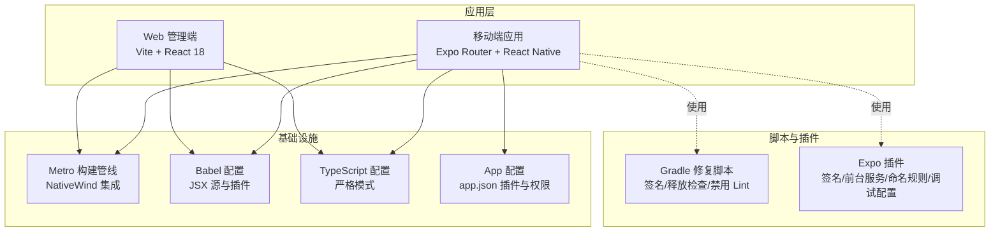
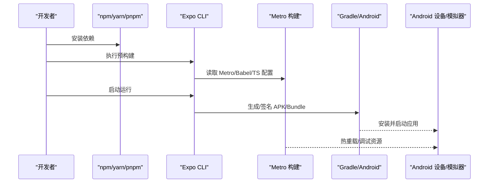
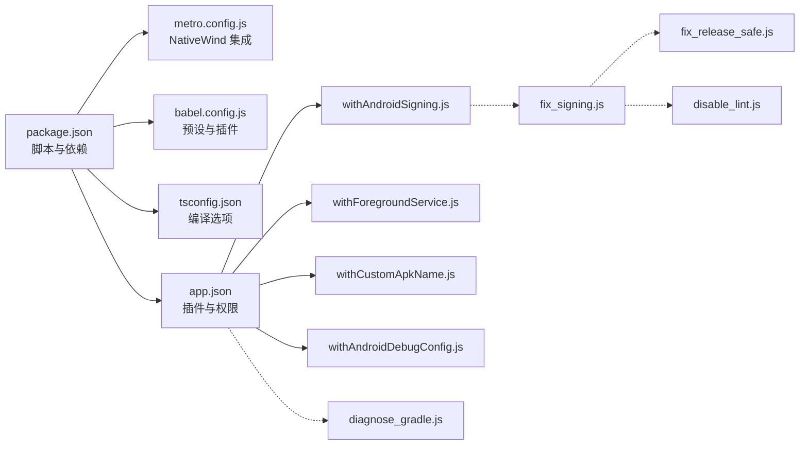

# 快速开始

<cite>
**本文引用的文件**
- [README.md](file://README.md)
- [package.json](file://package.json)
- [app.json](file://app.json)
- [metro.config.js](file://metro.config.js)
- [babel.config.js](file://babel.config.js)
- [tsconfig.json](file://tsconfig.json)
- [plugins/withAndroidSigning.js](file://plugins/withAndroidSigning.js)
- [plugins/withCustomApkName.js](file://plugins/withCustomApkName.js)
- [plugins/withForegroundService.js](file://plugins/withForegroundService.js)
- [plugins/withAndroidDebugConfig.js](file://plugins/withAndroidDebugConfig.js)
- [scripts/fix_signing.js](file://scripts/fix_signing.js)
- [scripts/fix_release_safe.js](file://scripts/fix_release_safe.js)
- [scripts/disable_lint.js](file://scripts/disable_lint.js)
- [scripts/diagnose_gradle.js](file://scripts/diagnose_gradle.js)
- [src/lib/llm/providers/vertexai.ts](file://src/lib/llm/providers/vertexai.ts)
- [src/lib/llm/api-logger.ts](file://src/lib/llm/api-logger.ts)
- [scripts/test-utils.ts](file://scripts/test-utils.ts)
</cite>

## 目录
1. [简介](#简介)
2. [项目结构](#项目结构)
3. [核心组件](#核心组件)
4. [架构总览](#架构总览)
5. [详细组件分析](#详细组件分析)
6. [依赖关系分析](#依赖关系分析)
7. [性能考虑](#性能考虑)
8. [故障排除指南](#故障排除指南)
9. [结论](#结论)
10. [附录](#附录)

## 简介
本指南面向首次接触 Nexara 的开发者，帮助你在约 30 分钟内完成环境准备、项目克隆、依赖安装、预构建与运行，并体验核心功能。你将学会：
- 安装与配置 Node.js、Expo CLI、Android 开发环境
- 克隆项目、安装依赖、执行预构建
- 运行到 Android 设备或模拟器
- 基本开发配置（API 密钥、模拟器配置）
- 首次使用最佳实践（配置首个 AI 服务商、导入示例知识库）

## 项目结构
Nexara 是一个基于 Expo SDK 54 + React Native 的 Android 应用，采用文件路由（Expo Router）、状态管理（Zustand）、样式（NativeWind/TailwindCSS）、数据库（op-sqlite）与本地推理（llama.rn）等技术栈。项目包含移动端应用、Web 管理端、脚本与插件等模块。

**图表来源**
- [metro.config.js:1-13](file://metro.config.js#L1-L13)
- [babel.config.js:1-14](file://babel.config.js#L1-L14)
- [tsconfig.json:1-14](file://tsconfig.json#L1-L14)
- [app.json:1-64](file://app.json#L1-L64)
- [plugins/withAndroidSigning.js:1-62](file://plugins/withAndroidSigning.js#L1-L62)
- [plugins/withForegroundService.js:1-73](file://plugins/withForegroundService.js#L1-L73)
- [plugins/withCustomApkName.js:1-85](file://plugins/withCustomApkName.js#L1-L85)
- [plugins/withAndroidDebugConfig.js:1-53](file://plugins/withAndroidDebugConfig.js#L1-L53)
- [scripts/fix_signing.js:1-118](file://scripts/fix_signing.js#L1-L118)
- [scripts/fix_release_safe.js:1-39](file://scripts/fix_release_safe.js#L1-L39)
- [scripts/disable_lint.js:1-30](file://scripts/disable_lint.js#L1-L30)

**章节来源**
- [README.md:48-61](file://README.md#L48-L61)
- [README.md:134-142](file://README.md#L134-L142)
- [app.json:1-64](file://app.json#L1-L64)
- [package.json:1-120](file://package.json#L1-L120)

## 核心组件
- 构建与打包
  - Metro 配置集成 NativeWind，启用全局样式输入。
  - Babel 预设与插件（含 Reanimated、Worklets Core）。
  - TypeScript 严格模式，排除 web-client 与测试目录。
- 应用配置
  - app.json 定义应用元信息、权限、插件链（含自定义插件与系统插件）。
  - 插件覆盖签名、前台服务、APK 命名、调试配置等。
- 脚本工具
  - Gradle 修复脚本用于签名、释放检查与 Lint 禁用，便于稳定构建。
  - 诊断脚本输出 build.gradle 行号，辅助定位构建问题。

**章节来源**
- [metro.config.js:1-13](file://metro.config.js#L1-L13)
- [babel.config.js:1-14](file://babel.config.js#L1-L14)
- [tsconfig.json:1-14](file://tsconfig.json#L1-L14)
- [app.json:1-64](file://app.json#L1-L64)
- [plugins/withAndroidSigning.js:1-62](file://plugins/withAndroidSigning.js#L1-L62)
- [plugins/withCustomApkName.js:1-85](file://plugins/withCustomApkName.js#L1-L85)
- [plugins/withForegroundService.js:1-73](file://plugins/withForegroundService.js#L1-L73)
- [plugins/withAndroidDebugConfig.js:1-53](file://plugins/withAndroidDebugConfig.js#L1-L53)
- [scripts/fix_signing.js:1-118](file://scripts/fix_signing.js#L1-L118)
- [scripts/fix_release_safe.js:1-39](file://scripts/fix_release_safe.js#L1-L39)
- [scripts/disable_lint.js:1-30](file://scripts/disable_lint.js#L1-L30)
- [scripts/diagnose_gradle.js:1-11](file://scripts/diagnose_gradle.js#L1-L11)

## 架构总览
下图展示了从开发机到设备的运行路径，以及关键配置点：

**图表来源**
- [package.json:5-12](file://package.json#L5-L12)
- [metro.config.js:1-13](file://metro.config.js#L1-L13)
- [babel.config.js:1-14](file://babel.config.js#L1-L14)
- [tsconfig.json:1-14](file://tsconfig.json#L1-L14)
- [app.json:43-61](file://app.json#L43-L61)

## 详细组件分析

### 环境准备与安装
- Node.js
  - 推荐使用 LTS 版本，确保 npm/yarn/pnpm 可用。
- Expo CLI
  - 通过 npm 全局安装，或使用 npx。
- Android 开发环境
  - Android Studio + SDK + AVD；或接入真机（需开启开发者选项与 USB 调试）。
  - 确保 ANDROID_HOME/SDK 路径正确，adb 可用。

**章节来源**
- [README.md:62-70](file://README.md#L62-L70)
- [README.md:134-142](file://README.md#L134-L142)

### 项目克隆与依赖安装
- 克隆仓库并进入目录
- 安装依赖
  - 使用 npm install 或等价命令。
  - 安装后会执行 postinstall 补丁流程。
- 预构建
  - 执行 npx expo prebuild，应用 app.json 中的插件链，生成原生工程。

**章节来源**
- [README.md:62-70](file://README.md#L62-L70)
- [README.md:134-142](file://README.md#L134-L142)
- [package.json:12](file://package.json#L12)

### 运行到 Android
- 启动开发服务器并安装到设备
  - 使用 npm run android 或 npx expo run:android。
- 若未检测到设备，先启动模拟器或连接真机。
- 首次运行可能需要等待 Metro 缓存与 Gradle 构建完成。

**章节来源**
- [package.json:6-8](file://package.json#L6-L8)
- [app.json:43-61](file://app.json#L43-L61)

### 开发环境基本配置
- API 密钥设置
  - 在应用设置中添加 AI 服务商密钥（例如 OpenAI、Anthropic、Gemini 等）。
  - 部分提供商支持服务账号密钥（如 Vertex AI），可按需配置。
- 模拟器配置
  - 建议使用 x86/x64 架构镜像，启用硬件加速。
  - 若遇到性能问题，可切换为较新版本的模拟器镜像。

**章节来源**
- [src/lib/llm/providers/vertexai.ts:72-108](file://src/lib/llm/providers/vertexai.ts#L72-L108)
- [src/lib/llm/api-logger.ts:1-59](file://src/lib/llm/api-logger.ts#L1-L59)

### 首次使用最佳实践
- 配置首个 AI 服务商
  - 在“设置/服务商”中新增一个提供商，填写 API Key。
  - 切换到“模型选择”，为该提供商选择可用模型。
- 导入示例知识库
  - 在“知识库/编辑器”中导入文档，系统将自动分块与向量化。
  - 在聊天中启用 RAG，验证检索结果与引用。
- 启用本地推理（可选）
  - 在“本地模型”中加载 GGUF 模型，确认 GPU 加速可用。
- 使用 Workbench（可选）
  - 在同一网络内打开 web-client，通过 WebSocket/静态服务进行远程管理。

**章节来源**
- [README.md:18-38](file://README.md#L18-L38)
- [README.md:104-110](file://README.md#L104-L110)

## 依赖关系分析
下图展示关键配置与脚本之间的耦合关系：

**图表来源**
- [package.json:1-120](file://package.json#L1-L120)
- [metro.config.js:1-13](file://metro.config.js#L1-L13)
- [babel.config.js:1-14](file://babel.config.js#L1-L14)
- [tsconfig.json:1-14](file://tsconfig.json#L1-L14)
- [app.json:1-64](file://app.json#L1-L64)
- [plugins/withAndroidSigning.js:1-62](file://plugins/withAndroidSigning.js#L1-L62)
- [plugins/withForegroundService.js:1-73](file://plugins/withForegroundService.js#L1-L73)
- [plugins/withCustomApkName.js:1-85](file://plugins/withCustomApkName.js#L1-L85)
- [plugins/withAndroidDebugConfig.js:1-53](file://plugins/withAndroidDebugConfig.js#L1-L53)
- [scripts/fix_signing.js:1-118](file://scripts/fix_signing.js#L1-L118)
- [scripts/fix_release_safe.js:1-39](file://scripts/fix_release_safe.js#L1-L39)
- [scripts/disable_lint.js:1-30](file://scripts/disable_lint.js#L1-L30)
- [scripts/diagnose_gradle.js:1-11](file://scripts/diagnose_gradle.js#L1-L11)

**章节来源**
- [package.json:1-120](file://package.json#L1-L120)
- [app.json:43-61](file://app.json#L43-L61)

## 性能考虑
- 构建性能
  - 预构建前清理缓存可避免旧配置干扰；必要时使用 --clean 参数。
  - 关闭不必要的 Lint 检查可缩短构建时间（仅在开发阶段）。
- 运行性能
  - 使用 x86/x64 模拟器镜像与硬件加速。
  - 避免同时运行多个大型服务（如后台通知服务）。
- 本地推理
  - 仅在具备足够内存与算力的设备上启用本地模型，避免卡顿。

[本节为通用建议，无需特定文件引用]

## 故障排除指南
- 无法找到设备或模拟器
  - 确认 adb devices 正常，或启动 AVD。
  - 若使用 USB，请检查驱动与授权。
- 构建失败（签名/发布检查）
  - 使用脚本修复 release 块签名与 Lint 检查；必要时临时禁用 release 校验。
  - 参考脚本行为：[scripts/fix_signing.js:1-118](file://scripts/fix_signing.js#L1-L118)、[scripts/fix_release_safe.js:1-39](file://scripts/fix_release_safe.js#L1-L39)、[scripts/disable_lint.js:1-30](file://scripts/disable_lint.js#L1-L30)。
- Gradle 配置异常
  - 使用诊断脚本输出 build.gradle 行号，定位问题块。
  - 参考：[scripts/diagnose_gradle.js:1-11](file://scripts/diagnose_gradle.js#L1-L11)。
- 预构建不生效或插件未注入
  - 检查 app.json 插件列表与插件实现；必要时重新执行预构建。
  - 参考插件：[plugins/withAndroidSigning.js:1-62](file://plugins/withAndroidSigning.js#L1-L62)、[plugins/withForegroundService.js:1-73](file://plugins/withForegroundService.js#L1-L73)、[plugins/withCustomApkName.js:1-85](file://plugins/withCustomApkName.js#L1-L85)、[plugins/withAndroidDebugConfig.js:1-53](file://plugins/withAndroidDebugConfig.js#L1-L53)。
- API 请求无日志或调试困难
  - 使用统一日志记录器进行请求/响应捕获与查看。
  - 参考：[src/lib/llm/api-logger.ts:1-59](file://src/lib/llm/api-logger.ts#L1-L59)。
- 测试配置缺失导致测试失败
  - 创建 secure_env/test_api.json 并按模板填充提供商密钥。
  - 参考：[scripts/test-utils.ts:1-47](file://scripts/test-utils.ts#L1-L47)。

**章节来源**
- [scripts/fix_signing.js:1-118](file://scripts/fix_signing.js#L1-L118)
- [scripts/fix_release_safe.js:1-39](file://scripts/fix_release_safe.js#L1-L39)
- [scripts/disable_lint.js:1-30](file://scripts/disable_lint.js#L1-L30)
- [scripts/diagnose_gradle.js:1-11](file://scripts/diagnose_gradle.js#L1-L11)
- [plugins/withAndroidSigning.js:1-62](file://plugins/withAndroidSigning.js#L1-L62)
- [plugins/withForegroundService.js:1-73](file://plugins/withForegroundService.js#L1-L73)
- [plugins/withCustomApkName.js:1-85](file://plugins/withCustomApkName.js#L1-L85)
- [plugins/withAndroidDebugConfig.js:1-53](file://plugins/withAndroidDebugConfig.js#L1-L53)
- [src/lib/llm/api-logger.ts:1-59](file://src/lib/llm/api-logger.ts#L1-L59)
- [scripts/test-utils.ts:1-47](file://scripts/test-utils.ts#L1-L47)

## 结论
按照本指南，你可以在 30 分钟内完成 Nexara 的环境准备、项目运行与基础配置。建议在完成上述步骤后，逐步探索 RAG、Agent、本地推理与 Workbench 等高级功能，结合日志与脚本工具提升开发效率与稳定性。

[本节为总结性内容，无需特定文件引用]

## 附录
- 快速命令清单
  - 克隆与安装：见 [README.md:62-70](file://README.md#L62-L70)、[README.md:134-142](file://README.md#L134-L142)
  - 预构建：npx expo prebuild
  - 运行 Android：npm run android 或 npx expo run:android
- 配置参考
  - app.json 插件与权限：[app.json:43-61](file://app.json#L43-L61)
  - Metro/NativeWind：[metro.config.js:1-13](file://metro.config.js#L1-L13)
  - Babel 预设与插件：[babel.config.js:1-14](file://babel.config.js#L1-L14)
  - TypeScript 严格模式：[tsconfig.json:1-14](file://tsconfig.json#L1-L14)

[本节为补充信息，无需特定文件引用]