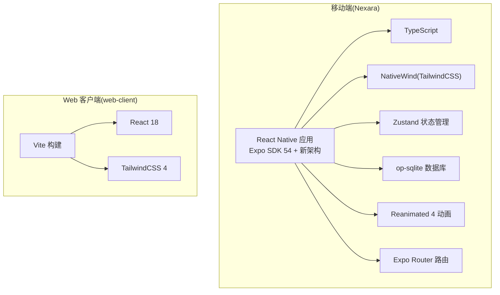
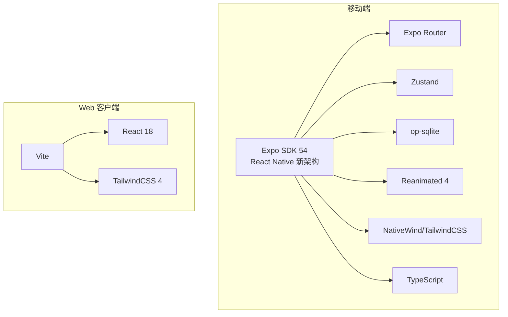
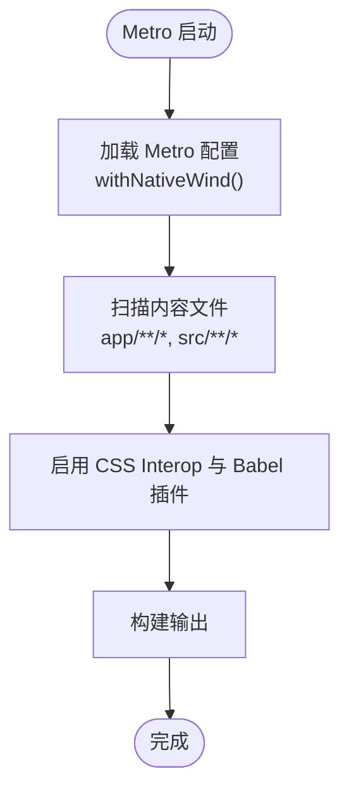
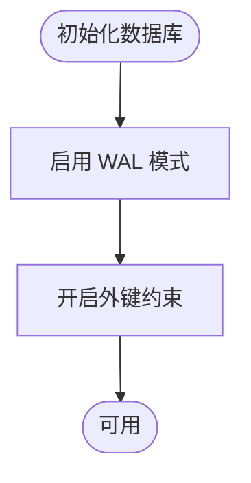
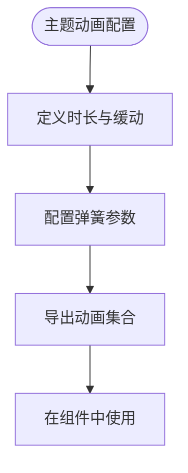
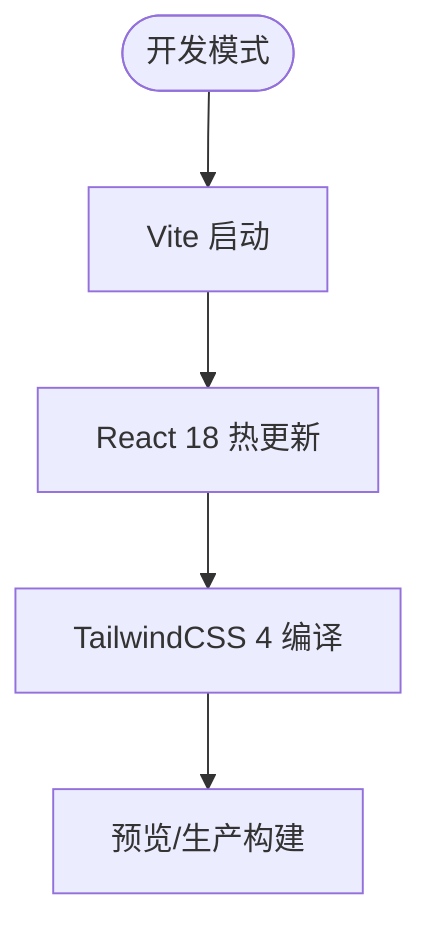
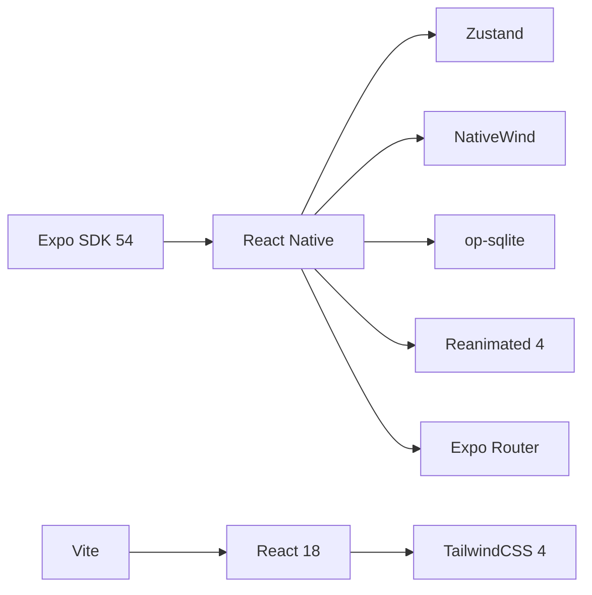

# 技术栈说明

<cite>
**本文引用的文件**
- [package.json](file://package.json)
- [web-client/package.json](file://web-client/package.json)
- [app.json](file://app.json)
- [tsconfig.json](file://tsconfig.json)
- [tailwind.config.js](file://tailwind.config.js)
- [babel.config.js](file://babel.config.js)
- [metro.config.js](file://metro.config.js)
- [web-client/vite.config.ts](file://web-client/vite.config.ts)
- [web-client/tailwind.config.js](file://web-client/tailwind.config.js)
- [README.md](file://README.md)
- [src/lib/db/index.ts](file://src/lib/db/index.ts)
- [src/theme/animations.ts](file://src/theme/animations.ts)
</cite>

## 目录
1. [简介](#简介)
2. [项目结构](#项目结构)
3. [核心组件](#核心组件)
4. [架构总览](#架构总览)
5. [详细组件分析](#详细组件分析)
6. [依赖关系分析](#依赖关系分析)
7. [性能考量](#性能考量)
8. [故障排查指南](#故障排查指南)
9. [结论](#结论)
10. [附录：学习路径与资源](#附录学习路径与资源)

## 简介
本文件系统化阐述 Nexara 的技术栈选型与架构设计，重点覆盖以下方面：
- 移动端：Expo SDK 54 + React Native 新架构、TypeScript、NativeWind（TailwindCSS）、Zustand、op-sqlite、Reanimated 4
- Web 客户端：Vite + React 18 + TailwindCSS 4
- 选型理由与优势：性能、开发体验、生态成熟度、跨平台一致性
- 学习路径与资源：帮助开发者快速上手核心技术

## 项目结构
Nexara 采用“单仓库多应用”的组织方式：
- 移动端应用位于根目录，使用 Expo SDK 54 + React Native（新架构）
- Web 客户端位于 web-client 目录，提供远程管理面板
- 样式体系统一通过 TailwindCSS/NativeWind 实现，移动端启用 CSS Interop 以提升样式编译性能
- 构建与打包分别由 Metro（移动端）与 Vite（Web）负责

章节来源
- [README.md:48-61](file://README.md#L48-L61)
- [app.json:10](file://app.json#L10)
- [package.json:33-67](file://package.json#L33-L67)
- [web-client/package.json:20-21](file://web-client/package.json#L20-L21)

## 核心组件
- 框架与运行时
  - Expo SDK 54 + React Native（新架构）：提供跨平台运行时、原生模块桥接与新架构带来的性能与并发能力
  - Web 客户端：Vite + React 18，构建快速、热更新高效
- 语言与类型系统
  - TypeScript：严格类型保障大型项目可维护性
- 样式与主题
  - NativeWind（TailwindCSS）：移动端原生样式方案，结合 CSS Interop 提升编译效率；Web 使用 TailwindCSS 4
- 导航与路由
  - Expo Router（文件系统路由）：约定式路由，开发体验佳
- 状态管理
  - Zustand：轻量、高性能、易于组合的状态容器，适合复杂业务状态
- 数据层
  - op-sqlite：SQLite 嵌入式数据库，支持 FTS5 与向量 BLOB，满足本地知识库与向量检索需求
- 本地推理与计算
  - llama.rn：在设备端运行 GGUF 模型，支持多模型槽位与 GPU 加速
- 动画与交互
  - Reanimated 4：基于工作线程的高性能动画，支持复杂交互动效
- Web 面板
  - Vite + React 18 + TailwindCSS 4：提供远程管理界面，与移动端通过 WebSocket/静态服务协同

章节来源
- [README.md:48-61](file://README.md#L48-L61)
- [package.json:14-96](file://package.json#L14-L96)
- [web-client/package.json:12-32](file://web-client/package.json#L12-L32)
- [babel.config.js:4-11](file://babel.config.js#L4-L11)
- [metro.config.js:12](file://metro.config.js#L12)
- [tailwind.config.js:4-5](file://tailwind.config.js#L4-L5)
- [web-client/tailwind.config.js:3-6](file://web-client/tailwind.config.js#L3-L6)

## 架构总览
下图展示移动端与 Web 客户端的关键技术栈与集成点：

图表来源
- [package.json:33-95](file://package.json#L33-L95)
- [web-client/package.json:12-31](file://web-client/package.json#L12-L31)
- [babel.config.js:4-11](file://babel.config.js#L4-L11)
- [metro.config.js:12](file://metro.config.js#L12)
- [tailwind.config.js:4-5](file://tailwind.config.js#L4-L5)
- [web-client/tailwind.config.js:3-6](file://web-client/tailwind.config.js#L3-L6)

## 详细组件分析

### 移动端框架与新架构（Expo SDK 54 + React Native 新架构）
- 选型理由
  - 新架构：提升主线程性能、改善内存占用、增强并发能力，利于复杂 UI 与动画场景
  - Expo SDK 54：提供稳定生态与持续更新，配合 Expo Router、Expo Image、Expo Font 等插件
- 关键配置
  - app.json 中开启新架构开关
  - babel 与 Metro 配置启用 NativeWind 与 Reanimated 插件
- 优势
  - 更流畅的动画与交互
  - 更好的原生模块桥接与可扩展性

章节来源
- [app.json:10](file://app.json#L10)
- [babel.config.js:4-11](file://babel.config.js#L4-L11)
- [metro.config.js:1-12](file://metro.config.js#L1-L12)

### 类型系统（TypeScript）
- 选型理由
  - 大型项目需要强类型约束以降低维护成本与运行时风险
  - 严格模式提升代码质量与团队协作效率
- 配置要点
  - 继承 Expo 默认 tsconfig，并启用严格模式
  - 排除 web-client 目录，避免类型冲突
- 优势
  - 编译期错误检测、智能补全与重构安全

章节来源
- [tsconfig.json:2-13](file://tsconfig.json#L2-L13)
- [README.md:53](file://README.md#L53)

### 样式体系（NativeWind 替代传统样式）
- 选型理由
  - NativeWind 将 TailwindCSS 引入 React Native，统一跨端样式语言
  - 结合 CSS Interop 提升样式编译性能，减少运行时开销
- 配置要点
  - babel 配置启用 nativewind/babel 与 jsxImportSource 指向 nativewind
  - Metro 集成 withNativeWind，输入全局样式文件
  - Tailwind 内容扫描范围包含 app 与 src 目录，并引入 nativewind/preset
- 优势
  - 一致的原子化样式语法、主题变量映射与按需编译

图表来源
- [metro.config.js:1-12](file://metro.config.js#L1-L12)
- [babel.config.js:4-11](file://babel.config.js#L4-L11)
- [tailwind.config.js:4-5](file://tailwind.config.js#L4-L5)

章节来源
- [babel.config.js:4-11](file://babel.config.js#L4-L11)
- [metro.config.js:1-12](file://metro.config.js#L1-L12)
- [tailwind.config.js:4-5](file://tailwind.config.js#L4-L5)
- [README.md:54](file://README.md#L54)

### 导航与路由（Expo Router 文件系统路由）
- 选型理由
  - 约定式路由，减少样板代码，提升开发效率
  - 与 Expo 生态无缝集成
- 优势
  - 目录即路由，清晰直观，便于团队协作

章节来源
- [README.md:55](file://README.md#L55)
- [app.json:43-61](file://app.json#L43-L61)

### 状态管理（Zustand）
- 选型理由
  - 相比 Redux，Zustand 更加轻量、API 更简洁、易于组合与调试
  - 在复杂业务状态与模块化 store 场景中表现优异
- 优势
  - 更低的学习曲线与更高的开发效率
  - 支持中间件与异步逻辑的灵活组织

章节来源
- [README.md:56](file://README.md#L56)
- [package.json:95](file://package.json#L95)

### 数据库（op-sqlite）
- 选型理由
  - SQLite 嵌入式、零配置、跨平台，适合本地优先的数据管理
  - FTS5 支持全文检索，向量 BLOB 存储适配 RAG 向量索引
- 初始化与性能
  - 启用 WAL 模式提升并发读写性能
  - 开启外键约束保证数据一致性
- 优势
  - 本地持久化、低延迟、可控的数据主权

图表来源
- [src/lib/db/index.ts:7-12](file://src/lib/db/index.ts#L7-L12)

章节来源
- [README.md:57](file://README.md#L57)
- [package.json:17](file://package.json#L17)
- [src/lib/db/index.ts:1-13](file://src/lib/db/index.ts#L1-L13)

### 本地推理（llama.rn）
- 选型理由
  - 支持 GGUF 模型格式，三槽位架构（聊天/嵌入/重排序），GPU 加速
  - 实现完全离线场景下的推理能力
- 优势
  - 保护隐私、降低网络依赖、提升响应速度

章节来源
- [README.md:32-34](file://README.md#L32-L34)
- [README.md:104-106](file://README.md#L104-L106)
- [package.json:61](file://package.json#L61)

### 动画库（Reanimated 4）
- 选型理由
  - 基于工作线程的高性能动画，支持复杂交互动效与物理模拟
  - 与新架构深度集成，提供更顺滑的用户体验
- 配置要点
  - babel 与 Metro 插件启用
  - 主题层集中管理动画时长、缓动与弹簧参数
- 优势
  - 减少主线程压力、提升动画流畅度与可定制性

图表来源
- [src/theme/animations.ts:12-75](file://src/theme/animations.ts#L12-L75)
- [babel.config.js:9-10](file://babel.config.js#L9-L10)
- [metro.config.js:12](file://metro.config.js#L12)

章节来源
- [README.md:59](file://README.md#L59)
- [src/theme/animations.ts:1-76](file://src/theme/animations.ts#L1-L76)
- [babel.config.js:9-10](file://babel.config.js#L9-L10)

### Web 客户端（Vite + React 18 + TailwindCSS 4）
- 选型理由
  - Vite 提供极快的冷启动与热更新，适合快速迭代
  - React 18 提供并发特性与更好的性能
  - TailwindCSS 4 保持与移动端一致的样式语言与主题体系
- 配置要点
  - Vite 插件 React（默认 Babel）
  - Tailwind 内容扫描范围包含 src 与模板文件
- 优势
  - 开发体验优秀、构建产物体积小、与移动端共享主题与组件理念

图表来源
- [web-client/vite.config.ts:1-17](file://web-client/vite.config.ts#L1-L17)
- [web-client/tailwind.config.js:3-6](file://web-client/tailwind.config.js#L3-L6)
- [web-client/package.json:12-31](file://web-client/package.json#L12-L31)

章节来源
- [README.md:60](file://README.md#L60)
- [web-client/vite.config.ts:1-17](file://web-client/vite.config.ts#L1-L17)
- [web-client/tailwind.config.js:1-13](file://web-client/tailwind.config.js#L1-L13)
- [web-client/package.json:12-31](file://web-client/package.json#L12-L31)

## 依赖关系分析
- 移动端依赖关系
  - Expo SDK 54 作为运行时与插件生态基础
  - React Native 与新架构提供 UI 与原生桥接
  - NativeWind/TailwindCSS 提供样式能力
  - Zustand 管理状态
  - op-sqlite 提供本地数据库
  - Reanimated 4 提供动画
  - Expo Router 提供路由
- Web 客户端依赖关系
  - Vite 提供构建与开发服务器
  - React 18 提供 UI 能力
  - TailwindCSS 4 提供样式能力

图表来源
- [package.json:33-95](file://package.json#L33-L95)
- [web-client/package.json:12-31](file://web-client/package.json#L12-L31)

章节来源
- [package.json:33-95](file://package.json#L33-L95)
- [web-client/package.json:12-31](file://web-client/package.json#L12-L31)

## 性能考量
- 新架构与 CSS Interop
  - 新架构减少主线程阻塞，CSS Interop 降低样式编译开销
- op-sqlite
  - WAL 模式提升并发读写吞吐，外键约束保障一致性
- Reanimated 4
  - 工作线程执行动画，避免主线程卡顿
- Vite
  - 快速冷启动与增量编译，缩短开发等待时间

章节来源
- [src/lib/db/index.ts:7-12](file://src/lib/db/index.ts#L7-L12)
- [src/theme/animations.ts:1-76](file://src/theme/animations.ts#L1-L76)
- [metro.config.js:12](file://metro.config.js#L12)

## 故障排查指南
- 样式未生效或编译报错
  - 检查 Metro 是否正确集成 withNativeWind 与 babel 中 nativewind 插件
  - 确认 Tailwind 内容扫描路径包含当前组件文件
- 动画异常或掉帧
  - 确认 Reanimated 插件已在 babel 与 Metro 中启用
  - 检查动画配置是否合理，避免过度复杂的弹簧参数
- 数据库初始化失败
  - 确认 WAL 模式与外键约束已正确执行
- Web 客户端样式不一致
  - 检查 Tailwind 4 配置与内容扫描路径
  - 确保与移动端主题变量保持一致

章节来源
- [metro.config.js:1-12](file://metro.config.js#L1-L12)
- [babel.config.js:4-11](file://babel.config.js#L4-L11)
- [tailwind.config.js:4-5](file://tailwind.config.js#L4-L5)
- [src/lib/db/index.ts:7-12](file://src/lib/db/index.ts#L7-L12)
- [web-client/tailwind.config.js:1-13](file://web-client/tailwind.config.js#L1-L13)

## 结论
Nexara 的技术栈围绕“本地优先、跨平台一致、高性能与高可维护性”展开。移动端采用 Expo SDK 54 + React Native 新架构，结合 NativeWind、Zustand、op-sqlite 与 Reanimated 4，形成高效的开发与运行基座；Web 客户端以 Vite + React 18 + TailwindCSS 4 提供远程管理能力。整体选型兼顾工程效率与产品体验，适合在多平台环境下快速迭代与规模化演进。

## 附录：学习路径与资源
- Expo SDK 54 + React Native 新架构
  - 官方文档：Expo Router、New Architecture、Reanimated 4、op-sqlite
- TypeScript
  - 官方文档：严格模式、模块解析、类型声明
- NativeWind 与 TailwindCSS
  - 官方文档：nativewind/babel、CSS Interop、preset 集成
- Zustand
  - 官方文档：store 设计、中间件、异步逻辑
- op-sqlite
  - 官方文档：WAL 模式、FTS5、向量存储
- Reanimated 4
  - 官方文档：工作线程、动画配置、物理模拟
- Web 客户端（Vite + React 18 + TailwindCSS 4）
  - 官方文档：Vite 配置、React 18 特性、TailwindCSS 4

章节来源
- [README.md:48-61](file://README.md#L48-L61)
- [package.json:33-95](file://package.json#L33-L95)
- [web-client/package.json:12-31](file://web-client/package.json#L12-L31)