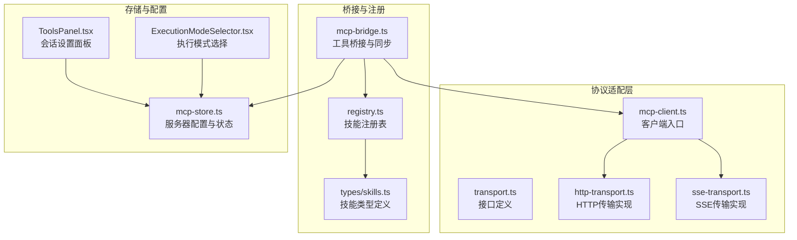
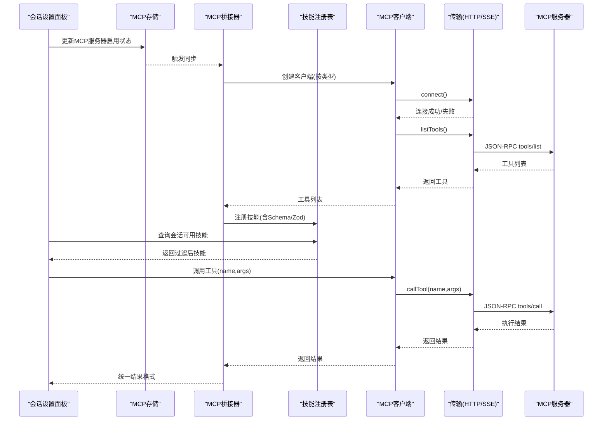
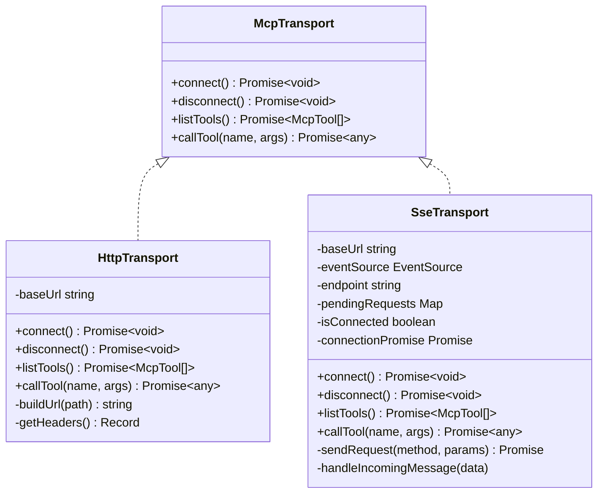
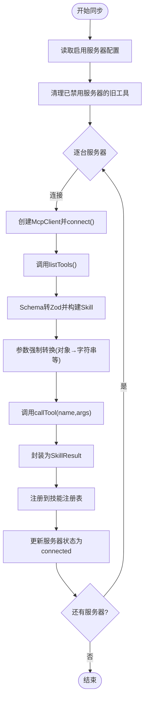
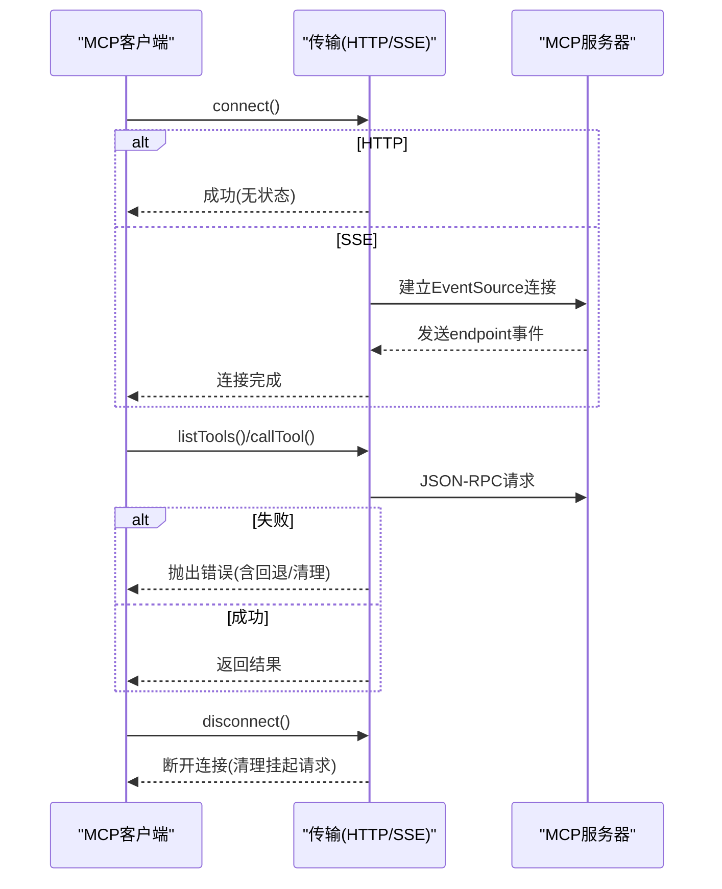
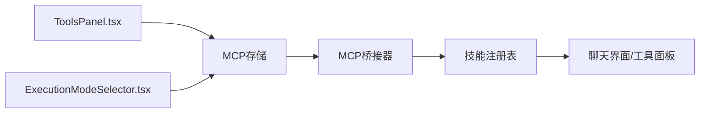
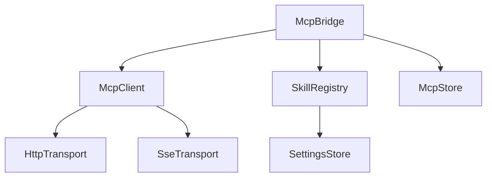

# MCP协议集成

<cite>
**本文档引用的文件**
- [src/lib/mcp/transport.ts](file://src/lib/mcp/transport.ts)
- [src/lib/mcp/mcp-client.ts](file://src/lib/mcp/mcp-client.ts)
- [src/lib/mcp/transports/http-transport.ts](file://src/lib/mcp/transports/http-transport.ts)
- [src/lib/mcp/transports/sse-transport.ts](file://src/lib/mcp/transports/sse-transport.ts)
- [src/lib/mcp/mcp-bridge.ts](file://src/lib/mcp/mcp-bridge.ts)
- [src/store/mcp-store.ts](file://src/store/mcp-store.ts)
- [src/lib/skills/registry.ts](file://src/lib/skills/registry.ts)
- [src/types/skills.ts](file://src/types/skills.ts)
- [src/features/chat/components/SessionSettingsSheet/ToolsPanel.tsx](file://src/features/chat/components/SessionSettingsSheet/ToolsPanel.tsx)
- [src/features/chat/components/ExecutionModeSelector.tsx](file://src/features/chat/components/ExecutionModeSelector.tsx)
</cite>

## 目录
1. [简介](#简介)
2. [项目结构](#项目结构)
3. [核心组件](#核心组件)
4. [架构总览](#架构总览)
5. [详细组件分析](#详细组件分析)
6. [依赖关系分析](#依赖关系分析)
7. [性能考量](#性能考量)
8. [故障排除指南](#故障排除指南)
9. [结论](#结论)
10. [附录](#附录)

## 简介
本文件面向Nexara的Model Context Protocol（MCP）集成，系统性阐述MCP协议工作原理与架构设计，重点对比SSE与HTTP两种传输层实现差异，深入说明外部工具桥接机制（工具发现、参数验证、执行流程与结果处理），并覆盖MCP服务器连接管理、认证机制与错误恢复策略。文档同时提供完整的集成示例、性能优化建议、安全注意事项与最佳实践。

## 项目结构
本次分析聚焦于src/lib/mcp目录下的协议适配层与桥接层，以及与之配套的存储、技能注册表与UI配置界面：

- 协议适配层
  - transport.ts：定义MCP工具与传输接口
  - transports/http-transport.ts：基于HTTP的JSON-RPC传输实现
  - transports/sse-transport.ts：基于SSE的JSON-RPC传输实现
  - mcp-client.ts：统一客户端入口，按配置选择具体传输
- 桥接与注册
  - mcp-bridge.ts：将外部MCP工具同步为本地技能，完成参数校验与执行封装
  - registry.ts：技能注册表，提供技能检索、过滤与会话级路由
  - types/skills.ts：技能类型定义与执行结果规范
- 存储与配置
  - mcp-store.ts：MCP服务器配置与状态持久化
  - UI设置面板：会话设置中对MCP服务器的启用/禁用与会话级路由

图表来源
- [src/lib/mcp/transport.ts:1-14](file://src/lib/mcp/transport.ts#L1-L14)
- [src/lib/mcp/mcp-client.ts:1-51](file://src/lib/mcp/mcp-client.ts#L1-L51)
- [src/lib/mcp/transports/http-transport.ts:1-158](file://src/lib/mcp/transports/http-transport.ts#L1-L158)
- [src/lib/mcp/transports/sse-transport.ts:1-205](file://src/lib/mcp/transports/sse-transport.ts#L1-L205)
- [src/lib/mcp/mcp-bridge.ts:1-202](file://src/lib/mcp/mcp-bridge.ts#L1-L202)
- [src/lib/skills/registry.ts:1-189](file://src/lib/skills/registry.ts#L1-L189)
- [src/types/skills.ts:1-74](file://src/types/skills.ts#L1-L74)
- [src/store/mcp-store.ts:1-72](file://src/store/mcp-store.ts#L1-L72)
- [src/features/chat/components/SessionSettingsSheet/ToolsPanel.tsx:135-180](file://src/features/chat/components/SessionSettingsSheet/ToolsPanel.tsx#L135-L180)
- [src/features/chat/components/ExecutionModeSelector.tsx:271-303](file://src/features/chat/components/ExecutionModeSelector.tsx#L271-L303)

章节来源
- [src/lib/mcp/transport.ts:1-14](file://src/lib/mcp/transport.ts#L1-L14)
- [src/lib/mcp/mcp-client.ts:1-51](file://src/lib/mcp/mcp-client.ts#L1-L51)
- [src/lib/mcp/transports/http-transport.ts:1-158](file://src/lib/mcp/transports/http-transport.ts#L1-L158)
- [src/lib/mcp/transports/sse-transport.ts:1-205](file://src/lib/mcp/transports/sse-transport.ts#L1-L205)
- [src/lib/mcp/mcp-bridge.ts:1-202](file://src/lib/mcp/mcp-bridge.ts#L1-L202)
- [src/lib/skills/registry.ts:1-189](file://src/lib/skills/registry.ts#L1-L189)
- [src/types/skills.ts:1-74](file://src/types/skills.ts#L1-L74)
- [src/store/mcp-store.ts:1-72](file://src/store/mcp-store.ts#L1-L72)
- [src/features/chat/components/SessionSettingsSheet/ToolsPanel.tsx:135-180](file://src/features/chat/components/SessionSettingsSheet/ToolsPanel.tsx#L135-L180)
- [src/features/chat/components/ExecutionModeSelector.tsx:271-303](file://src/features/chat/components/ExecutionModeSelector.tsx#L271-L303)

## 核心组件
- 传输接口与实现
  - McpTool：工具元数据（名称、描述、输入Schema）
  - McpTransport：统一传输接口（连接、断开、列出工具、调用工具）
  - HttpTransport：HTTP JSON-RPC实现，支持路径回退与错误处理
  - SseTransport：SSE JSON-RPC实现，基于EventSource接收endpoint事件并发起POST请求
- 客户端与桥接
  - McpClient：根据配置选择传输类型，统一路由连接、工具列表与调用
  - McpBridge：将外部MCP工具同步为本地技能，完成Schema到Zod的转换、参数强制转换与执行封装
- 技能与注册表
  - Skill：技能接口，包含执行上下文与结果规范
  - SkillRegistry：技能注册、检索、会话级路由与动态重载
- 存储与UI
  - McpServerConfig：服务器配置与状态（含类型、启用、默认包含等）
  - ToolsPanel/ExecutionModeSelector：会话设置中对MCP服务器的启用与会话级路由

章节来源
- [src/lib/mcp/transport.ts:2-13](file://src/lib/mcp/transport.ts#L2-L13)
- [src/lib/mcp/transports/http-transport.ts:3-48](file://src/lib/mcp/transports/http-transport.ts#L3-L48)
- [src/lib/mcp/transports/sse-transport.ts:22-104](file://src/lib/mcp/transports/sse-transport.ts#L22-L104)
- [src/lib/mcp/mcp-client.ts:6-51](file://src/lib/mcp/mcp-client.ts#L6-L51)
- [src/lib/mcp/mcp-bridge.ts:10-129](file://src/lib/mcp/mcp-bridge.ts#L10-L129)
- [src/types/skills.ts:8-47](file://src/types/skills.ts#L8-L47)
- [src/lib/skills/registry.ts:8-186](file://src/lib/skills/registry.ts#L8-L186)
- [src/store/mcp-store.ts:6-30](file://src/store/mcp-store.ts#L6-L30)

## 架构总览
下图展示从会话设置到工具执行的完整链路：会话设置面板控制MCP服务器启用状态；桥接器按启用状态同步工具；技能注册表提供会话级路由；执行时通过McpClient选择对应传输，最终调用外部MCP服务器。

图表来源
- [src/features/chat/components/SessionSettingsSheet/ToolsPanel.tsx:135-180](file://src/features/chat/components/SessionSettingsSheet/ToolsPanel.tsx#L135-L180)
- [src/store/mcp-store.ts:32-71](file://src/store/mcp-store.ts#L32-L71)
- [src/lib/mcp/mcp-bridge.ts:14-129](file://src/lib/mcp/mcp-bridge.ts#L14-L129)
- [src/lib/skills/registry.ts:130-172](file://src/lib/skills/registry.ts#L130-L172)
- [src/lib/mcp/mcp-client.ts:26-50](file://src/lib/mcp/mcp-client.ts#L26-L50)
- [src/lib/mcp/transports/http-transport.ts:50-143](file://src/lib/mcp/transports/http-transport.ts#L50-L143)
- [src/lib/mcp/transports/sse-transport.ts:182-193](file://src/lib/mcp/transports/sse-transport.ts#L182-L193)

## 详细组件分析

### 传输层对比：SSE vs HTTP
- HTTP传输
  - 特点：无状态、每次请求独立；内置路径回退策略（如/tools与/tools/call）
  - 错误处理：对常见HTTP错误码进行降级与回退，解析JSON-RPC错误
  - URL构建：健壮的路径拼接与回退逻辑，兼容不同服务端部署形态
- SSE传输
  - 特点：长连接，等待endpoint事件作为握手完成信号；后续通过fetch向服务端POST JSON-RPC消息
  - 连接管理：维护连接Promise、待处理请求映射、断开时拒绝所有挂起请求
  - 兼容性：对ID类型进行数字化处理，提升与部分服务端的兼容性

图表来源
- [src/lib/mcp/transport.ts:8-13](file://src/lib/mcp/transport.ts#L8-L13)
- [src/lib/mcp/transports/http-transport.ts:3-48](file://src/lib/mcp/transports/http-transport.ts#L3-L48)
- [src/lib/mcp/transports/sse-transport.ts:22-104](file://src/lib/mcp/transports/sse-transport.ts#L22-L104)

章节来源
- [src/lib/mcp/transports/http-transport.ts:14-48](file://src/lib/mcp/transports/http-transport.ts#L14-L48)
- [src/lib/mcp/transports/sse-transport.ts:34-104](file://src/lib/mcp/transports/sse-transport.ts#L34-L104)

### 客户端与桥接：工具发现、参数验证与执行
- 工具发现
  - McpClient根据配置选择传输类型，统一提供listTools与callTool
  - McpBridge遍历启用服务器，清理失效工具，覆盖式同步工具列表
- 参数验证
  - 将MCP输入Schema转换为Zod Schema，支持嵌套对象、数组、枚举与严格模式
  - 执行前进行Schema驱动的参数强制转换（如对象转字符串）
- 执行流程
  - 每次原子执行建立即时连接，执行完毕即断开，确保无状态与低耦合
  - 统一结果包装为SkillResult，便于UI渲染与历史记录

图表来源
- [src/lib/mcp/mcp-bridge.ts:14-129](file://src/lib/mcp/mcp-bridge.ts#L14-L129)
- [src/lib/mcp/mcp-client.ts:33-50](file://src/lib/mcp/mcp-client.ts#L33-L50)
- [src/lib/skills/registry.ts:105-109](file://src/lib/skills/registry.ts#L105-L109)

章节来源
- [src/lib/mcp/mcp-bridge.ts:14-129](file://src/lib/mcp/mcp-bridge.ts#L14-L129)
- [src/lib/mcp/mcp-client.ts:33-50](file://src/lib/mcp/mcp-client.ts#L33-L50)
- [src/lib/skills/registry.ts:105-109](file://src/lib/skills/registry.ts#L105-L109)

### 连接管理、认证与错误恢复
- 连接管理
  - HTTP：无状态，connect/disconnect为空操作；通过URL回退策略提升兼容性
  - SSE：EventSource长连接，等待endpoint事件完成握手；断开时拒绝所有挂起请求
- 认证机制
  - 默认HTTP头包含Content-Type、Accept与User-Agent；未内置额外认证头
  - 如需认证，请在服务端侧实现相应鉴权策略，并在客户端补充必要头部
- 错误恢复
  - HTTP：对404/405/403等错误进行路径回退重试；解析JSON-RPC错误并抛出
  - SSE：连接失败时reject并清理；断开时拒绝挂起请求并清空映射

图表来源
- [src/lib/mcp/transports/http-transport.ts:40-88](file://src/lib/mcp/transports/http-transport.ts#L40-L88)
- [src/lib/mcp/transports/sse-transport.ts:34-104](file://src/lib/mcp/transports/sse-transport.ts#L34-L104)

章节来源
- [src/lib/mcp/transports/http-transport.ts:40-88](file://src/lib/mcp/transports/http-transport.ts#L40-L88)
- [src/lib/mcp/transports/sse-transport.ts:34-104](file://src/lib/mcp/transports/sse-transport.ts#L34-L104)

### 会话级路由与UI集成
- 会话设置面板允许启用/禁用MCP服务器，并显示服务器状态
- 技能注册表提供会话感知的技能过滤：仅返回当前会话激活的MCP服务器工具
- 执行模式选择器与会话设置联动，支持工具开关与MCP服务器路由

图表来源
- [src/features/chat/components/SessionSettingsSheet/ToolsPanel.tsx:135-180](file://src/features/chat/components/SessionSettingsSheet/ToolsPanel.tsx#L135-L180)
- [src/features/chat/components/ExecutionModeSelector.tsx:271-303](file://src/features/chat/components/ExecutionModeSelector.tsx#L271-L303)
- [src/store/mcp-store.ts:32-71](file://src/store/mcp-store.ts#L32-L71)
- [src/lib/mcp/mcp-bridge.ts:14-37](file://src/lib/mcp/mcp-bridge.ts#L14-L37)
- [src/lib/skills/registry.ts:130-172](file://src/lib/skills/registry.ts#L130-L172)

章节来源
- [src/features/chat/components/SessionSettingsSheet/ToolsPanel.tsx:135-180](file://src/features/chat/components/SessionSettingsSheet/ToolsPanel.tsx#L135-L180)
- [src/features/chat/components/ExecutionModeSelector.tsx:271-303](file://src/features/chat/components/ExecutionModeSelector.tsx#L271-L303)
- [src/lib/skills/registry.ts:130-172](file://src/lib/skills/registry.ts#L130-L172)

## 依赖关系分析
- 组件耦合
  - McpClient依赖McpTransport接口，通过构造函数注入具体实现
  - McpBridge依赖McpClient、技能注册表与存储，承担“工具→技能”的转换与注册
  - 技能注册表依赖设置存储，提供会话级过滤
- 外部依赖
  - SSE传输依赖react-native-sse库
  - HTTP传输依赖浏览器/React Native环境的fetch

图表来源
- [src/lib/mcp/mcp-client.ts:10-21](file://src/lib/mcp/mcp-client.ts#L10-L21)
- [src/lib/mcp/mcp-bridge.ts:1-5](file://src/lib/mcp/mcp-bridge.ts#L1-L5)
- [src/lib/skills/registry.ts:1-32](file://src/lib/skills/registry.ts#L1-L32)
- [src/store/mcp-store.ts:1-7](file://src/store/mcp-store.ts#L1-L7)

章节来源
- [src/lib/mcp/mcp-client.ts:10-21](file://src/lib/mcp/mcp-client.ts#L10-L21)
- [src/lib/mcp/mcp-bridge.ts:1-5](file://src/lib/mcp/mcp-bridge.ts#L1-L5)
- [src/lib/skills/registry.ts:1-32](file://src/lib/skills/registry.ts#L1-L32)
- [src/store/mcp-store.ts:1-7](file://src/store/mcp-store.ts#L1-L7)

## 性能考量
- 无状态执行
  - 每次工具调用建立即时连接并在完成后断开，避免长连接资源占用，适合短频快的工具调用场景
- URL回退与兼容
  - HTTP传输内置路径回退策略，减少因服务端部署差异导致的失败重试成本
- 参数预处理
  - 在桥接层进行Schema驱动的参数强制转换，降低下游服务端解析与错误率
- 会话级过滤
  - 技能注册表按会话激活的MCP服务器过滤工具，减少无关工具带来的UI与推理负担

## 故障排除指南
- HTTP传输常见问题
  - 404/405/403：触发路径回退（如/tools → /tools/call），若仍失败，检查服务端是否正确实现tools/list与tools/call
  - JSON-RPC错误：解析data.error并记录详细信息，定位参数或权限问题
- SSE传输常见问题
  - 连接失败：确认SSE端点可达且能发送endpoint事件；断开后需重新connect
  - 请求超时/响应异常：检查pendingRequests映射是否正确清理，避免悬挂请求
- 参数校验失败
  - 使用Zod Schema进行严格校验，结合日志定位字段类型不匹配问题
- 会话不可用
  - 确认会话设置中已启用对应MCP服务器，且技能注册表返回过滤后的工具列表

章节来源
- [src/lib/mcp/transports/http-transport.ts:115-143](file://src/lib/mcp/transports/http-transport.ts#L115-L143)
- [src/lib/mcp/transports/sse-transport.ts:70-104](file://src/lib/mcp/transports/sse-transport.ts#L70-L104)
- [src/lib/mcp/mcp-bridge.ts:135-200](file://src/lib/mcp/mcp-bridge.ts#L135-L200)
- [src/lib/skills/registry.ts:130-172](file://src/lib/skills/registry.ts#L130-L172)

## 结论
Nexara的MCP集成采用“接口抽象 + 多传输实现 + 桥接转换 + 注册表路由”的架构，既保证了对SSE与HTTP两种传输方式的兼容，又通过严格的参数校验与无状态执行提升了稳定性与可维护性。配合会话级路由与UI设置，实现了灵活可控的工具使用体验。建议在生产环境中完善认证与限流策略，并持续监控服务器状态与错误日志以保障可靠性。

## 附录
- 集成步骤概览
  - 配置MCP服务器（HTTP/SSE），保存至McpStore
  - 启动同步：调用McpBridge.syncAll或syncServer，完成工具发现与技能注册
  - 会话设置：在ToolsPanel中启用目标服务器，在ExecutionModeSelector中开启工具
  - 执行工具：通过技能注册表获取会话可用技能，调用McpClient执行
- 自定义工具开发要点
  - 提供准确的输入Schema，以便桥接层生成Zod校验与参数强制转换
  - 实现tools/list与tools/call两个端点，遵循JSON-RPC 2.0规范
  - 若使用SSE，确保能发送endpoint事件并正确处理POST请求
- 调试方法
  - 开启详细日志：关注HttpTransport与SseTransport中的请求/响应打印
  - 使用会话设置面板查看服务器状态与错误信息
  - 通过技能注册表检查工具是否成功注册与会话过滤结果