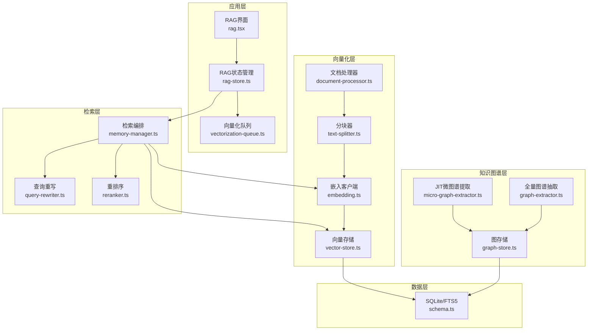
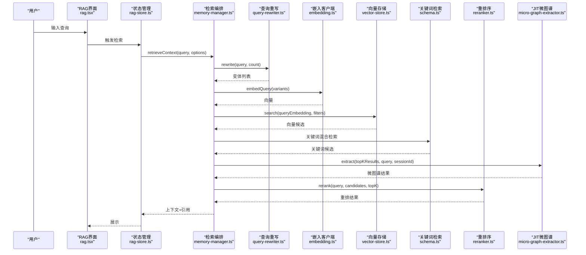
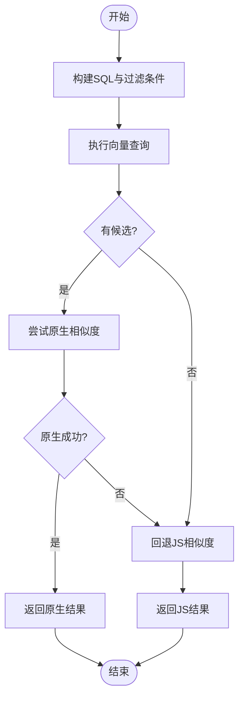
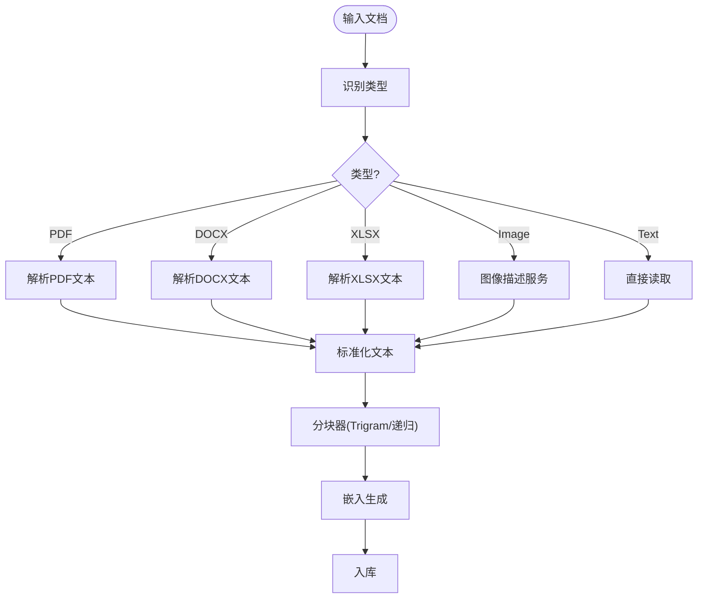
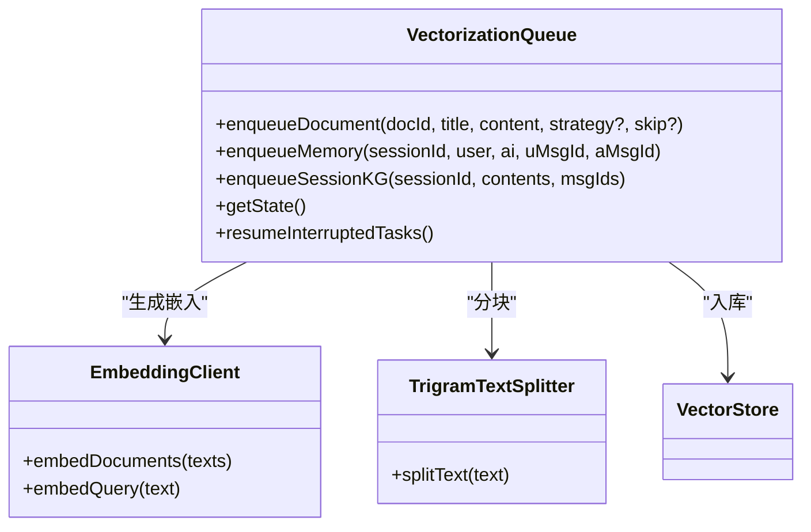
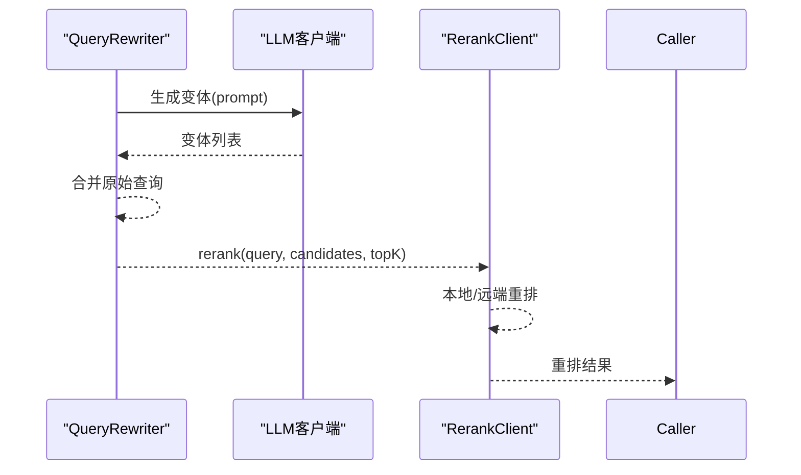
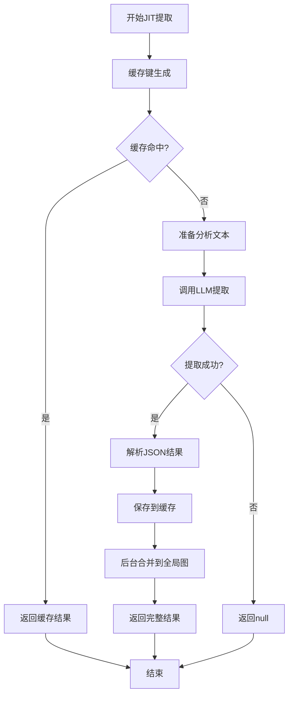
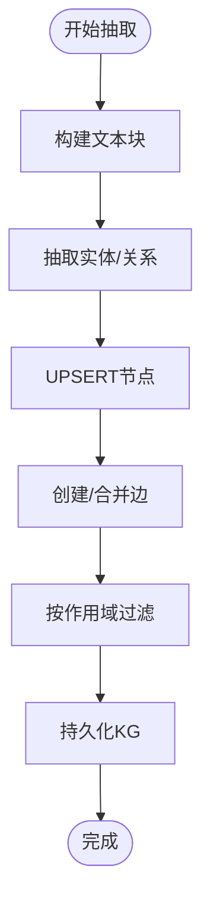
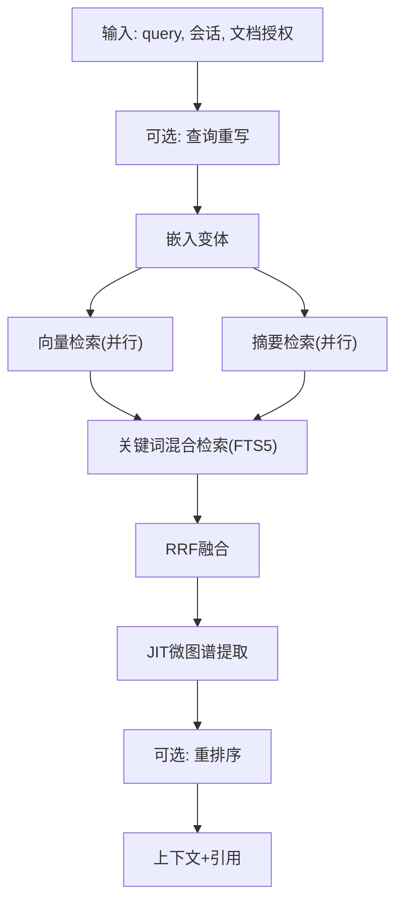
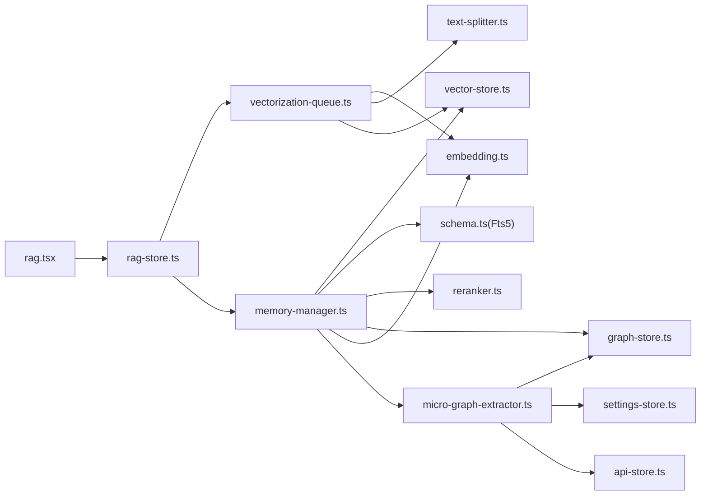

# RAG知识引擎

<cite>
**本文引用的文件**
- [vector-store.ts](file://src/lib/rag/vector-store.ts)
- [graph-store.ts](file://src/lib/rag/graph-store.ts)
- [document-processor.ts](file://src/lib/rag/document-processor.ts)
- [text-splitter.ts](file://src/lib/rag/text-splitter.ts)
- [embedding.ts](file://src/lib/rag/embedding.ts)
- [query-rewriter.ts](file://src/lib/rag/query-rewriter.ts)
- [reranker.ts](file://src/lib/rag/reranker.ts)
- [memory-manager.ts](file://src/lib/rag/memory-manager.ts)
- [schema.ts](file://src/lib/db/schema.ts)
- [rag-store.ts](file://src/store/rag-store.ts)
- [vectorization-queue.ts](file://src/lib/rag/vectorization-queue.ts)
- [rag.tsx](file://app/(tabs)/rag.tsx)
- [micro-graph-extractor.ts](file://src/lib/rag/micro-graph-extractor.ts)
- [graph-extractor.ts](file://src/lib/rag/graph-extractor.ts)
</cite>

## 目录
1. [简介](#简介)
2. [项目结构](#项目结构)
3. [核心组件](#核心组件)
4. [架构总览](#架构总览)
5. [详细组件分析](#详细组件分析)
6. [依赖关系分析](#依赖关系分析)
7. [性能考量](#性能考量)
8. [故障排查指南](#故障排查指南)
9. [结论](#结论)
10. [附录](#附录)

## 简介
本技术文档面向Nexara的RAG知识引擎，系统阐述基于SQLite + FTS5的向量存储架构与知识图谱抽取、查询重写与重排序机制的实现原理，并提供内存管理、缓存与性能优化策略、使用示例与与聊天系统的集成模式及最佳实践。

**更新** 新增JIT（Just-In-Time）微图谱提取功能，实现实时知识图谱构建，支持密度检查、缓存机制和动态提取，显著增强RAG系统的上下文丰富度。

## 项目结构
RAG引擎主要由以下层次构成：
- 数据层：SQLite数据库与FTS5全文索引，负责向量、文档、知识图谱与任务队列的持久化。
- 向量化层：文档/记忆分块、嵌入生成、向量入库与检索。
- 知识图谱层：实体与关系抽取、去重与合并、查询与可视化，包括全量抽取和JIT实时提取两种模式。
- 检索层：查询重写、混合检索（向量+关键词）、重排序与精排。
- 应用层：RAG UI、向量化队列、进度与状态管理、与聊天系统集成。

**图表来源**
- [rag.tsx](file://app/(tabs)/rag.tsx)
- [rag-store.ts](file://src/store/rag-store.ts)
- [vectorization-queue.ts](file://src/lib/rag/vectorization-queue.ts)
- [memory-manager.ts](file://src/lib/rag/memory-manager.ts)
- [query-rewriter.ts](file://src/lib/rag/query-rewriter.ts)
- [reranker.ts](file://src/lib/rag/reranker.ts)
- [document-processor.ts](file://src/lib/rag/document-processor.ts)
- [text-splitter.ts](file://src/lib/rag/text-splitter.ts)
- [embedding.ts](file://src/lib/rag/embedding.ts)
- [vector-store.ts](file://src/lib/rag/vector-store.ts)
- [graph-store.ts](file://src/lib/rag/graph-store.ts)
- [micro-graph-extractor.ts](file://src/lib/rag/micro-graph-extractor.ts)
- [graph-extractor.ts](file://src/lib/rag/graph-extractor.ts)
- [schema.ts](file://src/lib/db/schema.ts)

**章节来源**
- [rag.tsx](file://app/(tabs)/rag.tsx)
- [rag-store.ts](file://src/store/rag-store.ts)
- [schema.ts](file://src/lib/db/schema.ts)

## 核心组件
- 向量存储与检索：基于SQLite BLOB存储向量，支持原生与JS双路径相似度计算，配合FTS5实现关键词混合检索。
- 文档处理与分块：统一文档处理器支持多种格式；分块器采用Trigram分词与递归字符分块策略。
- 嵌入生成：多提供商适配（OpenAI、Vertex AI、Gemini、本地模型），批量与单条调用。
- 查询重写：多策略（HyDE、Multi-Query、Expansion）提升召回。
- 重排序：本地或远端rerank模型，支持进度回调与降级。
- **JIT微图谱提取**：实时知识图谱构建，支持密度检查、缓存机制和动态提取，显著增强RAG系统的上下文丰富度。
- **全量图谱抽取**：传统的批量知识图谱构建，支持会话/文档作用域隔离。
- 队列与状态：持久化向量化任务、断点续传、重试与恢复。
- UI与集成：RAG界面、向量化进度、与聊天系统检索流程集成。

**章节来源**
- [vector-store.ts](file://src/lib/rag/vector-store.ts)
- [document-processor.ts](file://src/lib/rag/document-processor.ts)
- [text-splitter.ts](file://src/lib/rag/text-splitter.ts)
- [embedding.ts](file://src/lib/rag/embedding.ts)
- [query-rewriter.ts](file://src/lib/rag/query-rewriter.ts)
- [reranker.ts](file://src/lib/rag/reranker.ts)
- [graph-store.ts](file://src/lib/rag/graph-store.ts)
- [vectorization-queue.ts](file://src/lib/rag/vectorization-queue.ts)
- [memory-manager.ts](file://src/lib/rag/memory-manager.ts)
- [micro-graph-extractor.ts](file://src/lib/rag/micro-graph-extractor.ts)
- [graph-extractor.ts](file://src/lib/rag/graph-extractor.ts)

## 架构总览
RAG引擎采用"离线向量化 + 在线检索"的架构：
- 离线：文档导入后进入向量化队列，分块、嵌入、入库；可选抽取知识图谱。
- 在线：用户查询经重写/混合检索/重排序，结合知识图谱增强，最终返回上下文与引用。

**图表来源**
- [memory-manager.ts](file://src/lib/rag/memory-manager.ts)
- [query-rewriter.ts](file://src/lib/rag/query-rewriter.ts)
- [embedding.ts](file://src/lib/rag/embedding.ts)
- [vector-store.ts](file://src/lib/rag/vector-store.ts)
- [schema.ts](file://src/lib/db/schema.ts)
- [reranker.ts](file://src/lib/rag/reranker.ts)
- [rag.tsx](file://app/(tabs)/rag.tsx)
- [rag-store.ts](file://src/store/rag-store.ts)
- [micro-graph-extractor.ts](file://src/lib/rag/micro-graph-extractor.ts)

## 详细组件分析

### 向量存储与检索（SQLite + FTS5）
- 数据模型
  - vectors：存储id、doc_id、session_id、content、embedding(BLOB)、metadata(JSON)、时间戳。
  - vectors_fts：FTS5虚拟表，与vectors同步，支持全文检索与召回。
- 检索路径
  - 原生路径：在原生模块可用时，将候选向量喂入原生相似度计算，显著提升性能。
  - JS路径：在JS侧计算余弦相似度，兼容性更强。
- 过滤与范围
  - 支持按docId/docIds、sessionId、metadata.type过滤。
  - 支持阈值与limit控制召回质量与数量。
- FTS5混合检索
  - 当启用混合检索时，将向量与关键词结果按RRF融合，提升召回稳定性。

**图表来源**
- [vector-store.ts](file://src/lib/rag/vector-store.ts)
- [schema.ts](file://src/lib/db/schema.ts)

**章节来源**
- [vector-store.ts](file://src/lib/rag/vector-store.ts)
- [schema.ts](file://src/lib/db/schema.ts)

### 文档处理与分块
- 文档处理器
  - 支持PDF、DOCX、XLSX、图片、文本等格式；图片通过图像描述服务生成文本描述。
  - 提供统一processFile接口，输出标准化文本与类型。
- 分块策略
  - TrigramTextSplitter：中文友好，按三元组与字符边界分块，兼顾语义完整性。
  - RecursiveCharacterTextSplitter：递归按分隔符切分，再合并小块，避免跨句截断。
  - overlap参数控制相邻块重叠，提升上下文连贯性。

**图表来源**
- [document-processor.ts](file://src/lib/rag/document-processor.ts)
- [text-splitter.ts](file://src/lib/rag/text-splitter.ts)
- [embedding.ts](file://src/lib/rag/embedding.ts)
- [vector-store.ts](file://src/lib/rag/vector-store.ts)

**章节来源**
- [document-processor.ts](file://src/lib/rag/document-processor.ts)
- [text-splitter.ts](file://src/lib/rag/text-splitter.ts)

### 嵌入生成与向量化队列
- 嵌入客户端
  - 多提供商适配：OpenAI、Vertex AI、Gemini、本地模型。
  - 批量与单条调用，支持令牌用量统计与降级估算。
- 向量化队列
  - 支持文档与记忆两类任务，串行处理，断点续传，心跳恢复。
  - 增量哈希：内容未变化则跳过向量化，减少开销。
  - 可选知识图谱抽取：全量或摘要采样策略，支持会话批量抽取。

**图表来源**
- [vectorization-queue.ts](file://src/lib/rag/vectorization-queue.ts)
- [embedding.ts](file://src/lib/rag/embedding.ts)
- [text-splitter.ts](file://src/lib/rag/text-splitter.ts)
- [vector-store.ts](file://src/lib/rag/vector-store.ts)

**章节来源**
- [embedding.ts](file://src/lib/rag/embedding.ts)
- [vectorization-queue.ts](file://src/lib/rag/vectorization-queue.ts)

### 查询重写与重排序
- 查询重写
  - 支持HyDE、Multi-Query、Expansion三种策略，动态提示词国际化。
  - 返回变体集合，包含原始查询，限制最大数量。
- 重排序
  - 本地或远端rerank模型，支持进度回调（TX/RX/Wait）。
  - 若API失败或返回空，回退至向量顺序，保证鲁棒性。

**图表来源**
- [query-rewriter.ts](file://src/lib/rag/query-rewriter.ts)
- [reranker.ts](file://src/lib/rag/reranker.ts)

**章节来源**
- [query-rewriter.ts](file://src/lib/rag/query-rewriter.ts)
- [reranker.ts](file://src/lib/rag/reranker.ts)

### JIT微图谱提取与管理
**新增** JIT（Just-In-Time）微图谱提取功能，实现实时知识图谱构建，显著增强RAG系统的上下文丰富度。

- **核心功能**
  - 基于召回文本动态提取微型图谱，实时响应用户查询。
  - 支持密度检查、缓存机制和动态提取，避免重复计算。
  - 与传统全量抽取形成互补，提供更丰富的上下文增强。

- **缓存机制**
  - 基于查询和召回块ID生成缓存键，支持过期清理。
  - TTL（Time-To-Live）可配置，默认1小时。
  - 缓存命中时直接返回，显著提升响应速度。

- **提取流程**
  1. 缓存检查：根据查询和召回结果生成缓存键
  2. 文本准备：将topK结果合并为分析文本，限制最大字符数
  3. LLM提取：使用统一prompt策略进行实体关系抽取
  4. 结果解析：三层JSON提取（代码块、通用块、外层对象）
  5. 缓存存储：保存提取结果，设置过期时间
  6. 后台合并：异步将结果合并到全局知识图谱

- **系统提示词策略**
  - 支持自定义提示词、自由模式和领域自动检测
  - 统一与全量抽取相同的prompt构建逻辑
  - 支持实体类型约束和领域专注指令

- **背景合并**
  - 使用事务确保数据一致性
  - 支持jit、full、summary三种来源类型的优先级
  - 自动处理节点合并、边权重累加和重复边清理

**图表来源**
- [micro-graph-extractor.ts](file://src/lib/rag/micro-graph-extractor.ts)

**章节来源**
- [micro-graph-extractor.ts](file://src/lib/rag/micro-graph-extractor.ts)

### 全量图谱抽取与管理
- 节点与边
  - UPSERT节点：按名称唯一，合并元数据与类型优先级。
  - 创建边：去重与权重累加，支持会话/文档作用域。
  - 合并节点：移动边、清理自环与重复边、合并元数据、删除源节点。
- 查询与可视化
  - 支持按文档/会话筛选，拉取相关节点与边，用于上下文增强与图谱视图。
- 清理策略
  - 孤立会话/文档的向量与KG数据清理，避免碎片化。

**图表来源**
- [graph-extractor.ts](file://src/lib/rag/graph-extractor.ts)
- [graph-store.ts](file://src/lib/rag/graph-store.ts)

**章节来源**
- [graph-extractor.ts](file://src/lib/rag/graph-extractor.ts)
- [graph-store.ts](file://src/lib/rag/graph-store.ts)

### 检索编排与混合检索
- 编排流程
  - 预计算文档授权范围，避免无效搜索。
  - 可选查询重写，生成变体并并行嵌入与检索。
  - 并行向量与摘要检索，混合关键词检索（RRF融合）。
  - **JIT微图谱提取**：在检索后对topK结果进行实时图谱增强。
  - 可选重排序，最终聚合去重并生成上下文与引用。
- 隐私与作用域
  - 严格按会话/文档作用域过滤，支持全局模式。
  - 知识图谱关联也遵循相同过滤规则。

**图表来源**
- [memory-manager.ts](file://src/lib/rag/memory-manager.ts)
- [schema.ts](file://src/lib/db/schema.ts)
- [micro-graph-extractor.ts](file://src/lib/rag/micro-graph-extractor.ts)

**章节来源**
- [memory-manager.ts](file://src/lib/rag/memory-manager.ts)
- [schema.ts](file://src/lib/db/schema.ts)

## 依赖关系分析
- 组件耦合
  - memory-manager依赖嵌入、向量存储、关键词检索、重排序与图存储。
  - 向量化队列依赖嵌入客户端、分块器与向量存储。
  - **JIT微图谱提取**依赖settings-store、api-store、graph-store和vector-store。
  - UI通过rag-store协调队列与状态，驱动检索流程。
- 外部依赖
  - SQLite/FTS5：全文检索与触发器同步。
  - LLM提供商：OpenAI、Vertex AI、Gemini、本地模型。
  - Expo文件系统与分享能力：文档导入与导出。

**图表来源**
- [memory-manager.ts](file://src/lib/rag/memory-manager.ts)
- [vector-store.ts](file://src/lib/rag/vector-store.ts)
- [schema.ts](file://src/lib/db/schema.ts)
- [reranker.ts](file://src/lib/rag/reranker.ts)
- [graph-store.ts](file://src/lib/rag/graph-store.ts)
- [embedding.ts](file://src/lib/rag/embedding.ts)
- [vectorization-queue.ts](file://src/lib/rag/vectorization-queue.ts)
- [text-splitter.ts](file://src/lib/rag/text-splitter.ts)
- [rag.tsx](file://app/(tabs)/rag.tsx)
- [rag-store.ts](file://src/store/rag-store.ts)
- [micro-graph-extractor.ts](file://src/lib/rag/micro-graph-extractor.ts)

**章节来源**
- [memory-manager.ts](file://src/lib/rag/memory-manager.ts)
- [vectorization-queue.ts](file://src/lib/rag/vectorization-queue.ts)
- [rag-store.ts](file://src/store/rag-store.ts)

## 性能考量
- 向量检索
  - 原生相似度计算优先，JS回退保障兼容性。
  - FTS5全文检索显著优于LIKE，建议启用。
- 分块与嵌入
  - Trigram分块适合中文长文本；合理设置chunkSize与overlap平衡召回与上下文长度。
  - 批量嵌入（除Gemini外）可显著降低API往返开销。
- 混合检索
  - RRF融合在召回与稳定性间取得平衡；alpha与bm25Boost可调。
- 队列与断点续传
  - 心跳与持久化任务避免中断丢失；指数退避重试提升鲁棒性。
- **JIT微图谱提取性能**
  - 缓存机制显著减少重复LLM调用，建议合理设置TTL。
  - 文本截断限制防止LLM输入过长，默认6000字符。
  - 超时控制防止长时间阻塞，默认5000ms。
  - 后台合并避免阻塞主线程。
- 内存与缓存
  - UI侧避免一次性加载大文档内容；向量存储使用BLOB，SQLite在百万级内表现稳定。
  - 建议开启增量哈希，避免重复向量化。

## 故障排查指南
- 向量维度不匹配
  - 现象：检索返回0，日志提示维度不一致。
  - 处理：确认嵌入模型维度一致；必要时重建向量。
- FTS5不可用
  - 现象：关键词检索回退到LIKE。
  - 处理：检查op-sqlite配置；或接受LIKE回退。
- 重排序失败
  - 现象：rerank API失败或返回空。
  - 处理：自动回退至向量顺序；检查API密钥与配额。
- 本地模型未加载
  - 现象：向量化/重排报错。
  - 处理：加载本地模型后再重试；或切换云端提供商。
- 队列卡住
  - 现象：任务长时间无进展。
  - 处理：检查心跳超时与重试次数；恢复中断任务。
- **JIT微图谱提取问题**
  - 现象：提取超时或失败。
  - 处理：检查LLM模型配置，调整超时时间；查看缓存是否正常工作。
  - 现象：缓存未生效。
  - 处理：检查kg_jit_cache表结构，验证TTL设置。

**章节来源**
- [vector-store.ts](file://src/lib/rag/vector-store.ts)
- [schema.ts](file://src/lib/db/schema.ts)
- [reranker.ts](file://src/lib/rag/reranker.ts)
- [vectorization-queue.ts](file://src/lib/rag/vectorization-queue.ts)
- [micro-graph-extractor.ts](file://src/lib/rag/micro-graph-extractor.ts)

## 结论
Nexara的RAG知识引擎以SQLite+FTS5为基础，结合向量化队列、查询重写、混合检索与重排序，实现了高效稳定的本地知识检索。通过严格的隐私作用域控制与KG增强，既满足个人会话记忆，也能支撑全局知识管理。

**更新** 新增的JIT微图谱提取功能进一步增强了系统的上下文丰富度，通过实时、缓存化的知识图谱构建，为用户提供更加智能和个性化的检索体验。建议在生产环境中启用FTS5、合理配置分块与阈值、开启增量哈希与断点续传，同时充分利用JIT缓存机制提升性能。

## 附录

### 使用示例与最佳实践
- 文档格式支持
  - PDF、DOCX、XLSX、图片（生成描述）、纯文本。
- 批量处理
  - UI支持多选导入；队列异步处理，进度可见。
- 增量更新
  - 内容哈希校验，未变更则跳过向量化；更新内容后自动重新向量化。
- 清理策略
  - 孤立会话/文档的向量与KG数据定期清理，避免碎片化。
- 与聊天系统集成
  - 在消息归档时将对话轮次异步向量化；检索时按会话与文档授权范围过滤；支持KG关联增强。
- **JIT微图谱提取配置**
  - 缓存TTL：默认3600秒，可通过globalRagConfig.jitCacheTTL配置。
  - 超时设置：默认5000ms，可根据网络环境调整。
  - 文本截断：默认6000字符，防止LLM输入过长。
  - 提示词策略：支持自定义、自由模式和领域自动检测。

**章节来源**
- [rag.tsx](file://app/(tabs)/rag.tsx)
- [rag-store.ts](file://src/store/rag-store.ts)
- [vectorization-queue.ts](file://src/lib/rag/vectorization-queue.ts)
- [memory-manager.ts](file://src/lib/rag/memory-manager.ts)
- [micro-graph-extractor.ts](file://src/lib/rag/micro-graph-extractor.ts)