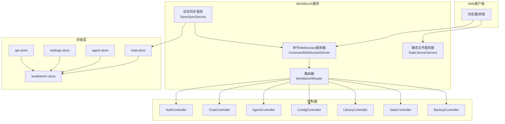
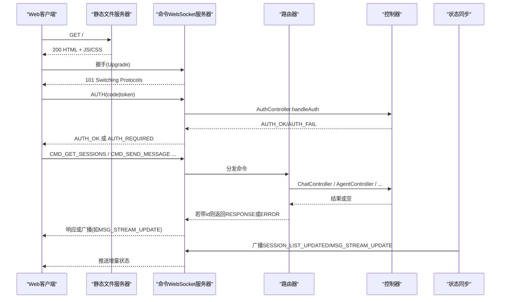
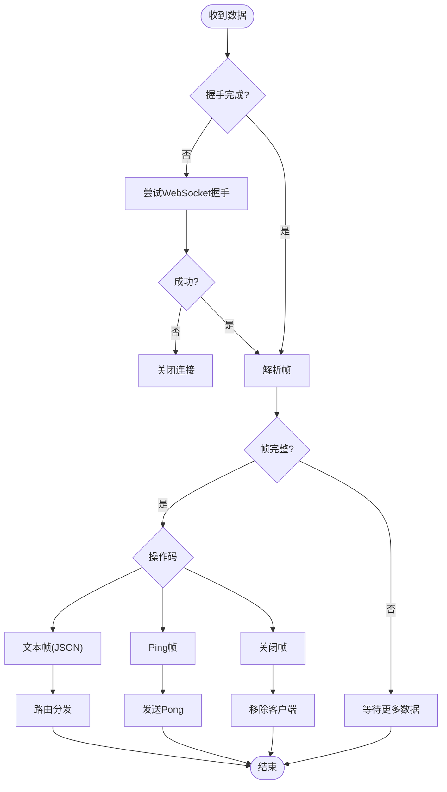
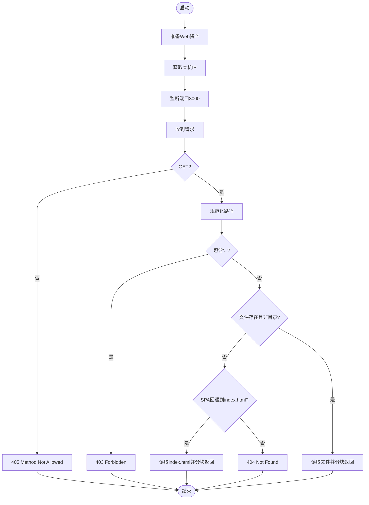
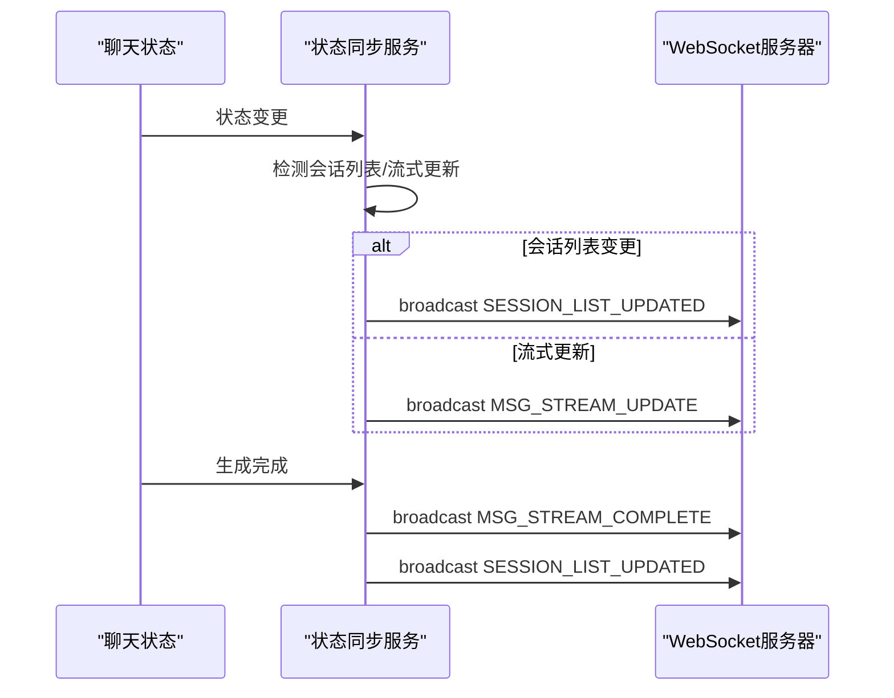
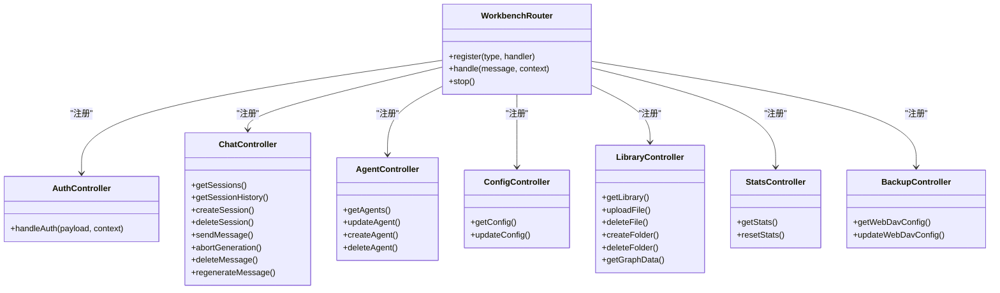
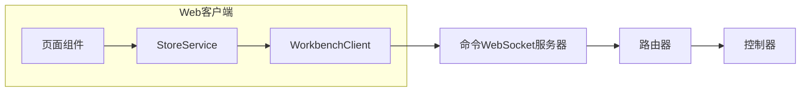
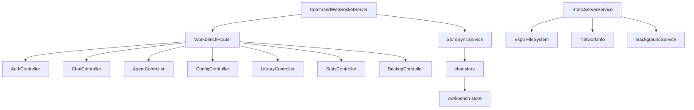
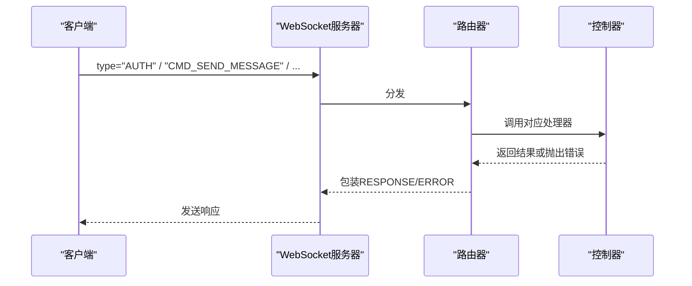
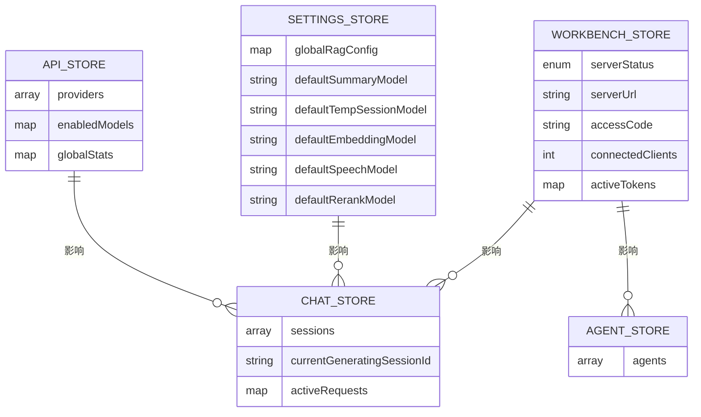

# Workbench远程管理

<cite>
**本文档引用的文件**
- [CommandWebSocketServer.ts](file://src/services/workbench/CommandWebSocketServer.ts)
- [StaticServerService.ts](file://src/services/workbench/StaticServerService.ts)
- [StoreSyncService.ts](file://src/services/workbench/StoreSyncService.ts)
- [WorkbenchRouter.ts](file://src/services/workbench/WorkbenchRouter.ts)
- [AgentController.ts](file://src/services/workbench/controllers/AgentController.ts)
- [AuthController.ts](file://src/services/workbench/controllers/AuthController.ts)
- [ChatController.ts](file://src/services/workbench/controllers/ChatController.ts)
- [ConfigController.ts](file://src/services/workbench/controllers/ConfigController.ts)
- [LibraryController.ts](file://src/services/workbench/controllers/LibraryController.ts)
- [StatsController.ts](file://src/services/workbench/controllers/StatsController.ts)
- [BackupController.ts](file://src/services/workbench/controllers/BackupController.ts)
- [workbench-store.ts](file://src/store/workbench-store.ts)
- [chat-store.ts](file://src/store/chat-store.ts)
- [agent-store.ts](file://src/store/agent-store.ts)
- [settings-store.ts](file://src/store/settings-store.ts)
- [api-store.ts](file://src/store/api-store.ts)
</cite>

## 目录
1. [简介](#简介)
2. [项目结构](#项目结构)
3. [核心组件](#核心组件)
4. [架构总览](#架构总览)
5. [详细组件分析](#详细组件分析)
6. [依赖关系分析](#依赖关系分析)
7. [性能考量](#性能考量)
8. [故障排除指南](#故障排除指南)
9. [结论](#结论)
10. [附录](#附录)

## 简介
本文件为Nexara Workbench远程管理功能的完整架构文档。Workbench通过内置的TCP-HTTP静态文件服务器与WebSocket命令服务器，向Web客户端提供远程管理能力。其核心目标包括：
- 实时通信：基于自定义WebSocket帧格式与路由机制，支持认证、命令分发与状态同步。
- 静态资源服务：在本地提供Web客户端资源，支持SPA回退与增量更新。
- 状态同步：监听应用内Zustand状态变化，向已认证客户端广播会话与流式消息更新。
- 远程管理功能：支持会话管理、Agent配置、知识库维护、系统设置与统计等。

## 项目结构
Workbench相关代码位于src/services/workbench目录，包含以下关键模块：
- 命令WebSocket服务器：负责TCP连接、握手、帧解析、命令路由与写队列。
- 静态文件服务器：负责资产准备、HTTP响应与分块传输。
- 状态同步服务：订阅Zustand状态，向客户端广播变更。
- 路由器：集中注册与分发命令处理器。
- 控制器：按功能域实现具体业务逻辑（认证、聊天、Agent、配置、知识库、统计、备份）。
- 存储层：工作台状态、聊天状态、Agent、设置与API配置等。

**图表来源**
- [CommandWebSocketServer.ts:33-178](file://src/services/workbench/CommandWebSocketServer.ts#L33-L178)
- [StaticServerService.ts:21-236](file://src/services/workbench/StaticServerService.ts#L21-L236)
- [StoreSyncService.ts:5-124](file://src/services/workbench/StoreSyncService.ts#L5-L124)
- [WorkbenchRouter.ts:18-72](file://src/services/workbench/WorkbenchRouter.ts#L18-L72)
- [AgentController.ts:4-47](file://src/services/workbench/controllers/AgentController.ts#L4-L47)
- [AuthController.ts:17-53](file://src/services/workbench/controllers/AuthController.ts#L17-L53)
- [ChatController.ts:5-129](file://src/services/workbench/controllers/ChatController.ts#L5-L129)
- [ConfigController.ts:5-69](file://src/services/workbench/controllers/ConfigController.ts#L5-L69)
- [LibraryController.ts:4-53](file://src/services/workbench/controllers/LibraryController.ts#L4-L53)
- [StatsController.ts:4-22](file://src/services/workbench/controllers/StatsController.ts#L4-L22)
- [BackupController.ts:6-28](file://src/services/workbench/controllers/BackupController.ts#L6-L28)
- [workbench-store.ts:22-55](file://src/store/workbench-store.ts#L22-L55)
- [chat-store.ts:108-210](file://src/store/chat-store.ts#L108-L210)
- [agent-store.ts:7-76](file://src/store/agent-store.ts#L7-L76)
- [settings-store.ts:10-73](file://src/store/settings-store.ts#L10-L73)
- [api-store.ts:9-36](file://src/store/api-store.ts#L9-L36)

**章节来源**
- [CommandWebSocketServer.ts:33-178](file://src/services/workbench/CommandWebSocketServer.ts#L33-L178)
- [StaticServerService.ts:21-236](file://src/services/workbench/StaticServerService.ts#L21-L236)
- [StoreSyncService.ts:5-124](file://src/services/workbench/StoreSyncService.ts#L5-L124)
- [WorkbenchRouter.ts:18-72](file://src/services/workbench/WorkbenchRouter.ts#L18-L72)

## 核心组件
- 命令WebSocket服务器
  - 监听端口，接受TCP连接，执行WebSocket握手，解析帧，分发命令，心跳检测与超时断开。
  - 写队列保证帧原子性，分片写提升可靠性。
- 静态文件服务器
  - 准备Web资源到本地目录，提供HTTP GET服务，支持SPA回退与分块传输。
- 状态同步服务
  - 订阅聊天状态，对会话列表变更与流式消息进行广播。
- 路由器
  - 注册命令类型与处理器，统一错误处理与请求-响应模式。
- 控制器
  - 实现认证、会话管理、Agent CRUD、配置同步、知识库操作、统计与备份等业务。

**章节来源**
- [CommandWebSocketServer.ts:33-178](file://src/services/workbench/CommandWebSocketServer.ts#L33-L178)
- [StaticServerService.ts:21-236](file://src/services/workbench/StaticServerService.ts#L21-L236)
- [StoreSyncService.ts:5-124](file://src/services/workbench/StoreSyncService.ts#L5-L124)
- [WorkbenchRouter.ts:18-72](file://src/services/workbench/WorkbenchRouter.ts#L18-L72)
- [AgentController.ts:4-47](file://src/services/workbench/controllers/AgentController.ts#L4-L47)
- [AuthController.ts:17-53](file://src/services/workbench/controllers/AuthController.ts#L17-L53)
- [ChatController.ts:5-129](file://src/services/workbench/controllers/ChatController.ts#L5-L129)
- [ConfigController.ts:5-69](file://src/services/workbench/controllers/ConfigController.ts#L5-L69)
- [LibraryController.ts:4-53](file://src/services/workbench/controllers/LibraryController.ts#L4-L53)
- [StatsController.ts:4-22](file://src/services/workbench/controllers/StatsController.ts#L4-L22)
- [BackupController.ts:6-28](file://src/services/workbench/controllers/BackupController.ts#L6-L28)

## 架构总览
Workbench采用“双服务器 + 多控制器”的架构：
- TCP-HTTP静态服务器：提供Web客户端资源，支持SPA路由。
- 自定义WebSocket服务器：承载命令与状态同步，支持认证与心跳。
- 路由器与控制器：解耦命令类型与业务逻辑，便于扩展。
- 状态同步：基于Zustand订阅，向客户端推送增量更新。

**图表来源**
- [CommandWebSocketServer.ts:134-178](file://src/services/workbench/CommandWebSocketServer.ts#L134-L178)
- [WorkbenchRouter.ts:34-71](file://src/services/workbench/WorkbenchRouter.ts#L34-L71)
- [AuthController.ts:17-53](file://src/services/workbench/controllers/AuthController.ts#L17-L53)
- [ChatController.ts:5-129](file://src/services/workbench/controllers/ChatController.ts#L5-L129)
- [StoreSyncService.ts:34-123](file://src/services/workbench/StoreSyncService.ts#L34-L123)

## 详细组件分析

### 命令WebSocket服务器
- 设计要点
  - 使用react-native-tcp-socket监听端口，支持端口冲突自动重试。
  - 手动实现WebSocket握手与帧解析，支持Ping/Pong与心跳超时。
  - 写队列与分片写，确保可靠传输；对二进制帧进行Base64编码跨桥传输。
  - 命令路由注册在启动时完成，运行时仅分发。
- 协议与消息格式
  - 帧头包含操作码(opcode)、长度与掩码位；支持短/长/超长长度。
  - 支持文本帧与二进制帧；客户端接收时强制二进制以规避严格UTF-8校验。
  - 心跳与超时：客户端发送HEARTBEAT，服务端30秒无心跳断开。
- 错误处理
  - 对常见网络错误静默移除客户端，避免崩溃。
  - 写失败抑制非致命错误，保证稳定性。

**图表来源**
- [CommandWebSocketServer.ts:192-297](file://src/services/workbench/CommandWebSocketServer.ts#L192-L297)

**章节来源**
- [CommandWebSocketServer.ts:33-178](file://src/services/workbench/CommandWebSocketServer.ts#L33-L178)
- [CommandWebSocketServer.ts:192-297](file://src/services/workbench/CommandWebSocketServer.ts#L192-L297)
- [CommandWebSocketServer.ts:307-413](file://src/services/workbench/CommandWebSocketServer.ts#L307-L413)
- [CommandWebSocketServer.ts:415-458](file://src/services/workbench/CommandWebSocketServer.ts#L415-L458)
- [CommandWebSocketServer.ts:460-484](file://src/services/workbench/CommandWebSocketServer.ts#L460-L484)

### 静态文件服务器
- 设计要点
  - 将Web客户端构建产物打包为require模块，启动前复制到本地目录。
  - 仅支持GET请求，对路径进行安全检查，禁止目录穿越。
  - SPA回退：未命中资源时回退到index.html，支持单页应用路由。
  - 分块写入，避免大文件一次性写入导致阻塞。
- 端口与URL
  - 监听端口3000，动态获取本机IPv4地址，生成访问URL。
- 后台服务
  - 启动后台服务与电池优化请求，保障长期运行。

**图表来源**
- [StaticServerService.ts:24-236](file://src/services/workbench/StaticServerService.ts#L24-L236)

**章节来源**
- [StaticServerService.ts:21-236](file://src/services/workbench/StaticServerService.ts#L21-L236)

### 状态同步服务
- 设计要点
  - 订阅聊天状态，区分会话列表变更与流式生成更新。
  - 会话列表变更：当ID集合或标题变化时广播SESSION_LIST_UPDATED。
  - 流式更新：检测assistant最新消息内容长度变化，广播MSG_STREAM_UPDATE；生成完成后广播MSG_STREAM_COMPLETE并刷新会话列表。
  - 缓存上次消息长度，避免频繁广播。
- 广播范围
  - 仅对已认证且完成握手的客户端广播。

**图表来源**
- [StoreSyncService.ts:34-123](file://src/services/workbench/StoreSyncService.ts#L34-L123)

**章节来源**
- [StoreSyncService.ts:5-124](file://src/services/workbench/StoreSyncService.ts#L5-L124)

### 路由器与控制器
- 路由器
  - 注册命令类型与处理器，统一处理请求-响应与错误。
  - 对未知命令返回ERROR，对带id的请求返回对应RESPONSE或ERROR。
- 控制器
  - 认证：支持PIN与令牌两种方式，令牌24小时有效期，定时清理过期令牌。
  - 聊天：会话列表、历史、创建、删除、发送消息、中断生成、删除/重生成消息。
  - Agent：查询、更新、创建、删除。
  - 配置：获取全局默认模型、RAG配置与提供商列表；全量同步提供商。
  - 知识库：获取库、上传/删除文件、创建/删除文件夹、获取图谱数据。
  - 统计：获取与重置令牌统计。
  - 备份：读取/保存WebDAV配置。

**图表来源**
- [WorkbenchRouter.ts:18-72](file://src/services/workbench/WorkbenchRouter.ts#L18-L72)
- [AuthController.ts:17-53](file://src/services/workbench/controllers/AuthController.ts#L17-L53)
- [ChatController.ts:5-129](file://src/services/workbench/controllers/ChatController.ts#L5-L129)
- [AgentController.ts:4-47](file://src/services/workbench/controllers/AgentController.ts#L4-L47)
- [ConfigController.ts:5-69](file://src/services/workbench/controllers/ConfigController.ts#L5-L69)
- [LibraryController.ts:4-53](file://src/services/workbench/controllers/LibraryController.ts#L4-L53)
- [StatsController.ts:4-22](file://src/services/workbench/controllers/StatsController.ts#L4-L22)
- [BackupController.ts:6-28](file://src/services/workbench/controllers/BackupController.ts#L6-L28)

**章节来源**
- [WorkbenchRouter.ts:18-72](file://src/services/workbench/WorkbenchRouter.ts#L18-L72)
- [AuthController.ts:17-53](file://src/services/workbench/controllers/AuthController.ts#L17-L53)
- [ChatController.ts:5-129](file://src/services/workbench/controllers/ChatController.ts#L5-L129)
- [AgentController.ts:4-47](file://src/services/workbench/controllers/AgentController.ts#L4-L47)
- [ConfigController.ts:5-69](file://src/services/workbench/controllers/ConfigController.ts#L5-L69)
- [LibraryController.ts:4-53](file://src/services/workbench/controllers/LibraryController.ts#L4-L53)
- [StatsController.ts:4-22](file://src/services/workbench/controllers/StatsController.ts#L4-L22)
- [BackupController.ts:6-28](file://src/services/workbench/controllers/BackupController.ts#L6-L28)

### 与Web客户端的集成架构
- 路由配置
  - 静态服务器仅处理GET请求，SPA回退到index.html，支持前端路由。
- 数据绑定与状态同步
  - 客户端通过WebSocket接收SESSION_LIST_UPDATED与MSG_STREAM_UPDATE，主动拉取最新数据或增量更新。
- 用户界面设计
  - Web客户端页面包含仪表盘、会话管理、知识库、设置等，通过StoreService与WorkbenchClient与服务器交互。

[本图为概念性架构示意，不直接映射具体源文件，故无图表来源]

## 依赖关系分析
- 服务器依赖
  - CommandWebSocketServer依赖WorkbenchRouter与各控制器，依赖StoreSyncService进行状态广播。
  - StaticServerService依赖Expo文件系统与网络信息，依赖后台服务。
- 存储依赖
  - 各控制器读取/写入Zustand存储（聊天、Agent、设置、API、工作台）。
  - StoreSyncService订阅聊天状态，间接依赖工作台状态用于客户端计数。

**图表来源**
- [CommandWebSocketServer.ts:7-15](file://src/services/workbench/CommandWebSocketServer.ts#L7-L15)
- [WorkbenchRouter.ts:18-72](file://src/services/workbench/WorkbenchRouter.ts#L18-L72)
- [StoreSyncService.ts:1-12](file://src/services/workbench/StoreSyncService.ts#L1-L12)
- [StaticServerService.ts:1-8](file://src/services/workbench/StaticServerService.ts#L1-L8)

**章节来源**
- [CommandWebSocketServer.ts:7-15](file://src/services/workbench/CommandWebSocketServer.ts#L7-L15)
- [StoreSyncService.ts:1-12](file://src/services/workbench/StoreSyncService.ts#L1-L12)
- [StaticServerService.ts:1-8](file://src/services/workbench/StaticServerService.ts#L1-L8)

## 性能考量
- 写队列与分片写
  - 通过写队列与1400字节分片降低丢包与阻塞风险，适合局域网环境。
- 分块传输
  - 静态服务器对大文件采用16KB分块写，避免内存峰值与阻塞。
- 状态广播策略
  - 会话列表变更采用“脏标记”广播，客户端按需拉取；流式更新广播完整内容，保证一致性。
- 超时与心跳
  - 30秒心跳超时断开无效连接，减少资源占用。
- 端口重试
  - 启动时若端口被占用自动重试，提升可用性。

[本节为通用性能讨论，无需列出章节来源]

## 故障排除指南
- 无法访问Web界面
  - 检查静态服务器端口3000是否被占用，确认已正确获取本机IP。
  - 查看服务器状态与URL是否设置成功。
- WebSocket连接失败
  - 确认客户端发起WebSocket升级请求，检查握手响应。
  - 观察服务端日志中的端口占用与重试信息。
- 认证失败
  - 确认输入PIN或令牌有效；令牌24小时过期，需重新获取。
- 消息不更新
  - 确认客户端已认证；检查StoreSyncService是否广播了MSG_STREAM_UPDATE。
  - 如长时间无更新，检查心跳与超时设置。
- 文件上传/知识库异常
  - 检查RAG存储加载与文件夹/文档操作是否成功。
  - 确认客户端请求的payload字段完整。

**章节来源**
- [StaticServerService.ts:24-236](file://src/services/workbench/StaticServerService.ts#L24-L236)
- [CommandWebSocketServer.ts:108-131](file://src/services/workbench/CommandWebSocketServer.ts#L108-L131)
- [AuthController.ts:17-53](file://src/services/workbench/controllers/AuthController.ts#L17-L53)
- [StoreSyncService.ts:79-123](file://src/services/workbench/StoreSyncService.ts#L79-L123)
- [LibraryController.ts:21-53](file://src/services/workbench/controllers/LibraryController.ts#L21-L53)

## 结论
Workbench通过轻量的TCP-HTTP静态服务器与自定义WebSocket服务器，实现了对Web客户端的远程管理能力。其设计强调：
- 明确的命令路由与控制器分离，便于扩展新功能。
- 基于Zustand的状态同步，确保客户端与本地应用状态一致。
- 稳健的错误处理与超时机制，保障在不稳定网络下的可用性。
建议在生产环境中结合网络安全策略（如TLS、访问控制）进一步加固，并根据负载情况优化广播频率与分片策略。

[本节为总结性内容，无需列出章节来源]

## 附录

### 命令类型与处理流程
- 认证类
  - AUTH：支持PIN或令牌认证，返回AUTH_OK或AUTH_FAIL。
- 会话类
  - CMD_GET_SESSIONS、CMD_GET_HISTORY、CMD_CREATE_SESSION、CMD_DELETE_SESSION、CMD_SEND_MESSAGE、CMD_ABORT_GENERATION、CMD_DELETE_MESSAGE、CMD_REGENERATE_MESSAGE。
- Agent类
  - CMD_GET_AGENTS、CMD_UPDATE_AGENT、CMD_CREATE_AGENT、CMD_DELETE_AGENT。
- 配置类
  - CMD_GET_CONFIG、CMD_UPDATE_CONFIG。
- 知识库类
  - CMD_GET_LIBRARY、CMD_UPLOAD_FILE、CMD_DELETE_FILE、CMD_CREATE_FOLDER、CMD_DELETE_FOLDER、CMD_GET_GRAPH。
- 统计类
  - CMD_GET_STATS、CMD_RESET_STATS。
- 备份类
  - CMD_GET_WEBDAV、CMD_UPDATE_WEBDAV。

**图表来源**
- [WorkbenchRouter.ts:34-71](file://src/services/workbench/WorkbenchRouter.ts#L34-L71)
- [AuthController.ts:17-53](file://src/services/workbench/controllers/AuthController.ts#L17-L53)
- [ChatController.ts:75-95](file://src/services/workbench/controllers/ChatController.ts#L75-L95)

### 存储层与状态同步
- 工作台状态
  - 服务器状态、访问码、活动令牌、连接客户端数量等。
- 聊天状态
  - 会话列表、消息、生成状态、RAG进度等。
- Agent状态
  - Agent列表、启用状态、默认模型等。
- 设置与API状态
  - 全局RAG配置、默认模型、提供商列表与启用状态等。

**图表来源**
- [workbench-store.ts:5-20](file://src/store/workbench-store.ts#L5-L20)
- [chat-store.ts:108-210](file://src/store/chat-store.ts#L108-L210)
- [agent-store.ts:7-15](file://src/store/agent-store.ts#L7-L15)
- [settings-store.ts:10-48](file://src/store/settings-store.ts#L10-L48)
- [api-store.ts:9-36](file://src/store/api-store.ts#L9-L36)