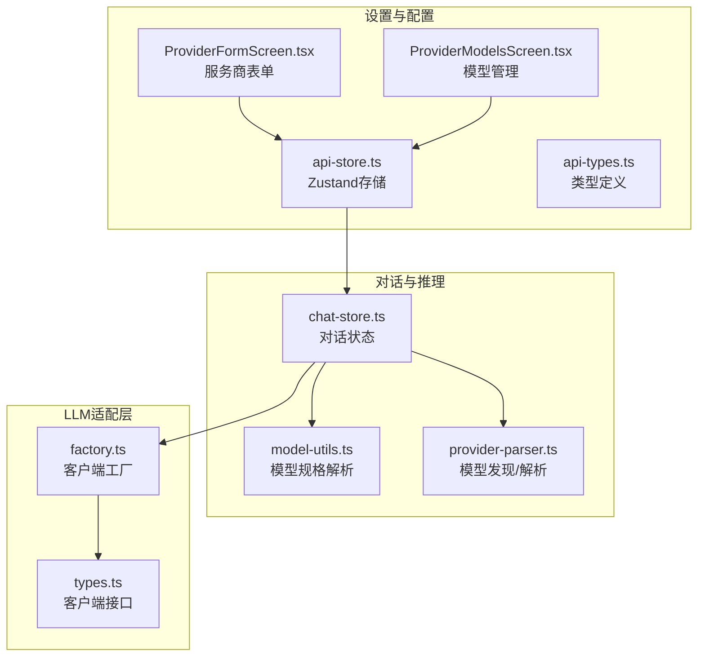
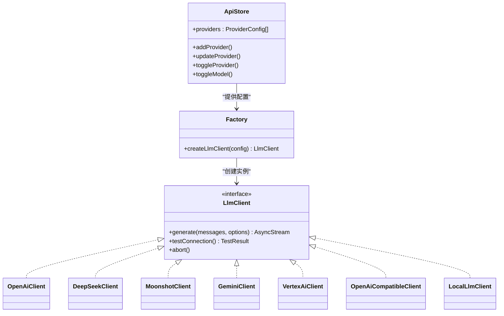
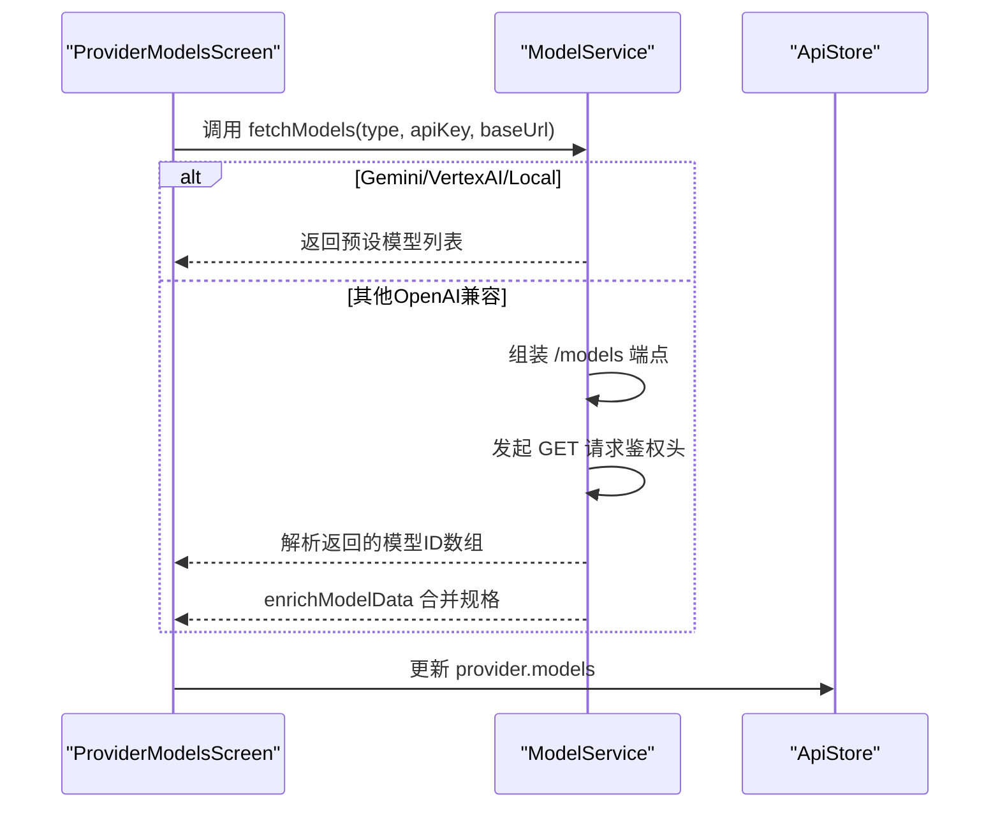
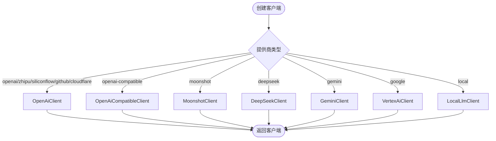
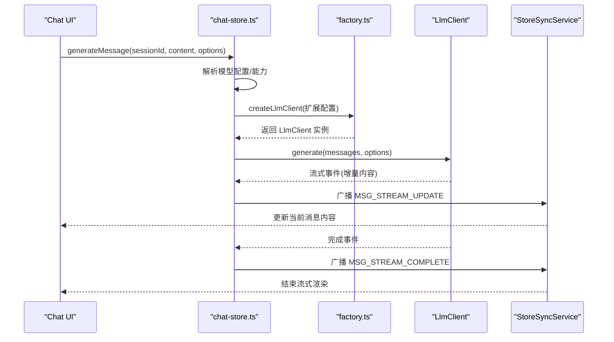
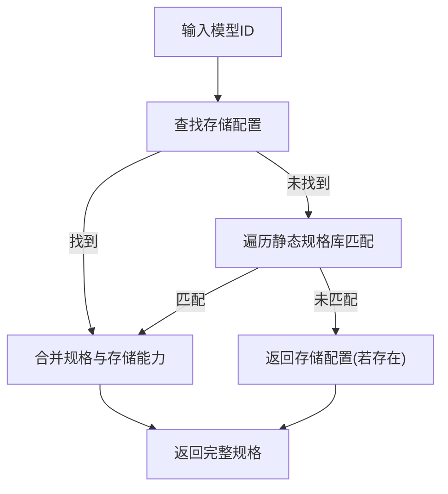
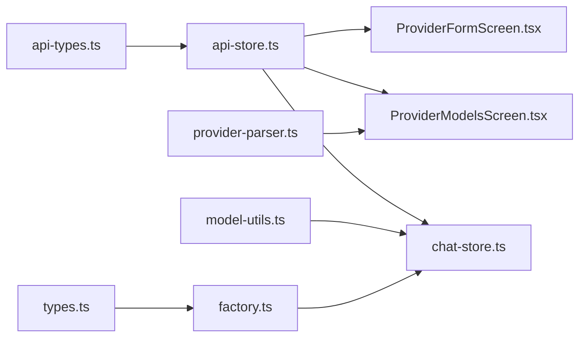

# 多提供商聊天系统

<cite>
**本文引用的文件**
- [src/lib/provider-parser.ts](file://src/lib/provider-parser.ts)
- [src/lib/llm/factory.ts](file://src/lib/llm/factory.ts)
- [src/lib/llm/types.ts](file://src/lib/llm/types.ts)
- [src/lib/llm/model-utils.ts](file://src/lib/llm/model-utils.ts)
- [src/store/api-store.ts](file://src/store/api-store.ts)
- [src/store/api-types.ts](file://src/store/api-types.ts)
- [src/store/chat-store.ts](file://src/store/chat-store.ts)
- [src/features/settings/screens/ProviderFormScreen.tsx](file://src/features/settings/screens/ProviderFormScreen.tsx)
- [src/features/settings/screens/ProviderModelsScreen.tsx](file://src/features/settings/screens/ProviderModelsScreen.tsx)
- [src/features/chat/utils/message-utils.ts](file://src/features/chat/utils/message-utils.ts)
- [src/services/workbench/StoreSyncService.ts](file://src/services/workbench/StoreSyncService.ts)
</cite>

## 目录
1. [简介](#简介)
2. [项目结构](#项目结构)
3. [核心组件](#核心组件)
4. [架构总览](#架构总览)
5. [详细组件分析](#详细组件分析)
6. [依赖关系分析](#依赖关系分析)
7. [性能考量](#性能考量)
8. [故障排除指南](#故障排除指南)
9. [结论](#结论)
10. [附录](#附录)

## 简介
本技术文档面向Nexara多提供商聊天系统，系统支持OpenAI、Anthropic、Gemini、Vertex AI、DeepSeek、Moonshot、智谱、SiliconFlow、GitHub Copilot、Cloudflare、本地模型等12+个AI服务商。文档重点阐述以下方面：
- LLM客户端工厂模式设计与模型发现机制
- 请求路由策略、错误处理与降级方案
- 流式响应处理、工具调用集成、图像生成与思维链推理模型支持
- 配置示例与最佳实践（API密钥管理、性能优化、故障排除）

## 项目结构
系统采用前端React Native/Expo应用与Web客户端双端架构，核心业务逻辑集中在src目录下，围绕“存储层（Zustand）+ 工厂模式（LLM客户端）+ 服务层（RAG/搜索/向量化）”组织。

**图表来源**
- [src/features/settings/screens/ProviderFormScreen.tsx:28-88](file://src/features/settings/screens/ProviderFormScreen.tsx#L28-L88)
- [src/features/settings/screens/ProviderModelsScreen.tsx:382-521](file://src/features/settings/screens/ProviderModelsScreen.tsx#L382-L521)
- [src/store/api-store.ts:38-161](file://src/store/api-store.ts#L38-L161)
- [src/store/api-types.ts:1-60](file://src/store/api-types.ts#L1-L60)
- [src/store/chat-store.ts:212-226](file://src/store/chat-store.ts#L212-L226)
- [src/lib/llm/model-utils.ts:25-68](file://src/lib/llm/model-utils.ts#L25-L68)
- [src/lib/provider-parser.ts:38-215](file://src/lib/provider-parser.ts#L38-L215)
- [src/lib/llm/factory.ts:23-96](file://src/lib/llm/factory.ts#L23-L96)
- [src/lib/llm/types.ts](file://src/lib/llm/types.ts)

**章节来源**
- [src/features/settings/screens/ProviderFormScreen.tsx:28-88](file://src/features/settings/screens/ProviderFormScreen.tsx#L28-L88)
- [src/features/settings/screens/ProviderModelsScreen.tsx:382-521](file://src/features/settings/screens/ProviderModelsScreen.tsx#L382-L521)
- [src/store/api-store.ts:38-161](file://src/store/api-store.ts#L38-L161)
- [src/store/api-types.ts:1-60](file://src/store/api-types.ts#L1-L60)
- [src/store/chat-store.ts:212-226](file://src/store/chat-store.ts#L212-L226)
- [src/lib/llm/model-utils.ts:25-68](file://src/lib/llm/model-utils.ts#L25-L68)
- [src/lib/provider-parser.ts:38-215](file://src/lib/provider-parser.ts#L38-L215)
- [src/lib/llm/factory.ts:23-96](file://src/lib/llm/factory.ts#L23-L96)

## 核心组件
- 服务商与模型配置存储：统一管理提供商类型、API密钥、基础URL、模型列表与启用状态。
- 模型发现与解析：自动拉取模型列表、解析模型能力、合并静态规格与用户配置。
- LLM客户端工厂：按提供商类型创建对应客户端，封装统一接口。
- 对话状态与流程编排：构建上下文、执行RAG检索、处理流式输出、工具调用与图像生成。
- 设置界面：便捷配置各提供商与模型，支持一键拉取、测试连接、批量开关。

**章节来源**
- [src/store/api-store.ts:38-161](file://src/store/api-store.ts#L38-L161)
- [src/lib/provider-parser.ts:38-215](file://src/lib/provider-parser.ts#L38-L215)
- [src/lib/llm/factory.ts:23-96](file://src/lib/llm/factory.ts#L23-L96)
- [src/store/chat-store.ts:360-750](file://src/store/chat-store.ts#L360-L750)
- [src/features/settings/screens/ProviderFormScreen.tsx:90-250](file://src/features/settings/screens/ProviderFormScreen.tsx#L90-L250)
- [src/features/settings/screens/ProviderModelsScreen.tsx:558-617](file://src/features/settings/screens/ProviderModelsScreen.tsx#L558-L617)

## 架构总览
系统采用“配置驱动 + 工厂模式 + 统一接口”的解耦架构：
- 配置驱动：通过Zustand存储提供商与模型配置，支持动态增删改与启用控制。
- 工厂模式：根据提供商类型创建具体客户端，屏蔽差异。
- 统一接口：所有客户端实现相同接口，便于在对话流程中切换与回退。
- 流式与工具：在对话状态中统一处理流式增量、工具调用、RAG检索与图像生成。

**图表来源**
- [src/store/api-store.ts:38-161](file://src/store/api-store.ts#L38-L161)
- [src/lib/llm/factory.ts:23-96](file://src/lib/llm/factory.ts#L23-L96)
- [src/lib/llm/types.ts](file://src/lib/llm/types.ts)
- [src/lib/llm/providers/openai.ts](file://src/lib/llm/providers/openai.ts)
- [src/lib/llm/providers/deepseek.ts](file://src/lib/llm/providers/deepseek.ts)
- [src/lib/llm/providers/moonshot.ts](file://src/lib/llm/providers/moonshot.ts)
- [src/lib/llm/providers/gemini.ts](file://src/lib/llm/providers/gemini.ts)
- [src/lib/llm/providers/vertexai.ts](file://src/lib/llm/providers/vertexai.ts)
- [src/lib/llm/providers/openai-compatible.ts](file://src/lib/llm/providers/openai-compatible.ts)
- [src/lib/llm/providers/local-llm.ts](file://src/lib/llm/providers/local-llm.ts)

## 详细组件分析

### 1) 服务商配置与模型发现
- 服务商表单：支持OpenAI、Anthropic、Gemini、VertexAI、智谱、Moonshot、DeepSeek、SiliconFlow、GitHub Models、Cloudflare、GitHub Copilot、OpenAI-Compatible等预设与自定义配置；VertexAI需导入服务账号JSON并校验关键字段。
- 模型管理：支持自动拉取模型列表、手动新增、批量开关、测试连接；拉取失败时降级使用预设模型并合并能力标记。

**图表来源**
- [src/features/settings/screens/ProviderModelsScreen.tsx:558-617](file://src/features/settings/screens/ProviderModelsScreen.tsx#L558-L617)
- [src/lib/provider-parser.ts:45-156](file://src/lib/provider-parser.ts#L45-L156)
- [src/lib/provider-parser.ts:195-214](file://src/lib/provider-parser.ts#L195-L214)

**章节来源**
- [src/features/settings/screens/ProviderFormScreen.tsx:90-250](file://src/features/settings/screens/ProviderFormScreen.tsx#L90-L250)
- [src/features/settings/screens/ProviderModelsScreen.tsx:558-617](file://src/features/settings/screens/ProviderModelsScreen.tsx#L558-L617)
- [src/lib/provider-parser.ts:38-215](file://src/lib/provider-parser.ts#L38-L215)

### 2) LLM客户端工厂模式
- 工厂根据提供商类型映射到具体客户端，传递统一的模型ID、温度、基础URL、嵌入/推理模式等参数。
- 支持OpenAI系列、DeepSeek、Moonshot、Gemini、VertexAI、OpenAI-Compatible、本地模型等。
- 客户端需实现统一接口（生成、测试连接、中止），便于在对话流程中切换与回退。

**图表来源**
- [src/lib/llm/factory.ts:23-96](file://src/lib/llm/factory.ts#L23-L96)

**章节来源**
- [src/lib/llm/factory.ts:23-96](file://src/lib/llm/factory.ts#L23-L96)
- [src/lib/llm/types.ts](file://src/lib/llm/types.ts)

### 3) 对话流程与上下文构建
- 会话加载与消息分页：按需从SQLite加载会话与消息，避免启动阻塞。
- 上下文构建：结合RAG检索结果、网络搜索结果、历史消息、系统提示词与技能工具，形成最终API消息数组。
- 流式输出：通过StoreSyncService监听状态变化，广播增量内容，保证本地LAN环境下的实时一致性。
- 工具调用与图像：根据模型能力决定是否允许视觉输入与工具调用；文件上传采用原生URI或文本抽取策略。

**图表来源**
- [src/store/chat-store.ts:360-750](file://src/store/chat-store.ts#L360-L750)
- [src/lib/llm/factory.ts:23-96](file://src/lib/llm/factory.ts#L23-L96)
- [src/services/workbench/StoreSyncService.ts:15-123](file://src/services/workbench/StoreSyncService.ts#L15-L123)

**章节来源**
- [src/store/chat-store.ts:228-287](file://src/store/chat-store.ts#L228-L287)
- [src/store/chat-store.ts:360-750](file://src/store/chat-store.ts#L360-L750)
- [src/services/workbench/StoreSyncService.ts:15-123](file://src/services/workbench/StoreSyncService.ts#L15-L123)

### 4) 模型规格解析与能力判定
- 优先从Zustand存储中查找模型配置，若不存在则回退到静态规格库，合并上下文长度、类型与能力标记。
- 支持“强制推理模型”“思维链配置支持”“高能力模型关键词”等策略，辅助对话流程的参数与行为决策。

**图表来源**
- [src/lib/llm/model-utils.ts:25-68](file://src/lib/llm/model-utils.ts#L25-L68)

**章节来源**
- [src/lib/llm/model-utils.ts:25-68](file://src/lib/llm/model-utils.ts#L25-L68)
- [src/lib/llm/model-utils.ts:75-107](file://src/lib/llm/model-utils.ts#L75-L107)
- [src/lib/llm/model-utils.ts:219-252](file://src/lib/llm/model-utils.ts#L219-L252)

### 5) 错误处理与降级方案
- 模型拉取失败：返回预设模型并合并能力标记，保证可用性。
- HTTP错误与HTML返回：识别404/403等异常与HTML错误页，抛出明确错误。
- RAG检索超时：设置30秒超时，避免主线程阻塞，失败时清理处理状态。
- 生成中止：通过activeRequests跟踪每个会话的活跃客户端，支持中止与清理。

**章节来源**
- [src/lib/provider-parser.ts:96-156](file://src/lib/provider-parser.ts#L96-L156)
- [src/store/chat-store.ts:677-686](file://src/store/chat-store.ts#L677-L686)
- [src/store/chat-store.ts:323-337](file://src/store/chat-store.ts#L323-L337)

## 依赖关系分析
- 存储层：ApiStore集中管理提供商与模型配置，被设置界面与对话流程共同依赖。
- 工厂层：工厂仅依赖类型枚举与客户端实现，耦合度低，易于扩展新提供商。
- 对话层：对话流程依赖模型规格解析、RAG检索、工具注册与消息格式化，形成强内聚的推理管线。
- 设置层：表单与模型管理负责配置输入与验证，保障后续推理的正确性。

**图表来源**
- [src/store/api-types.ts:1-60](file://src/store/api-types.ts#L1-L60)
- [src/store/api-store.ts:38-161](file://src/store/api-store.ts#L38-L161)
- [src/features/settings/screens/ProviderFormScreen.tsx:90-250](file://src/features/settings/screens/ProviderFormScreen.tsx#L90-L250)
- [src/features/settings/screens/ProviderModelsScreen.tsx:558-617](file://src/features/settings/screens/ProviderModelsScreen.tsx#L558-L617)
- [src/store/chat-store.ts:360-750](file://src/store/chat-store.ts#L360-L750)
- [src/lib/llm/model-utils.ts:25-68](file://src/lib/llm/model-utils.ts#L25-L68)
- [src/lib/provider-parser.ts:38-215](file://src/lib/provider-parser.ts#L38-L215)
- [src/lib/llm/factory.ts:23-96](file://src/lib/llm/factory.ts#L23-L96)
- [src/lib/llm/types.ts](file://src/lib/llm/types.ts)

**章节来源**
- [src/store/api-types.ts:1-60](file://src/store/api-types.ts#L1-L60)
- [src/store/api-store.ts:38-161](file://src/store/api-store.ts#L38-L161)
- [src/lib/llm/factory.ts:23-96](file://src/lib/llm/factory.ts#L23-L96)
- [src/store/chat-store.ts:360-750](file://src/store/chat-store.ts#L360-L750)

## 性能考量
- 按需加载：会话与消息采用分页加载，避免启动时全量读取。
- 流式传输：StoreSyncService广播增量内容，减少重复渲染与带宽占用。
- 模型规格缓存：优先命中存储配置，减少重复解析成本。
- RAG检索超时：30秒超时避免长时间阻塞UI线程。
- 文件处理：原生模型支持直接传入URI，非原生模型采用文本抽取策略，平衡性能与准确性。

[本节为通用指导，无需列出具体文件来源]

## 故障排除指南
- 模型拉取失败：检查API密钥与基础URL，确认返回为JSON而非HTML；若失败则使用预设模型。
- VertexAI配置错误：确保服务账号JSON包含必要字段，项目ID与区域正确。
- RAG检索卡住：检查数据库锁与检索逻辑，必要时重启应用或清理缓存。
- 生成无响应：检查activeRequests中是否存在活跃客户端，必要时中止并重试。
- 流式显示异常：确认StoreSyncService广播事件正常，UI侧订阅状态变更。

**章节来源**
- [src/lib/provider-parser.ts:96-156](file://src/lib/provider-parser.ts#L96-L156)
- [src/features/settings/screens/ProviderFormScreen.tsx:185-205](file://src/features/settings/screens/ProviderFormScreen.tsx#L185-L205)
- [src/store/chat-store.ts:677-686](file://src/store/chat-store.ts#L677-L686)
- [src/store/chat-store.ts:323-337](file://src/store/chat-store.ts#L323-L337)
- [src/services/workbench/StoreSyncService.ts:79-123](file://src/services/workbench/StoreSyncService.ts#L79-L123)

## 结论
Nexara通过“配置驱动 + 工厂模式 + 统一接口”的架构，实现了对12+个AI提供商的统一接入与灵活切换。模型发现与规格解析确保了能力与参数的正确性，对话流程整合了RAG、工具调用、图像与流式输出，满足复杂推理场景需求。配合完善的设置界面与错误降级策略，系统具备良好的可维护性与可扩展性。

[本节为总结性内容，无需列出具体文件来源]

## 附录

### A. 支持的提供商类型与预设
- 国际：OpenAI、Anthropic、Gemini、Cloudflare、GitHub Copilot、OpenAI-Compatible
- 中国：智谱、Moonshot、DeepSeek、SiliconFlow、GitHub Models（Azure）
- 本地：Local（Ollama等）

**章节来源**
- [src/store/api-types.ts:2-15](file://src/store/api-types.ts#L2-L15)
- [src/features/settings/screens/ProviderFormScreen.tsx:28-88](file://src/features/settings/screens/ProviderFormScreen.tsx#L28-L88)

### B. 配置示例与最佳实践
- API密钥管理：在服务商表单中填写，VertexAI需导入服务账号JSON；建议使用环境变量或安全存储。
- 模型拉取：首次配置后点击“拉取”，失败时使用预设模型；后续可手动调整能力与上下文长度。
- 性能优化：启用流式输出、按需加载、合理设置上下文窗口；对大文件采用文本抽取策略。
- 故障排除：检查HTTP状态与返回内容类型、确认RAG超时与数据库状态、中止异常生成任务。

**章节来源**
- [src/features/settings/screens/ProviderFormScreen.tsx:178-250](file://src/features/settings/screens/ProviderFormScreen.tsx#L178-L250)
- [src/features/settings/screens/ProviderModelsScreen.tsx:558-617](file://src/features/settings/screens/ProviderModelsScreen.tsx#L558-L617)
- [src/lib/provider-parser.ts:96-156](file://src/lib/provider-parser.ts#L96-L156)
- [src/store/chat-store.ts:677-686](file://src/store/chat-store.ts#L677-L686)