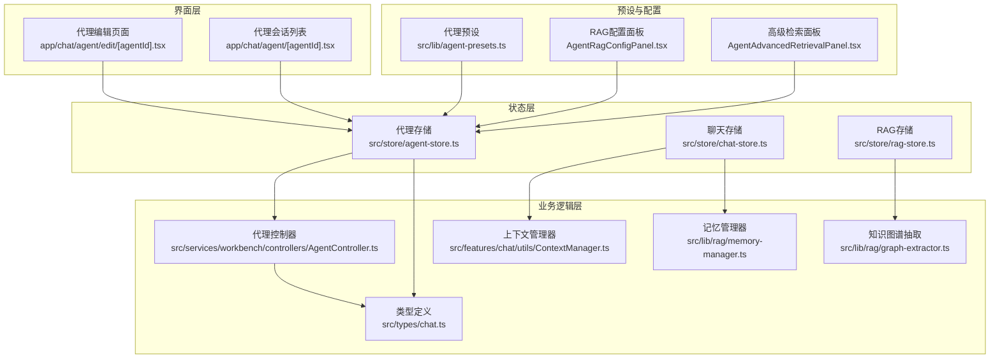
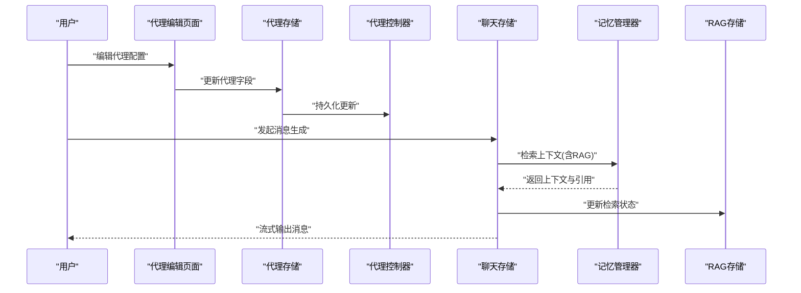
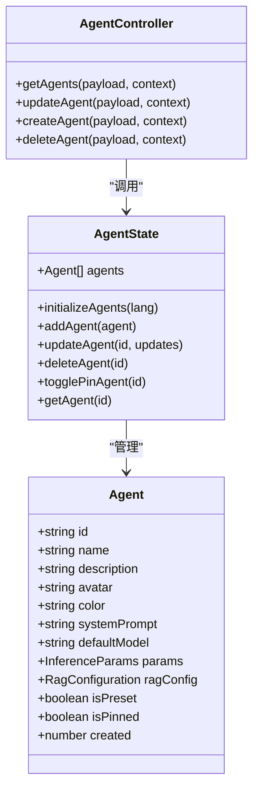
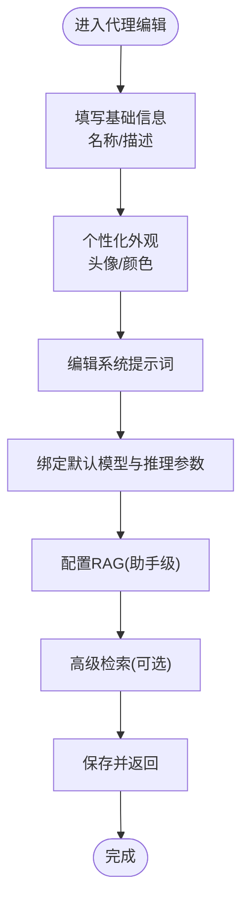
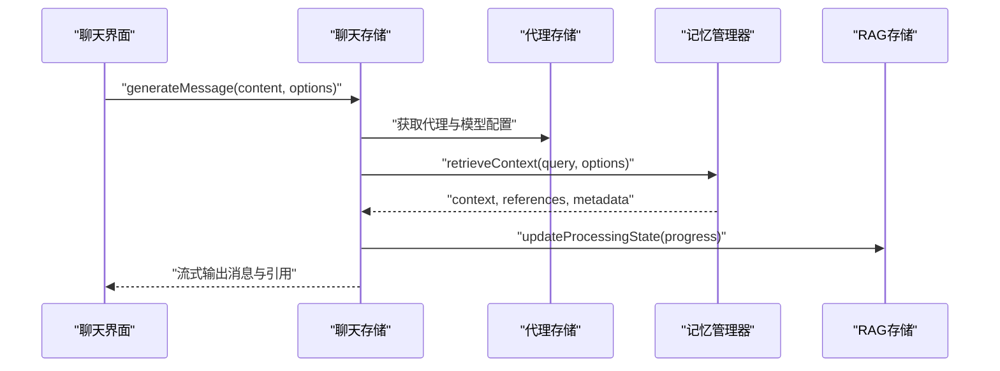
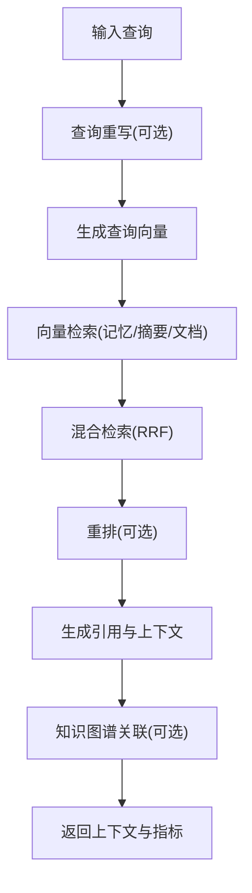
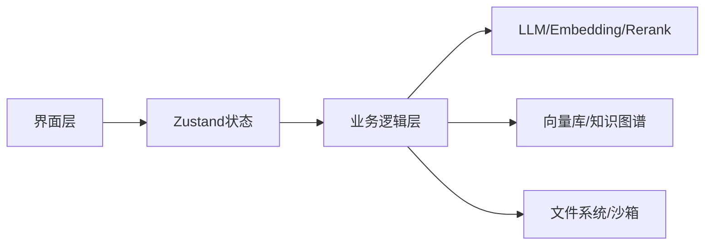

# 智能代理系统

<cite>
**本文档引用的文件**
- [src/lib/agent-presets.ts](file://src/lib/agent-presets.ts)
- [src/services/workbench/controllers/AgentController.ts](file://src/services/workbench/controllers/AgentController.ts)
- [src/store/agent-store.ts](file://src/store/agent-store.ts)
- [app/chat/agent/[agentId].tsx](file://app/chat/agent/[agentId].tsx)
- [app/chat/agent/edit/[agentId].tsx](file://app/chat/agent/edit/[agentId].tsx)
- [src/types/chat.ts](file://src/types/chat.ts)
- [src/features/settings/components/AgentRagConfigPanel.tsx](file://src/features/settings/components/AgentRagConfigPanel.tsx)
- [src/features/settings/components/AgentAdvancedRetrievalPanel.tsx](file://src/features/settings/components/AgentAdvancedRetrievalPanel.tsx)
- [src/store/chat-store.ts](file://src/store/chat-store.ts)
- [src/store/rag-store.ts](file://src/store/rag-store.ts)
- [src/features/chat/utils/ContextManager.ts](file://src/features/chat/utils/ContextManager.ts)
- [src/lib/rag/memory-manager.ts](file://src/lib/rag/memory-manager.ts)
- [src/lib/rag/graph-extractor.ts](file://src/lib/rag/graph-extractor.ts)
</cite>

## 目录
1. [简介](#简介)
2. [项目结构](#项目结构)
3. [核心组件](#核心组件)
4. [架构总览](#架构总览)
5. [详细组件分析](#详细组件分析)
6. [依赖关系分析](#依赖关系分析)
7. [性能考量](#性能考量)
8. [故障排查指南](#故障排查指南)
9. [结论](#结论)
10. [附录](#附录)

## 简介
本文件面向Nexara智能代理系统，系统性阐述代理的设计理念、预设模板、自定义流程、与RAG知识库的绑定机制、工具调用权限控制与执行模式配置，并提供调度算法、状态管理与性能监控的实现细节与使用案例。

## 项目结构
Nexara采用前端驱动的移动端应用架构，智能代理能力贯穿UI路由层、状态管理层、业务逻辑层与底层RAG/LLM服务层。关键模块包括：
- 代理定义与存储：预设代理、代理编辑与持久化
- 会话与聊天：会话管理、消息生成、工具执行与审批
- RAG检索：向量化检索、混合检索、重排、知识图谱增强
- 上下文管理：摘要与归档、令牌估算与上下文修剪
- 知识图谱：实体抽取与边建立

图表来源
- [app/chat/agent/edit/[agentId].tsx](file://app/chat/agent/edit/[agentId].tsx#L1-L566)
- [app/chat/agent/[agentId].tsx](file://app/chat/agent/[agentId].tsx#L1-L205)
- [src/store/agent-store.ts:1-77](file://src/store/agent-store.ts#L1-L77)
- [src/store/chat-store.ts:1-800](file://src/store/chat-store.ts#L1-L800)
- [src/store/rag-store.ts:1-800](file://src/store/rag-store.ts#L1-L800)
- [src/services/workbench/controllers/AgentController.ts:1-48](file://src/services/workbench/controllers/AgentController.ts#L1-L48)
- [src/lib/agent-presets.ts:1-130](file://src/lib/agent-presets.ts#L1-L130)
- [src/features/settings/components/AgentRagConfigPanel.tsx:1-309](file://src/features/settings/components/AgentRagConfigPanel.tsx#L1-L309)
- [src/features/settings/components/AgentAdvancedRetrievalPanel.tsx:1-521](file://src/features/settings/components/AgentAdvancedRetrievalPanel.tsx#L1-L521)

章节来源
- [src/store/agent-store.ts:1-77](file://src/store/agent-store.ts#L1-L77)
- [src/store/chat-store.ts:1-800](file://src/store/chat-store.ts#L1-L800)
- [src/store/rag-store.ts:1-800](file://src/store/rag-store.ts#L1-L800)

## 核心组件
- 代理预设与模板：提供翻译、编程、创意写作、情感陪伴、全局中枢等典型场景的系统提示词与默认模型绑定
- 代理存储与控制器：负责代理的增删改查、初始化与持久化
- 会话与聊天引擎：负责消息生成、工具执行、审批与执行模式控制
- RAG检索与知识图谱：负责检索、重排、混合检索、KG增强与向量化归档
- 上下文管理：负责摘要生成、向量清理与上下文修剪

章节来源
- [src/lib/agent-presets.ts:1-130](file://src/lib/agent-presets.ts#L1-L130)
- [src/store/agent-store.ts:1-77](file://src/store/agent-store.ts#L1-L77)
- [src/services/workbench/controllers/AgentController.ts:1-48](file://src/services/workbench/controllers/AgentController.ts#L1-L48)
- [src/store/chat-store.ts:1-800](file://src/store/chat-store.ts#L1-L800)
- [src/features/chat/utils/ContextManager.ts:1-482](file://src/features/chat/utils/ContextManager.ts#L1-L482)
- [src/lib/rag/memory-manager.ts:1-800](file://src/lib/rag/memory-manager.ts#L1-L800)
- [src/lib/rag/graph-extractor.ts:1-313](file://src/lib/rag/graph-extractor.ts#L1-L313)

## 架构总览
系统采用“界面层-状态层-业务逻辑层-服务层”的分层架构。界面层通过路由与页面组件与用户交互；状态层使用Zustand进行本地持久化；业务逻辑层封装LLM调用、RAG检索、工具执行与上下文管理；服务层对接外部API与本地向量库。

图表来源
- [app/chat/agent/edit/[agentId].tsx](file://app/chat/agent/edit/[agentId].tsx#L1-L566)
- [src/store/agent-store.ts:1-77](file://src/store/agent-store.ts#L1-L77)
- [src/services/workbench/controllers/AgentController.ts:1-48](file://src/services/workbench/controllers/AgentController.ts#L1-L48)
- [src/store/chat-store.ts:360-730](file://src/store/chat-store.ts#L360-L730)
- [src/lib/rag/memory-manager.ts:11-200](file://src/lib/rag/memory-manager.ts#L11-L200)
- [src/store/rag-store.ts:127-131](file://src/store/rag-store.ts#L127-L131)

## 详细组件分析

### 代理预设与模板
- 设计理念：针对不同任务场景提供专用系统提示词与温度参数，确保风格与质量符合预期
- 预设类型：情感陪伴、翻译专家、代码导师、创意写作、全局中枢（Nexus Hub）
- 默认模型绑定：如翻译与创意写作偏向高创造性模型，代码导师偏向稳健模型
- 全局中枢增强：内置RAG配置（重排、查询重写、混合检索、上下文窗口、摘要策略等）

章节来源
- [src/lib/agent-presets.ts:1-130](file://src/lib/agent-presets.ts#L1-L130)

### 代理存储与控制器
- 存储：Zustand + AsyncStorage，支持代理初始化、增删改查、置顶切换与回退机制
- 控制器：提供获取、更新、创建、删除代理的RPC式接口，便于工作台与远程调用

图表来源
- [src/types/chat.ts:15-35](file://src/types/chat.ts#L15-L35)
- [src/store/agent-store.ts:7-15](file://src/store/agent-store.ts#L7-L15)
- [src/services/workbench/controllers/AgentController.ts:4-47](file://src/services/workbench/controllers/AgentController.ts#L4-L47)

章节来源
- [src/store/agent-store.ts:1-77](file://src/store/agent-store.ts#L1-L77)
- [src/services/workbench/controllers/AgentController.ts:1-48](file://src/services/workbench/controllers/AgentController.ts#L1-L48)

### 代理编辑与自定义流程
- 界面入口：代理会话列表进入编辑页，支持头像选择、主题色、系统提示词编辑、模型与推理参数配置
- RAG配置入口：提供“助手级配置”与“继承全局配置”，支持快速预设与模板编辑
- 高级检索：启用/禁用重排、查询重写、混合检索，调节阈值与权重
- 模型选择：通过模型选择器绑定具体模型UUID，支持显示模型名称解析

图表来源
- [app/chat/agent/edit/[agentId].tsx](file://app/chat/agent/edit/[agentId].tsx#L57-L566)
- [src/features/settings/components/AgentRagConfigPanel.tsx:23-309](file://src/features/settings/components/AgentRagConfigPanel.tsx#L23-L309)
- [src/features/settings/components/AgentAdvancedRetrievalPanel.tsx:19-521](file://src/features/settings/components/AgentAdvancedRetrievalPanel.tsx#L19-L521)

章节来源
- [app/chat/agent/edit/[agentId].tsx](file://app/chat/agent/edit/[agentId].tsx#L1-L566)
- [src/features/settings/components/AgentRagConfigPanel.tsx:1-309](file://src/features/settings/components/AgentRagConfigPanel.tsx#L1-L309)
- [src/features/settings/components/AgentAdvancedRetrievalPanel.tsx:1-521](file://src/features/settings/components/AgentAdvancedRetrievalPanel.tsx#L1-L521)

### 会话与消息生成流程
- 生成入口：聊天存储提供生成消息方法，按会话与代理配置解析模型、拼装上下文
- RAG检索：根据会话与代理RAG配置，调用记忆管理器进行检索，支持查询重写、向量检索、混合检索与重排
- 工具执行：根据会话选项与技能注册表，决定是否启用工具，支持半自动/手动审批模式
- 流式输出：通过消息内容更新与进度回调，实时展示检索进度与引用

图表来源
- [src/store/chat-store.ts:360-730](file://src/store/chat-store.ts#L360-L730)
- [src/lib/rag/memory-manager.ts:11-200](file://src/lib/rag/memory-manager.ts#L11-L200)
- [src/store/rag-store.ts:127-131](file://src/store/rag-store.ts#L127-L131)

章节来源
- [src/store/chat-store.ts:1-800](file://src/store/chat-store.ts#L1-L800)
- [src/lib/rag/memory-manager.ts:1-800](file://src/lib/rag/memory-manager.ts#L1-L800)
- [src/store/rag-store.ts:1-800](file://src/store/rag-store.ts#L1-L800)

### RAG检索与知识图谱增强
- 检索阶段：查询重写、嵌入向量化、并行向量检索、混合检索（RRF融合）、重排、知识图谱关联
- 授权范围：支持全局/按文档/按文件夹授权，KG边过滤确保隐私
- 指标与可观测性：记录检索耗时、召回数、最终数、最大相似度、查询变体与来源分布
- KG抽取：基于LLM抽取实体与关系，入库并支持增量与批量策略

图表来源
- [src/lib/rag/memory-manager.ts:120-712](file://src/lib/rag/memory-manager.ts#L120-L712)
- [src/lib/rag/graph-extractor.ts:149-313](file://src/lib/rag/graph-extractor.ts#L149-L313)
- [src/store/rag-store.ts:98-131](file://src/store/rag-store.ts#L98-L131)

章节来源
- [src/lib/rag/memory-manager.ts:1-800](file://src/lib/rag/memory-manager.ts#L1-L800)
- [src/lib/rag/graph-extractor.ts:1-313](file://src/lib/rag/graph-extractor.ts#L1-L313)
- [src/store/rag-store.ts:1-800](file://src/store/rag-store.ts#L1-L800)

### 上下文管理与摘要
- 摘要触发：当超出活跃窗口的消息数量达到阈值时，批量生成摘要并写入向量库
- 摘要模型：支持自定义摘要模型，回退到可用模型，统计令牌用量
- 向量清理：删除被摘要覆盖的记忆向量，降低冗余

章节来源
- [src/features/chat/utils/ContextManager.ts:28-482](file://src/features/chat/utils/ContextManager.ts#L28-L482)

### 执行模式与工具调用权限
- 执行模式：自动、半自动、手动，支持暂停/恢复与审批请求
- 工具权限：根据会话选项与技能注册表启用/禁用工具，支持MCP服务器与技能开关
- 审批流程：半自动/手动模式下，工具调用需用户批准，支持续杯额度与自动轮数限制

章节来源
- [src/types/chat.ts:169-223](file://src/types/chat.ts#L169-L223)
- [src/store/chat-store.ts:200-210](file://src/store/chat-store.ts#L200-L210)

## 依赖关系分析
- 低耦合：界面层通过状态层间接依赖业务逻辑层，业务逻辑层通过工厂与存储解耦外部服务
- 数据一致性：代理与会话配置通过Zustand持久化，RAG状态通过独立存储统一管理
- 外部依赖：LLM提供商、嵌入模型、重排模型、知识图谱抽取模型均通过配置解析与运行时选择

图表来源
- [src/store/agent-store.ts:1-77](file://src/store/agent-store.ts#L1-L77)
- [src/store/chat-store.ts:1-800](file://src/store/chat-store.ts#L1-L800)
- [src/store/rag-store.ts:1-800](file://src/store/rag-store.ts#L1-L800)

章节来源
- [src/store/agent-store.ts:1-77](file://src/store/agent-store.ts#L1-L77)
- [src/store/chat-store.ts:1-800](file://src/store/chat-store.ts#L1-L800)
- [src/store/rag-store.ts:1-800](file://src/store/rag-store.ts#L1-L800)

## 性能考量
- 检索性能：并行向量检索、混合检索与重排，结合超时与进度回调，避免UI阻塞
- 摘要与归档：批量摘要与向量清理，减少冗余，提升检索效率
- 令牌估算：本地估算与API用量结合，支持真实计费与可视化
- UI响应：RAG进度状态与检索指标上报，保障用户体验

## 故障排查指南
- RAG检索超时：检查检索阶段回调与超时逻辑，确认嵌入与重排模型可用性
- 摘要失败：检查摘要模型解析与回退逻辑，关注令牌用量统计
- 知识图谱抽取失败：检查模型解析与JSON解析逻辑，查看错误状态上报
- 代理配置丢失：确认初始化逻辑与回退机制，检查预设代理映射

章节来源
- [src/store/chat-store.ts:670-730](file://src/store/chat-store.ts#L670-L730)
- [src/features/chat/utils/ContextManager.ts:182-347](file://src/features/chat/utils/ContextManager.ts#L182-L347)
- [src/lib/rag/graph-extractor.ts:178-313](file://src/lib/rag/graph-extractor.ts#L178-L313)

## 结论
Nexara智能代理系统通过预设模板与灵活的自定义配置，结合完善的RAG检索、知识图谱增强与上下文管理，实现了面向多场景的高质量对话体验。其分层架构与状态管理保证了可维护性与可扩展性，同时通过可观测性与性能优化提升了稳定性与用户体验。

## 附录
- 实际使用案例
  - 翻译专家：适用于多语言本地化场景，强调“信达雅”与文化适配
  - 代码导师：面向技术问答与重构建议，强调最佳实践与风险提示
  - 创意写作：面向故事与文案创作，强调灵感与修辞技巧
  - 全局中枢：面向全局检索与系统级操作，强调权威性与综合性
- 配置示例
  - 系统提示词：根据任务角色定制，明确语气、风格与边界
  - 模型绑定：依据任务特性选择稳健或高创造性模型
  - RAG策略：根据知识规模与隐私需求选择重排、混合检索与KG增强
  - 执行模式：根据任务复杂度选择自动/半自动/手动，配合工具权限与审批