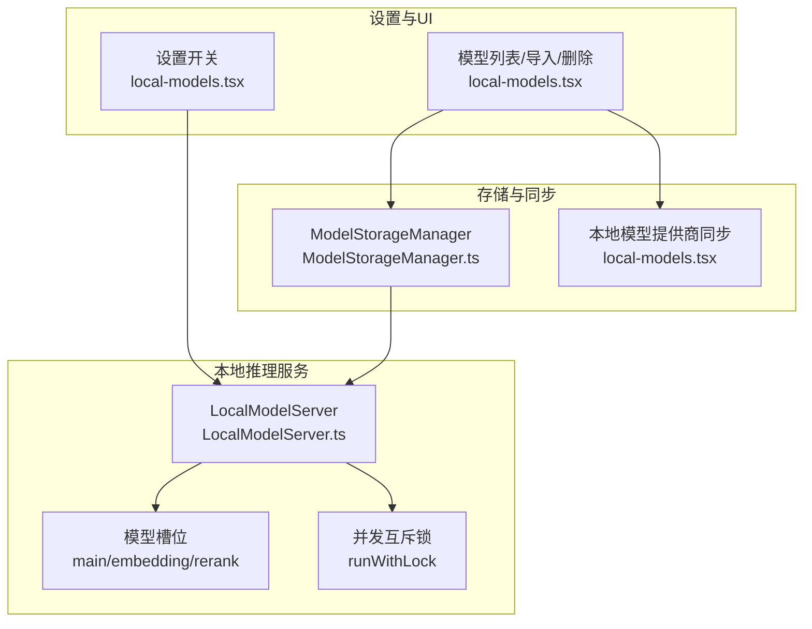
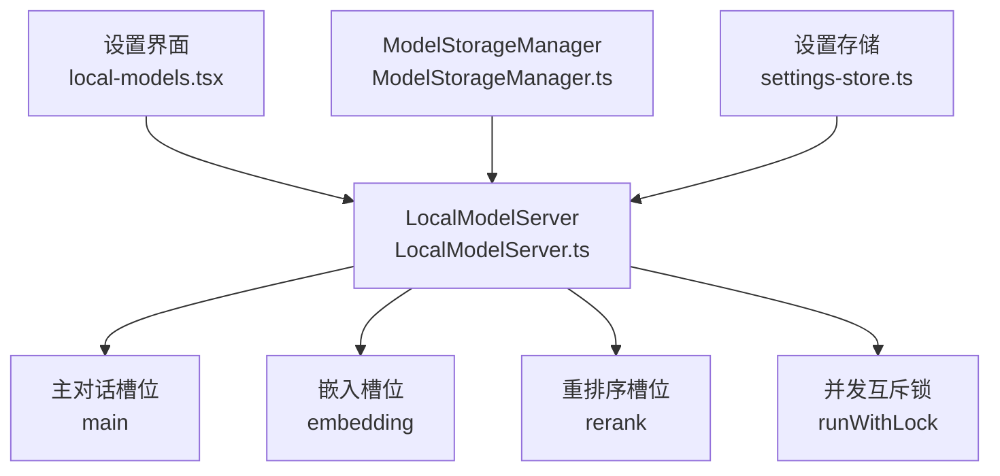
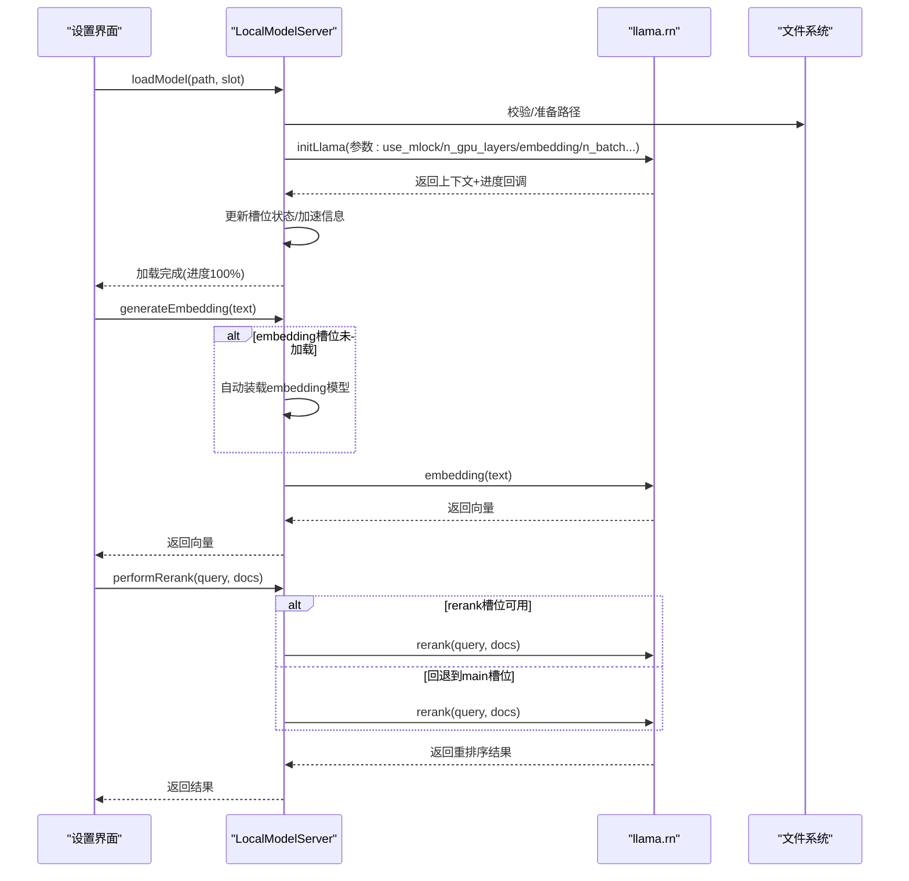
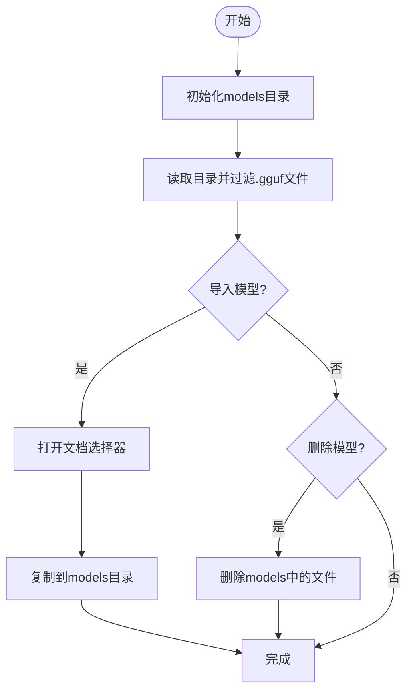
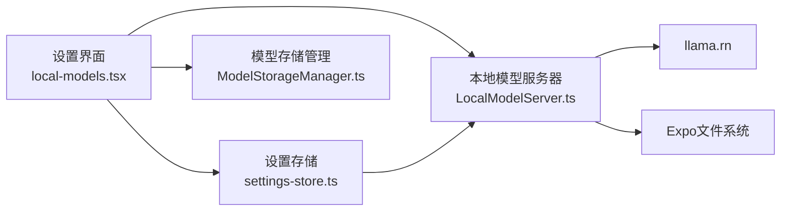

# 本地推理引擎

<cite>
**本文引用的文件**
- [LocalModelServer.ts](file://src/lib/local-inference/LocalModelServer.ts)
- [ModelStorageManager.ts](file://src/lib/local-inference/ModelStorageManager.ts)
- [local-models.tsx](file://app/settings/local-models.tsx)
- [settings-store.ts](file://src/store/settings-store.ts)
- [model-specs.ts](file://src/lib/llm/model-specs.ts)
- [vectorization-queue.ts](file://src/lib/rag/vectorization-queue.ts)
- [ContextManager.ts](file://src/features/chat/utils/ContextManager.ts)
- [model-prompts.ts](file://src/lib/llm/model-prompts.ts)
- [chat-store.ts](file://src/store/chat-store.ts)
- [audit-report-final.md](file://docs/audit-report-final.md)
- [comprehensive-defect-analysis.md](file://docs/comprehensive-defect-analysis.md)
</cite>

## 目录
1. [简介](#简介)
2. [项目结构](#项目结构)
3. [核心组件](#核心组件)
4. [架构总览](#架构总览)
5. [详细组件分析](#详细组件分析)
6. [依赖关系分析](#依赖关系分析)
7. [性能考量](#性能考量)
8. [故障排查指南](#故障排查指南)
9. [结论](#结论)
10. [附录](#附录)

## 简介
本文件面向Nexara的实验性本地推理引擎，围绕基于llama.rn的GGUF模型运行架构展开，重点说明三槽位（主对话、嵌入、重排序）的设计与资源分配策略，解释GPU加速支持、内存管理与性能优化，介绍模型存储与版本更新机制，并提供完整的本地推理配置指南与离线最佳实践。

## 项目结构
本地推理引擎主要由三层构成：
- 设置与入口：设置开关、模型导入/删除、槽位装载与卸载、硬件加速信息展示
- 推理服务：统一的本地模型服务器，负责初始化上下文、并发互斥、生成、向量化、重排序
- 存储与同步：模型文件目录管理、与“本地模型”提供商配置的同步

图表来源
- [local-models.tsx:43-447](file://app/settings/local-models.tsx#L43-L447)
- [LocalModelServer.ts:57-381](file://src/lib/local-inference/LocalModelServer.ts#L57-L381)
- [ModelStorageManager.ts:13-102](file://src/lib/local-inference/ModelStorageManager.ts#L13-L102)

章节来源
- [local-models.tsx:43-447](file://app/settings/local-models.tsx#L43-L447)
- [LocalModelServer.ts:57-381](file://src/lib/local-inference/LocalModelServer.ts#L57-L381)
- [ModelStorageManager.ts:13-102](file://src/lib/local-inference/ModelStorageManager.ts#L13-L102)

## 核心组件
- 本地模型服务器（LocalModelServer）
  - 提供三槽位上下文管理：main（主对话）、embedding（向量化）、rerank（重排序）
  - 初始化与装载：通过llama.rn的initLlama创建上下文，支持进度回调与硬件加速信息
  - 并发控制：使用runWithLock确保同一上下文的连续且串行的操作
  - 推理接口：completion（主对话）、generateEmbedding（向量化）、performRerank（重排序）
  - 自动装载：根据设置与持久化记录，在应用启动后延迟自动加载
- 模型存储管理（ModelStorageManager）
  - 确保models目录存在
  - 列举GGUF模型、导入模型、删除模型
  - 与UI侧的“本地模型”提供商配置保持同步
- 设置存储（settings-store）
  - 本地模型开关localModelsEnabled
  - 全局RAG配置（包含重排序等高级检索参数）
- 模型规格与提示（model-specs.ts、model-prompts.ts）
  - 模型规格：上下文长度、类型（重排序等）
  - 系统提示组装：根据模型家族与能力组装系统提示
- 向量化与知识图谱（vectorization-queue.ts、ContextManager.ts）
  - 文档与记忆向量化队列
  - 内存向量清理与去重

章节来源
- [LocalModelServer.ts:11-381](file://src/lib/local-inference/LocalModelServer.ts#L11-L381)
- [ModelStorageManager.ts:13-102](file://src/lib/local-inference/ModelStorageManager.ts#L13-L102)
- [settings-store.ts:58-244](file://src/store/settings-store.ts#L58-L244)
- [model-specs.ts:271-323](file://src/lib/llm/model-specs.ts#L271-L323)
- [model-prompts.ts:66-85](file://src/lib/llm/model-prompts.ts#L66-L85)
- [vectorization-queue.ts:39-144](file://src/lib/rag/vectorization-queue.ts#L39-L144)
- [ContextManager.ts:403-441](file://src/features/chat/utils/ContextManager.ts#L403-L441)

## 架构总览
本地推理采用“三槽位”隔离设计，分别承载不同职责：
- 主对话槽位（main）：承载聊天生成与可选嵌入能力
- 嵌入槽位（embedding）：独立承载向量化，避免与主对话共享资源
- 重排序槽位（rerank）：独立承载交叉编码重排序，或回退到主槽位

图表来源
- [local-models.tsx:43-447](file://app/settings/local-models.tsx#L43-L447)
- [LocalModelServer.ts:57-381](file://src/lib/local-inference/LocalModelServer.ts#L57-L381)
- [ModelStorageManager.ts:13-102](file://src/lib/local-inference/ModelStorageManager.ts#L13-L102)
- [settings-store.ts:58-244](file://src/store/settings-store.ts#L58-L244)

## 详细组件分析

### 本地模型服务器（LocalModelServer）
- 槽位状态与生命周期
  - 每个槽位保存context、modelPath、isLoaded、loadProgress、accelerationInfo
  - 支持按槽位卸载与重新装载，释放旧上下文后再加载新模型
- 初始化与装载参数
  - 使用use_mlock提升内存锁定稳定性
  - n_gpu_layers设置为较高层数以启用GPU/NPU加速
  - embedding设为true，保证所有槽位均具备嵌入能力
  - n_batch与n_ubatch显式设置，防止溢出
- 并发与互斥
  - runWithLock基于WeakMap实现每个上下文的串行化操作，避免竞态
- 推理接口
  - completion：主对话生成，带isGenerating状态
  - stopCompletion：停止生成
  - generateEmbedding：严格要求embedding槽位，不回退到主槽位；空文本直接报错
  - performRerank：优先使用rerank槽位，否则回退到main槽位
- 自动装载
  - initialize：读取lastLoadedModel、lastEmbeddingModel、lastRerankModel并尝试装载
  - onRehydrateStorage：应用启动后延迟3秒自动装载，避免启动崩溃
  - 受全局开关localModelsEnabled控制

图表来源
- [LocalModelServer.ts:161-335](file://src/lib/local-inference/LocalModelServer.ts#L161-L335)

章节来源
- [LocalModelServer.ts:11-381](file://src/lib/local-inference/LocalModelServer.ts#L11-L381)

### 模型存储管理（ModelStorageManager）
- 目录与列举
  - models目录位于documentDirectory/models/
  - 仅列出扩展名为.gguf的文件
- 导入与删除
  - 导入：通过DocumentPicker选择文件，复制到models目录
  - 删除：按文件名删除对应模型文件
- 与设置界面同步
  - 设置界面在刷新时同步models到本地提供商的模型列表，用于后续推理选择

图表来源
- [ModelStorageManager.ts:13-102](file://src/lib/local-inference/ModelStorageManager.ts#L13-L102)
- [local-models.tsx:60-101](file://app/settings/local-models.tsx#L60-L101)

章节来源
- [ModelStorageManager.ts:13-102](file://src/lib/local-inference/ModelStorageManager.ts#L13-L102)
- [local-models.tsx:60-101](file://app/settings/local-models.tsx#L60-L101)

### 设置与UI（local-models.tsx）
- 开关控制
  - localModelsEnabled：决定是否启用本地模型功能
  - 启用时自动创建/启用“本地模型”提供商，并同步模型列表
- 状态展示
  - 显示各槽位加载状态、硬件加速信息（GPU/NPU或CPU）
- 模型操作
  - 导入：触发ModelStorageManager.importModel
  - 删除：删除models中的文件并尝试卸载当前槽位
  - 加载：按槽位装载模型，支持卸载切换

章节来源
- [local-models.tsx:43-447](file://app/settings/local-models.tsx#L43-L447)
- [settings-store.ts:197-199](file://src/store/settings-store.ts#L197-L199)

### 模型规格与提示（model-specs.ts、model-prompts.ts）
- 模型规格
  - 定义重排序类模型的上下文长度与类型，辅助RAG配置
- 系统提示组装
  - 根据模型家族与能力组装系统提示，兼容多模型族

章节来源
- [model-specs.ts:271-323](file://src/lib/llm/model-specs.ts#L271-L323)
- [model-prompts.ts:66-85](file://src/lib/llm/model-prompts.ts#L66-L85)

### 向量化与知识图谱（vectorization-queue.ts、ContextManager.ts）
- 向量化队列
  - 支持文档与记忆两类任务，持久化到数据库，异步处理
  - 内存任务包含内容清洗，避免大体积Base64数据
- 内存向量清理
  - 基于消息ID范围精确删除，降低冗余

章节来源
- [vectorization-queue.ts:39-144](file://src/lib/rag/vectorization-queue.ts#L39-L144)
- [ContextManager.ts:403-441](file://src/features/chat/utils/ContextManager.ts#L403-L441)

## 依赖关系分析
- 组件耦合
  - LocalModelServer依赖llama.rn与文件系统，内部通过mutexMap实现上下文级互斥
  - 设置界面依赖LocalModelServer与ModelStorageManager，同时与设置存储联动
- 外部依赖
  - llama.rn：模型初始化、生成、嵌入、重排序
  - Expo文件系统：模型文件读写与目录管理
  - AsyncStorage：本地持久化（设置与模型槽位记录）

图表来源
- [local-models.tsx:43-447](file://app/settings/local-models.tsx#L43-L447)
- [settings-store.ts:58-244](file://src/store/settings-store.ts#L58-L244)
- [ModelStorageManager.ts:13-102](file://src/lib/local-inference/ModelStorageManager.ts#L13-L102)
- [LocalModelServer.ts:1-10](file://src/lib/local-inference/LocalModelServer.ts#L1-L10)

章节来源
- [local-models.tsx:43-447](file://app/settings/local-models.tsx#L43-L447)
- [settings-store.ts:58-244](file://src/store/settings-store.ts#L58-L244)
- [LocalModelServer.ts:1-10](file://src/lib/local-inference/LocalModelServer.ts#L1-L10)

## 性能考量
- GPU/NPU加速
  - n_gpu_layers设置为较高层数，优先启用硬件加速
  - accelerationInfo提供GPU可用性与原因说明
- 批处理与上下文
  - n_batch与n_ubatch显式设置，避免溢出
  - n_ctx在主对话槽位默认较大，兼顾体验与性能
- 并发与互斥
  - runWithLock确保同一上下文串行化，避免竞态与崩溃
- 自动装载策略
  - 启动后延迟3秒自动装载，减少启动卡顿与崩溃风险
- 向量化与重排序
  - 重排序优先使用专用槽位，回退到主槽位；向量化严格使用embedding槽位

章节来源
- [LocalModelServer.ts:182-205](file://src/lib/local-inference/LocalModelServer.ts#L182-L205)
- [LocalModelServer.ts:350-377](file://src/lib/local-inference/LocalModelServer.ts#L350-L377)

## 故障排查指南
- 模型加载失败
  - 检查模型路径与文件是否存在
  - 查看错误信息与加速信息（reasonNoGPU）
  - 确认n_gpu_layers与embedding参数设置
- 向量化失败
  - 确认embedding槽位已加载
  - 确认输入文本非空
  - 查看native embedding错误日志
- 重排序无结果
  - 确认rerank槽位是否可用，否则回退到主槽位
  - 检查模型是否支持交叉编码
- 启动卡顿或崩溃
  - 关闭自动装载或延后装载
  - 降低n_gpu_layers或调整batch大小
- 运维与监控现状
  - 当前仓库审计报告指出缺少监控、结构化日志、性能指标与故障恢复机制
  - 建议在生产环境补充日志与健康检查

章节来源
- [LocalModelServer.ts:231-236](file://src/lib/local-inference/LocalModelServer.ts#L231-L236)
- [LocalModelServer.ts:312-316](file://src/lib/local-inference/LocalModelServer.ts#L312-L316)
- [LocalModelServer.ts:321-325](file://src/lib/local-inference/LocalModelServer.ts#L321-L325)
- [audit-report-final.md:317-511](file://docs/audit-report-final.md#L317-L511)
- [comprehensive-defect-analysis.md:237-265](file://docs/comprehensive-defect-analysis.md#L237-L265)

## 结论
Nexara的本地推理引擎通过三槽位隔离实现了对话、向量化与重排序的解耦，结合llama.rn的硬件加速与严格的并发控制，提供了较为稳定的离线推理能力。配合设置界面与存储管理，用户可以灵活地导入、装载与卸载模型。建议在生产环境中补齐监控与日志体系，以进一步提升可观测性与可维护性。

## 附录

### 本地推理配置指南（步骤）
- 启用本地模型
  - 在设置中开启“本地模型”开关
- 导入模型
  - 在“本地模型”页面点击导入，选择.gguf文件
- 装载模型
  - 在模型列表中选择“主对话/嵌入/重排序”槽位进行装载
- 验证加速
  - 查看各槽位硬件加速状态（GPU/NPU或CPU）
- 使用推理
  - 主对话：completion
  - 向量化：generateEmbedding
  - 重排序：performRerank

章节来源
- [local-models.tsx:104-198](file://app/settings/local-models.tsx#L104-L198)
- [LocalModelServer.ts:249-335](file://src/lib/local-inference/LocalModelServer.ts#L249-L335)

### 离线使用最佳实践
- 优先使用专用槽位：向量化与重排序尽量使用独立槽位，避免资源竞争
- 控制上下文长度：根据模型规格合理设置上下文长度
- 合理批处理：n_batch与n_ubatch已显式设置，避免过大导致溢出
- 启动策略：首次启动建议关闭自动装载，确认硬件兼容后再启用

章节来源
- [model-specs.ts:271-323](file://src/lib/llm/model-specs.ts#L271-L323)
- [LocalModelServer.ts:198-205](file://src/lib/local-inference/LocalModelServer.ts#L198-L205)
- [LocalModelServer.ts:350-377](file://src/lib/local-inference/LocalModelServer.ts#L350-L377)