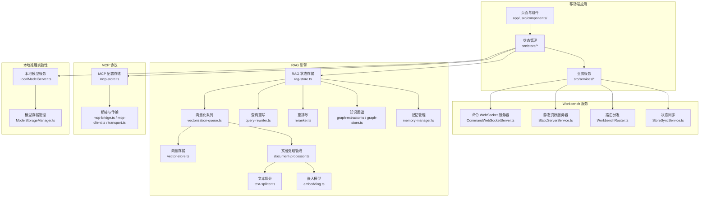
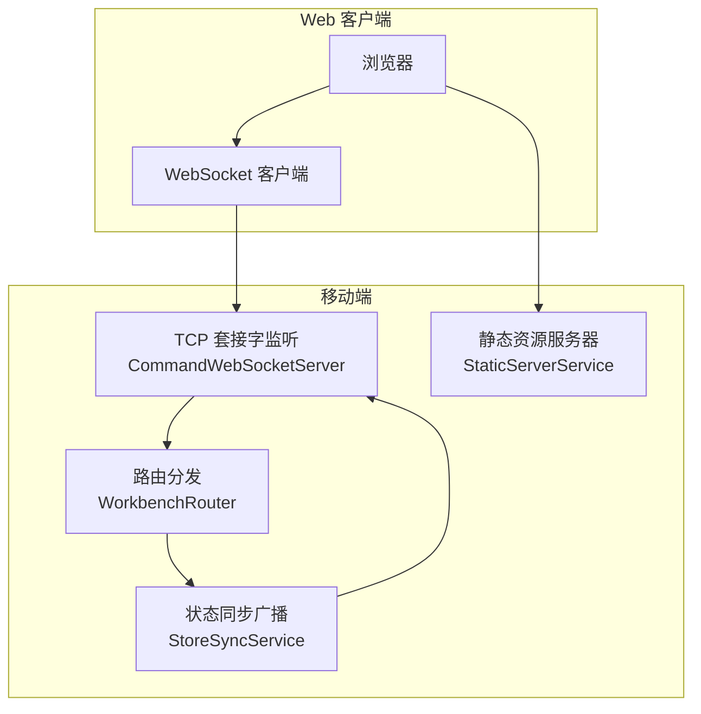
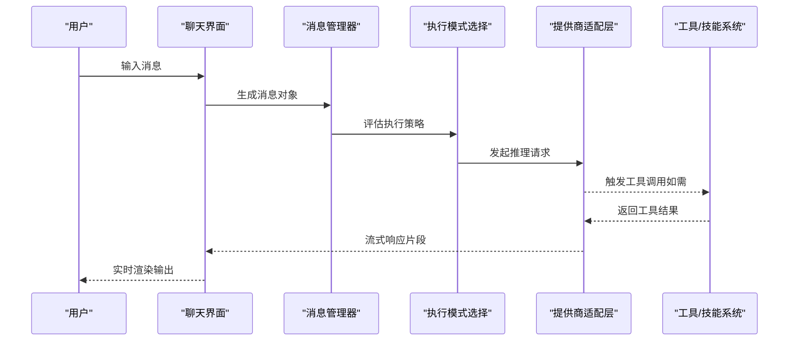
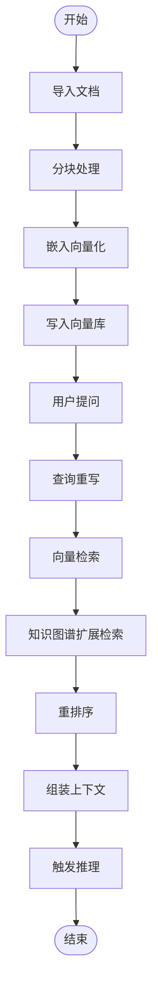
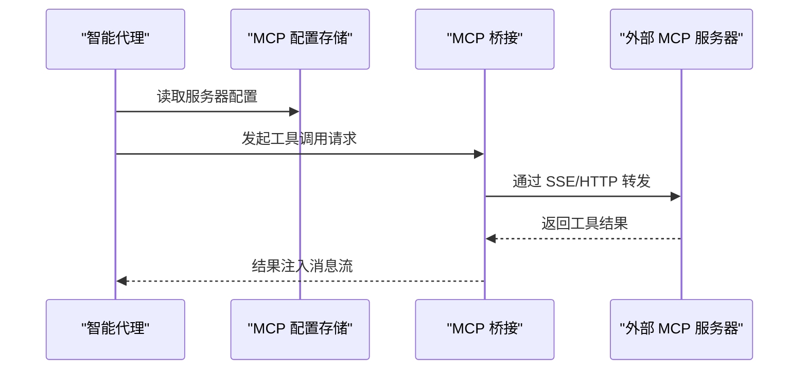
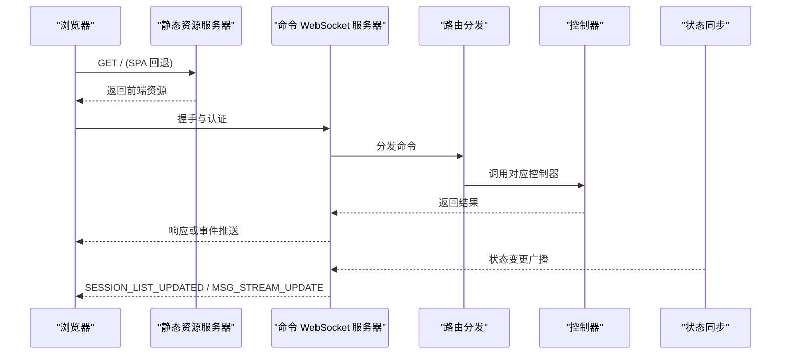
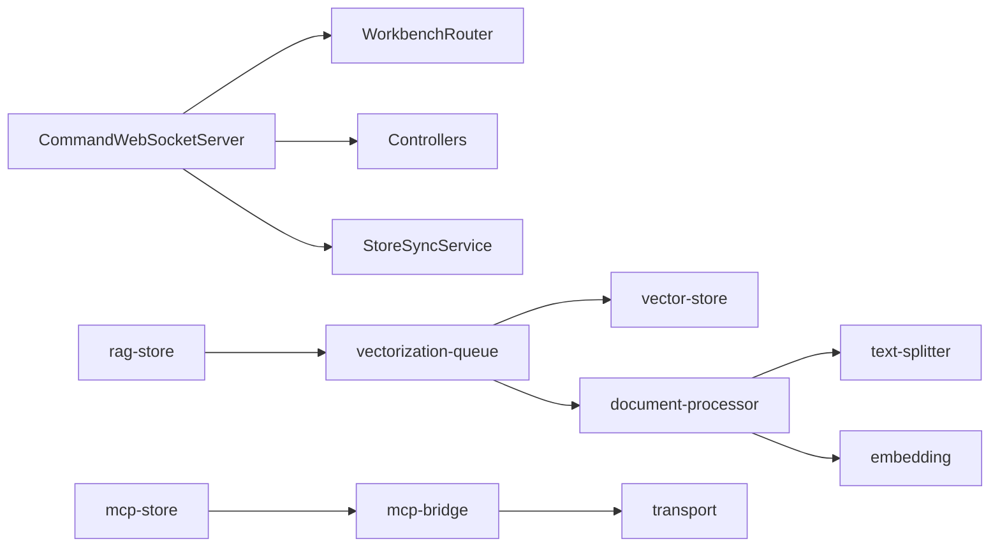

# 核心功能特性

<cite>
**本文引用的文件**
- [README.md](file://README.md)
- [src/services/workbench/CommandWebSocketServer.ts](file://src/services/workbench/CommandWebSocketServer.ts)
- [src/services/workbench/WorkbenchRouter.ts](file://src/services/workbench/WorkbenchRouter.ts)
- [src/services/workbench/StaticServerService.ts](file://src/services/workbench/StaticServerService.ts)
- [src/services/workbench/StoreSyncService.ts](file://src/services/workbench/StoreSyncService.ts)
- [src/store/rag-store.ts](file://src/store/rag-store.ts)
- [src/store/mcp-store.ts](file://src/store/mcp-store.ts)
- [src/lib/rag/vectorization-queue.ts](file://src/lib/rag/vectorization-queue.ts)
- [src/lib/rag/vector-store.ts](file://src/lib/rag/vector-store.ts)
- [src/lib/rag/document-processor.ts](file://src/lib/rag/document-processor.ts)
- [src/lib/rag/text-splitter.ts](file://src/lib/rag/text-splitter.ts)
- [src/lib/rag/embedding.ts](file://src/lib/rag/embedding.ts)
- [src/lib/rag/query-rewriter.ts](file://src/lib/rag/query-rewriter.ts)
- [src/lib/rag/reranker.ts](file://src/lib/rag/reranker.ts)
- [src/lib/rag/graph-extractor.ts](file://src/lib/rag/graph-extractor.ts)
- [src/lib/rag/graph-store.ts](file://src/lib/rag/graph-store.ts)
- [src/lib/rag/memory-manager.ts](file://src/lib/rag/memory-manager.ts)
- [src/lib/mcp/mcp-bridge.ts](file://src/lib/mcp/mcp-bridge.ts)
- [src/lib/mcp/mcp-client.ts](file://src/lib/mcp/mcp-client.ts)
- [src/lib/mcp/transport.ts](file://src/lib/mcp/transport.ts)
- [src/lib/local-inference/LocalModelServer.ts](file://src/lib/local-inference/LocalModelServer.ts)
- [src/lib/local-inference/ModelStorageManager.ts](file://src/lib/local-inference/ModelStorageManager.ts)
</cite>

## 目录
1. [引言](#引言)
2. [项目结构](#项目结构)
3. [核心组件](#核心组件)
4. [架构总览](#架构总览)
5. [详细组件分析](#详细组件分析)
6. [依赖关系分析](#依赖关系分析)
7. [性能考量](#性能考量)
8. [故障排查指南](#故障排查指南)
9. [结论](#结论)
10. [附录](#附录)

## 引言
本文件围绕 Nexara 的核心功能特性展开，系统性介绍多提供商聊天系统、RAG 知识引擎、智能代理系统与 MCP 协议桥接、本地推理引擎（实验性）、Workbench 远程管理功能，并给出使用场景与最佳实践建议。内容兼顾技术深度与可读性，帮助不同背景的读者快速理解并高效使用。

## 项目结构
Nexara 采用 React Native + Expo 架构，前端页面与业务逻辑分布在 app/ 与 src/ 下，服务端能力（Workbench）位于 src/services/workbench/，RAG 与 MCP 的核心实现位于 src/lib/，状态管理采用 Zustand，持久化使用 AsyncStorage 与 SQLite（op-sqlite）。

**图表来源**
- [src/services/workbench/CommandWebSocketServer.ts:33-178](file://src/services/workbench/CommandWebSocketServer.ts#L33-L178)
- [src/services/workbench/StaticServerService.ts:21-236](file://src/services/workbench/StaticServerService.ts#L21-L236)
- [src/services/workbench/WorkbenchRouter.ts:18-72](file://src/services/workbench/WorkbenchRouter.ts#L18-L72)
- [src/services/workbench/StoreSyncService.ts:5-124](file://src/services/workbench/StoreSyncService.ts#L5-L124)
- [src/store/rag-store.ts:147-800](file://src/store/rag-store.ts#L147-L800)
- [src/lib/rag/vectorization-queue.ts](file://src/lib/rag/vectorization-queue.ts)
- [src/lib/rag/vector-store.ts](file://src/lib/rag/vector-store.ts)
- [src/lib/rag/document-processor.ts](file://src/lib/rag/document-processor.ts)
- [src/lib/rag/text-splitter.ts](file://src/lib/rag/text-splitter.ts)
- [src/lib/rag/embedding.ts](file://src/lib/rag/embedding.ts)
- [src/lib/rag/query-rewriter.ts](file://src/lib/rag/query-rewriter.ts)
- [src/lib/rag/reranker.ts](file://src/lib/rag/reranker.ts)
- [src/lib/rag/graph-extractor.ts](file://src/lib/rag/graph-extractor.ts)
- [src/lib/rag/graph-store.ts](file://src/lib/rag/graph-store.ts)
- [src/lib/rag/memory-manager.ts](file://src/lib/rag/memory-manager.ts)
- [src/store/mcp-store.ts:32-71](file://src/store/mcp-store.ts#L32-L71)
- [src/lib/mcp/mcp-bridge.ts](file://src/lib/mcp/mcp-bridge.ts)
- [src/lib/mcp/mcp-client.ts](file://src/lib/mcp/mcp-client.ts)
- [src/lib/mcp/transport.ts](file://src/lib/mcp/transport.ts)
- [src/lib/local-inference/LocalModelServer.ts](file://src/lib/local-inference/LocalModelServer.ts)
- [src/lib/local-inference/ModelStorageManager.ts](file://src/lib/local-inference/ModelStorageManager.ts)

**章节来源**
- [README.md:12-47](file://README.md#L12-L47)

## 核心组件
- 多提供商聊天系统：支持 12+ 云厂商与 OpenAI 兼容接口，具备流式响应、工具调用、图像生成与思维链推理能力。
- RAG 知识引擎：基于 SQLite + FTS5 的向量存储，提供文档导入、分块、向量化、检索、知识图谱抽取、查询重写与重排序。
- 智能代理系统：预设 Agent 与自定义 Agent，可绑定特定 RAG 知识库与工具集合。
- MCP 协议：通过 SSE/HTTP 连接外部 MCP 服务器，将外部工具桥接到本地技能注册表。
- 本地推理引擎（实验性）：基于 llama.rn 的 GGUF 模型运行，支持三槽位（对话/嵌入/重排序）与 GPU 加速。
- Workbench 远程管理：内置 WebSocket 与静态资源服务器，配套 web-client 提供远程管理与可视化。

**章节来源**
- [README.md:14-46](file://README.md#L14-L46)

## 架构总览
下图展示 Workbench 的远程管理架构：移动端同时启动静态资源服务器与命令 WebSocket 服务器，Web 客户端通过浏览器访问静态资源，通过 WebSocket 与移动端通信，路由分发到各控制器，状态变更通过 StoreSyncService 广播。

**图表来源**
- [src/services/workbench/CommandWebSocketServer.ts:33-178](file://src/services/workbench/CommandWebSocketServer.ts#L33-L178)
- [src/services/workbench/StaticServerService.ts:21-236](file://src/services/workbench/StaticServerService.ts#L21-L236)
- [src/services/workbench/WorkbenchRouter.ts:18-72](file://src/services/workbench/WorkbenchRouter.ts#L18-L72)
- [src/services/workbench/StoreSyncService.ts:5-124](file://src/services/workbench/StoreSyncService.ts#L5-L124)

## 详细组件分析

### 多提供商聊天系统
- 支持的提供商与能力
  - 提供商：OpenAI、Anthropic、Gemini、Vertex AI、DeepSeek、Moonshot、智普、SiliconFlow、GitHub Copilot、Cloudflare，以及任意 OpenAI 兼容接口。
  - 能力：流式响应、工具调用、图像生成、思维链推理（CoT）。
- 控制流概览
  - 用户输入经消息管理器处理，按执行模式选择本地或云端推理；若启用工具调用，则在消息中插入工具调用块，等待工具返回结果后再继续生成。
  - 流式响应通过 WebSocket 或 HTTP 流式传输，前端逐步渲染。

**章节来源**
- [README.md:16-18](file://README.md#L16-L18)

### RAG 知识引擎
- 技术架构
  - 向量存储：SQLite + FTS5 + 向量 BLOB，支持全文检索与向量相似度检索。
  - 文档处理：分块（text-splitter、trigram-splitter）、清洗、嵌入（embedding，支持本地/云端）。
  - 检索与排序：查询重写（query-rewriter）、向量检索、重排序（reranker）、知识图谱抽取（graph-extractor）。
  - 记忆管理：将对话片段向量化并归档为“记忆”，参与后续检索。
- 关键流程（向量化与检索）

**图表来源**
- [src/store/rag-store.ts:147-800](file://src/store/rag-store.ts#L147-L800)
- [src/lib/rag/vectorization-queue.ts](file://src/lib/rag/vectorization-queue.ts)
- [src/lib/rag/vector-store.ts](file://src/lib/rag/vector-store.ts)
- [src/lib/rag/document-processor.ts](file://src/lib/rag/document-processor.ts)
- [src/lib/rag/text-splitter.ts](file://src/lib/rag/text-splitter.ts)
- [src/lib/rag/embedding.ts](file://src/lib/rag/embedding.ts)
- [src/lib/rag/query-rewriter.ts](file://src/lib/rag/query-rewriter.ts)
- [src/lib/rag/reranker.ts](file://src/lib/rag/reranker.ts)
- [src/lib/rag/graph-extractor.ts](file://src/lib/rag/graph-extractor.ts)
- [src/lib/rag/graph-store.ts](file://src/lib/rag/graph-store.ts)
- [src/lib/rag/memory-manager.ts](file://src/lib/rag/memory-manager.ts)

**章节来源**
- [README.md:20-22](file://README.md#L20-L22)
- [src/store/rag-store.ts:147-800](file://src/store/rag-store.ts#L147-L800)

### 智能代理系统与 MCP 协议
- 代理系统
  - 预设 Agent：覆盖常见任务（翻译、编程、创意写作等）。
  - 自定义 Agent：可配置系统提示词、模型绑定、RAG 知识库与工具集。
- MCP 协议
  - 通过 SSE 或 HTTP 连接外部 MCP 服务器，桥接外部工具到本地技能注册表，Agent 可直接调用。
  - 配置存储包含服务器地址、传输类型、启用状态、同步统计等。

**图表来源**
- [src/store/mcp-store.ts:32-71](file://src/store/mcp-store.ts#L32-L71)
- [src/lib/mcp/mcp-bridge.ts](file://src/lib/mcp/mcp-bridge.ts)
- [src/lib/mcp/mcp-client.ts](file://src/lib/mcp/mcp-client.ts)
- [src/lib/mcp/transport.ts](file://src/lib/mcp/transport.ts)

**章节来源**
- [README.md:24-30](file://README.md#L24-L30)
- [src/store/mcp-store.ts:32-71](file://src/store/mcp-store.ts#L32-L71)

### 本地推理引擎（实验性）
- 能力概述
  - 基于 llama.rn 的 GGUF 模型运行，提供三槽位（主对话、嵌入、重排序），支持 GPU 加速。
  - 适合离线使用场景，结合本地嵌入模型可实现全离线问答。
- 使用建议
  - 优先在设备性能允许的情况下启用 GPU 加速。
  - 选择与任务匹配的模型尺寸，平衡速度与质量。
  - 注意模型与嵌入模型的版本兼容性。

**章节来源**
- [README.md:32-34](file://README.md#L32-L34)
- [src/lib/local-inference/LocalModelServer.ts](file://src/lib/local-inference/LocalModelServer.ts)
- [src/lib/local-inference/ModelStorageManager.ts](file://src/lib/local-inference/ModelStorageManager.ts)

### Workbench 远程管理
- 架构设计
  - 命令 WebSocket 服务器：实现握手、帧解析、认证、命令路由与心跳检测。
  - 静态资源服务器：打包并提供 web-client 的前端资源，支持 SPA 回退。
  - 路由分发：统一注册命令类型（会话、代理、配置、库、统计、备份等）。
  - 状态同步：订阅本地状态变化，向已认证客户端广播会话列表与流式消息更新。
- 使用价值
  - 在同一局域网内通过浏览器远程管理会话、代理、知识库与设置。
  - 适合需要大屏操作、批量管理或远程运维的场景。

**图表来源**
- [src/services/workbench/CommandWebSocketServer.ts:33-178](file://src/services/workbench/CommandWebSocketServer.ts#L33-L178)
- [src/services/workbench/WorkbenchRouter.ts:18-72](file://src/services/workbench/WorkbenchRouter.ts#L18-L72)
- [src/services/workbench/StaticServerService.ts:21-236](file://src/services/workbench/StaticServerService.ts#L21-L236)
- [src/services/workbench/StoreSyncService.ts:5-124](file://src/services/workbench/StoreSyncService.ts#L5-L124)

**章节来源**
- [README.md:36-38](file://README.md#L36-L38)
- [src/services/workbench/CommandWebSocketServer.ts:33-178](file://src/services/workbench/CommandWebSocketServer.ts#L33-L178)
- [src/services/workbench/StaticServerService.ts:21-236](file://src/services/workbench/StaticServerService.ts#L21-L236)
- [src/services/workbench/StoreSyncService.ts:5-124](file://src/services/workbench/StoreSyncService.ts#L5-L124)

## 依赖关系分析
- 组件耦合
  - Workbench 服务与路由/控制器之间通过统一的命令类型解耦，便于扩展新的管理功能。
  - RAG 子系统内部通过向量化队列串联文档处理、嵌入与存储，降低耦合度。
  - MCP 桥接层与外部服务器通过传输抽象隔离，支持 SSE/HTTP 两种方式。
- 外部依赖
  - 数据库：op-sqlite（SQLite + FTS5 + 向量 BLOB）。
  - 本地推理：llama.rn。
  - 网络：react-native-tcp-socket、jsrsasign、expo-file-system、expo-asset、react-native-network-info。

**图表来源**
- [src/services/workbench/CommandWebSocketServer.ts:33-178](file://src/services/workbench/CommandWebSocketServer.ts#L33-L178)
- [src/services/workbench/WorkbenchRouter.ts:18-72](file://src/services/workbench/WorkbenchRouter.ts#L18-L72)
- [src/services/workbench/StoreSyncService.ts:5-124](file://src/services/workbench/StoreSyncService.ts#L5-L124)
- [src/store/rag-store.ts:147-800](file://src/store/rag-store.ts#L147-L800)
- [src/lib/rag/vectorization-queue.ts](file://src/lib/rag/vectorization-queue.ts)
- [src/lib/rag/vector-store.ts](file://src/lib/rag/vector-store.ts)
- [src/lib/rag/document-processor.ts](file://src/lib/rag/document-processor.ts)
- [src/lib/rag/text-splitter.ts](file://src/lib/rag/text-splitter.ts)
- [src/lib/rag/embedding.ts](file://src/lib/rag/embedding.ts)
- [src/store/mcp-store.ts:32-71](file://src/store/mcp-store.ts#L32-L71)
- [src/lib/mcp/mcp-bridge.ts](file://src/lib/mcp/mcp-bridge.ts)
- [src/lib/mcp/transport.ts](file://src/lib/mcp/transport.ts)

**章节来源**
- [README.md:48-61](file://README.md#L48-L61)

## 性能考量
- RAG 向量化与检索
  - 使用向量化队列异步处理，避免阻塞主线程；合理设置分块大小与重叠率，平衡召回与性能。
  - 嵌入模型选择：云端模型质量高但有网络延迟，本地模型可离线但需权衡算力与精度。
  - 向量存储：利用 SQLite + FTS5 的全文检索与向量索引组合，减少无关扫描。
- 流式传输
  - WebSocket 分片与写队列保证可靠性；对大包进行分片传输，避免阻塞。
  - StoreSyncService 仅在内容变化时推送增量更新，降低带宽占用。
- 本地推理
  - GPU 加速优先；模型尺寸与上下文长度需与设备性能匹配；注意内存峰值与热管理。

[本节为通用指导，无需具体文件引用]

## 故障排查指南
- Workbench 无法访问
  - 确认静态资源服务器与 WebSocket 服务器均已启动且端口未被占用。
  - 检查浏览器与移动端在同一局域网，确认 IP 地址与端口正确。
- 认证失败或命令受限
  - 未认证客户端仅允许 AUTH 命令；确保先完成握手与认证。
  - 查看路由日志与错误响应类型（如 ERROR、AUTH_REQUIRED）。
- RAG 导入无结果
  - 检查向量化队列是否正常运行，确认文档内容与分块策略。
  - 核对嵌入模型可用性与网络连通性。
- MCP 工具调用异常
  - 检查服务器配置（URL、传输类型、启用状态），关注状态字段与错误信息。
  - 确认外部 MCP 服务器可达与协议兼容。

**章节来源**
- [src/services/workbench/CommandWebSocketServer.ts:415-444](file://src/services/workbench/CommandWebSocketServer.ts#L415-L444)
- [src/services/workbench/WorkbenchRouter.ts:34-71](file://src/services/workbench/WorkbenchRouter.ts#L34-L71)
- [src/store/mcp-store.ts:32-71](file://src/store/mcp-store.ts#L32-L71)

## 结论
Nexara 通过本地优先的数据管理与多提供商推理能力，构建了安全可控、灵活可扩展的 AI 助手平台。RAG 引擎以 SQLite 为基础实现高效检索，MCP 协议打通外部工具生态，Workbench 提供远程管理能力，本地推理引擎为离线场景提供可能。建议在生产环境中结合设备性能与网络条件，合理选择推理与嵌入方案，并持续优化分块与检索策略以提升体验。

[本节为总结性内容，无需具体文件引用]

## 附录
- 使用场景与最佳实践
  - 多提供商聊天：在需要跨模型对比或特定模型能力时启用工具调用与思维链；对长对话启用上下文压缩与记忆归档。
  - RAG：优先使用高质量嵌入模型；对长文档采用分层检索与重排序；定期清理无效向量与知识图谱孤立节点。
  - MCP：统一管理外部工具的认证与限流；为新工具建立最小可用契约，逐步扩展。
  - 本地推理：在弱网或隐私敏感场景优先启用；根据任务类型选择合适模型尺寸；定期校准与回测。
  - Workbench：在固定办公环境部署，通过浏览器进行批量配置与监控；为远程运维人员分配只读权限。

[本节为通用指导，无需具体文件引用]