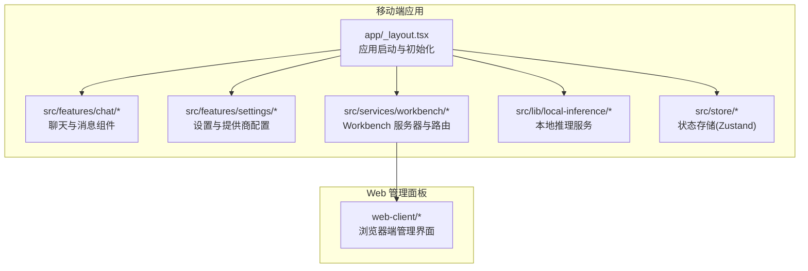
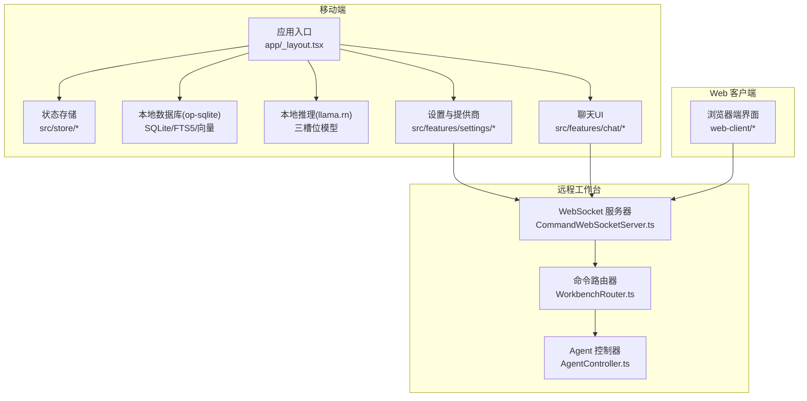
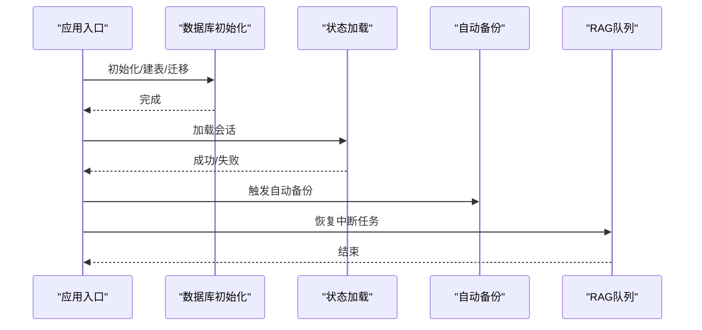
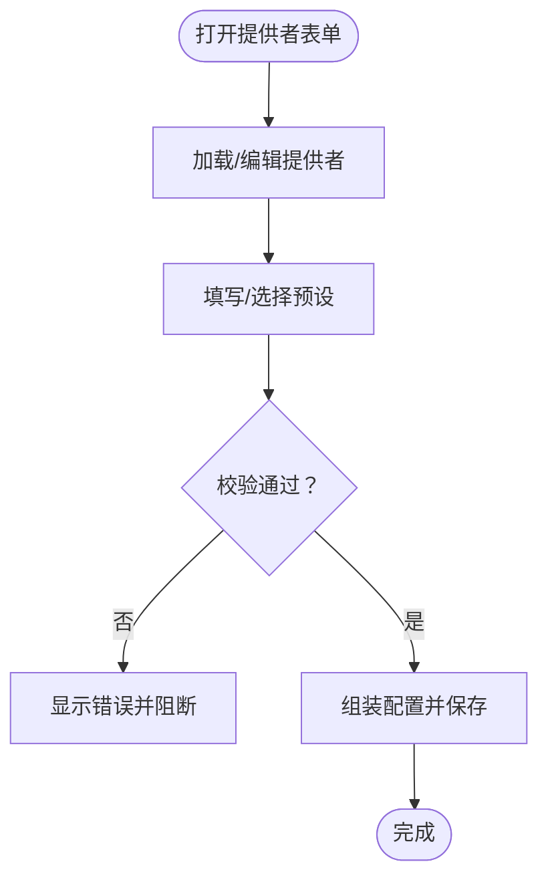
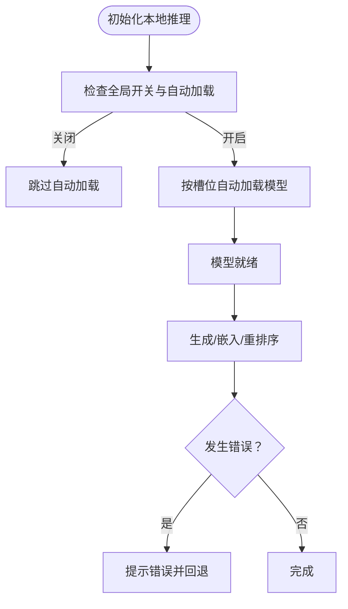
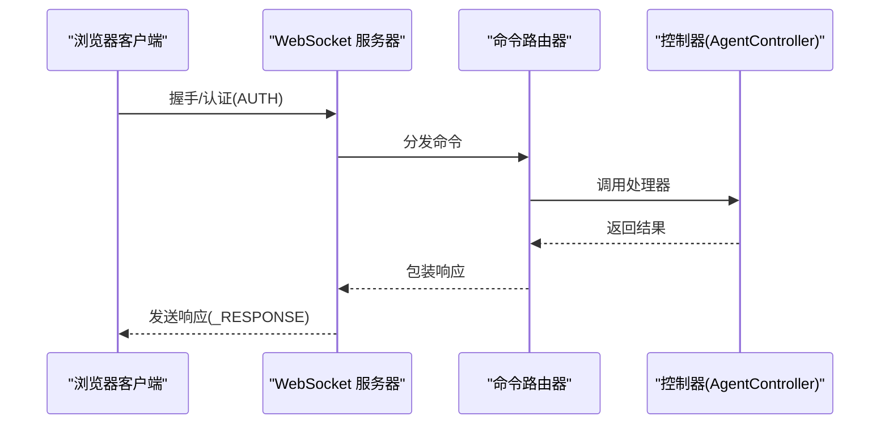
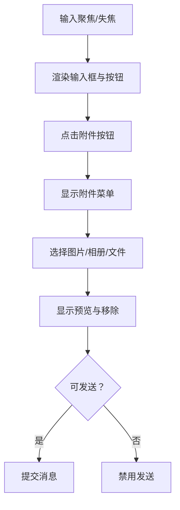
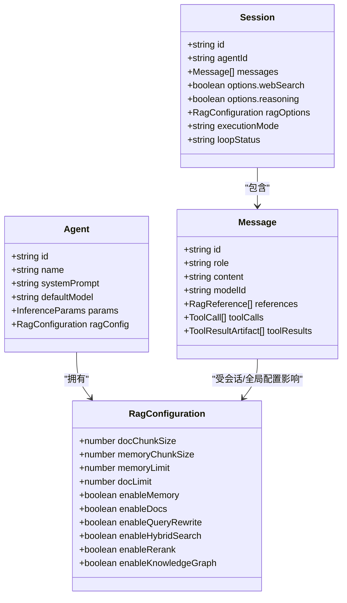
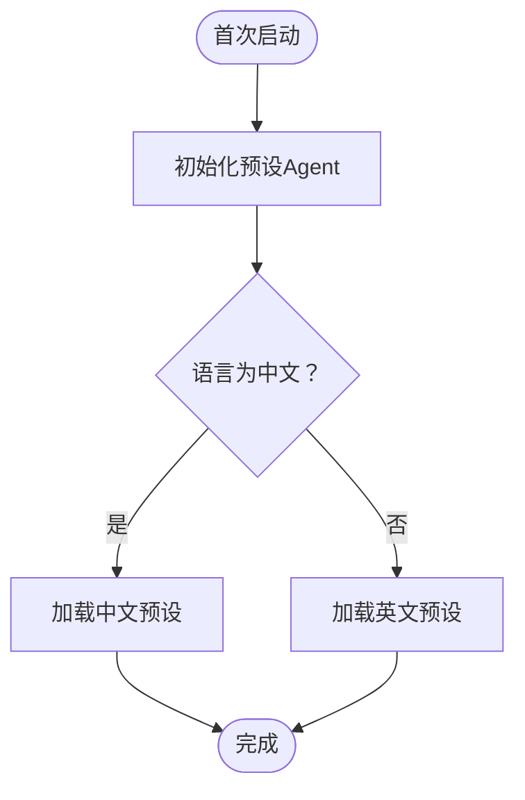
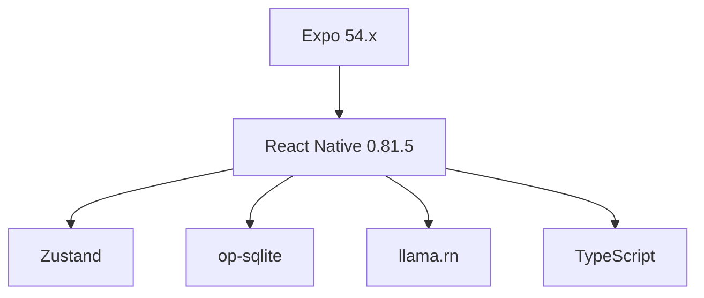

# 项目介绍

<cite>
**本文引用的文件**
- [README.md](file://README.md)
- [package.json](file://package.json)
- [app/_layout.tsx](file://app/_layout.tsx)
- [src/services/workbench/CommandWebSocketServer.ts](file://src/services/workbench/CommandWebSocketServer.ts)
- [src/services/workbench/WorkbenchRouter.ts](file://src/services/workbench/WorkbenchRouter.ts)
- [src/services/workbench/controllers/AgentController.ts](file://src/services/workbench/controllers/AgentController.ts)
- [src/lib/local-inference/LocalModelServer.ts](file://src/lib/local-inference/LocalModelServer.ts)
- [src/features/settings/screens/ProviderFormScreen.tsx](file://src/features/settings/screens/ProviderFormScreen.tsx)
- [src/features/chat/components/ChatInput.tsx](file://src/features/chat/components/ChatInput.tsx)
- [src/types/chat.ts](file://src/types/chat.ts)
- [src/lib/agent-presets.ts](file://src/lib/agent-presets.ts)
</cite>

## 目录
1. [引言](#引言)
2. [项目结构](#项目结构)
3. [核心组件](#核心组件)
4. [架构总览](#架构总览)
5. [详细组件分析](#详细组件分析)
6. [依赖关系分析](#依赖关系分析)
7. [性能考量](#性能考量)
8. [故障排查指南](#故障排查指南)
9. [结论](#结论)
10. [附录](#附录)

## 引言
Nexara 是一款面向 Android 的 AI 助手客户端，其核心使命是“本地优先、多提供商接入”。项目坚持将对话、知识库与向量嵌入等数据存储在设备本地（SQLite + FTS5 + 向量 BLOB），同时通过连接 12+ 云上 AI 提供商实现强大的推理能力。项目愿景是为用户提供安全可控、灵活可扩展、体验一致的个人智能助理与工作平台。

- 本地优先的数据管理策略：对话历史、知识库、向量索引均在本地持久化，保障数据主权与隐私。
- 多提供商模型接入：统一抽象 OpenAI、Anthropic、Gemini、Vertex AI、DeepSeek、Moonshot、智谱、SiliconFlow、GitHub Copilot、Cloudflare 等多家服务商，支持流式响应、工具调用、图像生成与思维链推理。
- 强大的 RAG 知识引擎：内置向量库与检索管线，支持查询重写、混合检索、重排序与知识图谱抽取。
- 实验性本地推理：通过 llama.rn 在设备端运行 GGUF 模型，三槽位（主对话/嵌入/重排序）支持 GPU 加速，实现离线可用。
- Workbench 远程工作台：内置 TCP/WebSocket 服务器与静态资源服务，配套 web-client，可在同一局域网内通过浏览器远程管理会话、代理、知识库与设置。

**章节来源**
- [README.md:12-47](file://README.md#L12-L47)
- [README.md:84-118](file://README.md#L84-L118)

## 项目结构
Nexara 采用 React Native + Expo 架构，前端路由基于 Expo Router，状态管理使用 Zustand，数据库采用 op-sqlite（SQLite + FTS5 + 向量 BLOB）。项目包含移动端应用、Web 管理面板（web-client）、以及大量功能模块与服务层。

**图表来源**
- [app/_layout.tsx:82-191](file://app/_layout.tsx#L82-L191)
- [src/services/workbench/CommandWebSocketServer.ts:33-178](file://src/services/workbench/CommandWebSocketServer.ts#L33-L178)

**章节来源**
- [README.md:48-61](file://README.md#L48-L61)
- [README.md:120-133](file://README.md#L120-L133)

## 核心组件
- 本地数据库与启动流程：应用启动时初始化数据库、建表、迁移，并恢复会话、触发自动备份、恢复中断的 RAG 任务队列。
- 多提供商模型接入：提供者表单支持 OpenAI、Anthropic、Gemini、Vertex AI、DeepSeek、Moonshot、智谱、SiliconFlow、GitHub Copilot、Cloudflare 等，以及 OpenAI 兼容接口；支持区域、凭据与 JSON 导入等高级配置。
- 本地推理（实验）：llama.rn 三槽位模型加载与推理，支持自动加载、进度上报、GPU 加速信息与错误处理。
- Workbench 服务器：基于 TCP 的 WebSocket 服务器，注册命令路由，支持认证、心跳、广播与写队列保证可靠性。
- 聊天输入与附件：支持图片/文件附件、编辑模式、发送/停止控制、加载动画与可访问性。
- 类型与配置：统一的消息、会话、Agent、RAG 配置类型，便于跨层协作与强类型约束。

**章节来源**
- [app/_layout.tsx:87-137](file://app/_layout.tsx#L87-L137)
- [src/features/settings/screens/ProviderFormScreen.tsx:28-88](file://src/features/settings/screens/ProviderFormScreen.tsx#L28-L88)
- [src/lib/local-inference/LocalModelServer.ts:57-381](file://src/lib/local-inference/LocalModelServer.ts#L57-L381)
- [src/services/workbench/CommandWebSocketServer.ts:134-178](file://src/services/workbench/CommandWebSocketServer.ts#L134-L178)
- [src/features/chat/components/ChatInput.tsx:63-312](file://src/features/chat/components/ChatInput.tsx#L63-L312)
- [src/types/chat.ts:15-314](file://src/types/chat.ts#L15-L314)

## 架构总览
Nexara 的整体架构围绕“本地优先 + 多提供商 + 本地推理 + 远程工作台”展开。移动端负责 UI、状态、本地推理与数据库；Workbench 服务器提供命令通道与远程管理；Web 客户端通过 WebSocket 与服务器交互，实现远程配置与运维。

**图表来源**
- [app/_layout.tsx:82-191](file://app/_layout.tsx#L82-L191)
- [src/services/workbench/CommandWebSocketServer.ts:33-178](file://src/services/workbench/CommandWebSocketServer.ts#L33-L178)
- [src/services/workbench/WorkbenchRouter.ts:18-75](file://src/services/workbench/WorkbenchRouter.ts#L18-L75)
- [src/services/workbench/controllers/AgentController.ts:4-48](file://src/services/workbench/controllers/AgentController.ts#L4-L48)

## 详细组件分析

### 本地数据库与启动流程
- 初始化顺序：初始化数据库 → 创建表 → 执行迁移 → 加载会话 → 触发自动备份 → 恢复中断的 RAG 任务队列。
- 数据持久化：会话、消息、Agent、RAG 状态等均通过状态存储与数据库协同，保障重启后可恢复。
- 错误处理：对数据库初始化、会话加载、自动备份、队列恢复等过程进行日志与异常捕获，避免崩溃影响用户体验。

**图表来源**
- [app/_layout.tsx:87-137](file://app/_layout.tsx#L87-L137)

**章节来源**
- [app/_layout.tsx:87-137](file://app/_layout.tsx#L87-L137)

### 多提供商模型接入
- 支持的提供商：OpenAI、Anthropic、Gemini、Vertex AI、DeepSeek、Moonshot、智谱、SiliconFlow、GitHub Copilot、Cloudflare、OpenAI 兼容接口等。
- 配置方式：通过提供者表单填写名称、类型、Base URL、API Key、区域、项目 ID 与服务账号 JSON；支持预设一键填充。
- 验证与保存：对必填项进行校验，保存时根据类型组装最终配置并写入状态存储。

**图表来源**
- [src/features/settings/screens/ProviderFormScreen.tsx:90-250](file://src/features/settings/screens/ProviderFormScreen.tsx#L90-L250)

**章节来源**
- [src/features/settings/screens/ProviderFormScreen.tsx:28-88](file://src/features/settings/screens/ProviderFormScreen.tsx#L28-L88)
- [src/features/settings/screens/ProviderFormScreen.tsx:178-250](file://src/features/settings/screens/ProviderFormScreen.tsx#L178-L250)

### 本地推理（实验）
- 三槽位模型：主对话、嵌入、重排序分别独立加载与管理，支持自动加载与进度上报。
- GPU 加速：检测并报告 GPU 使用情况与原因，提升推理性能。
- 错误处理：加载失败、推理异常、空文本向量化等场景均有明确错误提示与回退策略。

**图表来源**
- [src/lib/local-inference/LocalModelServer.ts:103-159](file://src/lib/local-inference/LocalModelServer.ts#L103-L159)
- [src/lib/local-inference/LocalModelServer.ts:249-335](file://src/lib/local-inference/LocalModelServer.ts#L249-L335)

**章节来源**
- [src/lib/local-inference/LocalModelServer.ts:57-381](file://src/lib/local-inference/LocalModelServer.ts#L57-L381)

### Workbench 服务器与路由
- 服务器：基于 TCP 的 WebSocket 服务器，监听固定端口，握手、帧解析、心跳与写队列可靠传输。
- 路由：注册命令类型（如 AUTH、CMD_GET_AGENTS、CMD_UPDATE_AGENT、CMD_GET_SESSIONS 等），统一处理请求并返回响应或错误。
- 控制器：AgentController 等控制器封装业务逻辑，实现远程管理能力。

**图表来源**
- [src/services/workbench/CommandWebSocketServer.ts:134-178](file://src/services/workbench/CommandWebSocketServer.ts#L134-L178)
- [src/services/workbench/WorkbenchRouter.ts:34-72](file://src/services/workbench/WorkbenchRouter.ts#L34-L72)
- [src/services/workbench/controllers/AgentController.ts:4-48](file://src/services/workbench/controllers/AgentController.ts#L4-L48)

**章节来源**
- [src/services/workbench/CommandWebSocketServer.ts:33-178](file://src/services/workbench/CommandWebSocketServer.ts#L33-L178)
- [src/services/workbench/WorkbenchRouter.ts:18-75](file://src/services/workbench/WorkbenchRouter.ts#L18-L75)
- [src/services/workbench/controllers/AgentController.ts:4-48](file://src/services/workbench/controllers/AgentController.ts#L4-L48)

### 聊天输入与附件
- 输入控件：支持多行输入、占位提示、编辑模式、发送/停止按钮、加载动画与附件预览。
- 附件：支持图片与文件选择、移除、确认对话框；结合媒体选择器与键盘跟踪钩子优化交互。
- 顶部工具栏：通过组合模式注入，保持组件轻量与可扩展。

**图表来源**
- [src/features/chat/components/ChatInput.tsx:63-312](file://src/features/chat/components/ChatInput.tsx#L63-L312)

**章节来源**
- [src/features/chat/components/ChatInput.tsx:63-312](file://src/features/chat/components/ChatInput.tsx#L63-L312)

### 类型与配置（消息/会话/Agent/RAG）
- Agent：包含 ID、名称、描述、头像、颜色、系统提示词、默认模型、推理参数、RAG 配置等。
- Session：包含会话 ID、Agent ID、消息列表、模型覆盖、推理参数、RAG 选项、执行模式与状态等。
- Message：包含角色、内容、模型 ID、状态、RAG 引用、推理内容、工具调用与结果等。
- RAG 配置：涵盖切块、上下文窗口、检索限制、重写、混合检索、重排序、知识图谱与降本策略等。

**图表来源**
- [src/types/chat.ts:15-314](file://src/types/chat.ts#L15-L314)

**章节来源**
- [src/types/chat.ts:15-314](file://src/types/chat.ts#L15-L314)

### 预设 Agent 与超级助手
- 预设 Agent：包含“心流伴侣”“翻译专家”“代码导师”“灵感作家”，覆盖日常陪伴、翻译、编程与创意写作场景。
- 超级助手（Nexus Hub）：作为全局中枢，具备增强的 RAG 配置，可访问全部知识与历史，适合复杂问答与系统级操作。

**图表来源**
- [src/lib/agent-presets.ts:11-130](file://src/lib/agent-presets.ts#L11-L130)

**章节来源**
- [src/lib/agent-presets.ts:11-130](file://src/lib/agent-presets.ts#L11-L130)

## 依赖关系分析
- 技术栈概览：Expo SDK 54 + React Native（新架构）、TypeScript、NativeWind、Expo Router、Zustand、op-sqlite、llama.rn、Reanimated 4、Vite + React 18 + TailwindCSS 4。
- 关键依赖：@op-engineering/op-sqlite（SQLite + FTS5 + 向量）、llama.rn（本地推理）、expo-router（文件路由）、zustand（状态管理）。
- 版本与脚本：package.json 中定义了版本号、构建脚本与依赖项；op-sqlite 启用 FTS5。

**图表来源**
- [package.json:33-95](file://package.json#L33-L95)
- [README.md:48-61](file://README.md#L48-L61)

**章节来源**
- [package.json:14-119](file://package.json#L14-L119)
- [README.md:48-61](file://README.md#L48-L61)

## 性能考量
- 本地推理优化：三槽位模型独立加载，支持 GPU 加速与批处理参数；自动加载延迟与错误提示减少启动卡顿与失败率。
- 数据库与检索：SQLite + FTS5 + 向量 BLOB，结合查询重写、混合检索与重排序，平衡召回与排序性能。
- UI 与交互：Reanimated 动画、模糊视图与玻璃效果在保证美观的同时尽量降低过度绘制；键盘与安全区适配提升输入体验。
- 网络与远程：WebSocket 写队列与分片写入、心跳与超时清理，保障远程工作台稳定与低延迟。

[本节为通用性能讨论，无需具体文件分析]

## 故障排查指南
- 数据库初始化失败：检查初始化、建表与迁移日志，确认权限与磁盘空间；必要时清理缓存后重试。
- 会话加载失败：查看日志中的错误信息，确认会话数据完整性；如损坏可尝试备份恢复。
- 自动备份失败：检查网络与 WebDAV 配置；确认 24 小时间隔策略与权限。
- 队列恢复失败：查看 RAG 队列状态，确认中断任务是否可恢复；必要时重试或清空队列。
- 本地推理加载失败：检查模型路径、文件存在性与 GPU 设备；查看加速信息与错误提示。
- 提供者配置错误：核对 API Key、Base URL、区域与 JSON；使用预设一键填充减少手工错误。
- Workbench 连接问题：确认端口占用与防火墙；检查握手、认证与心跳；查看客户端数量与超时清理日志。

**章节来源**
- [app/_layout.tsx:95-128](file://app/_layout.tsx#L95-L128)
- [src/lib/local-inference/LocalModelServer.ts:231-236](file://src/lib/local-inference/LocalModelServer.ts#L231-L236)
- [src/features/settings/screens/ProviderFormScreen.tsx:178-250](file://src/features/settings/screens/ProviderFormScreen.tsx#L178-L250)
- [src/services/workbench/CommandWebSocketServer.ts:471-484](file://src/services/workbench/CommandWebSocketServer.ts#L471-L484)

## 结论
Nexara 以“本地优先、多提供商接入、本地推理与远程工作台”为核心设计，既满足个人用户的隐私与可控需求，又提供企业级的知识管理与自动化能力。通过统一的类型体系、模块化组件与稳健的服务层，项目在功能丰富性与工程可维护性之间取得良好平衡。随着本地推理、Workbench 与 RAG 能力的持续完善，Nexara 将成为兼具易用性与扩展性的下一代 AI 助手平台。

[本节为总结性内容，无需具体文件分析]

## 附录
- 快速开始：克隆仓库、安装依赖、预构建与运行 Android。
- 待办事项：UI 交互打磨、CJK 排版优化、提供商测试、本地推理稳定性与 Workbench 边界处理。

**章节来源**
- [README.md:62-80](file://README.md#L62-L80)
- [README.md:134-151](file://README.md#L134-L151)