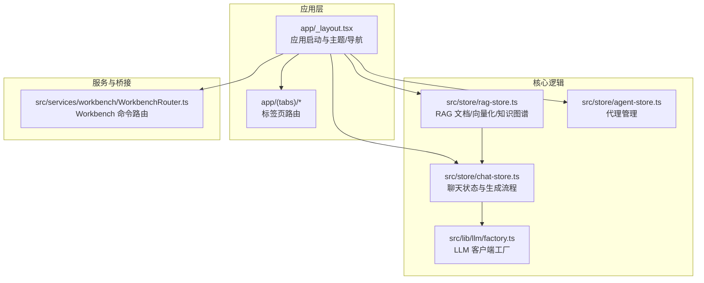
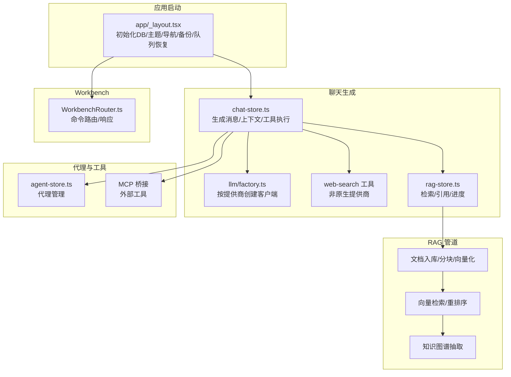
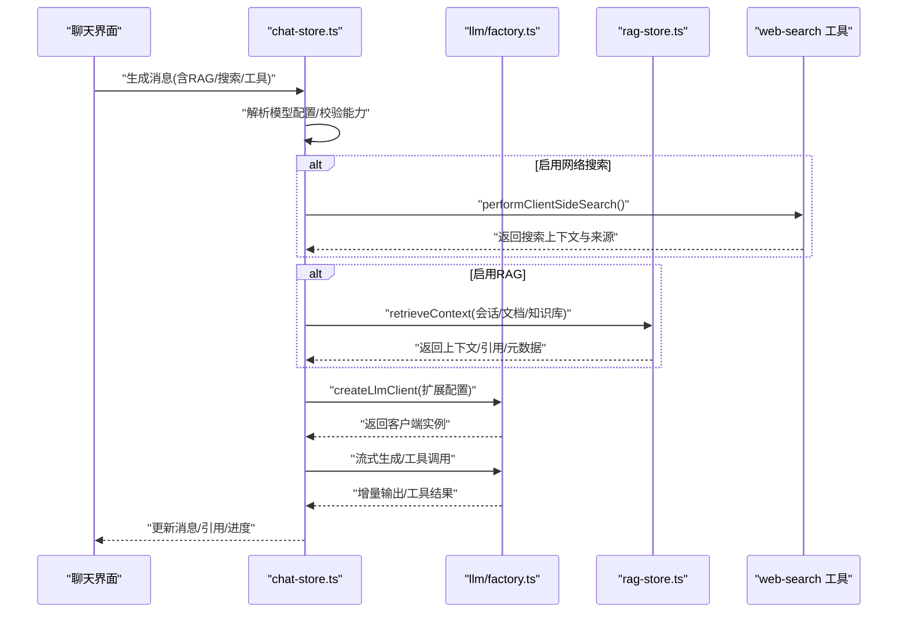
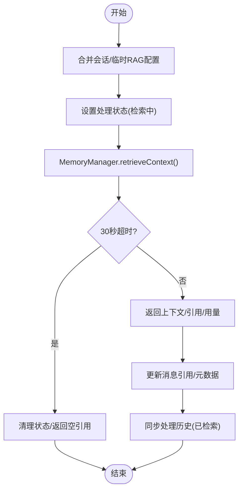
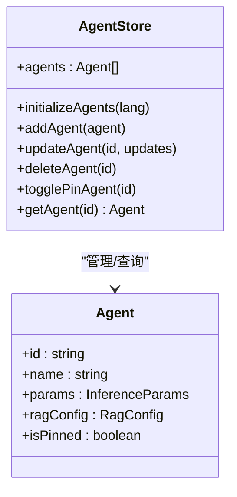
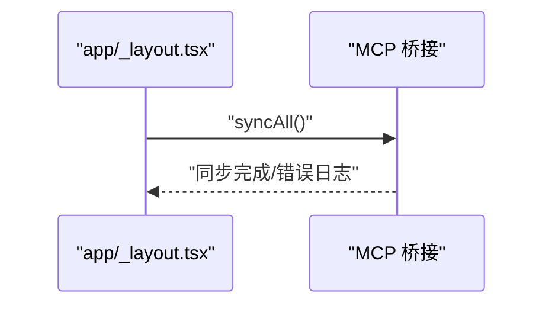
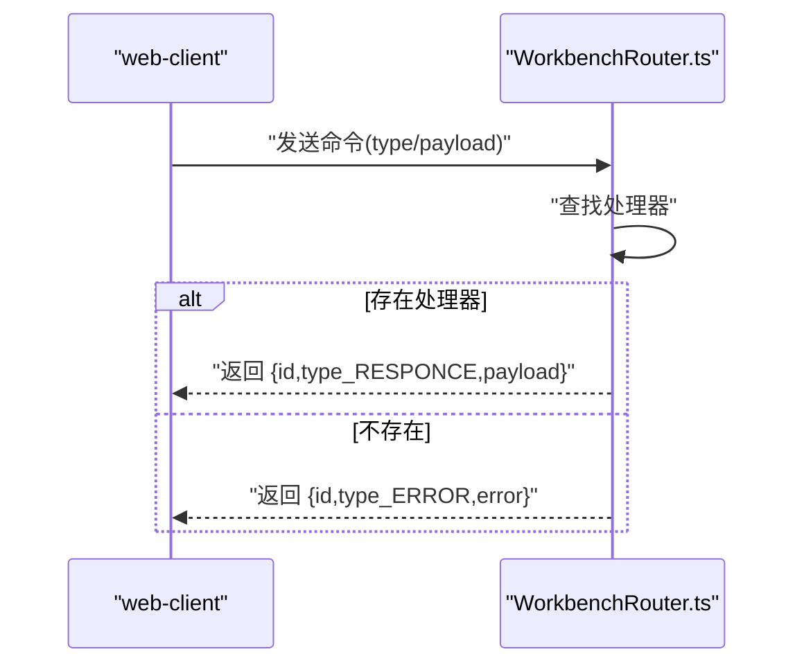
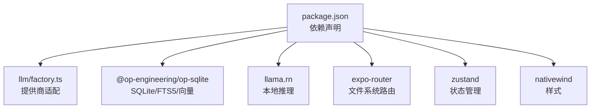

# 项目概述

<cite>
**本文引用的文件**   
- [README.md](file://README.md)
- [package.json](file://package.json)
- [app/_layout.tsx](file://app/_layout.tsx)
- [src/services/workbench/WorkbenchRouter.ts](file://src/services/workbench/WorkbenchRouter.ts)
- [src/store/chat-store.ts](file://src/store/chat-store.ts)
- [src/store/rag-store.ts](file://src/store/rag-store.ts)
- [src/lib/llm/factory.ts](file://src/lib/llm/factory.ts)
- [src/store/agent-store.ts](file://src/store/agent-store.ts)
</cite>

## 目录
1. [引言](#引言)
2. [项目结构](#项目结构)
3. [核心组件](#核心组件)
4. [架构总览](#架构总览)
5. [详细组件分析](#详细组件分析)
6. [依赖关系分析](#依赖关系分析)
7. [性能考量](#性能考量)
8. [故障排查指南](#故障排查指南)
9. [结论](#结论)
10. [附录](#附录)

## 引言
Nexara 是一款面向 Android 的 AI 助手客户端，其核心理念是“本地优先”的数据管理与“多提供商”模型接入。应用将对话、知识库与向量嵌入等数据全部存储于设备本地 SQLite，同时对接 12+ 云端 AI 提供商，支持流式响应、工具调用、图像生成与思维链推理。项目还提供 RAG 知识引擎、智能代理系统、MCP 协议桥接、本地推理能力（实验性），以及内置 Web 管理面板（Workbench）。

- 本地优先：对话、知识库、向量嵌入均在设备本地持久化，保障隐私与离线可用性。
- 多提供商：OpenAI、Anthropic、Gemini、Vertex AI、DeepSeek、Moonshot、智谱、SiliconFlow、GitHub Copilot、Cloudflare 等，以及任意 OpenAI 兼容接口。
- RAG 引擎：基于 SQLite + FTS5 的向量存储，支持文档导入、分块、向量化、检索、知识图谱抽取、查询重写与重排序。
- 智能代理：预设 Agent（翻译、编程、创意写作等），支持自定义 Agent，可绑定特定 RAG 知识库与工具集。
- MCP 协议：通过 SSE 或 HTTP 连接外部 MCP 服务器，将外部工具桥接到本地技能注册表。
- 本地推理：实验性地在设备上运行 GGUF 模型，三槽位（主对话、嵌入、重排序），GPU 加速支持。
- Workbench：内置 WebSocket 与静态文件服务，配套 web-client，可在同局域网内通过浏览器远程管理。

**章节来源**
- [README.md:12-118](file://README.md#L12-L118)

## 项目结构
Nexara 采用基于文件系统的路由（Expo Router）组织页面与功能模块，核心目录与职责概览如下：
- app/：页面与路由入口，包含标签页、聊天、RAG、设置等页面。
- src/：核心业务逻辑与类型定义，按领域划分：
  - features/chat：聊天 UI 组件与交互逻辑。
  - store/*：Zustand 状态管理（聊天、RAG、代理、设置等）。
  - lib/*：底层能力封装（LLM 客户端、RAG 流水线、本地推理、MCP、文件系统等）。
  - services/*：服务层（Workbench、后台服务等）。
- web-client/：配套 Web 管理面板，通过 Workbench 与移动端通信。
- scripts/plugins/docs/plans：构建脚本、插件与规划文档。

**图表来源**
- [app/_layout.tsx:82-191](file://app/_layout.tsx#L82-L191)
- [src/store/chat-store.ts:108-210](file://src/store/chat-store.ts#L108-L210)
- [src/store/rag-store.ts:24-145](file://src/store/rag-store.ts#L24-L145)
- [src/store/agent-store.ts:7-15](file://src/store/agent-store.ts#L7-L15)
- [src/lib/llm/factory.ts:23-96](file://src/lib/llm/factory.ts#L23-L96)
- [src/services/workbench/WorkbenchRouter.ts:18-75](file://src/services/workbench/WorkbenchRouter.ts#L18-L75)

**章节来源**
- [README.md:48-61](file://README.md#L48-L61)
- [package.json:14-96](file://package.json#L14-L96)

## 核心组件
- 多提供商聊天系统
  - 支持 OpenAI、Anthropic、Gemini、Vertex AI、DeepSeek、Moonshot、智谱、SiliconFlow、GitHub Copilot、Cloudflare 等。
  - 流式响应、工具调用、图像生成、思维链推理。
  - 通过 LLM 客户端工厂按提供商动态创建适配器。
- RAG 知识引擎
  - 基于 SQLite + FTS5 的向量存储，支持文档导入、分块、向量化、检索、知识图谱抽取、查询重写与重排序。
  - 支持全局/私有知识库切换与批量操作。
- 智能代理系统
  - 预设 Agent（翻译、编程、创意写作等），支持自定义 Agent，可配置系统提示词与模型绑定。
  - 可绑定特定 RAG 知识库与工具集。
- MCP 协议集成
  - 通过 SSE 或 HTTP 连接外部 MCP 服务器，将外部工具桥接到本地技能注册表。
- 本地推理能力（实验性）
  - 通过 llama.rn 在设备上运行 GGUF 模型，三槽位（主对话、嵌入、重排序），支持 GPU 加速。
- Workbench（实验性）
  - 内置 WebSocket 与静态文件服务，配套 web-client，可在同局域网内通过浏览器远程管理对话、Agent、知识库与设置。

**章节来源**
- [README.md:14-46](file://README.md#L14-L46)
- [src/lib/llm/factory.ts:23-96](file://src/lib/llm/factory.ts#L23-L96)
- [src/store/rag-store.ts:24-145](file://src/store/rag-store.ts#L24-L145)
- [src/store/agent-store.ts:7-15](file://src/store/agent-store.ts#L7-L15)
- [src/services/workbench/WorkbenchRouter.ts:18-75](file://src/services/workbench/WorkbenchRouter.ts#L18-L75)

## 架构总览
Nexara 的整体架构围绕“本地优先 + 多提供商 + RAG + 代理 + MCP + 本地推理”的设计展开。应用启动时初始化数据库、主题、导航与全局状态；聊天生成流程串联“上下文构建 → 搜索/知识检索 → LLM 推理 → 工具执行 → 结果回写”；RAG 流程包含“文档入库 → 分块/向量化 → 检索 → 重排序/知识图谱抽取 → 上下文注入”。

**图表来源**
- [app/_layout.tsx:87-137](file://app/_layout.tsx#L87-L137)
- [src/store/chat-store.ts:360-800](file://src/store/chat-store.ts#L360-L800)
- [src/lib/llm/factory.ts:23-96](file://src/lib/llm/factory.ts#L23-L96)
- [src/store/rag-store.ts:147-800](file://src/store/rag-store.ts#L147-L800)
- [src/store/agent-store.ts:17-77](file://src/store/agent-store.ts#L17-L77)
- [src/services/workbench/WorkbenchRouter.ts:18-75](file://src/services/workbench/WorkbenchRouter.ts#L18-L75)

## 详细组件分析

### 多提供商聊天系统
- 设计要点
  - 通过 LLM 客户端工厂根据提供商类型创建对应客户端，统一抽象流式输出、工具调用、图像输入等能力。
  - 聊天状态管理负责会话加载、消息增删改、生成控制、工具执行与审批流程。
  - 对于不支持原生网络搜索的提供商，采用客户端侧搜索策略补充上下文。
- 关键流程（生成消息）
  - 解析会话/代理模型配置，校验多模态能力。
  - 可选：文件/图片预处理与上下文拼接。
  - 可选：客户端侧网络搜索，生成搜索上下文。
  - 可选：RAG 检索，获取上下文与引用，更新消息引用与元数据。
  - 构建系统提示词与历史消息上下文，调用 LLM 客户端生成回复，实时更新 UI。
  - 工具执行与结果回写，支持续杯/恢复生成。

**图表来源**
- [src/store/chat-store.ts:360-800](file://src/store/chat-store.ts#L360-L800)
- [src/lib/llm/factory.ts:23-96](file://src/lib/llm/factory.ts#L23-L96)
- [src/store/rag-store.ts:617-732](file://src/store/rag-store.ts#L617-L732)

**章节来源**
- [src/lib/llm/factory.ts:23-96](file://src/lib/llm/factory.ts#L23-L96)
- [src/store/chat-store.ts:360-800](file://src/store/chat-store.ts#L360-L800)

### RAG 知识引擎
- 设计要点
  - 文档树与标签管理，支持批量向量化、知识图谱抽取、全局/私有作用域切换。
  - 向量化队列异步处理，支持中断恢复与进度跟踪。
  - 检索阶段包含意图分析、查询重写、向量检索、知识图谱检索与重排序。
- 关键流程（检索与进度）
  - 合并会话与临时 RAG 配置，设置处理状态与回调。
  - 触发检索与超时保护，收集引用与计费用量，更新消息引用与元数据。
  - 后处理阶段同步引用数量到处理历史，避免 UI 卡死。

**图表来源**
- [src/store/chat-store.ts:617-732](file://src/store/chat-store.ts#L617-L732)
- [src/store/rag-store.ts:98-131](file://src/store/rag-store.ts#L98-L131)

**章节来源**
- [src/store/rag-store.ts:147-800](file://src/store/rag-store.ts#L147-L800)
- [src/store/chat-store.ts:617-732](file://src/store/chat-store.ts#L617-L732)

### 智能代理系统
- 设计要点
  - 代理状态管理，支持初始化预设代理、增删改、固定与查询。
  - 代理与模型绑定、系统提示词与工具集配置，支持按 Agent 的 RAG 配置参与检索。
- 关键流程（代理初始化与查询）
  - 首次启动时按语言初始化预设代理集合。
  - 查询代理时优先从状态读取，兜底从预设集合恢复。

**图表来源**
- [src/store/agent-store.ts:17-77](file://src/store/agent-store.ts#L17-L77)

**章节来源**
- [src/store/agent-store.ts:17-77](file://src/store/agent-store.ts#L17-L77)

### MCP 协议集成
- 设计要点
  - 通过 SSE 或 HTTP 与外部 MCP 服务器建立连接，桥接外部工具到本地技能注册表。
  - 应用启动时进行一次性同步，保证工具可用性。
- 关键流程（启动同步）
  - 应用启动后异步触发 MCP 工具同步，失败记录日志但不影响主流程。

**图表来源**
- [app/_layout.tsx:112-128](file://app/_layout.tsx#L112-L128)

**章节来源**
- [app/_layout.tsx:112-128](file://app/_layout.tsx#L112-L128)

### 本地推理能力（实验性）
- 设计要点
  - 通过 llama.rn 在设备上运行 GGUF 模型，支持三槽位（主对话、嵌入、重排序），GPU 加速。
  - 与云端提供商互补，实现离线可用与隐私保护。
- 关注点
  - 实验性特性，稳定性与模型兼容性仍在完善中。

**章节来源**
- [README.md:32-34](file://README.md#L32-L34)

### Workbench（实验性）
- 设计要点
  - 内置 WebSocket 与静态文件服务，提供命令路由与请求-响应模式。
  - 与 web-client 配合，实现远程管理对话、Agent、知识库与设置。
- 关键流程（命令路由）
  - 注册命令处理器，收到消息后按类型分发，返回响应或错误。

**图表来源**
- [src/services/workbench/WorkbenchRouter.ts:34-71](file://src/services/workbench/WorkbenchRouter.ts#L34-L71)

**章节来源**
- [src/services/workbench/WorkbenchRouter.ts:18-75](file://src/services/workbench/WorkbenchRouter.ts#L18-L75)

## 依赖关系分析
- 技术栈选择
  - 框架：Expo SDK 54 + React Native（新架构）
  - 语言：TypeScript
  - 样式：NativeWind（TailwindCSS）
  - 路由：Expo Router（文件系统）
  - 状态：Zustand
  - 数据库：op-sqlite（SQLite + FTS5 + 向量 BLOB）
  - 本地推理：llama.rn
  - 动画：Reanimated 4
  - Web 面板：Vite + React 18 + TailwindCSS 4
- 外部依赖与集成
  - LLM 提供商：OpenAI、Anthropic、Gemini、Vertex AI、DeepSeek、Moonshot、智谱、SiliconFlow、GitHub Copilot、Cloudflare、OpenAI 兼容接口。
  - 工具与渲染：Markdown、LaTeX、Mermaid、ECharts、数学公式渲染。
  - 备份：WebDAV 自动备份（24 小时间隔）。
  - 多语言：中英双语界面。

**图表来源**
- [package.json:14-96](file://package.json#L14-L96)
- [src/lib/llm/factory.ts:23-96](file://src/lib/llm/factory.ts#L23-L96)

**章节来源**
- [README.md:48-61](file://README.md#L48-L61)
- [package.json:14-96](file://package.json#L14-L96)

## 性能考量
- 启动与初始化
  - 应用启动时串行初始化数据库、创建表与迁移、加载会话元数据、触发自动备份与 MCP 同步，避免阻塞主线程。
- 聊天生成
  - 对于重型 RAG 检索（SQLite 操作）加入微任务让渡与 30 秒超时保护，防止 UI 卡顿与无限等待。
  - 分页加载会话消息，减少一次性加载压力。
- RAG 管道
  - 向量化队列异步处理，支持中断恢复与进度可视化。
  - 文档列表仅加载必要字段，避免大文本导致内存压力。
- 本地推理
  - 三槽位模型分离，GPU 加速提升推理效率；实验性特性需关注稳定性与资源占用。

**章节来源**
- [app/_layout.tsx:87-137](file://app/_layout.tsx#L87-L137)
- [src/store/chat-store.ts:665-686](file://src/store/chat-store.ts#L665-L686)
- [src/store/rag-store.ts:243-299](file://src/store/rag-store.ts#L243-L299)

## 故障排查指南
- 数据库初始化失败
  - 现象：启动时数据库初始化报错。
  - 排查：确认 op-sqlite 插件配置（FTS5）、表创建与迁移脚本执行顺序。
  - 日志：应用层初始化日志与错误捕获。
- RAG 检索超时
  - 现象：检索耗时过长或无响应。
  - 排查：检查向量化队列状态、数据库锁、检索配置与网络统计。
  - 处理：利用 30 秒超时保护与状态清理，避免 UI 卡死。
- MCP 同步异常
  - 现象：外部工具不可用或同步失败。
  - 排查：检查 MCP 服务器连通性与传输层（SSE/HTTP），查看启动时同步日志。
- 本地推理不稳定
  - 现象：模型加载失败或推理崩溃。
  - 排查：确认模型格式（GGUF）、槽位分配与 GPU 加速配置，逐步缩小问题范围。

**章节来源**
- [app/_layout.tsx:112-128](file://app/_layout.tsx#L112-L128)
- [src/store/chat-store.ts:665-732](file://src/store/chat-store.ts#L665-L732)

## 结论
Nexara 以“本地优先”为核心，结合“多提供商接入 + RAG 引擎 + 智能代理 + MCP 协议 + 本地推理 + Workbench”的完整能力矩阵，为用户提供安全、灵活且强大的 AI 助手体验。其模块化架构与状态管理清晰分离 UI 与业务逻辑，便于扩展与维护。建议在实际使用中关注 RAG 检索的性能与稳定性、本地推理的兼容性，并通过 Workbench 进行远程运维与调试。

## 附录
- 快速开始
  - 克隆仓库、安装依赖、预构建、运行 Android。
- 开源协议
  - GPLv3（GNU General Public License v3.0）。
- 社区贡献
  - 参考项目文档与规划，关注待办事项与路线图，按模块提交 PR 并遵循代码规范。

**章节来源**
- [README.md:62-79](file://README.md#L62-L79)
- [README.md:154-161](file://README.md#L154-L161)