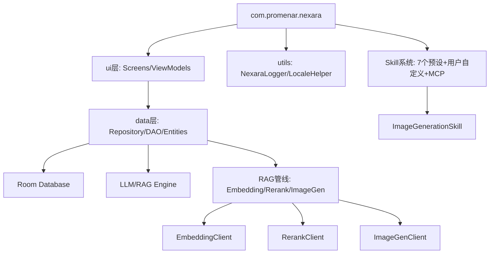

# Nexara Architecture 全景

> **注意**: 本文档为快速参考。完整架构设计见 [ARCHITECTURE_DESIGN.md](./ARCHITECTURE_DESIGN.md)（理想架构 + 技术路线择优），实现进度与差距分析见 [IMPLEMENTATION_ANALYSIS.md](./IMPLEMENTATION_ANALYSIS.md)。

## 核心架构
本项目是一个基于 Kotlin/Jetpack Compose 的原生 AI 助手应用，采用了典型的 MVVM 架构。

### 模块依赖关系

### 关键组件
- **NexaraApplication**: 全局上下文管理与服务初始化（嵌入/重排/图像生成客户端均在此懒加载）。
- **NavGraph**: 基于 Compose Navigation 的路由中心（27 条路由）。
- **ContextBuilder**: 负责多源上下文（RAG/Web/KG/History）的异步调度、打分与 Prompt 合成，支持实时观测回调。
- **MemoryManager**: 核心 RAG 检索引擎，集成 Embedding/Rerank/Hybrid Search 三阶段检索管线。
- **ImageGenClient**: OpenAI-compatible 图像生成 API 客户端，支持 url/b64_json 响应格式。
- **ImageGenerationSkill**: `generate_image` 工具实现，LLM 可调用生成图片并内联展示在对话气泡中。
- **RagOmniIndicator**: 基于磨砂玻璃设计的全能检索指示器，集成在对话流中展示检索深度与进度。
- **NexaraLogger**: 拦截未捕获异常并持久化崩溃日志。
- **AgentHubScreen**: Agent 列表中枢（已移除 Super Assistant FAB）。

### 架构决策记录 (ADR)
- **ADR-001 (2026-05-13)**: **取消 Super Assistant 概念** — 统一 Agent 模型，移除 `isSuperAssistant` 特殊逻辑，将 `spa_settings` 迁移为通用默认 Agent 配置。详见 [IMPLEMENTATION_ANALYSIS.md §8](./IMPLEMENTATION_ANALYSIS.md#8-超级助手super-assistant取舍分析)。
- **ADR-002 (2026-05-14)**: **Embedding/Rerank 配置回退策略** — 当 `embedding_base_url`/`embedding_api_key` 专用键为空时，回退到主 LLM 提供商的 `base_url`/`api_key`，避免独立配置所需的额外用户操作。
- **ADR-003 (2026-05-14)**: **图像生成工具设计** — 以 Skill 模式实现 `generate_image` 工具，通过 ToolExecutor 统一调度；图像模型独立于聊天模型选择（`preset_image_model`）。详见 [ADR/image-generation-tool.md](./ADR/image-generation-tool.md)。

### 诊断体系
- **Developer Panel**: 二级设置页面，用于导出日志 (`nexara_logs.txt`)。
- **Log Persistence**: 路径为应用私有 files 目录。
