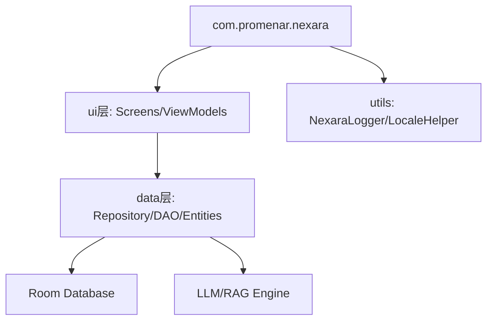

# Nexara Architecture全景

## 核心架构
本项目是一个基于 Kotlin/Jetpack Compose 的原生 AI 助手应用，采用了典型的 MVVM 架构。

### 模块依赖关系

### 关键组件
- **NexaraApplication**: 全局上下文管理与服务初始化。
- **NavGraph**: 基于 Compose Navigation 的路由中心。
- **ContextBuilder**: 负责多源上下文（RAG/Web/KG/History）的异步调度、打分与 Prompt 合成，支持实时观测回调。
- **RagOmniIndicator**: 基于磨砂玻璃设计的全能检索指示器，集成在对话流中展示检索深度与进度。
- **NexaraLogger**: 拦截未捕获异常并持久化崩溃日志。

### 诊断体系
- **Developer Panel**: 二级设置页面，用于导出日志 (`nexara_logs.txt`)。
- **Log Persistence**: 路径为应用私有 files 目录。
