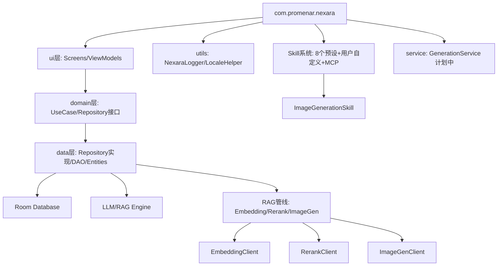

# Nexara Architecture 全景

> **注意**: 本文档为快速参考。完整架构设计见 [ARCHITECTURE_DESIGN.md](./ARCHITECTURE_DESIGN.md)（理想架构 + 技术路线择优），实现进度与差距分析见 [IMPLEMENTATION_ANALYSIS.md](./IMPLEMENTATION_ANALYSIS.md)。

## 核心架构
本项目是一个基于 Kotlin/Jetpack Compose 的原生 AI 助手应用，采用了典型的 MVVM 架构。

### 模块依赖关系

### 关键组件
- **NexaraApplication**: 全局上下文管理与服务初始化（嵌入/重排/图像生成客户端均在此懒加载）。
- **NavGraph**: 基于 Compose Navigation 的路由中心（27 条路由）。
- **Domain 层**: `domain/model/`（6 文件）+ `domain/repository/`（9 接口）+ `domain/usecase/`（6 UseCase），零 Android 依赖。
- **Repository 层**: 9 个数据仓库实现（Agent/Document/Folder/KG/Message/Provider/Session/TokenStats/Vector），覆盖率 100%。
- **ContextBuilder**: 负责多源上下文（RAG/Web/KG/History）的异步调度、打分与 Prompt 合成，支持实时观测回调。
- **MemoryManager**: 核心 RAG 检索引擎，集成 Embedding/Rerank/Hybrid Search 三阶段检索管线。
- **ImageGenClient**: OpenAI-compatible 图像生成 API 客户端，支持 url/b64_json 响应格式。
- **ImageGenerationSkill**: `generate_image` 工具实现，LLM 可调用生成图片并内联展示在对话气泡中。
- **RagOmniIndicator**: 基于磨砂玻璃设计的全能检索指示器，集成在对话流中展示检索深度与进度。
- **NexaraLogger**: 拦截未捕获异常并持久化崩溃日志。
- **AgentHubScreen**: Agent 列表中枢（Super Assistant 已于 2026-05-13 清理）。

### 架构决策记录 (ADR)
- **ADR-001 (2026-05-13)**: **取消 Super Assistant 概念** — 统一 Agent 模型，移除 `isSuperAssistant` 特殊逻辑。✅ 已实施（Phase 3, 2026-05-13）。
- **ADR-002 (2026-05-14)**: **Embedding/Rerank 配置回退策略** — 当专用键为空时回退到主 LLM Provider 配置。✅ 已实施。
- **ADR-003 (2026-05-14)**: **图像生成工具设计** — 以 Skill 模式实现 `generate_image` 工具。✅ 已实施，详见 [ADR/image-generation-tool.md](./ADR/image-generation-tool.md)。
- **ADR-004 (2026-05-14)**: **后台生成架构** — GenerationService (Foreground Service) 替代 viewModelScope 承载 SSE 流式生成。📋 方案已规划，待实施。

### 诊断体系
- **Developer Panel**: 二级设置页面，用于导出日志 (`nexara_logs.txt`)。
- **Log Persistence**: 路径为应用私有 files 目录。
