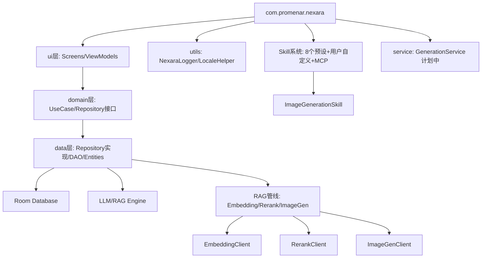

# Nexara Architecture 全景

> **注意**: 本文档为快速参考。完整架构设计见 [ARCHITECTURE_DESIGN.md](./ARCHITECTURE_DESIGN.md)（理想架构 + 技术路线择优），实现进度与差距分析见 [IMPLEMENTATION_ANALYSIS.md](./IMPLEMENTATION_ANALYSIS.md)。

## 核心架构
本项目是一个基于 Kotlin/Jetpack Compose 的原生 AI 助手应用，采用了典型的 MVVM 架构。

### 模块依赖关系

### 关键组件
- **NexaraApplication**: 全局上下文管理与服务初始化（嵌入/重排/图像生成客户端均在此懒加载）；`onCreate()` 自动创建 `WorkSpace` 物理目录。
- **NavGraph**: 基于 Compose Navigation 的路由中心（27 条路由）。
- **Domain 层**: `domain/model/`（6 文件）+ `domain/repository/`（9 接口）+ `domain/usecase/`（6 UseCase），零 Android 依赖。
- **Repository 层**: 9 个数据仓库实现（Agent/Document/Folder/KG/Message/Provider/Session/TokenStats/Vector），覆盖率 100%。
- **ContextBuilder**: 负责多源上下文（RAG/Web/KG/History）的异步调度、打分与 Prompt 合成，支持实时观测回调。所有子源均已接入 NexaraLogger 错误追踪。
- **MemoryManager**: 核心 RAG 检索引擎，集成 Embedding/Rerank/Hybrid Search 三阶段检索管线。embedQuery/search/rerank 全路径接入日志。
- **VectorizationQueue**: 文档/记忆向量化任务队列，含进度追踪、重试机制、分段日志。状态通过 `onStateChange` 回调同步至 UI。
- **MicroGraphExtractor/GraphExtractor**: 知识图谱提取引擎（JIT 缓存 + 全量提取双模式），全链路接入日志。
- **ImageGenClient**: OpenAI-compatible 图像生成 API 客户端，支持 url/b64_json 响应格式。
- **ImageGenerationSkill**: `generate_image` 工具实现，LLM 可调用生成图片并内联展示在对话气泡中。
- **RagOmniIndicator**: 基于磨砂玻璃设计的全能检索指示器，集成在对话流中展示检索深度与进度。
- **NexaraLogger**: 拦截未捕获异常并持久化崩溃日志；现已被 RAG/KG 全管线接入（5 条管线，覆盖 25+ 个 catch 块）。
- **AgentHubScreen**: Agent 列表中枢（Super Assistant 已于 2026-05-13 清理）。

### 架构决策记录 (ADR)
- **ADR-001 (2026-05-13)**: **取消 Super Assistant 概念** — 统一 Agent 模型，移除 `isSuperAssistant` 特殊逻辑。✅ 已实施（Phase 3, 2026-05-13）。
- **ADR-002 (2026-05-14)**: **Embedding/Rerank 配置回退策略** — 当专用键为空时回退到主 LLM Provider 配置。✅ 已实施。
- **ADR-003 (2026-05-14)**: **图像生成工具设计** — 以 Skill 模式实现 `generate_image` 工具。✅ 已实施，详见 [ADR/image-generation-tool.md](./ADR/image-generation-tool.md)。
- **ADR-004 (2026-05-14)**: **后台生成架构** — GenerationService (Foreground Service) 替代 viewModelScope 承载 SSE 流式生成。📋 方案已规划，待实施。
- **ADR-005 (2026-05-16)**: **NexaraPageLayout 架构重构** — 迁移至 Scaffold 架构，通过局部按需应用 `imePadding` 与 `weight(1f)` 彻底解决键盘避让与测量崩溃问题。✅ 已实施。
- **ADR-006 (2026-05-16)**: **数据库架构一致性校验修复** — 修复了因 Entity 变更与 Migration 缺失导致的 Room 完整性校验崩溃。通过强制升级至 v11 并补充 `defaultValue` 确保架构闭环。✅ 已实施。
- **ADR-007 (2026-05-16)**: **RAG 知识库现代化改造** — 引入多选批处理架构与双模式 Markdown 编辑器。通过状态提升（State Hoisting）同步 FilesPanel 与屏幕级 UI，并集成 `MarkdownText` 引擎替代旧的文本高亮逻辑。✅ 已实施。
- **ADR-008 (2026-05-16)**: **RAG 可观测性增强** — 向量化/Memory/MicroGraph/KnowledgeGraph/RAG Retrieval 五条管线全部接入 NexaraLogger，消除 25+ 个静默 catch 块，实现全链路错误可追踪。✅ 已实施。
- **ADR-009 (2026-05-16)**: **提示词编辑器原子化标准化** — 全站统一使用 `UnifiedPromptEditor` (预览/编辑双模式) 替代所有异构的 `BasicTextField` 或 `FloatingTextEditor` 提示词输入框，确保交互一致性并支持 Markdown 预览。✅ 已实施。
- **ADR-010 (2026-05-16)**: **Provider 管理多路保存** — 修复 `onSave` 始终写入主提供商的致命 Bug，改为三路分发（新增额外/编辑主/编辑额外）；模型列表按 `providerId` 作用域过滤；移除自动网络拉取。✅ 已实施。
- **ADR-011 (2026-05-16)**: **模型能力数据库 2026-04 更新** — ModelSpec 新增 `maxOutputTokens`/`knowledgeCutoff` 维度；覆盖 117+ 模型，含 GPT-5 全系 / Claude Sonnet 5 / Gemini 3.1 / DeepSeek V4 / Qwen 3.6 / GLM-5.1 / Grok 4 / Gemma 4。✅ 已实施。
- **ADR-012 (2026-05-16)**: **Embedding 跨提供商配置解析架构** — 放弃基于 key-prefix 的模糊匹配，建立 `modelId -> providerId -> config` 的精确查找链路，并引入 `OnSharedPreferenceChangeListener` 实现全管线响应式配置更新。✅ 已实施。
- **ADR-013 (2026-05-18)**: **WebView 生命周期管理 — 测高 WebViewClient 前置绑定** — 修复 Compose `LaunchedEffect` 与 `AndroidView.update` 之间的时序竞态导致 WebView 高度测量失效的 P0 缺陷。✅ 已实施。
- **ADR-014 (2026-05-18)**: **工具调用系统架构移植 — 基于 Cherry-Studio 参考实现** — 引入中间件管线（`LlmMiddleware`/`LlmMiddlewareChain`）、统一 LLM 客户端（`UnifiedLlmClient`）、工具调用生命周期管理（`ToolCallLifecycleHandler`）、DSML 流式解析（`DsmlStreamParser`）、Provider 原生工具工厂（`ProviderToolFactory`）、搜索意图编排（`ToolOrchestrationPlugin`）、多模态结果压缩（`ResultSizeOptimizer`）。根治 10 项工具调用缺陷。✅ 已实施。
- **ADR-015 (2026-05-18)**: **Nexara Metro 调试桥系统 (Phase 1)** — 对标 React Native Metro Server 的非侵入、全链路、无 Socket 双端调试桥。通过 Room 审计回调、OkHttp SSE 拦截拦截器、LlmMiddleware 中间件在 DEBUG 下以结构化格式流式打印，在桌面配合 Node.js TUI 解析器实现 100% 零网络阻碍的秒级极速调试。✅ 已实施。

### 新增关键组件 (2026-05-18 移植 & 调试桥落地)
- **UnifiedLlmClient**: 统一 LLM 调用入口，整合中间件链 + ToolCallLifecycleHandler，自动路由 Protocol。
- **LlmMiddlewareChain**: 可扩展中间件管线，支持 PRE/NORMAL/POST 三级 enforce 排序，链式包装 `transformStreamChunk`。
- **ToolCallLifecycleHandler**: 工具调用全生命周期管理（streaming→pending→complete），去重避免重复 chunk。
- **DsmlStreamParser**: DeepSeek DSML 格式 `<｜tool_calls｜>` XML 标签流式解析，支持跨 chunk 边界 + 缓冲区溢出保护。
- **ProviderToolFactory**: 7 个 Provider（OpenAI/Anthropic/Google/xAI/Hunyuan/DashScope）的原生 Web 搜索工具定义。
- **ToolOrchestrationPlugin**: 意图分析（关键词检测）+ 动态工具注入（web_search/knowledge_search/memory_search）。
- **ResultSizeOptimizer**: 多模态 MCP 结果 → 文本占位符转换，防 base64 超出消息大小限制。
- **MetroLogInterceptor**: 自定义 OkHttp 引擎拦截器，使用 Okio ForwardingSource 对流式 SSE (Server-Sent Events) API 响应进行非阻塞抓包，解析 chunk 并计算 Token CPS 速率。
- **MetroLoggingMiddleware**: 大模型中间件管线，拦截 `onRequestStart` / `onRequestEnd` 两个节点，高密度捕获大模型参数、滑窗历史消息和系统提示词。
- **Room QueryCallback Auditor**: 零侵入数据库 SQL 拦截。在 NexaraApplication 中直接挂载，捕获 Message / Session / TaskNode 表的所有底盘 SQL 操作。
- **scripts/nexara-metro-tui.js**: 桌面零依赖 Node.js TUI 解析终端，监听 adb logcat 管道并对结构化 JSON 日志流进行解析与极高美学彩色渲染，动态显示流式大模型的字数速率以及全链路生成动作。
- **Developer Panel**: 二级设置页面，用于导出日志 (`nexara_logs.txt`)。
- **Log Persistence**: 路径为应用私有 files 目录。
