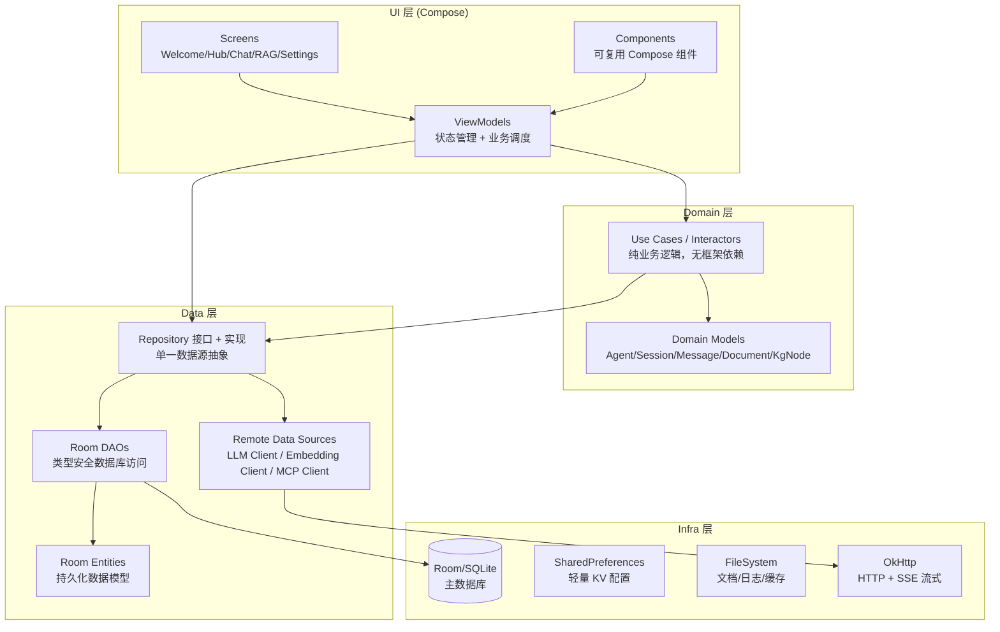

# Nexara — 全局架构设计文档

> **版本**: 2.0.0
> **更新时间**: 2026-05-13
> **状态**: 理想架构 — 对照实现差距分析见 [IMPLEMENTATION_ANALYSIS.md](./IMPLEMENTATION_ANALYSIS.md)
> **关联**: [PRD.md](./PRD.md) — 产品需求文档

---

## 1. 架构全景

### 1.1 分层架构图



### 1.2 模块依赖规则

```
依赖方向: UI → Domain → Data → Infra
          └─── 绝不反向 ────┘

规则:
  1. UI 层只依赖 Domain 层（通过 ViewModel）
  2. Domain 层无 Android 框架依赖（纯 Kotlin）
  3. Data 层实现 Domain 层定义的 Repository 接口
  4. Infra 层只被 Data 层引用
  5. 所有跨越层边界的通信使用 Flow / suspend 函数
```

---

## 2. 模块详细设计

### 2.1 数据模型 (Domain Models)

#### 核心聚合根

```
Agent（助手）
  ├── id: String                    # 唯一标识（uuid）
  ├── name: String                  # 显示名称
  ├── description: String           # 描述（Markdown）
  ├── systemPrompt: String          # 系统提示词
  ├── modelId: String               # 关联模型
  ├── icon: String                  # 图标（emoji 或 Material icon key）
  ├── color: String                 # 主题色（HEX）
  ├── avatarPath: String?           # 自定义头像路径
  ├── isPinned: Boolean             # 是否置顶
  ├── temperature: Double?          # 推理参数
  ├── topP: Double?
  ├── maxTokens: Int?
  ├── ragConfig: AgentRagConfig?    # RAG 配置（null = 继承全局）
  ├── retrievalConfig: AgentRetrievalConfig?  # 检索配置
  ├── useInheritedConfig: Boolean   # 是否继承全局 RAG 配置
  ├── executionMode: ExecutionMode  # auto / semi / manual
  ├── skills: List<String>          # 启用的技能 ID 列表
  └── createdAt: Long               # 创建时间戳

Session（会话）
  ├── id: String
  ├── agentId: String
  ├── title: String
  ├── modelId: String               # 当前使用的模型（可会话内切换）
  ├── isPinned: Boolean
  ├── createdAt / updatedAt: Long
  └── messageCount: Int

Message（消息）
  ├── id: String
  ├── sessionId: String
  ├── role: MessageRole             # USER / ASSISTANT / SYSTEM / TOOL
  ├── content: String               # Markdown 格式
  ├── thinking: String?             # 推理过程（如 DeepSeek R1）
  ├── toolCalls: List<ToolCall>?    # 工具调用记录
  ├── ragReferences: List<RagReference>?  # RAG 引用来源
  ├── tokenUsage: TokenUsage?       # Token 消耗
  └── timestamp: Long

Document（文档）
  ├── id: String
  ├── folderId: String
  ├── title: String
  ├── content: String               # 原始文本
  ├── summary: String?              # LLM 摘要
  ├── hash: String                  # SHA-256 内容指纹
  ├── chunkSize / chunkOverlap: Int
  ├── vectorizedAt: Long?
  └── createdAt / updatedAt: Long
```

#### 枚举与值对象

```kotlin
enum class MessageRole { USER, ASSISTANT, SYSTEM, TOOL }
enum class ExecutionMode { AUTO, SEMI, MANUAL }
enum class ProtocolType { OPENAI, ANTHROPIC, VERTEX_AI }
enum class ModelType { CHAT, REASONING, IMAGE, EMBEDDING, RERANK }
enum class ModelCapability { CHAT, REASONING, VISION, WEB_SEARCH, EMBEDDING, RERANK, IMAGE_GEN, CODE, FUNCTION_CALLING, TOOL_USE, JSON_MODE, STREAMING }

data class TokenUsage(val input: Int, val output: Int, val estimated: Boolean = false)
data class RagReference(val chunkId: String, val documentTitle: String, val snippet: String, val score: Double)
data class ToolCall(val id: String, val name: String, val arguments: String, val result: String?, val status: ToolCallStatus)
```

### 2.2 Repository 体系

```
每个聚合根一个 Repository 接口（定义在 Domain 层） + 实现（定义在 Data 层）

IAgentRepository
  fun observeAll(): Flow<List<Agent>>
  fun observeById(id: String): Flow<Agent?>
  suspend fun create(agent: Agent): String
  suspend fun update(agent: Agent)
  suspend fun delete(id: String)

ISessionRepository
  fun observeByAgent(agentId: String): Flow<List<Session>>
  fun observeById(id: String): Flow<Session?>
  suspend fun create(agentId: String, modelId: String): Session
  suspend fun updateTitle(id: String, title: String)
  suspend fun delete(id: String)

IMessageRepository
  fun observeBySession(sessionId: String): Flow<List<Message>>
  suspend fun send(sessionId: String, content: String, attachments: List<Attachment>): Message
  suspend fun appendStreamChunk(messageId: String, chunk: StreamChunk)
  suspend fun delete(id: String)

IDocumentRepository
  fun observeByFolder(folderId: String): Flow<List<Document>>
  suspend fun import(path: String, folderId: String): Document
  suspend fun update(id: String, content: String)
  suspend fun delete(id: String)
  suspend fun vectorize(id: String)

IVectorRepository
  suspend fun search(query: String, topK: Int, filters: SearchFilters): List<SearchResult>
  suspend fun index(documentId: String, chunks: List<VectorChunk>)
  suspend fun deleteByDocument(documentId: String)

IKnowledgeGraphRepository
  suspend fun extractFromDocument(documentId: String): ExtractionResult
  suspend fun queryNodes(documentIds: List<String>): List<KgNode>
  suspend fun queryEdges(nodeIds: List<String>): List<KgEdge>

IProviderRepository
  fun observeAll(): Flow<List<ProviderConfig>>
  suspend fun testConnection(providerId: String): ConnectionResult
  suspend fun fetchModels(providerId: String): List<ModelSpec>
```

### 2.3 LLM 抽象层

```
                    ┌──────────────────────────┐
                    │      LlmClient            │
                    │   (Domain 层接口)          │
                    │  + streamChat(request)    │
                    │  + chat(request)          │
                    │  + embed(texts)           │
                    └──────────┬───────────────┘
                               │ 实现
               ┌───────────────┼───────────────┐
               │               │               │
        ┌──────▼──────┐ ┌─────▼──────┐ ┌──────▼──────┐
        │ OpenAIClient │ │AnthropicCl │ │VertexAICl   │
        │  (Data 层)   │ │  (Data 层) │ │  (Data 层)  │
        └──────┬───────┘ └─────┬──────┘ └──────┬──────┘
               │               │               │
        ┌──────▼───────────────▼───────────────▼──────┐
        │          StreamParser 管线                    │
        │  ResponseNormalizer → StreamBuffer → Parser  │
        └──────────────────────────────────────────────┘
                               │
                    ┌──────────▼──────────┐
                    │   OkHttp (Infra)    │
                    │   SSE Stream Read   │
                    └─────────────────────┘
```

**关键设计**：
- `LlmClient` 接口定义在 Domain 层，返回 `Flow<StreamChunk>`（标准化片段）
- 每个 Provider 在 Data 层独立实现，通过 `MessageFormatter` 处理协议差异
- `StreamParser` 管线负责将原始 SSE 事件转为 `StreamChunk` 流
- `ThinkingDetector` 检测并分离推理内容（`<thinking>` 标签或 `reasoning_content` 字段）

### 2.4 上下文构建引擎（ContextBuilder）

上下文构建是 Nexara 的核心调度器，负责从多个数据源收集、打分、组装 System Prompt。
数据源分为 **被动检索** 和 **主动工具回传** 两类：

- **被动检索**（每次对话自动触发）：向量检索、FTS5 全文、知识图谱查询、历史摘要
- **主动工具回传**（Agent 循环中产生）：网络搜索、代码执行、文件读写等工具调用结果，作为下一轮 LLM 调用的上下文注入

```
┌──────────────────────────────────────────────────────────────────┐
│                    ContextBuilder Pipeline                        │
│                                                                   │
│  被动检索源                         主动工具回传源                │
│  ┌──────────┐  ┌──────────┐       ┌──────────────────┐          │
│  │ Vectors  │  │ FTS Main │       │ ToolCallResult   │          │
│  │(语义检索)│  │(关键词)  │       │ (上一轮工具回传) │          │
│  └────┬─────┘  └────┬─────┘       └────────┬─────────┘          │
│       │              │                      │                    │
│  ┌────▼──────────────▼──────┐              │                    │
│  │      Hybrid Search       │              │                    │
│  │     (混合检索 + Rerank)   │              │                    │
│  └────────────┬──────────────┘              │                    │
│               │                             │                    │
│  ┌────────────▼──────┐  ┌──────────┐       │                    │
│  │ Knowledge Graph   │  │ History  │       │                    │
│  │ (kg_nodes/edges)  │  │ Summary  │       │                    │
│  └────────┬──────────┘  └────┬─────┘       │                    │
│           │                  │              │                    │
│           └──────────┬───────┘              │                    │
│                      │                      │                    │
│                      ▼                      ▼                    │
│              ┌───────────────────────────────────────┐           │
│              │         ContextBuilder                 │           │
│              │    (Domain 层 — 多源调度与组装)        │           │
│              │                                       │           │
│              │  1. 向量 + FTS5 混合检索 → RAG 片段   │           │
│              │  2. KG 关系查询 → 结构化上下文        │           │
│              │  3. 历史摘要加载                     │           │
│              │  4. 工具回传结果注入                  │           │
│              │  5. Token 预算分配与裁剪              │           │
│              │  6. 拼接 System Prompt               │           │
│              └──────────────────┬────────────────────┘           │
│                                 │                                │
│                                 ▼                                │
│              ┌───────────────────────────────────────┐           │
│              │         ContextPayload                 │           │
│              │  systemPrompt + ragRefs + kgContext   │           │
│              │  + toolResults + tokenEstimate        │           │
│              └───────────────────────────────────────┘           │
│                                 │                                │
│                                 ▼                                │
│                        ┌──────────────┐                          │
│                        │  LLM Call    │                          │
│                        └──────────────┘                          │
└──────────────────────────────────────────────────────────────────┘
```

**ContextBuilder 设计**（核心调度器）：

```kotlin
// Domain 层接口
interface ContextBuilder {
    suspend fun build(
        sessionId: String,
        userMessage: String,
        config: RagConfig,
        previousToolResults: List<ToolCallResult> = emptyList(),  // ← 上一轮工具回传
        onProgress: (ContextBuildProgress) -> Unit
    ): ContextPayload
}

data class ContextPayload(
    val systemPrompt: String,                     // 拼接好的 System Prompt
    val ragReferences: List<RagReference>,        // 向量/FTS5 检索引用（展示用）
    val kgContext: List<KgTriple>,                // 知识图谱上下文
    val historySummary: String? = null,           // 历史对话摘要
    val toolResults: List<ToolCallResult>,        // 工具调用回传数据
    val tokenEstimate: Int                        // 上下文 Token 估算
)

// 工具调用回传 — 统一的抽象，网络搜索/代码执行/文件读写都是其子类型
data class ToolCallResult(
    val toolName: String,                         // "web_search", "execute_code", "read_file", ...
    val summary: String,                          // 摘要文本，注入 System Prompt
    val rawData: String? = null,                  // 原始数据（如搜索结果 JSON）
    val references: List<ExternalReference>? = null  // 外部引用（如搜索结果 URL）
)

data class ExternalReference(
    val title: String,
    val url: String,
    val snippet: String
)

// 进度观测（覆盖所有上下文构建阶段，不限于 RAG）
sealed class ContextBuildProgress {
    data class Retrieving(val source: String, val progress: Float) : ContextBuildProgress()
    data class Reranking(val candidateCount: Int) : ContextBuildProgress()
    data class LoadingHistory(val messageCount: Int) : ContextBuildProgress()
    data class InjectingTools(val toolName: String) : ContextBuildProgress()
    data class Building(val stage: String) : ContextBuildProgress()
    object Complete : ContextBuildProgress()
}
```

### 2.4.1 KG 抽取的双模式策略

知识图谱抽取分为两种模式，服务不同场景，不混用：

| 模式 | 触发者 | 输入 | 存储标记 | 生命周期 | 用途 |
|------|--------|------|---------|---------|------|
| **会话 JIT 微图** | ContextBuilder 自动 | RAG topK + 用户查询 | `sourceType="jit"` | JIT 缓存 1h → 后台归并到持久层 | 为当前对话提供关系上下文 |
| **文档全量抽取** | 用户手动（知识库文档长按菜单） | 整篇文档（分块→GraphExtractor） | `sourceType="full"` | GraphStore 持久 | 构建用户的知识模型 |

**设计原则**：
- 全量 KG 抽取成本高（LLM 调用 × 分块数），噪声大，**不应作为文档导入的副作用自动触发**
- 用户的知识图谱是显式知识建模，由用户控制何时对哪些文档建图
- `GraphStore.resolveSourceType()` 有优先级设计（`full > summary > jit`），保证持久抽取不被即时缓存覆盖
- 支持两种抽取策略：**全量抽取**（遍历所有分块）和 **摘要优先**（采样首/中/尾三块），用户可根据文档大小选择

```kotlin
// 触发入口：RagHomeScreen 文档长按 → DropdownMenu → 选择抽取策略
// RagViewModel.extractKnowledgeGraph(docId, kgStrategy)
//   → VectorizationQueue.enqueueDocument(docId, ..., kgStrategy, skipVectorization=true)
//     → GraphExtractor.extractAndSave(chunk, docId) per chunk
//       → GraphStore.upsertNode() / createEdge() with sourceType="full"
```

### 2.5 Agent 引擎架构

```
┌──────────────────────────────────────────────────────────┐
│                    AgentLoopManager                        │
│                                                           │
│  User Input                                               │
│     │                                                     │
│     ▼                                                     │
│  ┌─────────────┐                                         │
│  │ Context     │ ← RAG检索 + KG查询 + 工具回传 + 历史摘要 │
│  │ Builder     │                                         │
│  └──────┬──────┘                                         │
│         │                                                 │
│         ▼                                                 │
│  ┌─────────────┐     ┌──────────────┐                    │
│  │ LLM Call    │────▶│ Tool Call    │                    │
│  │ (streamChat)│     │ Detected?    │                    │
│  └─────────────┘     └──────┬───────┘                    │
│                             │ Yes                         │
│                             ▼                             │
│                    ┌──────────────┐                       │
│                    │ Execute Tool │                       │
│                    │ (ToolRegistry)                      │
│                    └──────┬───────┘                       │
│                           │                               │
│                           ▼                               │
│                    ┌──────────────┐                       │
│                    │ Need         │── Yes ──→ LLM Call   │
│                    │ Approval?    │          (loop)       │
│                    └──────┬───────┘                       │
│                           │ No                            │
│                           ▼                               │
│                    ┌──────────────┐                       │
│                    │ Return       │                       │
│                    │ Final Result │                       │
│                    └──────────────┘                       │
└──────────────────────────────────────────────────────────┘
```

**ToolRegistry 设计**：

```kotlin
interface Tool {
    val name: String
    val description: String
    val parameters: JsonSchema
    val riskLevel: RiskLevel         // LOW / MEDIUM / HIGH / CRITICAL
    suspend fun execute(args: String): ToolResult
}

enum class RiskLevel {
    LOW,        // 只读操作：搜索、检索
    MEDIUM,     // 本地写入：创建文件、保存文档
    HIGH,       // 网络操作：API调用、发送请求
    CRITICAL    // 系统操作：执行命令、修改配置
}

// 根据 ExecutionMode + RiskLevel 决定是否需要审批
fun needsApproval(executionMode: ExecutionMode, riskLevel: RiskLevel): Boolean {
    return when (executionMode) {
        ExecutionMode.AUTO -> riskLevel >= RiskLevel.HIGH
        ExecutionMode.SEMI -> riskLevel >= RiskLevel.MEDIUM
        ExecutionMode.MANUAL -> true
    }
}
```

---

## 3. 数据库设计

### 3.1 核心表（19 实体）

```
┌─────────────┐     ┌──────────────┐     ┌────────────────┐
│   agents    │     │   sessions   │     │   messages     │
├─────────────┤     ├──────────────┤     ├────────────────┤
│ id (PK)     │────▶│ agent_id(FK) │────▶│ session_id(FK) │
│ name        │     │ id (PK)      │     │ id (PK)        │
│ description │     │ title        │     │ role           │
│ system_prmpt│     │ model_id     │     │ content        │
│ model_id    │     │ is_pinned    │     │ thinking       │
│ icon        │     │ created_at   │     │ tool_calls     │
│ color       │     │ updated_at   │     │ rag_refs       │
│ avatar_path │     │ msg_count    │     │ token_usage    │
│ is_pinned   │     └──────────────┘     │ timestamp      │
│ temperature │                          └────────────────┘
│ top_p       │
│ max_tokens  │     ┌──────────────┐     ┌────────────────┐
│ rag_config  │     │  documents   │     │   folders      │
│ retr_config │     ├──────────────┤     ├────────────────┤
│ use_inherit │     │ id (PK)      │────▶│ id (PK)        │
│ exec_mode   │     │ folder_id(FK)│     │ name           │
│ skills      │     │ title        │     │ parent_id      │
│ created_at  │     │ content      │     │ created_at     │
└─────────────┘     │ summary      │     └────────────────┘
                    │ hash         │
┌─────────────┐     │ chunk_size   │     ┌────────────────┐
│  vectors    │     │ chunk_olap   │     │ kg_nodes       │
├─────────────┤     │ vectorized_at│     ├────────────────┤
│ id (PK)     │     │ created_at   │     │ id (PK)        │
│ doc_id (FK) │     └──────────────┘     │ label          │
│ session_id  │                          │ type           │
│ chunk_text  │     ┌──────────────┐     │ properties     │
│ embedding   │     │  kg_edges    │     │ created_at     │
│ chunk_index │     ├──────────────┤     └────────────────┘
│ created_at  │     │ id (PK)      │
└─────────────┘     │ source_id(FK)│     ┌────────────────┐
                    │ target_id(FK)│     │ context_summar │
┌─────────────┐     │ relation     │     ├────────────────┤
│  tags       │     │ weight       │     │ id (PK)        │
├─────────────┤     │ created_at   │     │ session_id(FK) │
│ id (PK)     │     └──────────────┘     │ summary_text   │
│ name        │                          │ range_start    │
│ color       │     ┌──────────────┐     │ range_end      │
└─────────────┘     │ doc_tags     │     │ created_at     │
                    ├──────────────┤     └────────────────┘
                    │ doc_id (FK)  │
                    │ tag_id (FK)  │     ┌────────────────┐
                    └──────────────┘     │ audit_logs     │
                                         ├────────────────┤
                                         │ id (PK)        │
                                         │ action         │
                                         │ entity_type    │
                                         │ entity_id      │
                                         │ details        │
                                         │ timestamp      │
                                         └────────────────┘
```

### 3.2 关键索引策略

```sql
-- 消息列表查询（最高频）
CREATE INDEX idx_messages_session_time ON messages(session_id, timestamp DESC);

-- Agent 会话列表
CREATE INDEX idx_sessions_agent_pinned ON sessions(agent_id, is_pinned DESC, updated_at DESC);

-- 向量检索（余弦相似度计算需要在应用层完成）
CREATE INDEX idx_vectors_doc ON vectors(doc_id);
CREATE INDEX idx_vectors_session ON vectors(session_id);

-- 全文搜索
CREATE VIRTUAL TABLE vectors_fts USING fts5(chunk_text, content=vectors, content_rowid=id);

-- 知识图谱关系查询
CREATE INDEX idx_edges_source ON kg_edges(source_id);
CREATE INDEX idx_edges_target ON kg_edges(target_id);
```

---

## 4. 导航架构

### 4.1 路由表

```
Welcome（一次性引导）
  └─→ MainTabScaffold
        ├─ Tab 0: CHAT（对话中枢）
        │     ├─ agent_hub              Agent 列表 + 搜索
        │     ├─ session_list/{aId}     Agent 的会话列表
        │     ├─ chat_hero/{sId}        对话详情
        │     ├─ agent_edit/{aId}       Agent 编辑
        │     ├─ agent_rag/{aId}        Agent RAG 配置
        │     ├─ agent_retrieval/{aId}  Agent 高级检索
        │     ├─ session_settings/{sId} 会话设置
        │     └─ workspace/{sId}        工作区（未来 Artifacts）
        │
        ├─ Tab 1: LIBRARY（知识库）
        │     ├─ rag_library            文库主页
        │     ├─ rag_folder/{fId}/{name} 文件夹详情
        │     ├─ doc_editor/{dId}       文档编辑器
        │     ├─ knowledge_graph        知识图谱可视化
        │     ├─ rag_global_config      全局 RAG 配置
        │     ├─ rag_advanced           高级检索配置
        │     └─ rag_debug              RAG 调试面板
        │
        └─ Tab 2: SETTINGS（设置）
              ├─ settings_hub           设置主页
              ├─ provider_form/{pId}?   服务商配置
              ├─ provider_models/{pId}  模型列表
              ├─ local_models           本地模型管理
              ├─ theme_config           主题配置
              ├─ search_config          搜索配置
              ├─ skills_config          技能配置
              ├─ token_usage            Token 统计
              ├─ backup_settings        备份管理
              └─ developer_panel        开发者工具
```

### 4.2 导航类型安全

```kotlin
// 使用密封类模式确保编译期类型安全
sealed class NavRoute(val route: String) {
    object AgentHub : NavRoute("agent_hub")
    data class SessionList(val agentId: String) : NavRoute("session_list/$agentId")
    data class ChatHero(val sessionId: String) : NavRoute("chat_hero/$sessionId")
    // ... 所有路由
}
```

---

## 5. 跨端架构路线（CMP 渐进式迁移）

### 5.1 当前状态

```
native-ui/
├── app/src/main/java/com/promenar/nexara/
│   ├── data/          ← 100% Android 依赖（Room / OkHttp / Context）
│   ├── ui/            ← 100% Compose Material3（Android-only API）
│   └── navigation/    ← Compose Navigation（Android-only）
```

### 5.2 渐进式提取路径

```
Step 1: 提取纯 Kotlin 模块
  └─ :core-model        Domain Models（无 Android 依赖）
  └─ :core-protocol     LLM 协议定义 + 序列化

Step 2: 抽取 commonMain
  └─ :shared
       ├─ commonMain/   ← Domain Models + Use Cases + Repository 接口
       ├─ androidMain/  ← Room DAO + OkHttp 实现（expect/actual）
       └─ iosMain/      ← 未来 iOS 实现

Step 3: UI 层迁移
  └─ Compose Multiplatform → 共享 UI 代码
  └─ 平台特定 UI（Android MD3 / iOS SwiftUI bridge）

Step 4: 数据层迁移
  └─ Room → SQLDelight（跨平台数据库）
  └─ OkHttp → Ktor Client（跨平台网络）
```

**原则**：每步迁移保持功能可用，不阻塞 Android 端交付。

---

## 6. 安全与隐私设计

### 6.1 API Key 管理

```
┌─────────────┐     ┌──────────────────┐     ┌─────────────┐
│  User Input │────▶│ EncryptedShared  │────▶│ LLM Client  │
│  (明文 Key) │     │ Preferences      │     │ (运行时解密) │
│              │     │ (AES-256-GCM)    │     │             │
│              │     │ Android Keystore │     │ Key 仅在    │
│              │     │ 硬件级密钥保护   │     │ 内存中短暂  │
│              │     │                  │     │ 存在        │
└─────────────┘     └──────────────────┘     └─────────────┘
```

### 6.2 数据所有权

- 所有数据存储在设备本地（SQLite + FileSystem）
- 用户可随时导出完整数据
- 用户可随时删除任意数据（含向量、图谱）并验证清理
- 网络传输仅发送必要上下文（用户消息 + RAG 片段 + System Prompt）
- 不上报任何遥测数据（除非用户主动启用崩溃报告）

---

## 7. 测试策略

| 层级 | 测试类型 | 工具 | 覆盖率目标 |
|------|---------|------|-----------|
| Domain | Unit Test | JUnit5 + MockK | > 90% |
| Data (Repository) | Integration Test | Room in-memory + OkHttp MockWebServer | > 70% |
| UI (ViewModel) | Unit Test | Turbine (Flow test) + MockK | > 70% |
| UI (Compose) | Screenshot Test | Paparazzi / Roborazzi | 关键页面 100% |
| E2E | Instrumentation Test | Espresso / Compose Testing | 核心流程 100% |

---

**文档维护者**: AI Assistant
**最后更新**: 2026-05-13
**下次审查**: CMP 迁移启动前
