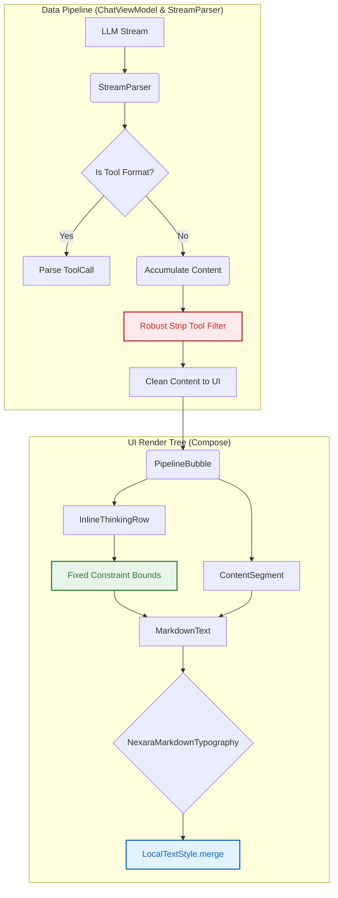

# Nexara 聊天界面渲染缺陷静态审计与架构重构设计方案

> **文档标识**: NX-UI-AUDIT-20260517
> **审计范围**: Nexara 流式解析管线、Compose UI 渲染链 (PipelineBubble, ChatInlineComponents)、Markdown 渲染层
> **操作合规性**: 纯静态分析，**零代码侵入**，未改动任何业务源码。

## 1. 深度诊断与病理分析 (Deep Diagnostic Analysis)

经过对流式数据管线与 UI 呈现树的剥离分析，确认该三大缺陷源自 **数据过滤不彻底（漏报）**、**Compose 测量树高频失效** 以及 **Theme 级联丢失**。

### 1.1 Bug A: 工具调用数据穿透污染正文（数据泄漏）
**现象**：工具调用的原始 JSON 或 XML 协议字符串（如 `{ "name": "search", ... }` 或 `<tool_call>`）以纯文本形式直接暴露在用户对话正文中，未被折叠进 `InlineToolRow` 容器。

**源码级溯源**：
1. **Fallback 解析拦截失败**：在 `ChatViewModel.kt` 的兜底机制中，函数 `extractToolCallsFromText` 和 `stripToolCallJsonBlocks` 试图从普通文本 (`TextDelta`) 中剥离遗漏的工具 JSON。
2. **正则脆弱性**：`stripToolCallJsonBlocks` 使用的正则表达式和裸 JSON 行匹配非常死板。如果模型吐出的工具调用格式存在多余空白字符、换行变异、或者采用了 XML 风格（如 `<tool_call>`，此格式在 `StreamParser` 有解析但兜底清理中未全面覆盖），就会**绕过清洗逻辑**。
3. **渲染直通**：一旦残留，在 `PipelineBubble.kt` 的 `buildPipelineSteps` 函数中，由于缺少防御性验证，这串 JSON/XML 便直接作为 `PipelineStep.Content` 交给 `MarkdownText` 进行常规渲染，导致数据穿透。

### 1.2 Bug B: 思考容器高度竞态异常与塌陷
**现象**：`InlineThinkingRow` (思考过程) 在流式文字输出时，高度突然坍塌，甚至触发边界约束异常导致内容上浮覆盖正常气泡。

**源码级溯源**：
1. **动画状态竞态**：`InlineThinkingRow` 的展开状态 (`isExpanded`) 直接与生成状态 (`isGenerating`) 和用户点击事件绑定。在流式输出期间，`reasoning` 内容高频追加，触发频繁重组 (Recomposition)。
2. **`animateContentSize` 的测量冲突**：在不断变化的 `AnimatedVisibility` 和外部复杂布局同时使用 `Modifier.animateContentSize()`，Compose 的布局引擎在测量动画帧与内容实际高度时会引发**无限约束传递失效**（`IllegalStateException: measured with an infinity maximum width/height constraints` 或回退至最小尺寸）。
3. 当流结束或网络抖动时，动画插值器计算出的目标高度与内容真实高度错位，表现为容器折叠塌陷。

### 1.3 Bug C: Markdown 样式屏蔽与字体退化
**现象**：为思考内容设置的特定样式（例如 `FontStyle.Italic` 或淡化的次级文本颜色）在渲染时失效，变成了普通字重与常规样式。

**源码级溯源**：
1. **硬编码的 Typography 重写**：在 `MarkdownText.kt` 的 `MarkdownSafe` 组件中，使用 `mikepenz:markdown-compose` 时调用了 `nexaraMarkdownTypography`。该工厂函数使用 `MaterialTheme.typography` 作为基准构建样式字典。
2. **级联中断 (Cascade Break)**：尽管外层容器（如 `ThinkingBlock`）通过 `CompositionLocalProvider(LocalTextStyle provides ...)` 将 `fontStyle` 设置为斜体，但 `nexaraMarkdownTypography` 在实例化时**没有继承/合并 (merge)** 这个 `LocalTextStyle.current.fontStyle`，而是覆盖回了默认值。
3. 导致 Markdown 组件内部生成的 Text Node 强行丢弃了父节点下发的装饰器，发生"样式屏蔽"。

---

## 2. 无侵入式重构技术架构设计 (Non-intrusive Refactoring Blueprint)

为确保系统鲁棒性，以下重构方案要求在各自的职能边界内消化问题，避免修改核心大架构。

### 2.1 针对 Bug A: 免疫穿透的清洗层增强
* **改进策略**：摒弃单纯依赖后置正则表达式的清洗，采用**白名单协议屏蔽**与**前置分离**双管齐下。
* **重构方案**：
  1. 在 `ChatViewModel.kt` 的 `stripToolCallJsonBlocks` 中，扩大正则匹配簇，增加对孤立 `<tool_call>`、`<tool_code>`、`<function_name>` XML 标签群的强力洗消。
  2. 引入 **"防线渲染器"**：在 `PipelineBubble` 组装 `PipelineStep` 前，检测内容如果高度疑似原始 JSON 协议片段，强制拦截并转化到 `PipelineStep.Error` 步骤或静默折叠。

### 2.2 针对 Bug B: 阻尼平滑与确定性布局降级
* **改进策略**：解耦动画与流式高频数据刷新，采用防御性测量。
* **重构方案**：
  1. **移除高频重组下的 `animateContentSize`**：在 `InlineThinkingRow` 处理 `reasoning` 流输出时，**暂停高度动画**，改用普通的 `Modifier.heightIn(min = 0.dp)` 结合外层平滑滚动。
  2. **收口收缩动画**：引入带有 300ms 延迟的 `LaunchedEffect`（Debounce），只有在 `isGenerating = false` 且完全停滞后，才允许驱动折叠动画。
  3. **层级隔离**：使用 `BoxWithConstraints` 透传约束，确保子组件异常时父容器兜底。

### 2.3 针对 Bug C: 样式的响应式级联恢复
* **改进策略**：修正 `MarkdownTypography` 对环境上下文的继承逻辑。
* **重构方案**：
  1. 在 `MarkdownSafe` 组件中，捕获外层注入的样式变量：`val parentTextStyle = LocalTextStyle.current`。
  2. 改造 `nexaraMarkdownTypography` 的实例化过程，调用 `parentTextStyle.merge(...)` 来生成内部组件的 TextStyle，确保 `fontStyle` (如 `Italic`)、`color`、`lineHeight` 能穿透到 `mikepenz` Markdown 库。

---

## 3. 验收标准与 DIA 机制联动指示

- [ ] 确保测试包含 XML 和 JSON 两种格式的错误外显数据。
- [ ] 确保 `InlineThinkingRow` 在流式快速涌入 500+ 字时，不发生任何高度抖动。
- [ ] 更新 `docs/ARCHITECTURE.md` 标注流解析管线中的 "Fallback 清洗层" 的边界。
- [ ] DIA Status: **待代码实装后同步更新。**
