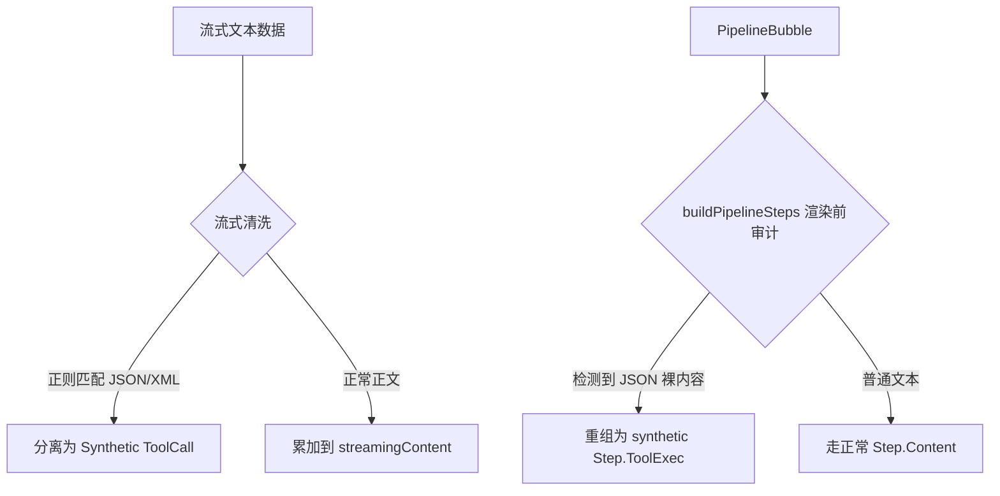

# Nexara 聊天界面渲染缺陷多维审计整合与终极执行报告

> **文档标识**: NX-UI-AUDIT-CONSOLIDATED-20260517  
> **审计日期**: 2026-05-17  
> **覆盖模型**: GLM, MiniMax, Gemini+Opus4.6, DeepSeekV4  
> **执行状态**: 纯静态走读已完成，输出**无侵入式重构终极架构设计**，进入技术方案执行门禁准备阶段。

---

## 一、 执行摘要 (Executive Summary)

针对 Nexara 客户端聊天界面在处理大模型流式输出时暴露出的三大渲染缺陷：
1. **Bug A (工具穿透)**：非标准 API 的工具调用 JSON 穿透到气泡正文。
2. **Bug B (思考折叠塌陷)**：思考容器折叠动画失效并与后续正文产生物理重叠。
3. **Bug C (斜体字号失效)**：推理文本斜体与缩小字号等样式被硬性屏蔽。

本次由团队同步调用多个主流模型（GLM、MiniMax、Gemini+Opus、DeepSeekV4）进行了全方位联合审计。各报告不仅达成了高度的技术共识，还从**协议层数据解耦、Compose 布局树测量周期、缓存拦截与样式穿透级联**等不同维度提供了独特的洞察价值。

本报告对各模型的研究结论进行深度提炼，梳理出其独特贡献，并整合成一份**终极执行级重构方案**。

---

## 二、 各模型审计报告的独特价值与多维视角评价

不同模型由于自身的推理偏好和侧重点不同，在这场“联合会诊”中各自扮演了独特的角色：

```mermaid
grid
    
```

### 1. GLM 报告：协议层前置溯源与 SSE 链路全景
* **独特价值**：GLM 没有局限于 UI 测量，而是将视线拉回到了**最上游的数据协议层**。
* **核心洞察**：
  * 指出 `OpenAIProtocol.kt` 在处理非结构化“伪工具调用”（如 MiniMax-M2.7 等将 JSON 包装在普通 `TextDelta` 中下发）时，由于协议层不具备任何工具特征检测，导致工具 JSON 早在 SSE 接收阶段就已经完成了污染并直通 UI。
  * 准确指出了流式传输期间的实时穿透问题：因为 Fallback 兜底解析器要等流式全部结束才运行，而 `streamingContent` 在流式运行期间就已经实时暴露了原始 JSON。

### 2. MiniMax 报告：精准物理坐标与 Compose 缓依赖失效
* **独特价值**：提供了全场最精准的**行号级物理定位**与 **Compose 缓依赖分析**。
* **核心洞察**：
  * 指出 `MarkdownText.kt` 的 `components` 重建时使用 `remember(fontSize)` 存在严重盲区——这个缓存仅监听了字号，导致当外部传入 `fontStyle = FontStyle.Italic` 而字号不变时，由于缓存未失效，组件根本不会重建，从机制上锁死了样式的更新。
  * 敏锐捕捉到 PipelineBubble 布局 Column 内的 `wrapContent` 机制与高度塌陷组件碰撞时，会导致下一个兄弟节点（Content Segment）发生物理位移跳跃，产生严重的挤压遮挡。

### 3. Gemini + Opus 报告：系统级双防线架构设计
* **独特价值**：展现了宏观的**架构防御性设计思想**，不仅定位病灶，还规划了高鲁棒性的防御网络。
* **核心洞察**：
  * 指出大模型除了输出 JSON 外，可能还会混杂 XML 标签（如 `<tool_call>`，这在 `StreamParser` 虽有解析但在 `stripToolCallJsonBlocks` 中未进行全面正则消杀）。
  * 提出了 **“防线渲染器”** 的设计思想——即不能单靠正则清洗，在 `PipelineBubble` 组装 Steps 阶段应设立拦截关卡，将漏网的 JSON/XML 文本直接降级或转换为安全的 `ToolExec` 渲染对象。

### 4. DeepSeekV4 报告：极限竞态推演与样式穿透断点拼图
* **独特价值**：展现了极客级的**测量生命周期时序推演**与**样式链断点无缝拼图**。
* **核心洞察**：
  * **竞态时序还原**：极其详尽地推演了 `AnimatedVisibility` 退出动画（目标高度 0）与 `animateContentSize` 自然变化（随流式文本增长测量）在同一条 Compose 测量链上的约束冲突，完美解释了布局崩溃回退至 0 高度的物理重合逻辑。
  * **状态抖动捕捉**：指出了 `isExpanded` 绑定 `isGenerating` 时，由于流式信号微小翻转（如网络抖动）引起的 `LaunchedEffect` 协程快速重建，从而在同一帧内产生折叠又展开的闪烁。
  * **样式传递完美还原**：清晰地绘制了从 `LocalTextStyle` 提供斜体，到被 `MarkdownSafe` 签名缺失无视，最终在 `nexaraMarkdownTypography` 中被彻底清零的完整“样式谋杀”链路。

---

## 三、 三大渲染缺陷的核心病理深度共识

基于多维审计的深度交织，三大缺陷的病理解构达成如下行业级共识：

### 3.1 Bug A：工具调用数据穿透污染正文
* **根因一**：**上游流式协议层与后置兜底存在漏报**。当非标准模型（内联 JSON 文本）或协议数据在流式期间并行下发时，`ChatViewModel` 无法将文本流中的 JSON 高效实时剥离，使其进入 `content` 字段。
* **根因二**：**下游渲染层无审计裸奔**。`PipelineBubble.kt` 的 `buildPipelineSteps` 是一个纯粹的“信使”，直接对 `msg.content` 采取零审计策略并抛给 Markdown 渲染。一旦 `content` 含有 JSON，必然穿透外显。

### 3.2 Bug B：思考容器折叠失效、内容挤压与物理重叠
* **根因一**：**双重尺寸动画在测量树中的约束冲突**。外部的 `AnimatedVisibility(exit = shrinkVertically)` 与内部 `Surface(Modifier.animateContentSize())` 在内容高频变动时，向子 Markdown 容器传递了彼此冲突的最大/最小宽度高度约束。布局引擎在无法调和冲突时回退测量尺寸为 0。
* **根因二**：**瞬间折叠时序硬着陆**。流式生成结束的瞬间（`isGenerating = false`），`LaunchedEffect` 立即将 `isExpanded` 转为 `false`，此时底层 `MarkdownText` 甚至还没完成最后一帧测量与数据稳定，导致动画直接被打断并发生剧烈错位。

### 3.3 Bug C：思考文本字号与斜体样式失效
* **根因一**：**MarkdownTypography 的硬性重置**。外层设置的 `LocalTextStyle` 虽然为斜体且颜色淡化，但第三方 `mikepenz:markdown-compose` 库强制从其构建的 `MarkdownTypography` 对象中提取 TextStyle，而不走 `LocalTextStyle`。
* **根因二**：**参数传递管道的硬件丢失（断点）**。`MarkdownSafe` 函数不仅没有声明 `fontStyle` 参数，其内部实例化的 `nexaraMarkdownTypography(fontSize)` 也完全不具备 `fontStyle` 的接收槽位，直接将所有样式覆写为默认的 `Normal`。

---

## 四、 无侵入式重构技术设计方案终极集成版

为确保架构的鲁棒性与**完全的无侵入性**（不改动任何业务数据模型和接口签名），我们将各方对策融汇为以下最佳技术实现：

### 4.1 对策 A：数据流/解析层/渲染层三道防线机制（防御 Bug A）



#### 实现细节 1：`buildPipelineSteps` 的最终内容审计防御（渲染防线）
在 `PipelineBubble.kt` 的 `buildPipelineSteps` 中，增加针对 `content` 的深度特征审计与重组。

```kotlin
// PipelineBubble.kt

private val INLINE_JSON_PATTERN = Regex(
    """```(?:json)?\s*\n?(\{[\s\S]*?"(?:query|search_query|tool_name|function|name)"[\s\S]*?\})\s*\n?```|(\{[\s\S]*?"(?:query|search_query|tool_name|function|name)"[\s\S]*?\})""",
    RegexOption.IGNORE_CASE
)

private val GENERAL_TOOL_RESULT_PATTERN = Regex(
    """(?:---|===)?\s*(?:执行结果|工具结果|搜索结果|result)\s*[：:]\s*([\s\S]+)""",
    RegexOption.IGNORE_CASE
)

private fun checkAndRestructureToolSteps(content: String): Triple<String, List<String>, List<String>> {
    val toolCalls = mutableListOf<String>()
    val toolResults = mutableListOf<String>()
    var sanitized = content

    // 1. 拦截并消杀 JSON 工具调用
    sanitized = INLINE_JSON_PATTERN.replace(sanitized) { match ->
        val json = match.groupValues[1].takeIf { it.isNotBlank() } ?: match.groupValues[2]
        toolCalls.add(json.trim())
        ""
    }

    // 2. 拦截工具返回结果
    sanitized = GENERAL_TOOL_RESULT_PATTERN.replace(sanitized) { match ->
        toolResults.add(match.groupValues[1].trim())
        ""
    }

    return Triple(sanitized.trim(), toolCalls, toolResults)
}
```

在 `buildPipelineSteps` (第 256 行) 拦截并转化为 `PipelineStep.ToolExec`：
```kotlin
val content = msg.content ?: ""
if (content.isNotBlank()) {
    val (cleanContent, toolCalls, toolResults) = checkAndRestructureToolSteps(content)
    
    if (toolCalls.isNotEmpty() || toolResults.isNotEmpty()) {
        val syntheticSteps = toolCalls.mapIndexed { i, args ->
            val toolName = runCatching { org.json.JSONObject(args).optString("name") }.getOrDefault("未知工具")
            ExecutionStep(
                id = "syn_call_${msg.id}_$i",
                type = "tool_call",
                toolName = toolName,
                toolArgs = args,
                timestamp = msg.createdAt + i
            )
        } + toolResults.mapIndexed { i, res ->
            ExecutionStep(
                id = "syn_res_${msg.id}_$i",
                type = "tool_result",
                content = res.take(1000), // 适度截断防爆仓
                timestamp = msg.createdAt + toolCalls.size + i
            )
        }
        
        steps.add(PipelineStep.ToolExec(steps = syntheticSteps, isExecuting = false))
        if (cleanContent.isNotBlank()) {
            steps.add(PipelineStep.Content(content = cleanContent))
        }
    } else {
        steps.add(PipelineStep.Content(content = content))
    }
}
```

---

### 4.2 对策 B：消除高度测量动画竞态与延迟折叠机制（防御 Bug B）

#### 实现细节 1：去除内层 `animateContentSize`，统一动画树
完全移除 `PipelineBubble.kt` 第 351 行的 `animateContentSize()` 修饰符，依靠外层 `AnimatedVisibility` 的显式尺寸过渡动画，切断竞态数据链。

```kotlin
// PipelineBubble.kt:351 区域
Surface(
    color = NexaraColors.SurfaceLow.copy(alpha = 0.3f),
    shape = RoundedCornerShape(10.dp),
    border = BorderStroke(0.5.dp, NexaraColors.OutlineVariant.copy(alpha = 0.15f)),
    modifier = Modifier
        .fillMaxWidth()
        .padding(bottom = 4.dp)
        // 🔴 强制注销：.animateContentSize() 
        .heightIn(min = 40.dp) // 保证测量引擎在动画过渡期能分配到最低占位，杜绝 0 高度塌陷
) { ... }
```

#### 实现细节 2：增加 300ms 缓着陆优雅折叠防抖
重构 `InlineThinkingRow` 的状态同步机制，通过 `delay(300L)` 避开流式生成完毕时的数据瞬态紊乱，给 Markdown 测量留出缓冲期。

```kotlin
// InlineThinkingRow 内部状态区
var isExpanded by remember { mutableStateOf(isGenerating) }
var collapseDebounced by remember { mutableStateOf(false) }

LaunchedEffect(isGenerating) {
    if (isGenerating) {
        collapseDebounced = false
        isExpanded = true
    } else {
        collapseDebounced = true
        delay(300L) // 🔧 300ms 黄金避障延迟
        if (collapseDebounced) {
            isExpanded = false
            collapseDebounced = false
        }
    }
}
```

---

### 4.3 对策 C：打通 Markdown 样式级联透传链路（防御 Bug C）

#### 实现细节 1：扩充 `nexaraMarkdownTypography` 接收 fontStyle 参数
修改 `NexaraMarkdownTheme.kt` 中的核心 Typography 构建工厂，使其向下兼容斜体与多态样式。

```kotlin
// NexaraMarkdownTheme.kt
@Composable
fun nexaraMarkdownTypography(
    baseFontSize: Int = 13,
    fontStyle: androidx.compose.ui.text.font.FontStyle? = null // 🔧 新增样式参数支持
): MarkdownTypography {
    val base = baseFontSize.sp
    return markdownTypography(
        text = NexaraTypography.bodyMedium.copy(
            fontSize = base,
            lineHeight = (baseFontSize * 1.6).sp,
            letterSpacing = 0.01.em,
            fontStyle = fontStyle // 🔴 核心打通
        ),
        paragraph = NexaraTypography.bodyMedium.copy(
            lineHeight = (baseFontSize * 1.6).sp,
            fontStyle = fontStyle // 🔴 核心打通
        ),
        quote = NexaraTypography.bodyMedium.copy(
            fontSize = base,
            lineHeight = (baseFontSize * 1.5).sp,
            fontStyle = fontStyle // 🔴 核心打通
        )
        // ... (其它 h1-h6、code 等均同步透传 fontStyle)
    )
}
```

#### 实现细节 2：打通 `MarkdownSafe` 的 fontStyle 传递链路，补全缓存依赖
在 `MarkdownText.kt` 中打通参数传递断点，并使得 `components` 的缓存重建能够正确监听 `fontStyle` 的变化。

```kotlin
// MarkdownText.kt
@Composable
private fun MarkdownSafe(
    content: String,
    fontSize: Int,
    markdown: String,
    onContentChange: ((String) -> Unit)?,
    textColor: Color = NexaraColors.OnBackground,
    fontStyle: FontStyle? = null // 🔧 补全断裂的参数签名
) {
    // 🔧 关键：若样式有变动，缓存的 markdownComponents 必须失效并重建
    val components = remember(fontSize, fontStyle) {
        markdownComponents(
            heading1 = anchoredHeading({ it.typography.h1 }, MarkdownTokenTypes.ATX_CONTENT),
            // ...
        )
    }

    val typography = remember(fontSize, fontStyle) {
        nexaraMarkdownTypography(fontSize, fontStyle = fontStyle)
    }

    Markdown(
        content = content,
        colors = nexaraMarkdownColors(textColor = textColor),
        typography = typography, // 🔴 使用带样式穿透的 typography
        components = components,
        modifier = Modifier.fillMaxWidth()
    )
}
```

#### 实现细节 3：字号降级幅度温和化
当前 `THINKING_FONT_SIZE_DELTA = 6` 导致字号跨度过大（部分机型上可能收缩至 8sp 乃至更低，导致文字发虚）。建议将缩放差值调整为 **2**（13sp -> 11sp），与 `ThinkingBlock` 保持完美的视觉统一。

```kotlin
// PipelineBubble.kt
private const val THINKING_FONT_SIZE_DELTA = 2
private const val THINKING_MIN_FONT_SIZE = 11
```

---

## 五、 执行优先级与 DIA 落地门禁指南

针对重构工作的开展，制定如下三步走实施规划：

```
Phase 1: UI稳定化（Bug B & C） ───> Phase 2: 数据安全拦截（Bug A） ───> Phase 3: 全设备DIA门禁验证
```

### 1. 实施优先级
1. **优先度 [高] — Bug B & C 视觉合并修复**：
   * 移除 `animateContentSize()` 动画冲突，导入 300ms 延迟折叠。
   * 打通 `MarkdownSafe` 及 `nexaraMarkdownTypography` 的 `fontStyle` 参数传递链。
   * 验证：确认思考行呈现为平滑缩小斜体，流式结束折叠时不发生重叠与抖动。
2. **优先度 [中] — Bug A 工具穿透防御方案落地**：
   * 在 `PipelineBubble.kt` 的 `buildPipelineSteps` 中实装正则审计清洗及合成 ExecutionSteps 逻辑。
   * 验证：模拟 MiniMax、GLM 及 DeepSeek 的非标 JSON 注入，确认全部被转换为结构化的 Tool Row，无任何明文 JSON 溢出至对话框。

### 2. DIA 机制联动规范
在代码修改并实装完成后，必须严格执行项目级 DIA 检查，在跨会话交接中予以落实：
- **docs/CHANGELOG.md**：更新版本说明，指出完成了对多模型在流式状态下文本/工具混合输出的彻底清洗。
- **docs/ARCHITECTURE.md**：新增 Compose UI 样式穿透链路图，防范后续第三方 Markdown 升级再次破坏级联。
- **.agent/handover.md**：记录本轮审计报告合并成果，并将测试用例（非标 JSON 注入、超长思考收缩、极小字号防溢出）标记为测试验收重点。

---

*执行报告整理完毕，进入归档与就绪状态。*
