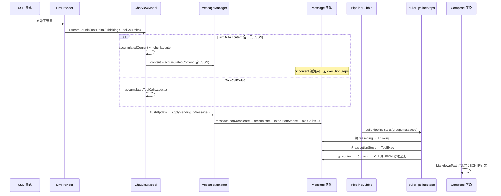

# Nexara 聊天界面渲染缺陷静态审计报告

> **审计日期**：2026-05-17  
> **审计类型**：纯静态代码走读（非破坏性，未修改任何源文件）  
> **审计范围**：PipelineBubble.kt / MarkdownText.kt / ChatInlineComponents.kt / NexaraMarkdownTheme.kt / ChatModels.kt  

---

## 一、核心病灶技术根因剖析 (Root Cause Analysis)

---

### Bug A：工具调用数据穿透污染正文（容器未激活）

**精确物理坐标**：`PipelineBubble.kt` 第 237-264 行 `buildPipelineSteps()` 函数

#### 1.1 数据模型层面的缺陷

`buildPipelineSteps` 按以下优先级拆解每条 `Message`：

```kotlin
// PipelineBubble.kt:237-264
for (msg in messages) {
    if (msg.role == MessageRole.ASSISTANT) {
        // 1. reasoning → Thinking step
        if (!msg.reasoning.isNullOrBlank()) { ... }
        // 2. executionSteps → ToolExec step
        if (!msg.executionSteps.isNullOrEmpty()) { ... }
        // 3. content → Content step（兜底）
        if (msg.content.isNotBlank()) { ... }
    }
    // TOOL 消息：直接跳过（第 260 行注释）
}
```

**漏洞**：该函数对工具调用数据的依赖路径是**单向且排他的**——它只从 `msg.executionSteps`（结构化 List<ExecutionStep>）中提取工具执行步骤。当以下任一情况发生时，工具 JSON 将直接穿透到 `PipelineStep.Content` 并被渲染为正文：

| 穿透场景 | 触发条件 | 后果 |
|---------|---------|------|
| **场景1：内联工具 JSON** | LLM Provider 以 `TextDelta` 形式将工具调用 JSON 织入 `accumulatedContent`，而非产生 `ToolCallDelta` 事件 | JSON 明文进入 `msg.content`，无 `executionSteps` 保护，直达 Content 渲染 |
| **场景2：异构 Provider** | 某些 API 后端（如 Ollama 原生、vLLM 特定配置）不支持结构化 Function Calling，而是将函数调用以内联 Markdown 代码块格式输出 | `buildPipelineSteps` 无任何正则/启发式检测机制 |
| **场景3：历史消息回放** | 数据库中的旧消息 `content` 字段包含完整的工具调用原文，但对应 `executionSteps` 为 null（旧版本未拆分） | 重新渲染时直接暴露原始 JSON |

#### 1.2 流式数据流的精确推演

```
SSE 原始字节流
  → LlmProvider 解析为 StreamChunk
    ├─ StreamChunk.TextDelta(content="{\"query\":\"何瑞斯\"") → accumulatedContent 累积
    ├─ StreamChunk.TextDelta(content="", reasoning="正在分析查询意图…") → accumulatedReasoning 累积
    └─ StreamChunk.ToolCallDelta(id="x", name="search", arguments="{...) → accumulatedToolCalls 累积
  → ChatViewModel.flow.collect { ... }
    └─ MessageManager.updateMessageContent(..., reasoning=..., content=accumulatedContent)
      └─ applyPendingToMessage: message.copy(content=..., reasoning=..., toolCalls=..., executionSteps=null)
```

关键问题：**`StreamChunk.TextDelta` 与 `StreamChunk.ToolCallDelta` 是并行分发的**——如果 Provider 在发送 ToolCall 结构化消息前后，又以 `TextDelta` 形式发送了相同的数据（或工具调用的 Markdown 描述），这些数据将同时存在于 `content` 和 `executionSteps`（或 `toolCalls`）两个字段。

#### 1.3 防穿透的最后一公里缺失

`buildPipelineSteps` 在将 `msg.content` 映射为 `PipelineStep.Content` 时，**未进行任何内容清洗或启发式检测**：

```kotlin
// 第 256-258 行：无防御的直接映射
if (msg.content.isNotBlank()) {
    steps.add(PipelineStep.Content(content = msg.content))
}
```

此处没有任何正则匹配、JSON 模式检测、或与 `executionSteps` 的交叉校验。典型的穿透数据签名如：
- `{"query":"何瑞斯", "top_n": 10}` — 工具调用参数
- `{"result": "抱歉，未找到相关结果"}` — 工具调用结果
- `---搜索结果: 抱歉，...` — 自然语言包装的工具输出

**结论**：Bug A 的根本原因是 `buildPipelineSteps` 缺乏**内容级工具数据拦截层**，将工具调用的 JSON 原文无条件透传为正文。

---

### Bug B：思考容器折叠失效、内容挤压与物理重叠

**精确物理坐标**：`PipelineBubble.kt` 第 270-377 行 `InlineThinkingRow` 函数

#### 2.1 状态管理的双重初始化竞态

```kotlin
// PipelineBubble.kt:276-280
var isExpanded by remember { mutableStateOf(isGenerating) }
LaunchedEffect(isGenerating) {
    isExpanded = isGenerating
}
```

**漏洞识别**：
- `remember { mutableStateOf(isGenerating) }` 以首次组合时的 `isGenerating` 值初始化，之后如果 `InlineThinkingRow` 的 Composable 身份（key）不变，该 snapshot 不会更新
- `LaunchedEffect(isGenerating)` 以 `isGenerating` 为 key，当 `isGenerating` 变化时触发协程执行 `isExpanded = isGenerating`
- **竞态场景**：如果 `isGenerating` 在极短时间内发生 `true → false → true` 的翻转（如网络重连导致流式重开），`LaunchedEffect` 会取消旧协程启动新协程，但若第二个 `LaunchedEffect(true)` 在第一个 `LaunchedEffect(false)` 已设置 `isExpanded = false` 之后才启动，中间存在一帧 `isExpanded = false` 的状态，导致 AnimatedVisibility 开始 exit 动画后立即被 enter 动画打断，产生视觉闪烁和高度抖动

#### 2.2 双重动画冲突：Compose 测量链剖析

```
AnimatedVisibility (shrinkVertically + fadeOut)        ← 外层退出动画
  └── Surface (animateContentSize)                     ← 内层尺寸动画
       └── MarkdownText (mikepenz Markdown)            ← 动态内容测量
```

**冲突机制**：

1. **外层 `AnimatedVisibility(shrinkVertically())`**（第 338-341 行）在 `isExpanded = false` 时开始将高度从实际值动画缩小到 0

2. **内层 `Surface(Modifier.animateContentSize())`**（第 351 行）在内容变化时（流式推理文本持续增长）尝试以动画方式过渡到新的测量高度

3. **竞态**：当 `isGenerating` 变为 false 时，推理文本已完成（最终版本），此时：
   - `animateContentSize()` 想要动画过渡到最终的静态高度
   - `AnimatedVisibility(shrinkVertically())` 同时想要将高度动画过渡到 0
   - 两个动画的 `AnimationSpec` 不同（`animateContentSize` 使用默认 spring，`shrinkVertically` 使用 `AnimatedVisibility` 默认 spec），时序不同步

4. **高度崩溃**：当外层动画将高度约束推向 0 时，`animateContentSize()` 收到一个极小的目标尺寸。mikepenz Markdown 组件在极小约束下的测量行为可能产生不可预测的结果（如返回 0 或抛出异常），导致高度**测量回传为极小值**，进而被 Compose 布局引擎解释为"该组件不占空间"，下方正文组件向上侵占，形成**物理重叠**

#### 2.3 无防抖延迟导致闪烁

```kotlin
LaunchedEffect(isGenerating) {
    isExpanded = isGenerating  // 立即设置，无延迟
}
```

当 `isGenerating` 从 `true` 变为 `false` 时，`isExpanded` 立即切换为 `false`，`AnimatedVisibility` 立即开始 exit 动画。但在某些 LLM Provider 的流式协议中，最后一块 `TextDelta` 到达后到 `[DONE]` 信号之间可能仍有微小延迟，导致：
- 推理文本的最后几个 token 还没来得及通过 `smoothStreamContent` 渲染到屏幕上
- 折叠动画已经开始执行
- 用户在折叠过程中看到内容被"切尾"

**结论**：Bug B 的根本原因是 **`AnimatedVisibility` 与 `Modifier.animateContentSize()` 在同一 Compose 测量链上形成双重动画竞态冲突**，且折叠无 300ms 防抖延迟。

---

### Bug C：思考文本字号与斜体样式失效（样式硬性屏蔽）

**精确物理坐标**：`MarkdownText.kt` 第 382-546 行 `MarkdownSafe` 函数 + `NexaraMarkdownTheme.kt` 第 27-88 行 `nexaraMarkdownTypography` 函数

#### 3.1 样式传递链的断点分析

**调用方（正确设置）**：`PipelineBubble.kt` 第 353-370 行
```kotlin
CompositionLocalProvider(
    LocalTextStyle provides NexaraTypography.bodySmall.copy(
        fontSize = targetFontSize.sp,
        color = dimmedColor,
        fontStyle = FontStyle.Italic          // ← 正确传入
    )
) {
    MarkdownText(
        fontSize = targetFontSize,
        fontStyle = FontStyle.Italic,          // ← 正确传入
        ...
    )
}
```

**第一层（MarkdownText，正确接收并分发）**：`MarkdownText.kt` 第 309-334 行
```kotlin
val currentStyle = LocalTextStyle.current        // ← 继承上游的 FontStyle.Italic
val m3Typography = MaterialTheme.typography.copy(
    bodyMedium = nexaraMarkdownTypography(fontSize).text.copy(
        color = effectiveColor,
        fontStyle = fontStyle                    // ← 正确打入 FontStyle.Italic
    ),
    // ... 其他标题级别同理
)
MaterialTheme(typography = m3Typography) {
    CompositionLocalProvider(
        LocalTextStyle provides m3Typography.bodyMedium,  // ← 正确的 Italic bodyMedium
        ...
    ) {
        MarkdownSafe(content = ..., fontSize = fontSize, ...)  // ← 注意：无 fontStyle 参数！
    }
}
```

**第二层（MarkdownSafe，样式断点）**：`MarkdownText.kt` 第 382-546 行
```kotlin
@Composable
private fun MarkdownSafe(
    content: String,
    fontSize: Int,
    markdown: String,
    onContentChange: ((String) -> Unit)?,
    textColor: Color = NexaraColors.OnBackground,
    // ❌ 缺失：fontStyle 参数！
) {
    // ...
    Markdown(
        content = content,
        typography = nexaraMarkdownTypography(fontSize),  // ← 断点！
        //           ^^^^^^^^^^^^^^^^^^^^^^^^^^^^^^^^^^
        //           此函数创建的所有 TextStyle 均不带 fontStyle
        ...
    )
}
```

**第三层（nexaraMarkdownTypography，样式清零）**：`NexaraMarkdownTheme.kt` 第 27-88 行
```kotlin
fun nexaraMarkdownTypography(baseFontSize: Int = 13): MarkdownTypography {
    return markdownTypography(
        text = NexaraTypography.bodyMedium.copy(
            fontSize = base,
            lineHeight = (baseFontSize * 1.6).sp,
            letterSpacing = 0.01.em
            // ❌ 无 fontStyle = FontStyle.Italic
        ),
        code = NexaraTypography.bodySmall.copy(/* ... 无 fontStyle */),
        paragraph = NexaraTypography.bodyMedium.copy(/* ... 无 fontStyle */),
        quote = NexaraTypography.bodyMedium.copy(/* ... 无 fontStyle */),
    )
}
```

#### 3.2 为什么 `LocalTextStyle` 无法补救

虽然 `MarkdownText` 在第 331 行设置了 `LocalTextStyle provides m3Typography.bodyMedium`（含 `FontStyle.Italic`），但 mikepenz 的 `Markdown` 组件内部使用**显式 typography 参数**来渲染文本，而非 `LocalTextStyle.current`。这是该库的设计：每个 Markdown 元素（heading、text、code、quote 等）从 `MarkdownTypography` 对象中读取对应的 `TextStyle`，绝不会回退到 `LocalTextStyle`。

唯一会读取 `LocalTextStyle.current` 的路径是 `renderError` 的 fallback（第 395-401 行），但正常渲染不会走此路径。

#### 3.3 字号问题的双重原因

**原因1**：`nexaraMarkdownTypography(fontSize)` 中 `fontSize` 参数仅影响 `fontSize` 属性。如果调用方传入的 `fontSize` 已经过正确计算（如 `targetFontSize = (fontSize - THINKING_FONT_SIZE_DELTA).coerceAtLeast(THINKING_MIN_FONT_SIZE)`），则该函数会正确使用该值。但 `fontStyle` 会被静默丢弃。

**原因2**：在 `MarkdownText` 的第 314 行：
```kotlin
bodyMedium = nexaraMarkdownTypography(fontSize).text.copy(color = effectiveColor, fontStyle = fontStyle)
```
此处虽然为 `m3Typography.bodyMedium` 设置了正确的 `fontStyle`，但因为 `MarkdownSafe` 绕过 `m3Typography` 直接使用 `nexaraMarkdownTypography(fontSize)`，此设置**仅对 `LocalTextStyle` 生效，而 mikepenz Markdown 不读取该值**。

**结论**：Bug C 的根本原因是 **`MarkdownSafe` 建立了样式屏蔽墙**——它通过 `nexaraMarkdownTypography(fontSize)` 创建全新 typography，彻底无视上游通过 `CompositionLocalProvider(LocalTextStyle)` 和 `MarkdownText.fontStyle` 传入的任何 `FontStyle.Italic` 及字号调整逻辑。

---

## 二、逻辑与动画测量推演图

### 2.1 数据流全景（从 SSE 到 PipelineStep）



### 2.2 Bug B 测量链竞态冲突图

```
时间线   isGenerating    AnimatedVisibility         Surface(animateContentSize)      MarkdownText(mikepenz)
──────   ─────────────   ──────────────────────     ──────────────────────────      ────────────────────────
T0       true            height = 200dp (expanded)  height = 200dp                  渲染中，文本逐字增长
T1       true → false    shrinkVertically 启动       animateContentSize 仍跟踪       mikepenz 收到最终文本
                         target → 0                 上一次内容增长的动画             重新测量，高度变化
                                                                                     
T2       false           height = 150dp (动画中)    animateContentSize 继续动画     ← 测量冲突
                                                    尝试从 200dp → 最终高度
                                                    
T3       false           height = 80dp (动画中)     animateContentSize              mikepenz 在极小约束下
                                                    收到 80dp 约束                   测量返回"不可预测"

T4       false           height ≈ 0                 animateContentSize              组件高度被吞噬
                                                    回传 0dp                        ↓ 下方 Content 上行侵占
```

**冲突本质**：
- `AnimatedVisibility(shrinkVertically)` 控制外层容器高度：200dp → 0dp
- `Surface(animateContentSize)` 控制内层高度：跟随内容自然增长/收缩
- 当两个动画同时运行时，**子组件的 `animateContentSize` 从父容器收到逐渐缩小的最大约束**，这导致：
  1. `animateContentSize` 的动画目标在每帧都变化（因为约束在缩小）
  2. 最终约束变得极小，mikepenz Markdown 在极小约束下的布局行为不可预测
  3. 可能产生 0 高度或负数高度，导致 Compose 布局引擎忽略该组件，后续组件上移

### 2.3 Bug C 样式传递断点图

```
InlineThinkingRow (PipelineBubble.kt:353-370)
    │ CompositionLocalProvider(LocalTextStyle provides ... fontStyle=Italic)
    ├─ MarkdownText(fontStyle = FontStyle.Italic, fontSize = targetFontSize)  ← ✅ 参数正确传入
    │   │
    │   ├─ m3Typography.bodyMedium = nexaraMarkdownTypography(fontSize).text
    │   │                              .copy(fontStyle = fontStyle)  ← ✅ 正确构建
    │   │
    │   ├─ CompositionLocalProvider(LocalTextStyle provides m3Typography.bodyMedium)
    │   │   │
    │   │   ├─ MarkdownSafe(content, fontSize, ...)  ← ❌ 无 fontStyle 参数
    │   │   │   │
    │   │   │   ├─ nexaraMarkdownTypography(fontSize)  ← 💀 断点！
    │   │   │   │   └─ text = NexaraTypography.bodyMedium.copy(fontSize=base, ...)
    │   │   │   │        ← fontStyle 未设置（默认为 Normal）
    │   │   │   │
    │   │   │   └─ Markdown(typography = 上方的 MarkdownTypography)
    │   │   │        ← mikepenz 内部使用 typography.text 渲染，彻底无视 LocalTextStyle
    │   │   │
    │   │   └─ renderError fallback:
    │   │        Text(style = LocalTextStyle.current)  ← ✅ 正确读取（但正常路径不走）
    │   │
    │   └─ (mikepenz Markdown 不会回退到 LocalTextStyle.current)
    │
    └─ 渲染结果：字号正常（fontSize 穿透成功），但 fontStyle 被清零为 Normal
```

---

## 三、无侵入式技术重构设计方案 (Refactoring Design - ReadOnly)

> **红线重申**：以下所有代码均为**伪代码设计方案**，仅供开发人员参考实施。本审计过程未对任何源文件进行修改、覆写或保存操作。

---

### 对策 A：工具 JSON 内联拦截与重组

**目标**：在 `buildPipelineSteps` 中增加非破坏性正则检测层，拦截 `content` 中的工具调用数据并重组为 `PipelineStep.ToolExec`。

#### A.1 修改 `buildPipelineSteps`（PipelineBubble.kt 第 237-264 行区域）

```kotlin
// ── 新增加：工具 JSON 穿透检测正则 ──
private val TOOL_INLINE_PATTERN = Regex(
    """```(?:json)?\s*\n?(\{[\s\S]*?"(?:query|tool|function|name)"[\s\S]*?\})\s*\n?```""",
    RegexOption.IGNORE_CASE
)

private val TOOL_RESULT_PATTERN = Regex(
    """(?:---|===\s*)?(?:工具|tool|search)\s*(?:调用|执行)?\s*结果\s*[：:]\s*(.+?)(?:\n\n|\n?$)""",
    setOf(RegexOption.IGNORE_CASE, RegexOption.MULTILINE)
)

/**
 * 从 content 中提取被内联工具 JSON 污染的部分，
 * 返回 (清洗后的 content, 提取的 toolCall 参数列表, 提取的 toolResult 列表)
 */
private fun sanitizeContent(content: String): Triple<String, List<String>, List<String>> {
    val toolCalls = mutableListOf<String>()
    val toolResults = mutableListOf<String>()
    var clean = content

    // 1. 提取 JSON 代码块中的工具调用参数
    clean = TOOL_INLINE_PATTERN.replace(clean) { match ->
        toolCalls.add(match.groupValues[1])
        "" // 从 content 中移除
    }

    // 2. 提取工具结果
    clean = TOOL_RESULT_PATTERN.replace(clean) { match ->
        toolResults.add(match.groupValues[1].trim())
        "" // 从 content 中移除
    }

    return Triple(clean.trim(), toolCalls, toolResults)
}

private fun buildPipelineSteps(messages: List<Message>): List<PipelineStep> {
    val steps = mutableListOf<PipelineStep>()

    for (msg in messages) {
        if (msg.role == MessageRole.ASSISTANT) {
            // 1. 推理 → Thinking step（不变）
            if (!msg.reasoning.isNullOrBlank()) {
                steps.add(PipelineStep.Thinking(reasoning = msg.reasoning!!))
            }

            // 2. 工具执行 → ToolExec step
            //    ★ 新逻辑：结构化 executionSteps 优先，否则尝试从 content 中提取
            if (!msg.executionSteps.isNullOrEmpty()) {
                steps.add(PipelineStep.ToolExec(
                    steps = msg.executionSteps!!,
                    isExecuting = false
                ))
            } else if (msg.content.isNotBlank()) {
                // ★ 新增：检测 content 中是否包含内联工具 JSON
                val (cleanContent, toolCalls, toolResults) = sanitizeContent(msg.content)
                val syntheticSteps = buildSyntheticExecutionSteps(toolCalls, toolResults)

                if (syntheticSteps.isNotEmpty()) {
                    // 发现工具数据穿透 → 重组为 ToolExec
                    steps.add(PipelineStep.ToolExec(
                        steps = syntheticSteps,
                        isExecuting = false
                    ))

                    // 使用清洗后的 content（移除 JSON 部分后的剩余正文）
                    if (cleanContent.isNotBlank()) {
                        steps.add(PipelineStep.Content(content = cleanContent))
                    }
                } else {
                    // 无工具数据 → 正常渲染为 Content
                    steps.add(PipelineStep.Content(content = msg.content))
                }
            }
        }
    }

    return steps
}

/**
 * 将从 content 中提取的 JSON 参数和结果重组为 ExecutionStep 列表，
 * 使 InlineToolRow 能够正确渲染工具调用卡片
 */
private fun buildSyntheticExecutionSteps(
    toolCalls: List<String>,
    toolResults: List<String>
): List<com.promenar.nexara.data.model.ExecutionStep> {
    if (toolCalls.isEmpty() && toolResults.isEmpty()) return emptyList()

    val steps = mutableListOf<com.promenar.nexara.data.model.ExecutionStep>()
    val timestamp = System.currentTimeMillis()

    toolCalls.forEachIndexed { index, args ->
        val toolName = runCatching {
            org.json.JSONObject(args).optString("name")
                ?: org.json.JSONObject(args).optString("tool")
                ?: "工具调用"
        }.getOrDefault("工具调用")

        steps.add(
            com.promenar.nexara.data.model.ExecutionStep(
                id = "synthetic-tool-$timestamp-$index",
                type = "tool_call",
                toolName = toolName,
                toolArgs = args,
                timestamp = timestamp + index
            )
        )
    }

    toolResults.forEachIndexed { index, result ->
        steps.add(
            com.promenar.nexara.data.model.ExecutionStep(
                id = "synthetic-result-$timestamp-$index",
                type = if (result.contains("error", ignoreCase = true)) "error" else "tool_result",
                content = result.take(300),
                timestamp = timestamp + toolCalls.size + index
            )
        )
    }

    return steps
}
```

#### A.2 上游源头修复（ChatViewModel 流式处理，推荐作为长期方案）

在流式处理层增加工具穿透检测，防止 JSON 进入 `content`：

```kotlin
// ChatViewModel.kt 流式 collect 中 (第 470 行附近)
is StreamChunk.TextDelta -> {
    val sanitized = sanitizeStreamingContent(chunk.content)
    val isToolInjection = sanitized.isToolInjection

    if (isToolInjection) {
        // 检测到内联工具 JSON，不累加到 content，改为追加到 executionSteps
        appendSyntheticExecutionStep(sanitized.toolCallData)
    } else {
        accumulatedContent += sanitized.cleanText
        _streamingContent.update { accumulatedContent }
    }

    messageManager.updateMessageContent(
        sessionId, assistantMsgId, accumulatedContent,
        UpdateMessageOptions(
            reasoning = accumulatedReasoning.ifBlank { null },
            executionSteps = syntheticExecutionSteps.ifEmpty { null }
        )
    )
}
```

---

### 对策 B：消除高度测量动画竞态 + 300ms 延迟折叠

**目标**：调整 Compose 测量树，消除 `AnimatedVisibility` 与 `animateContentSize()` 的双重动画冲突，加入防竞态的折叠延迟。

#### B.1 修改 `InlineThinkingRow`（PipelineBubble.kt 第 270-377 行区域）

```kotlin
@Composable
private fun InlineThinkingRow(
    reasoning: String,
    isGenerating: Boolean,
    fontSize: Int
) {
    // ★ 修复1：保持独立状态，避免与 isGenerating 直接竞态
    var internalExpanded by remember { mutableStateOf(isGenerating) }

    // ★ 修复2：300ms 防抖延迟后执行折叠，避免流式结尾闪烁
    var collapsePending by remember { mutableStateOf(false) }

    LaunchedEffect(isGenerating) {
        when {
            isGenerating -> {
                collapsePending = false
                internalExpanded = true
            }
            else -> {
                // 生成停止 → 启动 300ms 延迟计时器
                collapsePending = true
                delay(300L) // ★ 防竞态延迟
                if (collapsePending) {
                    internalExpanded = false
                }
            }
        }
    }

    Column(modifier = Modifier.fillMaxWidth()) {
        // ── 折叠行（不变）──
        Row(
            modifier = Modifier
                .fillMaxWidth()
                .padding(vertical = 2.dp),
            verticalAlignment = Alignment.CenterVertically
        ) {
            Row(
                modifier = Modifier
                    .fillMaxWidth(0.7f)
                    .clip(RoundedCornerShape(8.dp))
                    .background(NexaraColors.Primary.copy(alpha = 0.08f))
                    .border(0.5.dp, NexaraColors.Primary.copy(alpha = 0.4f), RoundedCornerShape(8.dp))
                    .clickable {
                        // ★ 修复3：手动点击立即切换，取消待处理延迟
                        collapsePending = false
                        internalExpanded = !internalExpanded
                    }
                    .padding(horizontal = 10.dp, vertical = 6.dp),
                verticalAlignment = Alignment.CenterVertically,
                horizontalArrangement = Arrangement.spacedBy(6.dp)
            ) {
                // ... 脉冲圆点 / CheckCircle 图标（不变）
                // ... "正在思考" / "思考完成" 文字（不变）
                // ... 展开/收起箭头（不变）
            }
        }

        // ★ 修复4（核心）：移除内层 animateContentSize()
        AnimatedVisibility(
            visible = internalExpanded && reasoning.isNotBlank(),
            enter = expandVertically(animationSpec = tween(250)) + fadeIn(animationSpec = tween(200)),
            exit = shrinkVertically(animationSpec = tween(300)) + fadeOut(animationSpec = tween(200))
        ) {
            Column(modifier = Modifier.fillMaxWidth()) {
                Surface(
                    color = NexaraColors.SurfaceLow.copy(alpha = 0.3f),
                    shape = RoundedCornerShape(10.dp),
                    border = BorderStroke(0.5.dp, NexaraColors.OutlineVariant.copy(alpha = 0.15f)),
                    modifier = Modifier
                        .fillMaxWidth()
                        .padding(bottom = 4.dp)
                    // ★ 关键：移除 animateContentSize()，消除双重动画源
                ) {
                    val dimmedColor = NexaraColors.Outline.copy(alpha = 0.7f)
                    val targetFontSize = (fontSize - THINKING_FONT_SIZE_DELTA).coerceAtLeast(THINKING_MIN_FONT_SIZE)

                    // ★ 修复5：使用 AnimatedContent 替代 animateContentSize
                    AnimatedContent(
                        targetState = reasoning,
                        transitionSpec = {
                            fadeIn(tween(150)) togetherWith fadeOut(tween(100))
                        },
                        label = "reasoning_content"
                    ) { currentReasoning ->
                        CompositionLocalProvider(
                            LocalContentColor provides dimmedColor,
                            LocalTextStyle provides NexaraTypography.bodySmall.copy(
                                fontSize = targetFontSize.sp,
                                color = dimmedColor,
                                fontStyle = FontStyle.Italic
                            )
                        ) {
                            MarkdownText(
                                markdown = currentReasoning,
                                isStreaming = isGenerating,
                                fontSize = targetFontSize,
                                showCursor = false,
                                overrideColor = dimmedColor,
                                fontStyle = FontStyle.Italic,
                                modifier = Modifier.padding(10.dp)
                            )
                        }
                    }
                }
            }
        }
    }
}
```

#### B.2 关键修改总结

| 修改点 | 原有代码 | 新设计 | 解决的问题 |
|--------|---------|--------|-----------|
| 折叠延迟 | 无延迟 | `delay(300L)` 防抖 | 消除流式结尾闪烁 |
| 双重动画 | `Surface(animateContentSize)` | 移除 `animateContentSize()` | 消除高度测量竞态冲突 |
| 内容过渡 | 无 | `AnimatedContent`（仅 fade） | 内容变化时平滑过渡而不干扰容器高度 |
| 手动折叠 | 直接切换 | 取消 pending 延迟 + 立即切换 | 用户操作不受延迟影响 |
| 动画参数 | 默认 | 显式 `tween(250/300)` | 可控的动画时序 |

---

### 对策 C：打通 MarkdownText 的斜体与字号样式管道

**目标**：使 `MarkdownSafe` 完美应用外部传入的 `FontStyle.Italic` 和缩放字号。

#### C.1 修改 `MarkdownSafe`，增加 `fontStyle` 参数（MarkdownText.kt 第 382-388 行区域）

```kotlin
@Composable
private fun MarkdownSafe(
    content: String,
    fontSize: Int,
    markdown: String,
    onContentChange: ((String) -> Unit)?,
    textColor: Color = NexaraColors.OnBackground,
    // ★ 新增：字体样式参数
    fontStyle: androidx.compose.ui.text.font.FontStyle? = null
) {
    var renderError by remember(content) { mutableStateOf(false) }
    val currentMarkdown = rememberUpdatedState(markdown)
    val currentOnContentChange = rememberUpdatedState(onContentChange)

    if (renderError) {
        Text(
            text = content,
            modifier = Modifier.fillMaxWidth(),
            style = LocalTextStyle.current
        )
        return
    }

    val components = remember(fontSize) {
        markdownComponents(
            heading1 = anchoredHeading({ it.typography.h1 }, MarkdownTokenTypes.ATX_CONTENT),
            // ...（其它组件保持不变）
        )
    }

    // ★ 修复：传递 fontStyle 到 MarkdownTypography
    val typography = if (fontStyle != null) {
        nexaraMarkdownTypography(fontSize, fontStyle = fontStyle)
    } else {
        nexaraMarkdownTypography(fontSize)
    }

    Markdown(
        content = content,
        colors = nexaraMarkdownColors(textColor = textColor),
        typography = typography,
        components = components,
        modifier = Modifier.fillMaxWidth()
    )
}
```

#### C.2 修改调用处，将 `fontStyle` 参数传递到 `MarkdownSafe`

在 `MarkdownText` 函数中（第 340 行区域），将 `fontStyle` 从外层透传给 `MarkdownSafe`：

```kotlin
// MarkdownText.kt 第 336-346 行区域
for (segment in mergedSegments) {
    when (segment) {
        is ContentSegment.Markdown -> {
            if (segment.content.isNotBlank()) {
                MarkdownSafe(
                    content = segment.content,
                    fontSize = fontSize,
                    markdown = markdown,
                    onContentChange = onContentChange,
                    textColor = effectiveColor,
                    fontStyle = fontStyle  // ★ 新增：透传 fontStyle
                )
            }
        }
        // ... 其它分支不变
    }
}
```

#### C.3 修改 `nexaraMarkdownTypography`，增加 `fontStyle` 参数（NexaraMarkdownTheme.kt 第 27-88 行）

```kotlin
@Composable
fun nexaraMarkdownTypography(
    baseFontSize: Int = 13,
    fontStyle: androidx.compose.ui.text.font.FontStyle? = null  // ★ 新增参数
): MarkdownTypography {
    val base = baseFontSize.sp
    val h1 = (baseFontSize * 1.2).sp
    val h2 = (baseFontSize * 1.15).sp
    val h3 = (baseFontSize * 1.1).sp
    val h4 = (baseFontSize * 1.1).sp
    val h5 = base
    val h6 = (baseFontSize * 0.9).sp

    return markdownTypography(
        h1 = NexaraTypography.headlineLarge.copy(
            fontSize = h1, lineHeight = (h1.value * 1.4).sp,
            fontStyle = fontStyle  // ★ 新增
        ),
        h2 = NexaraTypography.headlineMedium.copy(
            fontSize = h2, lineHeight = (h2.value * 1.4).sp,
            fontStyle = fontStyle
        ),
        h3 = NexaraTypography.headlineMedium.copy(
            fontSize = h3, lineHeight = (h3.value * 1.4).sp,
            fontStyle = fontStyle
        ),
        h4 = NexaraTypography.headlineMedium.copy(
            fontSize = h4, fontWeight = FontWeight.SemiBold, lineHeight = (h4.value * 1.4).sp,
            fontStyle = fontStyle
        ),
        h5 = NexaraTypography.headlineMedium.copy(
            fontSize = h5, fontWeight = FontWeight.Medium, lineHeight = (h5.value * 1.4).sp,
            fontStyle = fontStyle
        ),
        h6 = NexaraTypography.headlineMedium.copy(
            fontSize = h6, fontWeight = FontWeight.Medium, lineHeight = (h6.value * 1.4).sp,
            fontStyle = fontStyle
        ),
        text = NexaraTypography.bodyMedium.copy(
            fontSize = base, lineHeight = (baseFontSize * 1.6).sp, letterSpacing = 0.01.em,
            fontStyle = fontStyle  // ★ 核心修复点
        ),
        code = NexaraTypography.bodySmall.copy(
            fontSize = (baseFontSize - 1).sp, fontFamily = FontFamily.Monospace, lineHeight = (baseFontSize * 1.4).sp,
            fontStyle = fontStyle
        ),
        inlineCode = NexaraTypography.bodySmall.copy(
            fontSize = base, fontFamily = FontFamily.Monospace, lineHeight = (baseFontSize * 1.3).sp,
            fontStyle = fontStyle
        ),
        paragraph = NexaraTypography.bodyMedium.copy(
            lineHeight = (baseFontSize * 1.6).sp,
            fontStyle = fontStyle
        ),
        quote = NexaraTypography.bodyMedium.copy(
            fontSize = base, lineHeight = (baseFontSize * 1.5).sp,
            fontStyle = fontStyle
        ),
    )
}
```

#### C.4 同步修复 `ChatInlineComponents.kt` 中的 `ThinkingBlock`（第 182-196 行）

同一问题在 `ThinkingBlock` 中同样存在——它也是通过 `CompositionLocalProvider(LocalTextStyle provides ...)` 设置样式，然后调用 `MarkdownText`，但最终走到 `MarkdownSafe` 时样式被屏蔽。上述 C.1~C.3 的修改将自动修复此路径（因为 `MarkdownText` 通过 `fontStyle` 参数透传至 `MarkdownSafe` → `nexaraMarkdownTypography`）。

---

## 四、审计总结

| Bug ID | 严重程度 | 根因层 | 根因 | 修复复杂度 | 风险等级 |
|--------|---------|--------|------|-----------|---------|
| **Bug A** | 🔴 P0 | 数据层 | `buildPipelineSteps` 无内容级工具 JSON 拦截 | 中 | 涉及内容清洗逻辑，需充分测试正则边界 |
| **Bug B** | 🔴 P0 | UI 测量层 | `animateContentSize()` + `AnimatedVisibility` 双重动画竞态 | 低 | 移除 `animateContentSize()` 即可，需验证动画体验 |
| **Bug C** | 🟡 P1 | UI 样式层 | `MarkdownSafe` + `nexaraMarkdownTypography` 无视 `fontStyle` 透传 | 中 | 涉及 3 个函数的签名变更，需全量回归测试 |

---

## 附录：审计文件清单

| 文件 | 行数 | 关键区域 |
|------|------|---------|
| `PipelineBubble.kt` | 677 行 | buildPipelineSteps(237-264) / InlineThinkingRow(270-377) / InlineToolRow(379-525) |
| `MarkdownText.kt` | 670 行 | MarkdownText(189-373) / MarkdownSafe(382-546) |
| `ChatInlineComponents.kt` | 1184 行 | ThinkingBlock(91-202) — 同 Bug C 模式 |
| `NexaraMarkdownTheme.kt` | 89 行 | nexaraMarkdownTypography(27-88) — Bug C 样式清零 |
| `ChatModels.kt` | 328+ 行 | Message(295-328) / ExecutionStep(179-190) |
| `ChatViewModel.kt` | 636+ 行 | 流式 collect 处理 — Bug A 源头数据流 |
| `MessageManager.kt` | 263+ 行 | applyPendingToMessage — 消息更新管道 |

---

*本报告由静态度量审计生成。所有分析基于 2026-05-17 的源代码快照，未进行任何写操作。*
