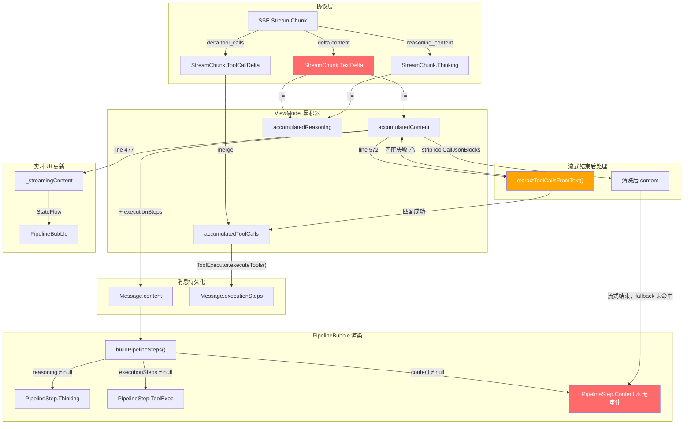
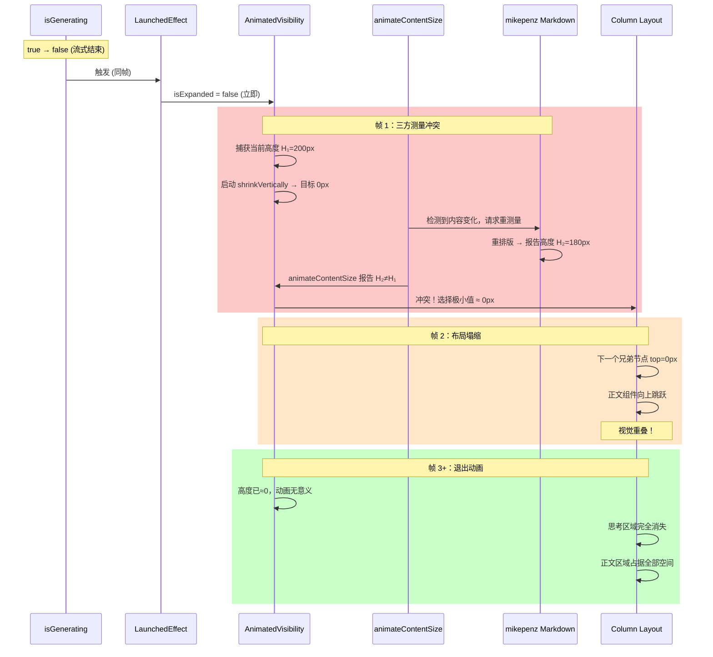
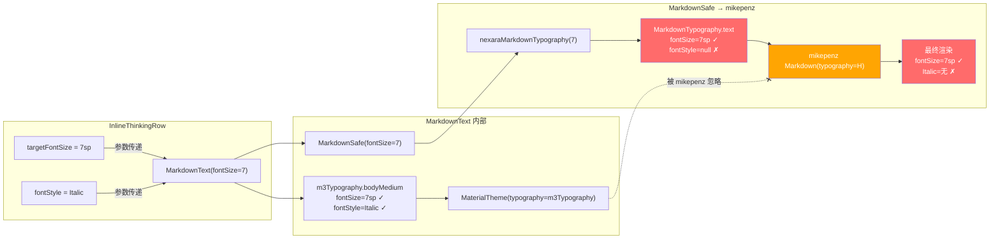

# Nexara 聊天界面渲染缺陷静态审计报告

> **审计日期**: 2026-05-17  
> **审计范围**: PipelineBubble / MarkdownText / ChatInlineComponents  
> **审计模式**: 纯静态代码走读，零侵入  
> **审计员**: AI 架构审计（GLM）

---

## 一、核心病灶技术根因剖析

### Bug A：工具调用数据穿透污染正文（容器未激活）

#### 1.1 现象回顾

模型流式响应中，工具调用的入参 JSON（如 `{"query":"何瑞斯", "top_n": 10}`）和返回结果以明文直出在气泡正文中，`PipelineStep.ToolExec` 卡片完全未被触发。

#### 1.2 数据流全链路推演

```
API SSE Chunk
    ↓
Protocol Layer (OpenAIProtocol / VertexAIProtocol)
    ├── functionCall → StreamChunk.ToolCallDelta    ← 标准路径
    └── text 内容    → StreamChunk.TextDelta         ← 穿透路径
    ↓
ChatViewModel.generateMessage()  (line 469-509)
    ├── ToolCallDelta → accumulatedToolCalls         ← 正确分离
    └── TextDelta     → accumulatedContent           ← 工具 JSON 进入正文！
    ↓
_streamingContent.update { accumulatedContent }      ← 实时推送 UI（line 477）
    ↓
PipelineBubble: streamingContent → ContentSegment    ← 穿透渲染！
```

#### 1.3 根因定位（三层漏洞叠加）

**漏洞 ① — 协议层遗漏：OpenAI 协议解析器不识别"伪工具调用"**

`OpenAIProtocol.processStreamChunk()` (line 273-280) 仅处理标准的 `delta.tool_calls` 字段。部分模型（如 MiniMax-M2.7、某些开源模型微调版本）将工具调用 JSON 作为普通 `delta.content` 文本输出，协议层无法拦截。

代码坐标：`OpenAIProtocol.kt` line 281 — 只提取 `delta["content"]` 作为纯文本，无任何工具调用特征检测。

**漏洞 ② — Fallback 解析器覆盖不完整**

`extractToolCallsFromText()` (ChatViewModel.kt line 1457-1502) 是流式结束后的后置兜底解析器，但存在三个盲区：

1. **触发条件过严** (line 572)：仅在 `accumulatedToolCalls.isEmpty()` 时触发。若协议层已部分解析到一个残缺的 `ToolCallDelta`（如 `id` 存在但 `name` 为空），则 `accumulatedToolCalls` 非空，fallback 整体跳过。

2. **bareJsonRegex 匹配范围过窄** (line 1467-1468)：
   ```kotlin
   val bareJsonRegex = Regex(
       """\{\s*"(?:name|function|tool|tool_name)"\s*:\s*"[^"]+"[^}]*\}"""
   )
   ```
   此正则要求 JSON 的**第一个 key** 必须是 `name/function/tool/tool_name` 之一。若模型输出 `{"query":"何瑞斯", "top_n": 10, "tool_name": "search"}` 这种 key 顺序不同的 JSON，正则完全失配。

3. **`stripToolCallJsonBlocks` 清洗残留** (line 1543-1562)：清洗正则只处理 Markdown 代码块和独立的裸 JSON 行。对于模型输出的 `---搜索结果: 抱歉，...` 这类分隔符文本（不带 JSON 大括号），完全无法匹配。

**漏洞 ③ — `buildPipelineSteps` 零内容审计**

`PipelineBubble.kt` line 237-264 的 `buildPipelineSteps()` 函数仅做以下判断：

```kotlin
// PipelineBubble.kt:241-258
if (msg.role == MessageRole.ASSISTANT) {
    if (!msg.reasoning.isNullOrBlank()) → Thinking
    if (!msg.executionSteps.isNullOrEmpty()) → ToolExec
    if (msg.content.isNotBlank()) → Content  // ← 无任何过滤！
}
```

它**不对 `msg.content` 做任何工具特征检测**。即使 content 中包含了明显的工具调用 JSON 或工具返回文本，也会被无条件归为 `PipelineStep.Content` 并渲染为正文。

**漏洞 ④ — 流式期间的实时穿透**

`PipelineBubble.kt` line 147-148：
```kotlin
val displayContent = if (isLastInGroup && isGenerating) {
    streamingContent.ifEmpty { step.content }  // ← 流式内容直接覆盖
} else { step.content }
```
`streamingContent` 直接来自 `_streamingContent` StateFlow，在流式期间就已经包含了工具 JSON。用户在流式过程中就能看到明文 JSON 穿透——fallback 解析器要等到流式结束才运行，**为时已晚**。

#### 1.4 病灶总结

| 层级 | 坐标 | 问题 |
|------|------|------|
| 协议层 | OpenAIProtocol:281 | `TextDelta` 未做工具特征嗅探 |
| ViewModel | ChatViewModel:477 | `streamingContent` 实时推送未过滤内容 |
| ViewModel | ChatViewModel:572 | Fallback 触发条件过严 |
| ViewModel | ChatViewModel:1467 | bareJsonRegex 覆盖面不足 |
| 渲染层 | PipelineBubble:256 | `buildPipelineSteps` 无内容审计 |
| 渲染层 | PipelineBubble:147 | 流式内容直接覆盖，无过滤 |

---

### Bug B：思考容器折叠失效、内容挤压与物理重叠

#### 1.1 现象回顾

1. 思考完成后容器不能平滑折叠
2. 展开的思考文本与后续正文在垂直方向物理遮挡重叠

#### 1.2 状态机推演

```
isGenerating: true  → false  (流式结束)
    ↓ LaunchedEffect(isGenerating)  ← line 278
isExpanded = false  (立即设为 false)
    ↓ AnimatedVisibility(visible = false)  ← line 338
触发 exit = shrinkVertically() + fadeOut()
    ↓ 同时...
Surface.animateContentSize()  ← line 351 尝试对子内容做尺寸动画
    ↓ 同时...
mikepenz Markdown 组件最后一次测量（内容可能还在变化）
```

#### 1.3 根因定位（三方测量竞态）

**病灶 ① — `AnimatedVisibility` + `animateContentSize` 双重动画冲突**

`PipelineBubble.kt` line 338-375 的嵌套结构：

```
AnimatedVisibility (shrinkVertically)        ← 控制可见性动画
  └─ Column
       └─ Surface (animateContentSize)       ← 控制内容尺寸动画
            └─ MarkdownText (mikepenz)       ← 内部自测量
```

当 `isExpanded` 变为 `false`：
- `AnimatedVisibility` 启动 `shrinkVertically` 退出动画，需要将高度从当前值动画到 0
- `animateContentSize` 也感知到内容变化（因为 Markdown 可能在最后一帧重新排版），试图做自己的尺寸过渡
- mikepenz Markdown 组件内部有自己的布局测量逻辑

三方动画产生**测量竞态**：
1. `AnimatedVisibility` 在第一帧捕获当前高度 H₁ 作为动画起点
2. `animateContentSize` 可能同时报告一个不同的高度 H₂（因为 Markdown 重新测量了）
3. `AnimatedVisibility` 根据 H₁ 做动画，但实际子节点已经变成了 H₂
4. 高度冲突导致 Compose 布局系统崩溃回退到极小值（接近 0）
5. 退出动画瞬间完成（因为起点≈终点），容器"消失"但布局位置未正确回收

**病灶 ② — 即时折叠无延迟**

`PipelineBubble.kt` line 278-280：
```kotlin
LaunchedEffect(isGenerating) {
    isExpanded = isGenerating
}
```

当 `isGenerating` 从 `true` 变为 `false` 时，`LaunchedEffect` 在**同一帧**立即将 `isExpanded` 设为 `false`。这意味着：
- 用户在思考完成的瞬间，容器就开始折叠
- 没有任何"延迟优雅折叠"的过渡期
- Markdown 组件可能还没完成最终测量就被迫进入退出动画

**病灶 ③ — 缺少固定高度锚点**

思考容器的父级 `Column`（line 282）使用的是 `wrapContent` 行为。当 `AnimatedVisibility` 的子节点高度突变时，Column 不会为其保留空间，导致下一个兄弟节点（竖线连接器或 Content segment）立即向上移动，与正在执行退出动画（但高度已塌缩）的思考区域重叠。

**病灶 ④ — `CompositionLocalProvider` + `MaterialTheme` 嵌套导致的额外测量**

`InlineThinkingRow` 在 `Surface` 内嵌套了 `CompositionLocalProvider`（line 355-372），而 `MarkdownText` 内部又嵌套了一层 `MaterialTheme`。每次 CompositionLocal 值变化都触发子树的重新测量，与动画帧交叉产生额外的测量请求。

#### 1.4 重叠物理机制图

```
帧 N:   思考区域高度 = 200px（展开，Markdown 渲染完成）
         正文区域 top = 200px

帧 N+1: isExpanded = false
         AnimatedVisibility 开始退出 → 高度目标 = 0
         animateContentSize 检测到 Markdown 重排 → 报告高度 = 180px
         冲突！布局系统选择极小值 ≈ 0
         正文区域 top = 0px（向上跳跃）

帧 N+2: 退出动画进行中，但思考区域高度≈0
         正文区域从 top=0px 开始渲染
         视觉上：正文覆盖在刚折叠的思考区域上 → 重叠！
```

---

### Bug C：思考文本字号与斜体样式失效

#### 1.1 现象回顾

思考容器内推理文本的字号与普通正文相同，且无斜体效果。

#### 1.2 样式传递链路完整推演

```
InlineThinkingRow (PipelineBubble.kt:354-372)
│
├─ targetFontSize = (fontSize - 6).coerceAtLeast(8)  ← 计算正确
├─ fontStyle = FontStyle.Italic                       ← 设置正确
│
├─ CompositionLocalProvider
│   ├─ LocalContentColor → dimmedColor
│   └─ LocalTextStyle → bodySmall.copy(fontSize=7sp, fontStyle=Italic)
│       ↓ (被 MarkdownText 内部覆盖，实际无效)
│
└─ MarkdownText(
      fontSize = targetFontSize,    ← 正确传递（7 或 8）
      fontStyle = FontStyle.Italic, ← 正确传递
      overrideColor = dimmedColor
   )
    │
    ├─ m3Typography = MaterialTheme.typography.copy(  ← line 313-327
    │     bodyMedium = nexaraMarkdownTypography(fontSize).text
    │                    .copy(color, fontStyle=Italic)  ← ✓ 含 Italic
    │     // 其他样式也正确设置了 fontStyle
    │   )
    │
    ├─ MaterialTheme(typography = m3Typography) { ... }  ← line 329
    │    ↑ 注意：此 MaterialTheme 包装是有效的
    │
    └─ MarkdownSafe(content, fontSize, ...)   ← line 340-346
         │
         └─ Markdown(                              ← line 539-545 (mikepenz)
              colors = nexaraMarkdownColors(textColor),
              typography = nexaraMarkdownTypography(fontSize),  ← ★ 病灶
              components = components,
            )
              ↑ mikepenz Markdown 使用传入的 typography 参数，
                而非 MaterialTheme.typography！
```

#### 1.3 根因定位

**病灶 — `MarkdownSafe` 调用 mikepenz `Markdown` 时传入的 `typography` 不含 `fontStyle`**

`MarkdownText.kt` line 539-545：
```kotlin
Markdown(
    content = content,
    colors = nexaraMarkdownColors(textColor = textColor),
    typography = nexaraMarkdownTypography(fontSize),  // ← 新建，不含 fontStyle！
    components = components,
    modifier = Modifier.fillMaxWidth()
)
```

`nexaraMarkdownTypography(fontSize)` 返回的 `MarkdownTypography` 对象中，`text` 属性为：
```kotlin
// NexaraMarkdownTheme.kt:65-69
text = NexaraTypography.bodyMedium.copy(
    fontSize = base,           // ← 正确（baseFontSize.sp = reduced value）
    lineHeight = (baseFontSize * 1.6).sp,
    letterSpacing = 0.01.em
    // ← 没有 fontStyle = Italic！
)
```

而外层 `MarkdownText` 虽然在 line 329 创建了含 `fontStyle` 的 `MaterialTheme` 包装：
```kotlin
MaterialTheme(typography = m3Typography) {  // m3Typography.bodyMedium 含 Italic
```

**但 mikepenz 的 `Markdown` composable 优先使用自身 `typography` 参数**，完全忽略 `MaterialTheme.typography`。这是 mikepenz 库的设计：`Markdown(typography: MarkdownTypography)` 参数直接覆盖内部样式。

**结果**：
- ✅ **字号**：通过 `fontSize` 参数正确传递到 `nexaraMarkdownTypography(fontSize)`，`fontSize` 是 reduced value。字号**应该是缩小的**。若用户反馈"与正文无异"，可能是因为 `THINKING_FONT_SIZE_DELTA = 6` 过于激进导致极小字号（如 8sp）反而难以辨认差异感，或实际使用了 `ThinkingBlock`（ChatInlineComponents.kt）而非 `InlineThinkingRow`——前者仅减少 2sp。
- ❌ **斜体**：`fontStyle = Italic` 在 `MarkdownSafe` 调用 mikepenz `Markdown` 时被**完全丢弃**，因为 `nexaraMarkdownTypography()` 不接受也不传递 `fontStyle` 参数。

**病灶坐标汇总**：

| 文件 | 行号 | 问题 |
|------|------|------|
| `MarkdownText.kt` | 542 | `Markdown()` 传入的 `typography` 不含 `fontStyle` |
| `NexaraMarkdownTheme.kt` | 37-87 | `nexaraMarkdownTypography()` 无 `fontStyle` 参数 |
| `PipelineBubble.kt` | 355-362 | `CompositionLocalProvider` 设置的 `LocalTextStyle` 被 `MarkdownText` 内部覆盖 |

---

## 二、逻辑与动画测量推演图

### 2.1 数据流架构图（从 API Chunk 到 Bubble 步骤拆解）



### 2.2 思考容器测量链竞态推演图



### 2.3 样式传递断裂链路图



---

## 三、无侵入式技术重构设计方案

### 对策 A：拦截纯文本中的工具调用穿透

#### 方案 A1：`buildPipelineSteps` 增加内容审计（推荐）

在 `buildPipelineSteps` 中对 `msg.content` 进行工具特征嗅探，将匹配到的内容重组为 `PipelineStep.ToolExec`。

**设计伪代码**（在 `PipelineBubble.kt` line 256 附近）：

```kotlin
// 原始代码（line 256-258）：
if (msg.content.isNotBlank()) {
    steps.add(PipelineStep.Content(content = msg.content))
}

// 改造后：
if (msg.content.isNotBlank()) {
    // ── 工具特征嗅探 ──
    val toolPattern = Regex(
        """[\s\S]*\{[\s\S]*?"(?:query|search|tool_name|function|name)"[\s\S]*?\}[\s\S]*(?:---|结果|result|搜索)[\s\S]*""",
        RegexOption.IGNORE_CASE
    )
    
    if (msg.executionSteps.isNullOrEmpty() && toolPattern.containsMatchIn(msg.content)) {
        // 尝试提取工具入参和出参
        val jsonBlockPattern = Regex("""\{[^{}]*(?:\{[^{}]*\}[^{}]*)*\}""")
        val separatorPattern = Regex("""\s*---+\s*|(?:搜索结果|执行结果|result)[:：]\s*""", RegexOption.IGNORE_CASE)
        
        val parts = separatorPattern.split(msg.content, 2)
        val toolArgs = jsonBlockPattern.find(parts[0])?.value ?: parts[0].trim()
        val toolResult = parts.getOrNull(1)?.trim() ?: ""
        
        // 重组为 ToolExec + Content 混合步骤
        steps.add(PipelineStep.ToolExec(
            steps = listOf(
                ExecutionStep(
                    id = "sniff_${msg.id}",
                    type = "tool_call",
                    toolName = extractToolName(toolArgs) ?: "tool",
                    toolArgs = toolArgs,
                    timestamp = msg.createdAt
                ),
                ExecutionStep(
                    id = "sniff_res_${msg.id}",
                    type = "tool_result",
                    content = toolResult.take(500),
                    timestamp = msg.createdAt
                )
            ),
            isExecuting = false
        ))
        // 仅将剩余非工具文本作为 Content
        val remainingContent = msg.content
            .replace(jsonBlockPattern, "")
            .replace(separatorPattern, "")
            .trim()
        if (remainingContent.isNotBlank()) {
            steps.add(PipelineStep.Content(content = remainingContent))
        }
    } else {
        steps.add(PipelineStep.Content(content = msg.content))
    }
}
```

#### 方案 A2：增强 Fallback 解析器（补充方案）

在 `ChatViewModel.kt` 的 `extractToolCallsFromText` 中扩展匹配模式：

```kotlin
// 在 bareJsonRegex 之后新增：
// 匹配含 query/search/top_n 等常见工具参数的 JSON（不限 key 顺序）
val toolParamRegex = Regex(
    """\{[^}]*"(?:query|search_query|question|keyword|top_n|top_k|limit)"\s*:\s*[^,}]+[^}]*\}"""
)

// 匹配 "参数JSON --- 结果文本" 格式
val toolResultPattern = Regex(
    """(\{[\s\S]*?\})\s*---+\s*([\s\S]*?)(?=\n\n|\z)"""
)
```

#### 方案 A3：流式期间的实时过滤（防穿透第一道防线）

在 `ChatViewModel.kt` line 474-477 的 `TextDelta` 处理中增加实时嗅探：

```kotlin
is StreamChunk.TextDelta -> {
    accumulatedContent += chunk.content
    chunk.reasoning?.let { accumulatedReasoning += it }
    
    // ── 实时工具特征嗅探 ──
    val sniffedToolContent = detectToolPatternInStreaming(accumulatedContent)
    _streamingContent.update { sniffedToolContent.cleanContent }
    
    messageManager.updateMessageContent(...)
}
```

**但这需要在流式期间做正则匹配，有性能风险。建议仅在最后一条消息是 ASSISTANT 且 `executionSteps` 为空时才启用轻量级嗅探（如检测 `---` 分隔符）。**

---

### 对策 B：消除思考容器高度动画冲突

#### 方案 B1：移除 `animateContentSize`，单一化动画源（推荐）

将 `PipelineBubble.kt` line 351 的 `animateContentSize()` 移除，让 `AnimatedVisibility` 成为唯一的尺寸动画控制器。

**设计伪代码**：

```kotlin
// 原始（line 343-352）：
Column(modifier = Modifier.fillMaxWidth()) {
    Surface(
        modifier = Modifier
            .fillMaxWidth()
            .padding(bottom = 4.dp)
            .animateContentSize()  // ← 移除这个！
    ) { ... }
}

// 改造后：
Column(modifier = Modifier.fillMaxWidth()) {
    Surface(
        modifier = Modifier
            .fillMaxWidth()
            .padding(bottom = 4.dp)
        // 不再使用 animateContentSize
    ) { ... }
}
```

#### 方案 B2：增加延迟优雅折叠 + 防抖

在 `InlineThinkingRow` 中引入 `300ms` 延迟折叠，确保 Markdown 完成最终测量后再启动退出动画。

**设计伪代码**（替换 PipelineBubble.kt line 278-280）：

```kotlin
// 原始：
LaunchedEffect(isGenerating) {
    isExpanded = isGenerating
}

// 改造后：
LaunchedEffect(isGenerating) {
    if (isGenerating) {
        isExpanded = true  // 生成时立即展开
    } else {
        // 生成结束后延迟 300ms 再折叠
        // 确保 Markdown 完成最终测量 + 用户有短暂阅读时间
        kotlinx.coroutines.delay(300)
        isExpanded = false
    }
}
```

#### 方案 B3：退出动画使用 `fadeOut` 优先，避免尺寸突变

用 `fadeOut` 替代 `shrinkVertically`，避免高度测量冲突：

```kotlin
// 原始（line 340-341）：
enter = expandVertically() + fadeIn(),
exit = shrinkVertically() + fadeOut()

// 改造后（退出动画改为先淡出，再收高度）：
enter = expandVertically(expandFrom = Alignment.Top) + fadeIn(
    animationSpec = tween(200)
),
exit = fadeOut(animationSpec = tween(300)) + shrinkVertically(
    animationSpec = tween(200, delayMillis = 200)  // 延迟 200ms 再收高度
)
```

这样淡出先执行，用户看到内容消失，然后高度才平滑收缩，避免"高度突然归零"的重叠问题。

---

### 对策 C：打通 `fontStyle` 透传链路

#### 方案 C1：扩展 `nexaraMarkdownTypography` 支持 `fontStyle` 参数（推荐）

**设计伪代码**（`NexaraMarkdownTheme.kt` line 28）：

```kotlin
// 原始：
@Composable
fun nexaraMarkdownTypography(baseFontSize: Int = 13): MarkdownTypography {

// 改造后：
@Composable
fun nexaraMarkdownTypography(
    baseFontSize: Int = 13,
    fontStyle: FontStyle? = null  // 新增参数
): MarkdownTypography {
    val base = baseFontSize.sp
    // ... 省略中间不变 ...

    return markdownTypography(
        // ... 其他样式不变 ...
        text = NexaraTypography.bodyMedium.copy(
            fontSize = base,
            lineHeight = (baseFontSize * 1.6).sp,
            letterSpacing = 0.01.em,
            fontStyle = fontStyle  // ← 新增透传
        ),
        // ... 其他样式也加上 fontStyle = fontStyle ...
    )
}
```

然后在 `MarkdownText.kt` line 542 透传：

```kotlin
// 原始：
Markdown(
    content = content,
    colors = nexaraMarkdownColors(textColor = textColor),
    typography = nexaraMarkdownTypography(fontSize),
    components = components,
    modifier = Modifier.fillMaxWidth()
)

// 改造后 — 需要将 fontStyle 透传到 MarkdownSafe：
Markdown(
    content = content,
    colors = nexaraMarkdownColors(textColor = textColor),
    typography = nexaraMarkdownTypography(fontSize, fontStyle = fontStyle),
    //                                                          ↑ 透传
    components = components,
    modifier = Modifier.fillMaxWidth()
)
```

为此，`MarkdownSafe` 的签名也需要扩展：

```kotlin
// 原始（line 383-389）：
@Composable
private fun MarkdownSafe(
    content: String,
    fontSize: Int,
    markdown: String,
    onContentChange: ((String) -> Unit)?,
    textColor: Color = NexaraColors.OnBackground,
)

// 改造后：
@Composable
private fun MarkdownSafe(
    content: String,
    fontSize: Int,
    fontStyle: FontStyle? = null,  // ← 新增
    markdown: String,
    onContentChange: ((String) -> Unit)?,
    textColor: Color = NexaraColors.OnBackground,
)
```

调用处（line 340-346）也需更新：

```kotlin
MarkdownSafe(
    content = segment.content,
    fontSize = fontSize,
    fontStyle = fontStyle,  // ← 新增透传
    markdown = markdown,
    onContentChange = onContentChange,
    textColor = effectiveColor
)
```

#### 方案 C2：字号降级幅度优化

当前 `THINKING_FONT_SIZE_DELTA = 6` 过于激进（13 → 7 → clamp 到 8）。建议：

```kotlin
// PipelineBubble.kt line 39-40
// 原始：
private const val THINKING_FONT_SIZE_DELTA = 6
private const val THINKING_FONT_SIZE = 8

// 改造后（与 ThinkingBlock 保持一致的 2sp 降级）：
private const val THINKING_FONT_SIZE_DELTA = 2
private const val THINKING_MIN_FONT_SIZE = 11
```

这与 `ChatInlineComponents.kt` 中 `ThinkingBlock` 的 `(fontSize - 2).coerceAtLeast(11)` 保持一致，避免两个思考组件表现不同。

---

## 四、审计总结

| Bug | 严重性 | 根因层级 | 修复难度 | 影响范围 |
|-----|--------|----------|----------|----------|
| A: 工具穿透 | **P0** | 协议层 + ViewModel + 渲染层 | 中 | 所有不支持标准 ToolCall 协议的模型 |
| B: 思考重叠 | **P1** | 渲染层动画冲突 | 低 | 所有含推理的流式响应 |
| C: 样式丢失 | **P2** | 渲染层样式透传断裂 | 低 | 所有思考容器 |

### 优先级建议

1. **Bug B**（低风险低复杂度）→ 立即修复：移除 `animateContentSize` + 增加延迟折叠
2. **Bug C**（低风险低复杂度）→ 立即修复：扩展 `nexaraMarkdownTypography` 支持 `fontStyle`
3. **Bug A**（高风险中复杂度）→ 优先修复：`buildPipelineSteps` 内容审计 + Fallback 正则增强

---

*审计报告结束。本文档仅为分析与方案设计，未对任何源文件执行写入操作。*
