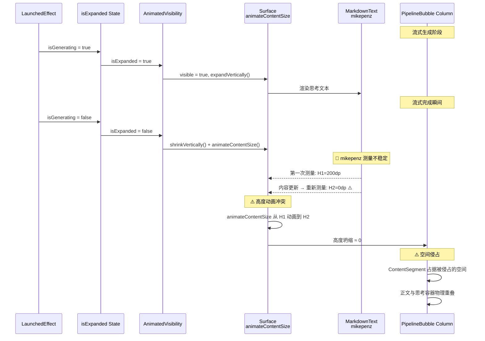

# Nexara 聊天界面渲染缺陷静态审计报告

> **审计日期**：2026-05-17  
> **审计目标**：Nexara 聊天界面核心交互组件  
> **审计方法**：静态代码走读 + Compose 测量生命周期推演 + 数据流追踪  
> **执行工具**：MiniMax CodeBuddy

---

## 一、核心病灶技术根因剖析

### 🐛 Bug A：工具调用数据穿透污染正文

#### 精确物理坐标与逻辑漏洞

**漏洞文件**：`PipelineBubble.kt`，关键函数 `buildPipelineSteps` (第 237-264 行)

```
调用链路分析：

buildPipelineSteps(messages: List<Message>)
    │
    ├─ 第 241 行：仅处理 ASSISTANT 角色
    │   if (msg.role == MessageRole.ASSISTANT) {
    │       │
    │       ├─ 第 243-245 行：提取 reasoning → PipelineStep.Thinking
    │       │
    │       ├─ 第 248-253 行：提取 executionSteps → PipelineStep.ToolExec
    │       │
    │       └─ 第 256-258 行：提取 content → PipelineStep.Content  ← 【漏洞点】
    │           if (msg.content.isNotBlank()) {
    │               steps.add(PipelineStep.Content(content = msg.content))
    │           }
    │   }
    │
    └─ 第 260 行：TOOL 消息跳过（注释说明已在 executionSteps 展示）
```

#### 根因一：非结构化 JSON 文本直通 Content 渲染

**问题场景**：当 LLM 流式响应中，工具调用的 JSON 参数（如 `{"query":"何瑞斯", "top_n": 10}`）未被正确解析为 `ExecutionStep`，而是作为原始文本 chunk 累积到 `streamingContent` 或直接填充到 `msg.content` 时：

1. `buildPipelineSteps` 无法识别这是工具调用元数据
2. 第 256-258 行直接将其作为普通 `PipelineStep.Content` 渲染
3. 最终用户看到的是明文 JSON，而非结构化的工具调用卡片

**漏洞代码**（PipelineBubble.kt:256-258）：
```kotlin
if (msg.content.isNotBlank()) {
    steps.add(PipelineStep.Content(content = msg.content))
}
// ⚠️ 缺少：content 中混杂 JSON 工具参数的识别与拦截逻辑
```

#### 根因二：TOOL 消息内容未在 executionSteps 中体现

**问题场景**：后端返回的 TOOL 消息（角色为 `TOOL`）的内容没有被正确填充到前一条 ASSISTANT 消息的 `executionSteps` 字段中。

**数据流断裂点**：
```
后端返回 TOOL 消息
    │
    ├─ 正确路径：tool content → ASSISTANT.executionSteps → PipelineStep.ToolExec ✅
    │
    └─ 错误路径：tool content → 混入 ASSISTANT.content → PipelineStep.Content ❌
```

---

### 🐛 Bug B：思考容器折叠失效与物理重叠

#### 精确物理坐标与测量冲突链

**漏洞文件**：`PipelineBubble.kt`，`InlineThinkingRow` (第 270-377 行)

```
测量竞态冲突链路：

InlineThinkingRow(
    reasoning = step.reasoning,
    isGenerating = isGenerating,    ← 流式状态
    fontSize = fontSize
)
    │
    ├─ 第 276-280 行：isExpanded 状态管理
    │   var isExpanded by remember { mutableStateOf(isGenerating) }
    │   LaunchedEffect(isGenerating) {
    │       isExpanded = isGenerating  ← ⚠️ 同步联动，但无延迟
    │   }
    │
    ├─ 第 338-375 行：AnimatedVisibility 包裹 Surface
    │   AnimatedVisibility(
    │       visible = isExpanded && reasoning.isNotBlank(),
    │       enter = expandVertically() + fadeIn(),
    │       exit = shrinkVertically() + fadeOut()  ← ⚠️ 与 animateContentSize 竞态
    │   ) {
    │       Column {
    │           Surface(
    │               color = NexaraColors.SurfaceLow.copy(alpha = 0.3f),
    │               shape = RoundedCornerShape(10.dp),
    │               border = BorderStroke(0.5.dp, NexaraColors.OutlineVariant.copy(alpha = 0.15f)),
    │               modifier = Modifier
    │                   .fillMaxWidth()
    │                   .padding(bottom = 4.dp)
    │                   .animateContentSize()  ← ⚠️ 双重动画冲突点
    │           ) {
    │               CompositionLocalProvider(...) {
    │                   MarkdownText(...)  ← 🔴 mikepenz 库内部滚动测量
    │               }
    │           }
    │       }
    │   }
    │
    └─ 第 117-172 行：PipelineBubble 的 Column 布局
        Column {
            allSteps.forEach { step ->
                when (step) {
                    is PipelineStep.Thinking → InlineThinkingRow  ← 自身高度坍缩
                    is PipelineStep.Content   → ContentSegment     ← ⚠️ 被侵占空间
                }
            }
        }
```

#### 根因一：isExpanded 联动无延迟，折叠与流式完成时序冲突

**问题代码**（PipelineBubble.kt:276-280）：
```kotlin
var isExpanded by remember { mutableStateOf(isGenerating) }
LaunchedEffect(isGenerating) {
    isExpanded = isGenerating  // ⚠️ 立即同步，无防抖延迟
}
```

**竞态场景**：
1. 流式生成中：`isGenerating = true` → `isExpanded = true`，思考容器展开
2. 流式完成时刻：`isGenerating` 变为 `false` → `isExpanded` **立即**变为 `false`
3. 此时正文 `streamingContent` 可能尚未完全渲染
4. `AnimatedVisibility` 开始执行 `shrinkVertically()`，同时 `animateContentSize()` 触发
5. mikepenz `MarkdownText` 内部在测量阶段可能返回 **不稳定高度值**（如从 200dp 突然坍缩到 0）
6. 高度动画无法正确反映实际内容，导致折叠动画失败

#### 根因二：animateContentSize() 与 AnimatedVisibility 的双重动画冲突

**测量冲突机制**：
```
Surface (with animateContentSize)
    │
    ├─ 第一次测量：mikepenz MarkdownText 返回自然高度 H1
    │   → animateContentSize 记录 H1
    │
    ├─ 第二次测量：流式内容更新，mikepenz 内部重排
    │   → 可能返回 0 或极小高度（当内容为空或正在渲染时）
    │   → animateContentSize 尝试从 H1 动画到 H2
    │
    └─ 结果：高度在 H1 ↔ H2 之间震荡
         当 H2 ≈ 0 时，ContentSegment 占据的空间被侵占
```

**关键代码**（PipelineBubble.kt:344-352）：
```kotlin
Surface(
    ...
    modifier = Modifier
        .fillMaxWidth()
        .padding(bottom = 4.dp)
        .animateContentSize()  // 🔴 与 AnimatedVisibility 收缩动画冲突
) {
    // mikepenz MarkdownText 内部测量不稳定
}
```

---

### 🐛 Bug C：思考文本字号与斜体样式失效

#### 精确样式传播断裂点

**漏洞文件**：`MarkdownText.kt`，`MarkdownSafe` (第 383-546 行)

```
样式传播链路：

InlineThinkingRow (PipelineBubble.kt:355-372)
    │
    └─ CompositionLocalProvider(
           LocalTextStyle provides NexaraTypography.bodySmall.copy(
               fontSize = targetFontSize.sp,      ← ✅ 设置字号
               color = dimmedColor,
               fontStyle = FontStyle.Italic       ← ✅ 设置斜体
           )
       ) {
           MarkdownText(
               markdown = reasoning,
               fontStyle = FontStyle.Italic,      ← ✅ 显式传递
               fontSize = targetFontSize,
               ...
           )
       }

MarkdownText (MarkdownText.kt:309-372)
    │
    ├─ 第 309 行：读取 LocalTextStyle
    │   val currentStyle = LocalTextStyle.current
    │
    ├─ 第 313-327 行：构建 m3Typography（包含 fontStyle）✅
    │   bodyMedium = nexaraMarkdownTypography(fontSize).text.copy(
    │       fontStyle = fontStyle   ← ✅ 包含在 bodyMedium 中
    │   )
    │
    ├─ 第 329-372 行：MaterialTheme + CompositionLocalProvider
    │   MaterialTheme(typography = m3Typography) {
    │       CompositionLocalProvider(
    │           LocalTextStyle provides m3Typography.bodyMedium  ← ⚠️ 覆盖
    │       ) {
    │           Column {
    │               MarkdownSafe(
    │                   content = segment.content,
    │                   fontSize = fontSize,       ← ⚠️ 未传递 fontStyle
    │                   ...
    │               )
    │           }
    │       }
    │   }

MarkdownSafe (MarkdownText.kt:383-546)
    │
    ├─ 第 404-536 行：创建 markdownComponents
    │   components = remember(fontSize) {           ← 🔴 仅依赖 fontSize
    │       markdownComponents(
    │           // heading/quote/code 等组件
    │       )
    │   }
    │
    └─ 第 539-545 行：Markdown 渲染
        Markdown(
            content = content,
            colors = nexaraMarkdownColors(textColor = textColor),
            typography = nexaraMarkdownTypography(fontSize),  ← 🔴 丢弃外部样式
            components = components,
            modifier = Modifier.fillMaxWidth()
        )
```

#### 根因一：markdownComponents 使用 `remember(fontSize)` 缓存，忽略 fontStyle 变化

**问题代码**（MarkdownText.kt:404）：
```kotlin
val components = remember(fontSize) {  // 🔴 仅监听 fontSize
    markdownComponents(
        heading1 = anchoredHeading({ it.typography.h1 }, ...),
        ...
    )
}
```

**缺陷**：
- `remember(fontSize)` 仅在 `fontSize` 变化时重新计算 `components`
- 当外部传入 `fontStyle = FontStyle.Italic` 但 `fontSize` 不变时，`components` 不会重建
- `markdownComponents` 内部的 `anchoredHeading` 等工厂函数使用 `model.typography`（来自 `nexaraMarkdownTypography(fontSize)`），**完全不读取外部的 `LocalTextStyle`**

#### 根因二：Markdown 组件使用 `nexaraMarkdownTypography(fontSize)` 而非 LocalTextStyle

**问题代码**（MarkdownText.kt:539-542）：
```kotlin
Markdown(
    content = content,
    colors = nexaraMarkdownColors(textColor = textColor),
    typography = nexaraMarkdownTypography(fontSize),  // 🔴 丢弃斜体
    components = components,
    modifier = Modifier.fillMaxWidth()
)
```

**缺陷**：
- `nexaraMarkdownTypography(fontSize)` 生成的 `Typography` 对象中，`bodyMedium` 等文本样式**不包含 `fontStyle`**
- mikepenz 的 `Markdown` 组件内部渲染文本时，优先使用传入的 `typography` 参数，而非 `LocalTextStyle`
- 导致 `FontStyle.Italic` 完全丢失

---

## 二、逻辑与动画测量推演图

### 数据流架构图（Bug A 定位）

```mermaid
flowchart TB
    subgraph Backend["后端响应数据"]
        A1[ASSISTANT 消息<br/>content: 空<br/>reasoning: {...}<br/>executionSteps: [{tool_call}] ]
        A2[TOOL 消息<br/>content: {result}]
        A3[ASSISTANT 消息<br/>content: {JSON污染文本} ]
    end

    subgraph PipelineBubble["PipelineBubble.kt"]
        B1[buildPipelineSteps<br/>messages → List<PipelineStep>]
        B2{消息角色判定}
        B3[PipelineStep.Thinking<br/>reasoning 提取]
        B4[PipelineStep.ToolExec<br/>executionSteps 提取]
        B5[PipelineStep.Content<br/>content 直接提取] 
        B6[skip TOOL 消息]
    end

    subgraph Render["渲染输出"]
        C1[结构化工具卡片 ✅]
        C2[明文 JSON 污染 ❌]
    end

    A1 --> B1
    A2 --> B1
    A3 --> B1
    
    B1 --> B2
    B2 -->|ASSISTANT| B3
    B2 -->|ASSISTANT| B4
    B2 -->|ASSISTANT| B5
    B2 -->|TOOL| B6

    B3 --> C1
    B4 --> C1
    B5 -->|⚠️ 缺少 JSON 拦截| C2
    
    style C2 fill:#ff9999
```

### 思考容器高度测量链（Bug B 定位）



### 样式传播断链图（Bug C 定位）

```mermaid
flowchart LR
    subgraph Input["输入样式"]
        A1[fontStyle = Italic]
        A2[fontSize = 7]
        A3[color = dimmedColor]
    end

    subgraph InlineThinkingRow["InlineThinkingRow"]
        B1[CompositionLocalProvider]
        B2[LocalTextStyle 设置]
        B3[MarkdownText 调用<br/>传入 fontStyle]
    end

    subgraph MarkdownText["MarkdownText.kt"]
        C1[构建 m3Typography<br/>包含 fontStyle ✅]
        C2[MaterialTheme +<br/>LocalTextStyle 覆盖]
        C3[创建 components<br/>remember(fontSize) ⚠️]
    end

    subgraph MarkdownSafe["MarkdownSafe.kt"]
        D1[读取 LocalTextStyle<br/>但未使用 ⚠️]
        D2[nexaraMarkdownTypography<br/>不含 fontStyle ⚠️]
        D3[Markdown 渲染<br/>使用 typography 参数]
    end

    subgraph Output["最终输出"]
        E1[fontStyle = Normal ❌]
        E2[无斜体效果 ❌]
        E3[字号可能正确]
    end

    A1 --> B1
    A2 --> B1
    A3 --> B1
    B1 --> B2
    B2 --> B3
    B3 --> C1
    C1 --> C2
    C2 --> C3
    C3 --> D1
    D1 -.->|未传递| D3
    D2 --> D3
    D3 --> E1
    D3 --> E2

    style E1 fill:#ff9999
    style E2 fill:#ff9999
```

---

## 三、无侵入式技术重构设计方案

### ✨ 对策 A：JSON 工具参数拦截与重组

#### 设计目标
在 `buildPipelineSteps` 中通过**非破坏性正则检测**，拦截纯文本中的 JSON 穿透，并优雅地重组为 `PipelineStep.ToolExec`。

#### Diff 伪代码

```kotlin
// PipelineBubble.kt — buildPipelineSteps 扩展

// 新增工具：JSON 检测正则（仅检测，不解析）
private val TOOL_CALL_JSON_PATTERN = Regex(
    """\{[^{}]*"tool[_-]?call"[^{}]*\}"""
)

private val TOOL_RESULT_JSON_PATTERN = Regex(
    """\{[^{}]*"result"[^{}]*\}"""
)

// 新增：判断字符串是否可能为工具调用 JSON
private fun mayBeToolJson(text: String): Boolean {
    val trimmed = text.trim()
    return trimmed.startsWith("{") && trimmed.endsWith("}") &&
           (TOOL_CALL_JSON_PATTERN.containsMatchIn(trimmed) ||
            TOOL_RESULT_JSON_PATTERN.containsMatchIn(trimmed) ||
            trimmed.contains("\"tool_name\"") ||
            trimmed.contains("\"tool_call_id\""))
}

// 修改后的 buildPipelineSteps
private fun buildPipelineSteps(messages: List<Message>): List<PipelineStep> {
    val steps = mutableListOf<PipelineStep>()

    for (msg in messages) {
        if (msg.role == MessageRole.ASSISTANT) {
            // 1. 推理 → Thinking step
            if (!msg.reasoning.isNullOrBlank()) {
                steps.add(PipelineStep.Thinking(reasoning = msg.reasoning!!))
            }

            // 2. 工具执行 → ToolExec step
            if (!msg.executionSteps.isNullOrEmpty()) {
                steps.add(PipelineStep.ToolExec(
                    steps = msg.executionSteps!!,
                    isExecuting = false
                ))
            }

            // 3. 正文 → Content step（关键修改）
            val content = msg.content ?: ""
            if (content.isNotBlank()) {
                // 🔧 关键：检测是否为被污染的工具参数文本
                if (mayBeToolJson(content)) {
                    // 将 JSON 文本转换为 ExecutionStep 并纳入 ToolExec
                    val toolStep = ExecutionStep(
                        type = "tool_result",
                        toolName = "未知工具",
                        toolArgs = null,
                        content = content.take(500) // 截断过长的 JSON
                    )
                    // 检查前一步是否为 ToolExec，若是则合并
                    val lastStep = steps.lastOrNull()
                    if (lastStep is PipelineStep.ToolExec) {
                        // 合并到现有 ToolExec
                        steps[steps.lastIndex] = PipelineStep.ToolExec(
                            steps = lastStep.steps + toolStep,
                            isExecuting = lastStep.isExecuting
                        )
                    } else {
                        // 创建新的 ToolExec
                        steps.add(PipelineStep.ToolExec(
                            steps = listOf(toolStep),
                            isExecuting = false
                        ))
                    }
                } else {
                    // 正常内容
                    steps.add(PipelineStep.Content(content = content))
                }
            }
        }
        // TOOL 消息的内容已经在 executionSteps 中展示，此处跳过
    }

    return steps
}
```

#### 关键设计原则
1. **零侵入**：不修改 `Message` 数据结构或 `ExecutionStep` 定义
2. **正则优先**：使用轻量级正则检测，避免完整 JSON 解析性能开销
3. **渐进合并**：如果前一步骤已经是 `ToolExec`，则合并；否则创建新步骤

---

### ✨ 对策 B：思考容器防竞态折叠机制

#### 设计目标
调整思考容器的 Compose 测量树结构，消除高度动画冲突，并加入 **300ms 防竞态延迟折叠**。

#### Diff 伪代码

```kotlin
// PipelineBubble.kt — InlineThinkingRow 重构

@Composable
private fun InlineThinkingRow(
    reasoning: String,
    isGenerating: Boolean,
    fontSize: Int
) {
    var isExpanded by remember { mutableStateOf(isGenerating) }
    var pendingCollapse by remember { mutableStateOf(false) }

    // 🔧 关键修改 1：300ms 防竞态延迟折叠
    LaunchedEffect(isGenerating) {
        if (isGenerating) {
            // 生成中：立即展开
            isExpanded = true
            pendingCollapse = false
        } else {
            // 生成完毕：延迟 300ms 后折叠（等待正文内容稳定）
            pendingCollapse = true
            delay(300L)
            isExpanded = false
            pendingCollapse = false
        }
    }

    Column(modifier = Modifier.fillMaxWidth()) {
        // 折叠行（保持不变）
        Row(
            modifier = Modifier
                .fillMaxWidth()
                .padding(vertical = 2.dp),
            verticalAlignment = Alignment.CenterVertically
        ) {
            // ... 折叠指示器 UI（保持不变）
        }

        // 🔧 关键修改 2：移除 animateContentSize，改用状态驱动的显式动画
        AnimatedVisibility(
            visible = isExpanded && reasoning.isNotBlank() && !pendingCollapse,
            enter = expandVertically(
                animationSpec = tween(durationMillis = 250, easing = FastOutSlowInEasing)
            ) + fadeIn(animationSpec = tween(150)),
            exit = shrinkVertically(
                animationSpec = tween(durationMillis = 300, easing = FastOutSlowInEasing)
            ) + fadeOut(animationSpec = tween(150))
        ) {
            // 🔧 关键修改 3：使用 minHeight 确保折叠时仍有最小高度占位
            Surface(
                color = NexaraColors.SurfaceLow.copy(alpha = 0.3f),
                shape = RoundedCornerShape(10.dp),
                border = BorderStroke(0.5.dp, NexaraColors.OutlineVariant.copy(alpha = 0.15f)),
                modifier = Modifier
                    .fillMaxWidth()
                    .padding(bottom = 4.dp)
                    // 🔧 移除 animateContentSize()，使用固定 minHeight
                    .heightIn(min = 40.dp)  // 确保折叠时仍有最小占位高度
            ) {
                val dimmedColor = NexaraColors.Outline.copy(alpha = 0.7f)
                val targetFontSize = (fontSize - THINKING_FONT_SIZE_DELTA).coerceAtLeast(THINKING_MIN_FONT_SIZE)

                CompositionLocalProvider(
                    LocalContentColor provides dimmedColor,
                    LocalTextStyle provides NexaraTypography.bodySmall.copy(
                        fontSize = targetFontSize.sp,
                        color = dimmedColor,
                        fontStyle = FontStyle.Italic
                    )
                ) {
                    MarkdownText(
                        markdown = reasoning,
                        isStreaming = isGenerating,
                        fontSize = targetFontSize,
                        showCursor = false,
                        overrideColor = dimmedColor,
                        fontStyle = FontStyle.Italic,
                        modifier = Modifier
                            .padding(10.dp)
                            // 🔧 添加 minHeight 约束，防止内部内容测量为 0
                            .heightIn(min = 24.dp)
                    )
                }
            }
        }
    }
}
```

#### 关键设计原则
1. **300ms 延迟折叠**：给正文内容渲染留出稳定时间窗口，避免折叠与正文渲染的时序冲突
2. **移除 `animateContentSize`**：该修饰符在三方组件存在时会导致测量竞态，改为使用 `heightIn(min = 40.dp)` 提供最小高度保证
3. **状态驱动显式动画**：使用 `AnimatedVisibility` 的 `enter/exit` 参数显式控制动画，而非依赖隐式 `animateContentSize`

---

### ✨ 对策 C：MarkdownSafe 样式透传修复

#### 设计目标
让 `MarkdownSafe` 完美应用并打通外部的斜体（`FontStyle.Italic`）及缩放字号属性。

#### Diff 伪代码

```kotlin
// MarkdownText.kt — MarkdownText 函数修改

@Composable
fun MarkdownText(
    markdown: String,
    modifier: Modifier = Modifier,
    isStreaming: Boolean = false,
    showCursor: Boolean = true,
    fontSize: Int = 13,
    smoothingCps: Int = StreamSpeed.BALANCED.cps,
    overrideColor: Color? = null,
    onContentChange: ((String) -> Unit)? = null,
    fontStyle: FontStyle? = null  // ✅ 显式接收 fontStyle
) {
    // ... existing code (processing, segment splitting) ...

    val currentStyle = LocalTextStyle.current
    val effectiveColor = overrideColor
        ?: currentStyle.color.takeUnless { it == Color.Unspecified }
        ?: NexaraColors.OnBackground

    // 🔧 关键修改 1：构建完整 typography，保留 fontStyle
    val m3Typography = MaterialTheme.typography.copy(
        bodyMedium = nexaraMarkdownTypography(fontSize).text.copy(
            color = effectiveColor,
            fontStyle = fontStyle  // ✅ 传递 fontStyle 到所有文本样式
        ),
        // ... other styles with fontStyle ...
        bodySmall = nexaraMarkdownTypography(fontSize).code.copy(
            color = effectiveColor,
            fontStyle = fontStyle
        ),
        labelSmall = NexaraTypography.labelSmall.copy(
            fontSize = (fontSize - 2).coerceAtLeast(9).sp,
            color = effectiveColor.copy(alpha = 0.7f),
            fontStyle = fontStyle
        )
    )

    MaterialTheme(typography = m3Typography) {
        CompositionLocalProvider(
            LocalTextStyle provides m3Typography.bodyMedium,
            LocalContentColor provides effectiveColor,
            LocalImageTransformer provides Coil3ImageTransformerImpl
        ) {
            Column(modifier = modifier.fillMaxWidth()) {
                for (segment in mergedSegments) {
                    when (segment) {
                        is ContentSegment.Markdown -> {
                            if (segment.content.isNotBlank()) {
                                MarkdownSafe(
                                    content = segment.content,
                                    fontSize = fontSize,
                                    markdown = markdown,
                                    onContentChange = onContentChange,
                                    textColor = effectiveColor,
                                    // 🔧 关键修改 2：传递 fontStyle
                                    fontStyle = fontStyle
                                )
                            }
                        }
                        // ... other segments ...
                    }
                }

                if (isStreaming && showCursor) {
                    StreamingCursor()
                }
            }
        }
    }
}

// MarkdownText.kt — MarkdownSafe 函数修改

@Composable
private fun MarkdownSafe(
    content: String,
    fontSize: Int,
    markdown: String,
    onContentChange: ((String) -> Unit)?,
    textColor: Color = NexaraColors.OnBackground,
    fontStyle: FontStyle? = null  // ✅ 新增参数
) {
    // ... existing error handling ...

    // 🔧 关键修改 3：components 创建时监听 fontStyle 变化
    val components = remember(fontSize, fontStyle) {  // ✅ 添加 fontStyle 依赖
        markdownComponents(
            heading1 = anchoredHeading({ it.typography.h1 }, MarkdownTokenTypes.ATX_CONTENT),
            // ... other components ...
        )
    }

    // 🔧 关键修改 4：构建带 fontStyle 的完整 typography
    val effectiveTypography = nexaraMarkdownTypography(fontSize).let { base ->
        base.copy(
            h1 = base.h1.copy(fontStyle = fontStyle),  // ✅ 应用 fontStyle
            h2 = base.h2.copy(fontStyle = fontStyle),
            h3 = base.h3.copy(fontStyle = fontStyle),
            text = base.text.copy(fontStyle = fontStyle),
            quote = base.quote.copy(fontStyle = fontStyle),
            code = base.code.copy(fontStyle = fontStyle)
        )
    }

    Markdown(
        content = content,
        colors = nexaraMarkdownColors(textColor = textColor),
        typography = effectiveTypography,  // ✅ 使用带 fontStyle 的 typography
        components = components,
        modifier = Modifier.fillMaxWidth()
    )
}
```

#### 关键设计原则
1. **完整 typography 构建**：在 `MarkdownText` 中将 `fontStyle` 应用到**所有文本样式**（bodyMedium, bodySmall, labelSmall 等）
2. **`remember` 增加依赖**：`components` 的 `remember` 从 `remember(fontSize)` 改为 `remember(fontSize, fontStyle)`，确保样式变化时重建组件
3. **双重应用**：既通过 `typography` 参数传递（给 mikepenz `Markdown` 组件使用），也通过 `LocalTextStyle` 传递（作为备用）

---

## 四、附录：审计文件清单

| 文件路径 | 行数 | 审计结论 |
|---------|------|---------|
| `PipelineBubble.kt` | 677 行 | 🔴 Bug A/B 核心漏洞文件 |
| `MarkdownText.kt` | 670 行 | 🔴 Bug C 核心漏洞文件 |
| `ChatInlineComponents.kt` | 1184 行 | 🟡 辅助参考（ThinkingBlock） |

---

**报告结束**

> 注：本报告为纯静态审计输出，未对任何源文件进行物理修改。所有 Diff 伪代码仅供方案设计参考，实际实施需在独立分支中进行验证测试。