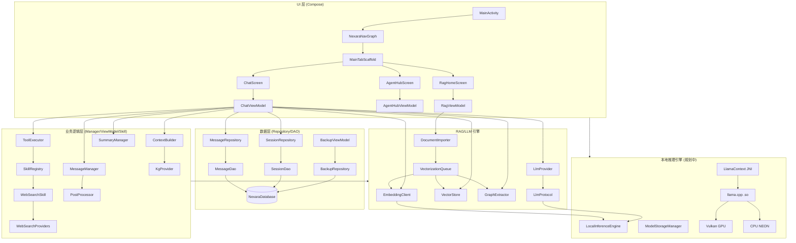

# 架构全景 (ARCHITECTURE.md)

## 核心架构

Nexara 原生版本采用标准的 Jetpack Compose + MVVM 架构，结合 Room 数据库进行本地持久化。

## 目录结构说明

| 目录 | 说明 |
| :--- | :--- |
| `data/local` | Room 数据库定义、实体 (Entities) 与数据访问对象 (DAOs) |
| `data/remote` | LLM 协议实现 (OpenAI, Anthropic, VertexAI) 与流式解析器 |
| `data/rag` | RAG 核心逻辑：向量存储 (VectorStore)、知识图谱 (GraphStore)、文本切分等 |
| `data/repository` | 数据仓库层，封装本地数据库与业务逻辑的交互 |
| `ui/chat` | 聊天会话核心界面及逻辑管理 (MessageManager, ContextBuilder, SummaryManager) |
| `ui/hub` | 智能体中心 (Agent Hub) 相关界面 |
| `ui/rag` | 知识库管理与 RAG 配置界面 |
| `ui/renderer` | Markdown 增强渲染器 (LaTeX, Mermaid, ECharts) |
| `data/remote/search` | Web 搜索提供商 (DuckDuckGo, SearXNG, Tavily) |
| `ui/chat/manager/skills` | 智能体技能实现 (WebSearch, Calculator, Time) |
| `ui/settings` | 设置中心，包括模型配置与搜索设置 (SearchConfigViewModel) |
| `ui/common` | 通用 UI 组件与业务枚举，如 `ModelPicker` 和 `ModelCapability` 映射 |
| `ui/theme` | 全局设计系统 (Colors, Typography, Theme) |
| `data/local/inference` | (规划中) 本地推理引擎 (LocalInferenceEngine, LlamaContext, ModelStorageManager) |
| `cpp` | (规划中) llama.cpp JNI 桥接层 |

## 关键技术栈

- **UI**: Jetpack Compose (Material 3)
- **数据库**: Room (SQLite) + FTS5
- **Markdown**: `multiplatform-markdown-renderer` (mikepenz)
- **公式/图表**: KaTeX, Mermaid.js, ECharts (通过 WebView 渲染)
- **网络**: Ktor (用于 LLM API 通信)
