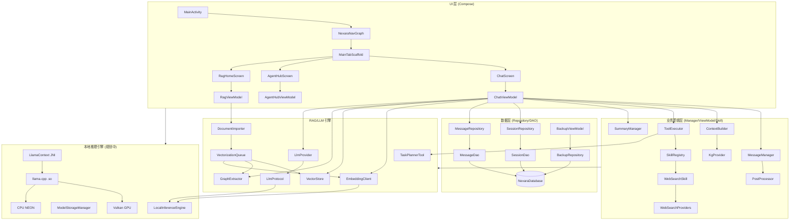

# 架构全景 (ARCHITECTURE.md)

## 核心架构

Nexara 原生版本采用标准的 Jetpack Compose + MVVM 架构，结合 Room 数据库进行本地持久化。



## 目录结构说明

| 目录 | 说明 |
| :--- | :--- |
| `data/local` | Room 数据库定义、实体 (Entities) 与数据访问对象 (DAOs) |
| `data/remote` | LLM 协议实现 (OpenAI, Anthropic, VertexAI) 与流式解析器 |
| `data/remote/protocol` | 协议接口定义 (`LlmProtocol`, `PromptRequest`) + 实现类 + `ProtocolParamAdapter` 参数抽象层 |
| `data/remote/provider` | LlmProvider 工厂（协议创建与路由） |
| `data/rag` | RAG 核心逻辑：向量存储 (VectorStore)、知识图谱 (GraphStore)、文本切分等 |
| `data/repository` | 数据仓库层，封装本地数据库与业务逻辑的交互 |
| `ui/chat` | 聊天会话核心界面及逻辑管理 (MessageManager, ContextBuilder, SummaryManager) |
| `ui/hub` | 智能体中心 (Agent Hub) 相关界面 |
| `ui/rag` | 知识库管理与 RAG 配置界面 |
| `ui/renderer` | Markdown 增强渲染器 (LaTeX, Mermaid, ECharts) |
| `data/remote/search` | Web 搜索提供商 (DuckDuckGo, SearXNG, Tavily) |
| `ui/chat/manager/skills` | 智能体技能实现 (WebSearch, Calculator, Time) |
| `ui/settings` | 设置中心，包括模型配置与搜索设置 (SearchConfigViewModel) |
| `ui/common` | 通用 UI 组件与业务枚举，如 `ModelPicker` 和 `ModelCapability` 映射 |
| `ui/theme` | 全局设计系统 (Colors, Typography, Theme) |
| `data/local/inference` | (规划中) 本地推理引擎 (LocalInferenceEngine, LlamaContext, ModelStorageManager) |
| `cpp` | (规划中) llama.cpp JNI 桥接层 |

## 关键技术栈

- **UI**: Jetpack Compose (Material 3)
- **数据库**: Room (SQLite) + FTS5
- **Markdown**: `multiplatform-markdown-renderer` (mikepenz)
- **公式/图表**: KaTeX, Mermaid.js, ECharts (通过 WebView 渲染)
- **网络**: Ktor (用于 LLM API 通信)

## RAG 检索引用链路 (2026-05-13 完成)
- **ContextBuilder → ChatViewModel → Message**: `buildContext()` 返回的 `ragReferences` 现写入 `Message` 模型，`RagOmniIndicator` 可正确显示检索来源
- **Embedding 降级链**: `EmbeddingClient` → (失败) → `LocalInferenceEngine`，确保 API 故障时 RAG 不静默失效
- **向量维度检测**: `VectorStore.search()` 携带 `onWarning` 回调，维度不匹配时输出警告日志并通知调用方

## Markdown 渲染安全层 (2026-05-13 完成)
- **safeTrimIndent()**: 在 `trimIndent()` 前检测缩进代码块，保护 GFM 语法
- **CJK 间距保护**: `insertCjkSpacing()` 跳过行内代码与链接，使用占位符替换/恢复模式
- **流式边界检测**: 增量追加时检测 ` ``` ` / `$$` 跨边界，自动重新解析
- **崩溃降级**: `MarkdownSafe` composable 包裹 `Markdown()` 调用，渲染崩溃时自动回退纯文本 `Text`
- **模型未选拦截**: `ChatInputBar` 集成模型有效性校验，未选模型时通过 `GenerationStatusButton` 置灰拦截发送，并触发 `ModelHint` 浮动提示。
- **Pipeline 指示器优化**: `PipelineBubble` 采用紧凑型指示器设计（70% 宽度），将点击涟漪限制在内容区域内，并实现思考块样式的视觉降级。

## 流式渲染性能优化 (2026-05-14 完成)
- **无感追赶 (Smooth Catch-up)**：`rememberSmoothStreamContent` 不再随内容更新重启 Effect，而是通过内部循环平滑步进，在高频更新下仍能保持丝滑。
- **分段合并 (Segment Merging)**：在流式解析 Markdown 时，系统会动态合并连续的纯文本段落，避免 Jetpack Compose 渲染树过度膨胀，大幅降低 UI 线程压力。
- **布局平滑器 (Layout Smoother)**：利用 `animateContentSize()` 缓冲 Markdown 重排（如代码块闭合）带来的尺寸跳变。

## RAG 命名标准化与参数中心 (2026-05-15 完成)
- **命名语义化**: 统一了 UI 术语，将"向量检索"更名为"长期记忆" (Long-term Memory)，将"会话向量化"更名为"上下文管理" (Context Management)，提升了非极客用户的理解度。
- **参数控制中心**: 重构了设置面板，将"思考级别"升级为"参数" (Parameters) 标签页。
- **高级采样支持**: 实装了 Top K、重复惩罚 (Repetition Penalty) 等极客参数在协议层的透传，支持本地 Ollama 及各主流云端端点的精细化控制。
- **步进逻辑修复**: 修复了字体大小滑动条的断点失效问题，实现了 10-18px 的 7 档离散步进。

## 协议参数抽象层 (2026-05-15 完成)
- **ProtocolParamAdapter**: 新建 `data/remote/protocol/ProtocolParamAdapter.kt`，作为所有 LLM 协议的共享参数映射工具。
  - `mapCommonParams()` — temperature, topP, maxTokens
  - `mapPenaltyParams()` — frequencyPenalty, presencePenalty, repetitionPenalty（协议感知降级）
  - `mapSamplingParams()` — topK
  - `mapCommonParamsVertexAI()` / `mapPenaltyParamsVertexAI()` — VertexAI 专用 key 名适配
  - `buildGenerateConfig()` / `clampGenerateConfig()` — LocalProtocol 参数构建 + 极端值安全裁剪
- **全协议迁移**: OpenAIProtocol / AnthropicProtocol / VertexAIProtocol / GenericOpenAICompatProtocol / LocalProtocol 全部改用 Adapter，参数映射从分散手写收敛至单一信任源
- **LlmProvider 路由修复**: Cohere_Chat / Mistral_Chat / DeepSeek / Generic_OpenAI_Compat 现路由至 `GenericOpenAICompatProtocol`（全 7 参数支持），修复此前路由至 `OpenAIProtocol`（缺 topK/repetitionPenalty）的 Bug
- **GenerateConfig 扩展**: `data/local/inference/GenerateConfig` 新增 `frequencyPenalty`/`presencePenalty` (Float, 默认 0.0)，数据类从 5 字段扩展至 7 字段
- **LlamaCppBackend JNI 修复**: `generate()` 现传递完整 `GenerateConfig` 到 JNI 层，修复此前仅传 `maxTokens` 导致所有采样参数丢失的问题
- **知识审计系统 (2026-05-15 完成)**:
  - `RagDetailsSheet`: 全新的 BottomSheet 组件，用于可视化 RAG 片段与 KG 路径。
  - `KgPath 可视化`: 通过 `KgNodeBadge` 与连线渲染图谱推理拓扑。
  - `数据模型增强`: `RagReference` 扩展了 `rerankScore`/`rankChange`，`Message` 新增 `kgPaths` 列表。
  - `交互集成`: `RagOmniIndicator` 现作为详情入口支持点击触发。
  - `持久化校验`: 通过 `RagDetailsSerializationTest` 确保复杂嵌套数据的 Room 兼容性。

## 弹窗确认系统重构与视觉统一 (2026-05-17 完成)
- **ConfirmDialog 组件架构重构**：重构了 `ConfirmDialog.kt` 的底层架构，使其由原来的普通布局重写为直接以 `Dialog` 窗体承载 `NexaraConfirmDialog`。这一重构实现了原有普通确认界面向高阶拟态磨砂玻璃（Glassmorphism）风格的无损升级。
- **全局 Dialog 容器安全包裹**：对 `UserSettingsHomeScreen.kt`、`SessionSettingsScreen.kt`、`RecycleBinPanel.kt` 和 `ProviderModelsScreen.kt` 进行了包裹修复，将缺失 `Dialog` 导致组件飞到屏幕最顶端覆盖状态栏的 Bug 彻底铲除，保证弹窗能够优雅、居中地渲染在屏幕中央。
- **破坏性删除按钮配色统一**：遵循高阶视觉质量规范，将危险操作按钮的背景色统一为深红色（`Color(0xFFBA1A1A)`），前景文字升级为高对比度、极其清晰的纯白色（`Color.White`），彻底解决了淡粉红字迹难以看清的问题。

## 增强渲染器与排版视觉调优 (2026-05-18 完成)
- **思考容器排版挤压重叠根治与字号微调优化**：在 `NexaraMarkdownTheme.kt` 中为段落拷贝属性注入 `fontSize = base`。使得微缩后的行高与字号完美协同，彻底解决了思考内容行距过小文字重叠的 P0 级排版顽疾；在此基础上，将思考气泡的字体大小由 11sp **调大 1 号优化至 12sp**（比普通消息气泡字号小 1 号，比原本的 11sp 略大），并将行高同步增加至 `18.sp`（`fontSize + 5`），保证排版在微调后重现极其清透、呼吸舒展的视觉美感。
- **XML 渲染器头部动作合并与高度高精度无感自适应重构**：重写了 `HtmlArtifactRenderer.kt` 与 `CodeBlockHeader.kt` 的交互逻辑，将“全屏预览”和“下载（导出 PNG）”动作按钮，**从 HTML 页面右下角直接移入代码块最顶部的 Header 动作栏**，与“编辑”和“复制”图标按钮并排展示，高度彻底合一；同步移除了 `RichContentWebView` 和 `HtmlArtifactCard` 外部强行限制的 `200.dp` 硬编码高度，并在 `RichContentWebView` 内部**构建了智能 Viewport 与 Monospace HTML 模板包裹外壳**：针对裸 XML（如 `<tool_call>`）自动渲染在紧凑 CSS 模板中以解决缩放失准问题，配合 Math.max 双测量与 100ms 延时二次校准，实现了无空白残留的 100% 精准自适应。
- **代码行号与间距紧凑化**：将 `CodeBlockHeader` 中行号物理宽度 `gutterWidth` 缩窄至专业紧凑标准，同步缩减行号 Column 和代码 Box 的 paddings，累计为屏幕赢回了 34dp 以上的水平宽度，大幅降低了移动设备上的代码折行率。


## 远期设计目标 (Roadmap)

### 1. 多分支会话系统 (Multi-branching System)
- **目标**: 允许用户对历史消息进行非破坏性的重发或编辑。
- **设计**: 将消息列表结构升级为树状结构 (Tree Structure)，引入 `parent_id` 概念。
- **交互**: 在消息气泡上增加版本切换组件 (如 `1/2`, `2/2`)，支持在不同对话路径间快速切换。

### 2. 精确 Token 计费
- **目标**: 接入 `tiktoken` 等库实现针对具体模型的精确 Token 消耗统计。

### 3. 自动化插件系统
- **目标**: 深度集成 MCP (Model Context Protocol) 协议，允许模型自主调用外部工具。
